# 06. Kiến trúc & bộ sơ đồ hệ thống (cập nhật)

Tài liệu này gom toàn bộ sơ đồ quan trọng để phục vụ báo cáo tốt nghiệp và bàn giao kỹ thuật.

## 1) Sơ đồ ngữ cảnh (Context)

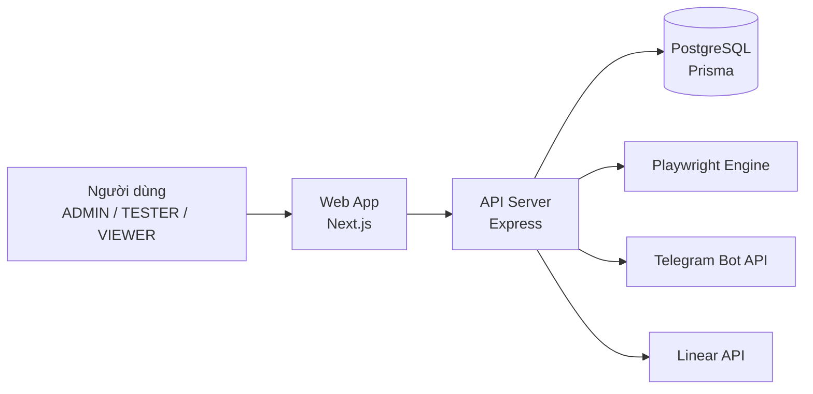

## 2) Sơ đồ container (C4-Container style)

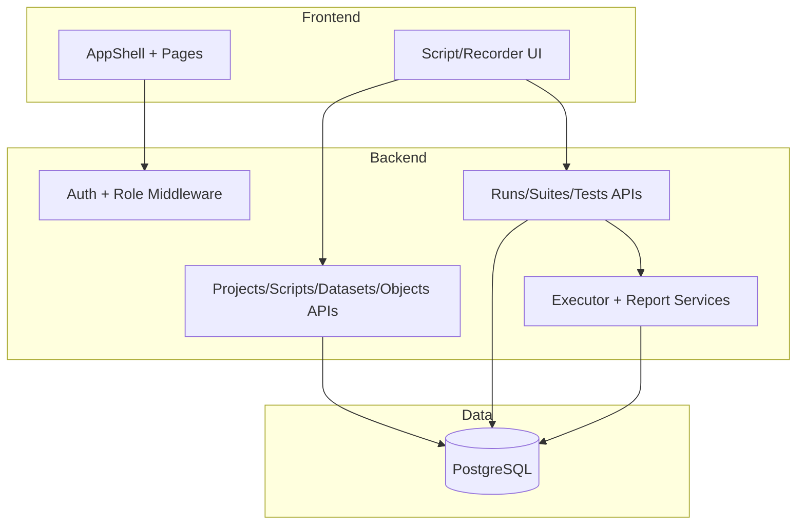

## 3) Sơ đồ component backend

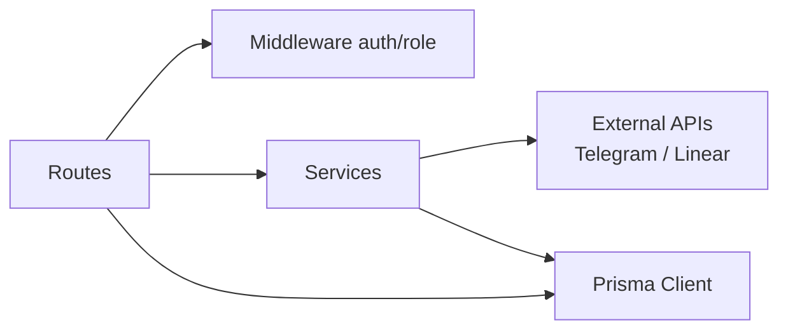

## 4) Sơ đồ use case

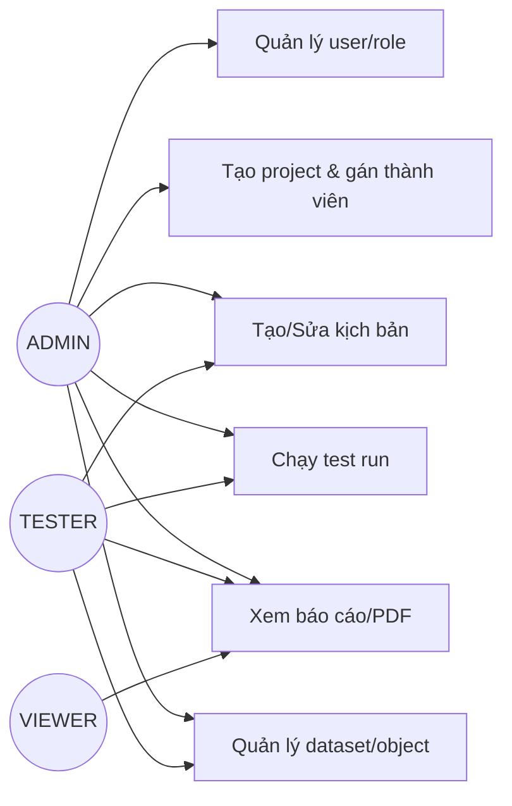

## 5) Sơ đồ hoạt động (Activity) – chạy kịch bản

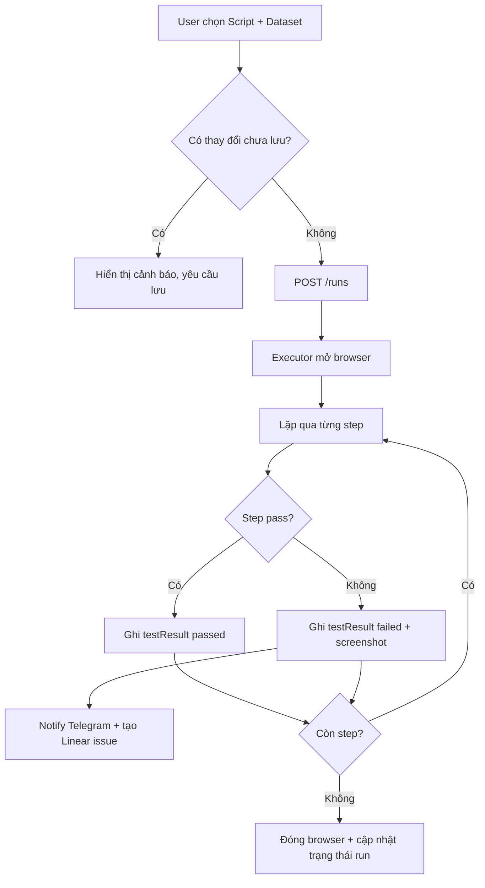

## 6) Sơ đồ sequence – Login

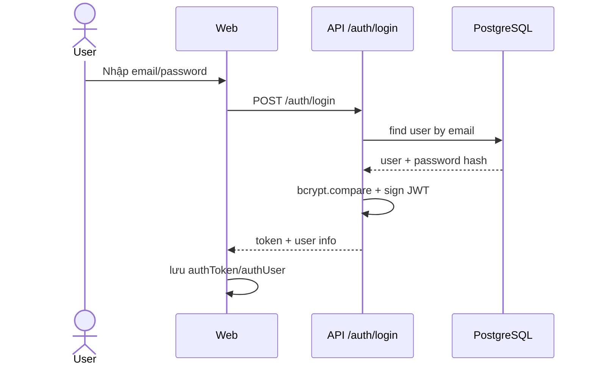

## 7) Sơ đồ sequence – tạo project và gán tester/viewer

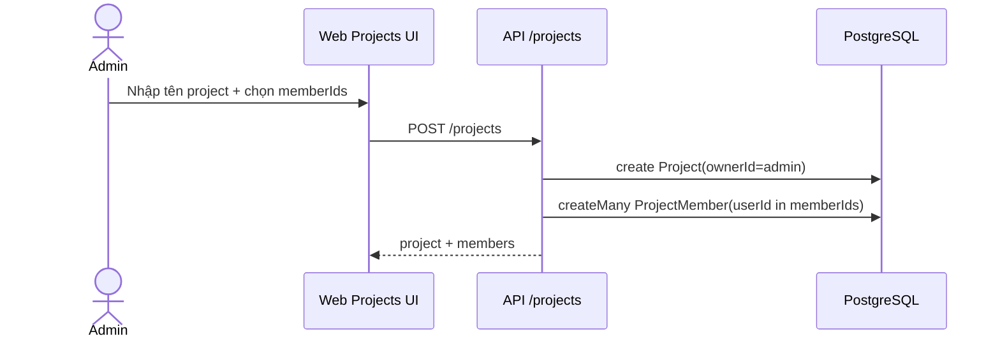

## 8) Sơ đồ trạng thái (State) – TestRun

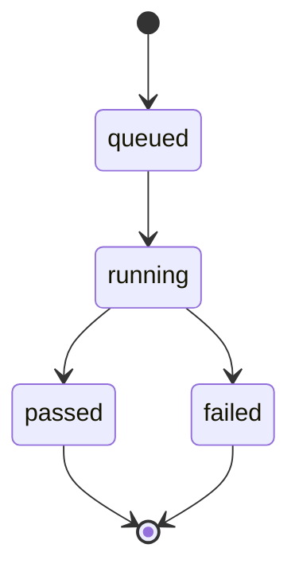

## 9) Sơ đồ trạng thái (State) – TestCase lifecycle

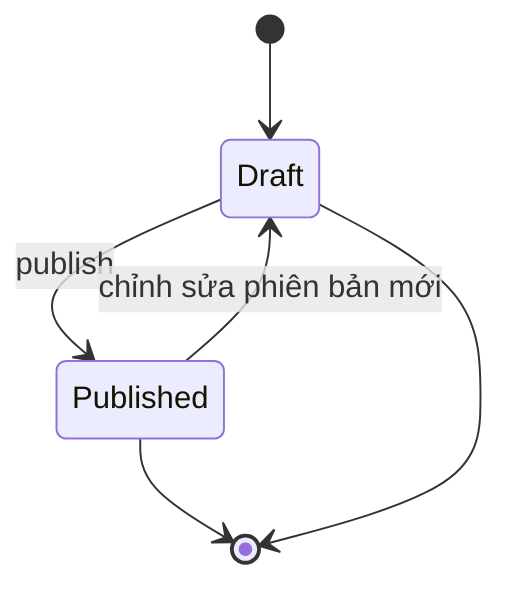

## 10) ERD rút gọn (Mermaid)

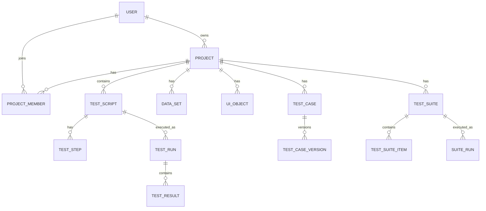

## 11) Sơ đồ class/domain (mức khái niệm)

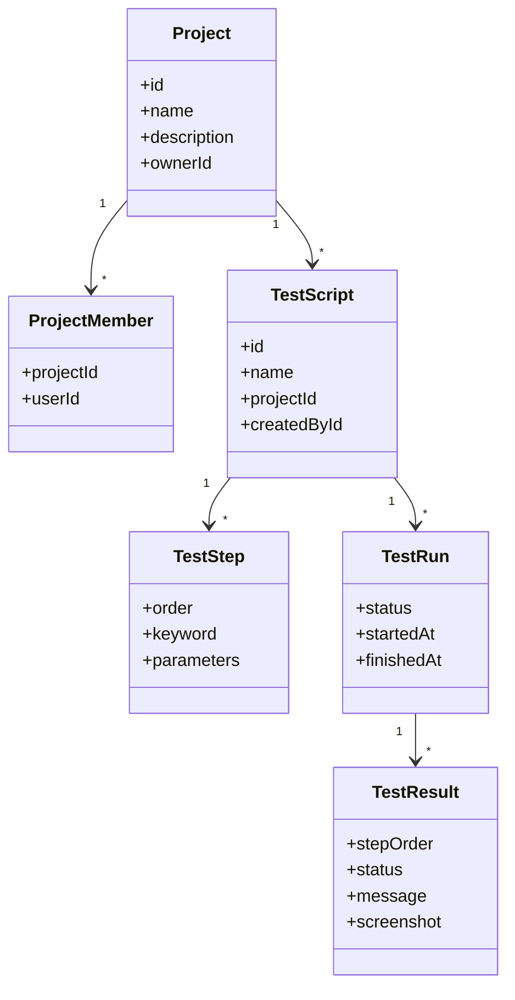

## 12) Sơ đồ deployment (môi trường local/dev)

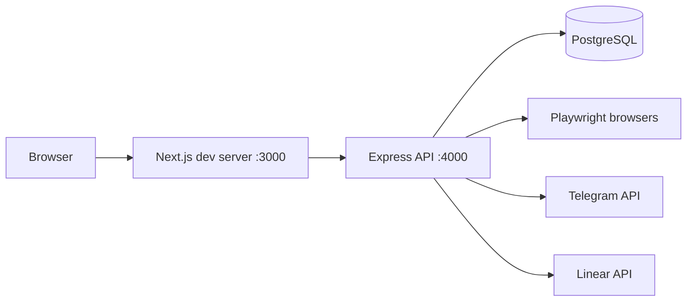

## 13) Sơ đồ luồng dữ liệu (DFD mức 1)

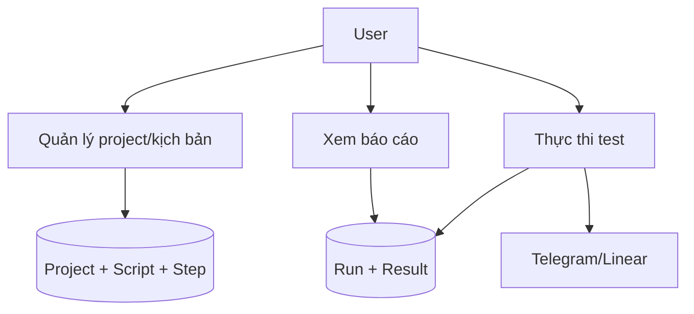

## 14) Sơ đồ quyết định quyền truy cập project

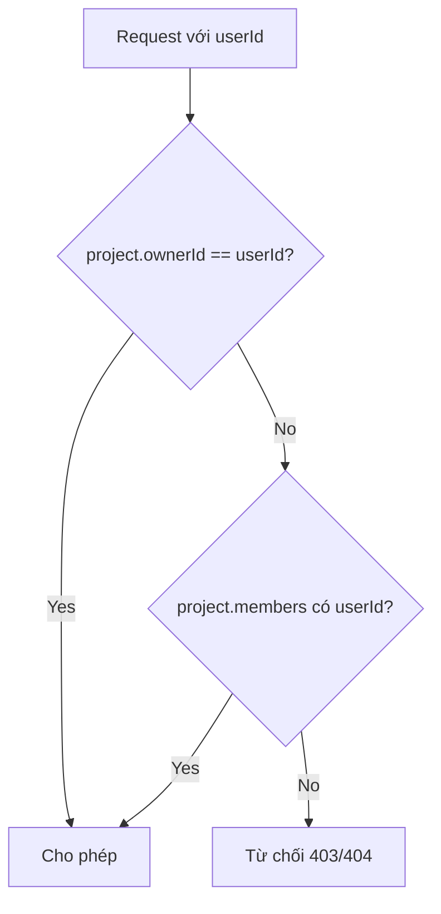

---

## Danh sách sơ đồ đã bao phủ

- Context
- Container
- Component
- Use case
- Activity
- Sequence (2 luồng)
- State (2 loại)
- ERD
- Class/domain
- Deployment
- DFD
- Access decision flow

Đây là bộ sơ đồ tổng hợp dùng trực tiếp cho báo cáo và thuyết trình.

