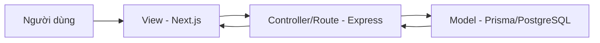
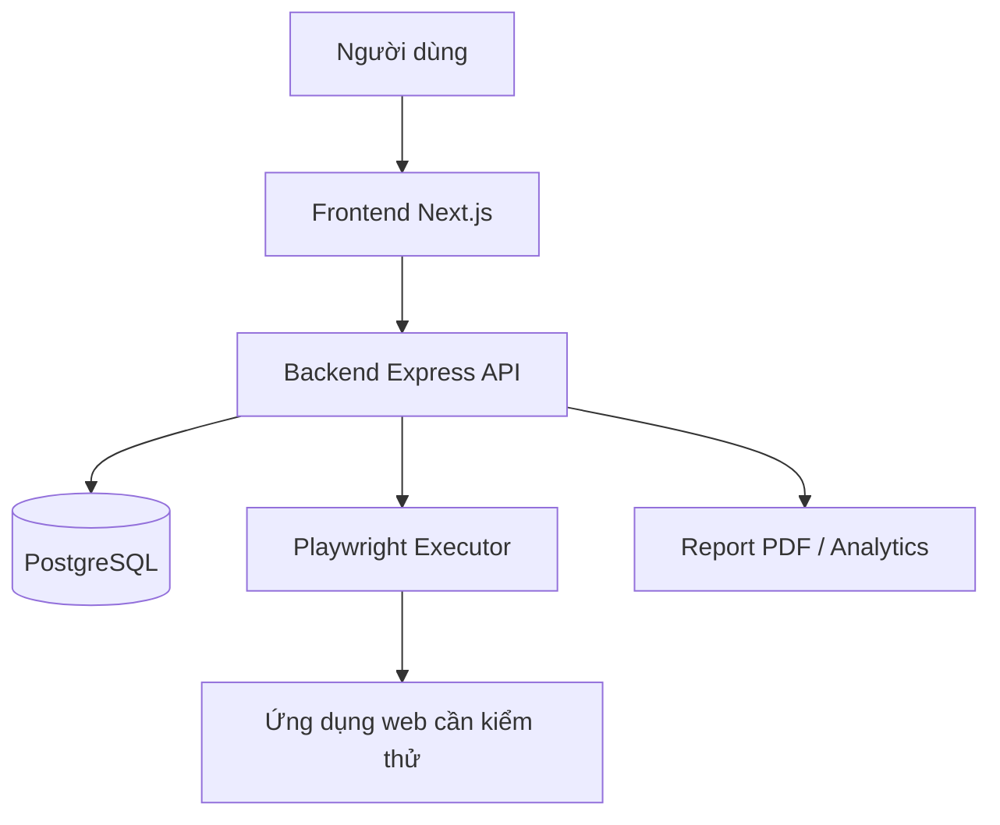
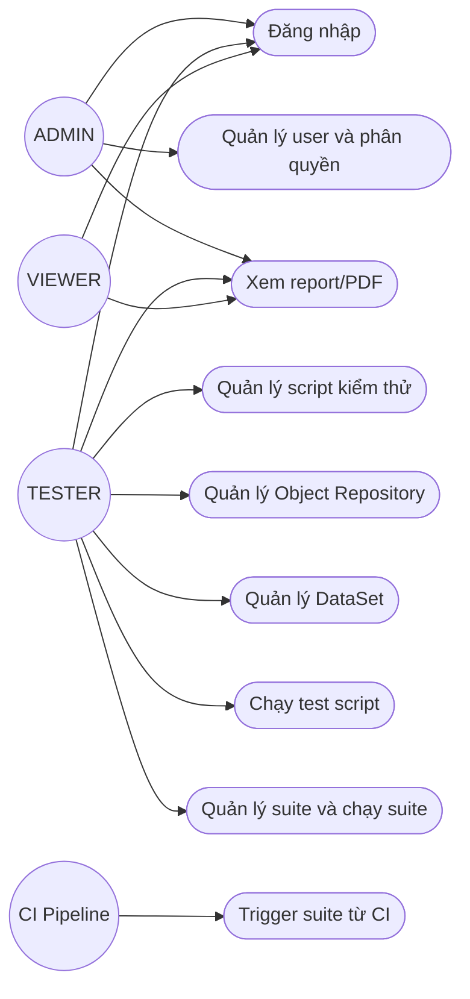
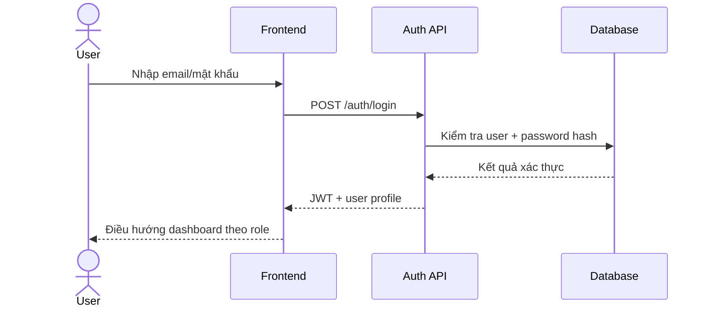
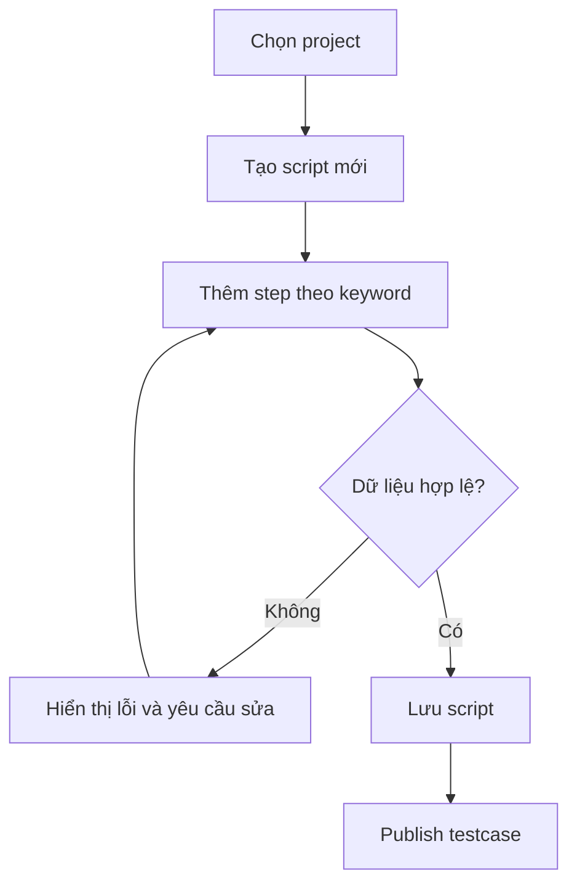
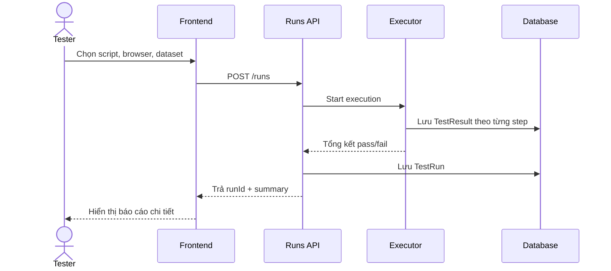
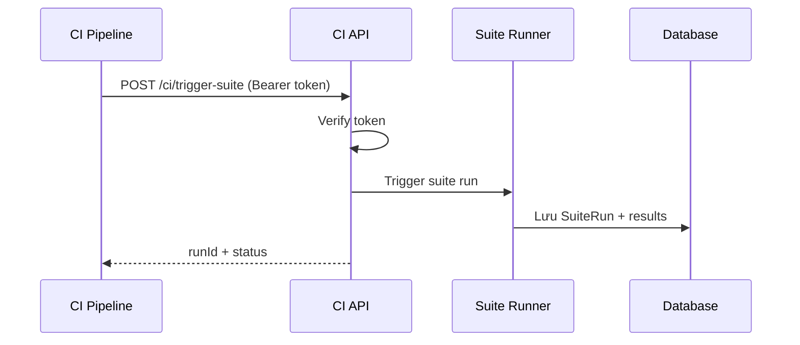
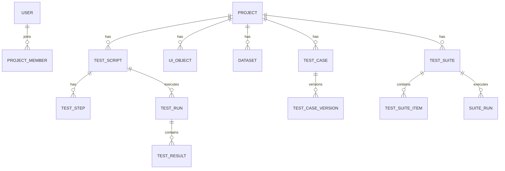

# BÁO CÁO ĐỒ ÁN TỐT NGHIỆP

## ĐỀ TÀI
**Xây dựng hệ thống kiểm thử tự động no-code cho ứng dụng web nội bộ Vietants**

---

## LỜI MỞ ĐẦU
Trong bối cảnh chuyển đổi số mạnh mẽ, các hệ thống phần mềm nội bộ được cập nhật với tần suất ngày càng cao để đáp ứng yêu cầu kinh doanh. Điều này kéo theo áp lực rất lớn lên hoạt động kiểm thử phần mềm, đặc biệt là kiểm thử hồi quy trước mỗi lần phát hành. Nếu tiếp tục phụ thuộc hoàn toàn vào kiểm thử thủ công, doanh nghiệp dễ gặp tình trạng chậm tiến độ, tăng chi phí nhân sự, và rủi ro bỏ sót lỗi.

Tại Vietants, nhóm QA/BA/PM là lực lượng nắm rõ nghiệp vụ nhất nhưng không phải tất cả đều có khả năng lập trình để sử dụng các framework automation truyền thống như Selenium, Cypress hay Playwright thuần mã. Rào cản kỹ thuật này làm cho quá trình tự động hóa kiểm thử khó mở rộng, phụ thuộc vào số ít kỹ sư kỹ thuật.

Xuất phát từ bài toán thực tế đó, đề tài tập trung xây dựng một nền tảng kiểm thử tự động theo hướng **no-code**, cho phép người dùng không chuyên lập trình có thể tạo, chỉnh sửa, chạy và theo dõi kết quả kiểm thử thông qua giao diện trực quan. Hệ thống được thiết kế theo hướng **keyword-driven**, kết hợp **data-driven testing**, có báo cáo chi tiết và khả năng tích hợp CI để hỗ trợ quy trình release.

Báo cáo này trình bày toàn bộ quá trình từ khảo sát hiện trạng, phân tích yêu cầu, thiết kế hệ thống, xây dựng chương trình đến đánh giá kết quả triển khai và đề xuất hướng phát triển tiếp theo.

---

## LỜI CẢM ƠN
Em xin chân thành cảm ơn quý thầy cô Khoa Công nghệ Thông tin, Trường Đại học Giao thông Vận tải đã trang bị cho em nền tảng kiến thức chuyên môn trong suốt quá trình học tập.

Em xin bày tỏ lòng biết ơn sâu sắc tới giảng viên hướng dẫn đã tận tình định hướng, góp ý và hỗ trợ em hoàn thiện đề tài từ giai đoạn hình thành ý tưởng đến triển khai thực tế.

Em xin cảm ơn đội ngũ tại Vietants đã tạo điều kiện cung cấp bối cảnh nghiệp vụ, phản hồi thực tế và hỗ trợ thử nghiệm hệ thống trong quá trình thực hiện đồ án.

Do thời gian và kinh nghiệm còn hạn chế, báo cáo khó tránh khỏi thiếu sót. Em rất mong nhận được ý kiến đóng góp từ quý thầy cô để tiếp tục hoàn thiện hơn.

---

## MỤC LỤC
1. CHƯƠNG 1: GIỚI THIỆU TỔNG QUAN  
2. CHƯƠNG 2: KIẾN THỨC NỀN TẢNG  
3. CHƯƠNG 3: PHÂN TÍCH VÀ THIẾT KẾ HỆ THỐNG  
4. CHƯƠNG 4: XÂY DỰNG CHƯƠNG TRÌNH  
5. KẾT LUẬN  
6. TÀI LIỆU THAM KHẢO  

---

## DANH MỤC HÌNH ẢNH
- Hình 2.1. Mô hình MVC  
- Hình 3.1. Mô hình kiến trúc hệ thống no-code testing  
- Hình 3.2. Use case tổng quát  
- Hình 3.3. Sequence đăng nhập  
- Hình 3.4. Activity chạy test script  
- Hình 3.5. Sequence trigger suite từ CI  
- Hình 3.6. ERD tổng quát  
- Hình 4.1. Giao diện đăng nhập  
- Hình 4.2. Giao diện dashboard  
- Hình 4.3. Giao diện editor script  
- Hình 4.4. Giao diện suite runs  
- Hình 4.5. Giao diện báo cáo kết quả  

## DANH MỤC BẢNG
- Bảng 3.1. Nội dung phỏng vấn và nhu cầu nghiệp vụ  
- Bảng 3.2. Bảng tác nhân và chức năng (Actor - Use case)  
- Bảng 3.3. Đặc tả chức năng Đăng nhập  
- Bảng 3.4. Đặc tả chức năng Quản lý script kiểm thử  
- Bảng 3.5. Đặc tả chức năng Chạy test và báo cáo  
- Bảng 3.6. Mô tả cơ sở dữ liệu vật lý  

---

# CHƯƠNG 1: GIỚI THIỆU TỔNG QUAN

## 1.1. Lí do chọn đề tài
Hoạt động kiểm thử phần mềm tại nhiều doanh nghiệp hiện vẫn phụ thuộc lớn vào thao tác thủ công. Khi sản phẩm phát triển nhanh và liên tục cập nhật tính năng, kiểm thử thủ công gặp ba vấn đề chính: (1) chi phí thời gian cao, (2) khó đảm bảo tính lặp lại nhất quán, (3) khó mở rộng phạm vi kiểm thử hồi quy.

Trong khi đó, tự động hóa kiểm thử theo cách truyền thống đòi hỏi đội ngũ sử dụng phải có khả năng lập trình và hiểu sâu framework. Điều này tạo ra khoảng cách giữa người hiểu nghiệp vụ (QA manual, BA, PM) và công cụ kiểm thử tự động.

Đề tài được lựa chọn nhằm giải quyết khoảng cách đó thông qua một hệ thống no-code giúp người dùng nghiệp vụ chủ động xây dựng và vận hành kiểm thử tự động mà không cần viết mã.

## 1.2 Mục tiêu và nhiệm vụ đề tài

### 1.2.1. Mục tiêu
- Xây dựng hệ thống kiểm thử tự động no-code cho ứng dụng web nội bộ.
- Cho phép tạo/chỉnh sửa kịch bản kiểm thử bằng giao diện trực quan theo từ khóa hành động.
- Hỗ trợ quản lý đối tượng UI tập trung (Object Repository).
- Hỗ trợ chạy kiểm thử theo nhiều bộ dữ liệu (Data-driven testing).
- Cung cấp báo cáo chi tiết, dashboard tổng hợp pass/fail và lỗi phổ biến.
- Hỗ trợ kích hoạt chạy suite từ CI để phục vụ quy trình release.

### 1.2.2. Nhiệm vụ
- Khảo sát hiện trạng quy trình kiểm thử tại đơn vị ứng dụng.
- Phân tích yêu cầu chức năng và phi chức năng của hệ thống.
- Thiết kế kiến trúc tổng thể, dữ liệu và luồng xử lý.
- Triển khai backend, frontend, cơ chế thực thi test và báo cáo.
- Kiểm thử và đánh giá mức độ đáp ứng mục tiêu đề tài.

## 1.3. Phạm vi nghiên cứu
- **Đối tượng hệ thống:** ứng dụng web nội bộ tại Vietants.
- **Loại kiểm thử ưu tiên:** Functional Testing, Regression Testing.
- **Người dùng mục tiêu:** Admin, Tester, Viewer; trong đó tester có thể không cần kỹ năng lập trình.
- **Ngoài phạm vi:** kiểm thử hiệu năng chuyên sâu, kiểm thử bảo mật chuyên sâu, hỗ trợ mobile native/desktop native.

## 1.4. Kết quả dự kiến
- Một nền tảng no-code testing vận hành được ở mức MVP thực tế.
- Bộ API quản lý script/object/dataset/run/suite/CI trigger đầy đủ.
- Giao diện trực quan cho luồng tạo test, chạy test, xem báo cáo.
- Tài liệu SRS, tài liệu thiết kế, test plan, user manual và báo cáo tổng hợp.

---

# CHƯƠNG 2: KIẾN THỨC NỀN TẢNG

## 2.1. Cơ sở lí thuyết

### 2.1.1. Cơ sở lý thuyết về thiết kế website
Hệ thống no-code testing là một ứng dụng web nên các nguyên lý UI/UX giữ vai trò quan trọng:
- Thiết kế giao diện trực quan, tối ưu luồng thao tác cho người dùng không chuyên kỹ thuật.
- Thiết kế điều hướng đơn giản theo quy trình nghiệp vụ thực tế.
- Responsive cơ bản để thuận tiện quan sát trên nhiều kích thước màn hình.
- Tối ưu biểu mẫu nhập liệu và phản hồi lỗi để giảm thao tác sai.

### 2.1.2. Trình bày về mô hình MVC
Mô hình MVC giúp tổ chức hệ thống rõ ràng:
- **Model:** biểu diễn dữ liệu nghiệp vụ (User, Project, Script, Run, Suite...).
- **View:** giao diện người dùng trên web.
- **Controller/Route + Service:** tiếp nhận yêu cầu, xử lý nghiệp vụ, trả kết quả.

### 2.1.3. Giới thiệu về Framework CSS TailwindCSS
TailwindCSS hỗ trợ xây dựng giao diện nhanh với các utility class, giúp:
- Tăng tốc độ phát triển UI.
- Dễ chuẩn hóa thiết kế giữa các trang.
- Giảm chi phí bảo trì CSS khi mở rộng tính năng.

### 2.1.4. Ngôn ngữ JavaScript và thư viện ReactJS
- JavaScript/TypeScript cho phép thống nhất ngôn ngữ từ frontend đến backend.
- React (trong Next.js) phù hợp xây dựng giao diện tương tác cao, component hóa tốt.
- Quản lý trạng thái giao diện linh hoạt cho các màn hình editor/recorder/report.

### 2.1.5. Giới thiệu ngôn ngữ lập trình NodeJS
Node.js phù hợp cho hệ thống API vì:
- Khả năng xử lý I/O tốt.
- Hệ sinh thái thư viện phong phú.
- Dễ tích hợp với Playwright và các dịch vụ ngoài (CI, Telegram, PDF...).

### 2.1.6.  Giới thiệu Framework ExpressJS
Express giúp xây dựng API nhanh và rõ ràng theo module:
- Tách route theo miền nghiệp vụ (`auth`, `scripts`, `runs`, `suites`, `ci`).
- Dễ gắn middleware xác thực/phân quyền.
- Dễ mở rộng và bảo trì theo từng chức năng.

## 2.2. Công dụng sử dụng

### 2.2.1. Phần mềm quản trị cơ sở dữ liệu
Trong đề tài này, cơ sở dữ liệu chính là PostgreSQL (thông qua Prisma). Công cụ quản trị dữ liệu được sử dụng theo nhu cầu triển khai:
- Prisma Studio (xem/chỉnh dữ liệu nhanh theo model).
- Công cụ SQL client tương thích PostgreSQL (nếu cần truy vấn chuyên sâu).

### 2.2.2. Phần mềm lập trình Visual Studio Code
VS Code/Cursor được sử dụng để:
- Viết và quản lý mã nguồn.
- Tích hợp terminal, git, extension TypeScript/Prisma.
- Tăng hiệu suất phát triển và kiểm thử trong suốt quá trình thực hiện đề tài.

---

# CHƯƠNG 3: PHÂN TÍCH VÀ THIẾT KẾ HỆ THỐNG

## 3.1. Khảo sát hệ thống

### 3.1.1. Giới thiệu đơn vị khảo sát
- **Đơn vị:** Vietants.
- **Lĩnh vực:** phát triển và vận hành các ứng dụng web nội bộ.
- **Nhu cầu:** tăng tốc kiểm thử hồi quy và giảm phụ thuộc vào nguồn lực lập trình cho automation.

### 3.1.2. Phỏng vấn
**Bảng 3.1. Nội dung phỏng vấn và nhu cầu nghiệp vụ**

| STT | Câu hỏi khảo sát | Kết quả ghi nhận |
|---|---|---|
| 1 | Khó khăn lớn nhất trong kiểm thử hiện tại là gì? | Test hồi quy tốn thời gian, khó lặp lại ổn định, báo cáo chưa thống nhất. |
| 2 | Đối tượng nào trực tiếp tạo test? | QA manual/BA/PM, mức kỹ thuật không đồng đều. |
| 3 | Mong muốn công cụ mới có gì? | Tạo test không cần code, dễ sửa khi UI thay đổi, có báo cáo trực quan. |
| 4 | Có nhu cầu tích hợp CI không? | Có, cần trigger suite để hỗ trợ quyết định release. |

### 3.1.3. Mô tả hiện trạng hệ thống
- Quy trình kiểm thử hiện tại chủ yếu manual, phụ thuộc checklist và kinh nghiệm cá nhân.
- Việc tái sử dụng testcase, dữ liệu và locator còn rời rạc.
- Báo cáo sau chạy test chưa tự động và khó tổng hợp xu hướng.
- Chưa có cơ chế nhất quán để chạy regression suite trước khi release từ CI.

## 3.2. Yêu cầu cho hệ thống
- Quản lý tài khoản và phân quyền rõ ràng (ADMIN/TESTER/VIEWER).
- Quản lý kịch bản kiểm thử bằng từ khóa hành động.
- Quản lý Object Repository để tái sử dụng locator.
- Quản lý DataSet để chạy data-driven testing.
- Chạy script và suite, theo dõi trạng thái thực thi.
- Xem kết quả chi tiết từng bước, export PDF.
- Trigger suite từ CI bằng token bảo mật.

## 3.3. Mô tả bài toán
Bài toán đặt ra là xây dựng một hệ thống cho phép:
1. Người dùng nghiệp vụ tạo test case mà không viết mã.
2. Hệ thống tự động thực thi trên trình duyệt, ghi nhận pass/fail theo step.
3. Kết quả được hiển thị rõ ràng trên dashboard và báo cáo.
4. Quy trình kiểm thử được tích hợp vào CI để trở thành cổng kiểm soát chất lượng.

## 3.4. Phân tích thiết kế

### 3.4.1. Mô hình hệ thống
Hệ thống gồm các thành phần:
- Frontend (Next.js) cho trải nghiệm no-code.
- Backend API (Express) xử lý nghiệp vụ.
- Executor (Playwright) thực thi test.
- Database (PostgreSQL/Prisma) lưu dữ liệu nghiệp vụ và kết quả.

### 3.4.2 Biểu đồ ca sử dụng (Usecase Diagram)

**Bảng 3.2. Bảng xác định các tác nhân (Actor) và chức năng (Usecase)**

| Tác nhân | Chức năng chính |
|---|---|
| ADMIN | Quản lý người dùng, phân quyền, quản lý project, theo dõi toàn hệ thống |
| TESTER | Quản lý script/step/object/dataset, chạy test, xem báo cáo, quản lý suite |
| VIEWER | Xem dashboard, xem báo cáo và kết quả chạy test |
| CI Pipeline | Trigger suite run qua API token |

### 3.4.3 Đặc tả từng ca sử dụng và các loại biểu đồ (Usecase specification)

#### • Usecase Đăng nhập
**Bảng 3.3. Đặc tả chức năng Đăng nhập**
- Tác nhân: ADMIN/TESTER/VIEWER
- Mục đích: xác thực người dùng vào hệ thống.
- Điều kiện tiên quyết: tài khoản đã tồn tại.
- Luồng chính: nhập email/mật khẩu -> API xác thực -> trả JWT -> vào dashboard theo quyền.
- Ngoại lệ: sai thông tin hoặc tài khoản không hợp lệ.

#### • Usecase Quản lý script kiểm thử
**Bảng 3.4. Đặc tả chức năng Quản lý script**
- Tác nhân: TESTER
- Mục đích: tạo/sửa/xóa script và test step theo keyword.
- Điều kiện tiên quyết: người dùng có quyền tester trở lên.
- Luồng chính: chọn project -> tạo script -> thêm step -> lưu/publish.
- Ngoại lệ: dữ liệu step thiếu trường bắt buộc, keyword không hợp lệ.

#### • Usecase Chạy test script và báo cáo
**Bảng 3.5. Đặc tả chức năng Chạy test và báo cáo**
- Tác nhân: TESTER/VIEWER (xem)
- Mục đích: chạy test script và theo dõi kết quả.
- Luồng chính: chọn script + browser + dataset -> chạy -> lưu step result -> hiển thị report.
- Ngoại lệ: lỗi selector/network/assertion.

#### • Usecase Trigger suite từ CI
- Tác nhân: CI Pipeline
- Mục đích: chạy bộ regression suite tự động từ pipeline.
- Luồng chính: pipeline gọi `/ci/trigger-suite` với token -> hệ thống xác thực -> tạo suite run.

### 3.4.4. Thiết kế Database
Hệ thống dữ liệu tập trung vào 4 nhóm chính:
1. **Identity:** quản lý người dùng và quyền.
2. **Test Assets:** project, script, step, object, dataset.
3. **Execution:** run và kết quả theo step.
4. **Regression:** testcase version, suite, suite run.

### 3.4.5. Thiết kế cơ sở dữ liệu vật lý
**Bảng 3.6. Mô tả dữ liệu vật lý (rút gọn)**

| Bảng | Trường chính | Ý nghĩa |
|---|---|---|
| User | id, email, passwordHash, role | Quản lý tài khoản và quyền |
| Project | id, name, ownerId | Không gian làm việc theo dự án |
| TestScript | id, projectId, name, status | Kịch bản kiểm thử |
| TestStep | id, scriptId, keyword, selector, input | Các bước kiểm thử |
| UiObject | id, projectId, name, selector | Kho đối tượng UI |
| DataSet | id, projectId, name, rows | Bộ dữ liệu chạy test |
| TestRun | id, scriptId, browser, status | Phiên chạy kiểm thử |
| TestResult | id, runId, stepOrder, passed, message | Kết quả từng bước |
| TestCaseVersion | id, testCaseId, version, content | Phiên bản testcase |
| TestSuite | id, projectId, name | Bộ regression suite |
| SuiteRun | id, suiteId, trigger, status, results | Phiên chạy suite |

---

# CHƯƠNG 4: XÂY DỰNG CHƯƠNG TRÌNH

## 4.1. Môi trường xây dựng
- Backend: Node.js, Express, Prisma.
- Frontend: Next.js 16, TypeScript.
- Test execution: Playwright.
- Database: PostgreSQL.
- Công cụ hỗ trợ: Git/GitHub, Postman, VS Code/Cursor.

## 4.2. Xây dựng các phân hệ chính

### 4.2.1. Phân hệ xác thực và phân quyền
- Đăng ký/đăng nhập bằng JWT.
- Middleware xác thực cho route bảo vệ.
- Phân quyền theo role cho các chức năng nhạy cảm.

### 4.2.2. Phân hệ quản lý kịch bản kiểm thử
- Tạo script, thêm bước theo keyword.
- Kiểm tra dữ liệu step đầu vào.
- Hỗ trợ publish testcase để dùng trong suite.

### 4.2.3. Phân hệ quản lý đối tượng và dữ liệu
- Object Repository để chuẩn hóa selector.
- DataSet để chạy nhiều bộ input trên cùng một script.

### 4.2.4. Phân hệ thực thi và báo cáo
- Chạy script trên trình duyệt lựa chọn.
- Lưu kết quả chi tiết theo từng bước.
- Xuất PDF report và dashboard tổng hợp.

### 4.2.5. Phân hệ suite và tích hợp CI
- Quản lý suite từ danh sách testcase version.
- Chạy suite thủ công từ UI hoặc tự động từ CI token.
- Trả runId để pipeline theo dõi trạng thái.

## 4.3. Một số giao diện trong website
Bạn chèn ảnh thật vào các mục sau:
- **Hình 4.1:** Giao diện đăng nhập.
- **Hình 4.2:** Dashboard thống kê pass/fail.
- **Hình 4.3:** Giao diện editor script theo keyword.
- **Hình 4.4:** Giao diện quản lý suite runs.
- **Hình 4.5:** Giao diện xem báo cáo chi tiết và PDF.

## 4.4. Đánh giá kết quả triển khai
- Hệ thống đã đáp ứng các luồng cốt lõi của bài toán no-code testing.
- Người dùng nghiệp vụ có thể tạo và vận hành kiểm thử mà không cần viết mã.
- Luồng báo cáo và tích hợp CI hỗ trợ tốt cho quy trình kiểm soát chất lượng release.

---

# KẾT LUẬN
Đề tài đã hoàn thành mục tiêu xây dựng hệ thống kiểm thử tự động no-code cho ứng dụng web nội bộ tại Vietants. Kết quả đạt được bao gồm: nền tảng quản lý script kiểm thử theo keyword, quản lý object/dataset, thực thi test tự động, báo cáo kết quả chi tiết, dashboard trực quan và tích hợp trigger suite từ CI.

Giải pháp giúp giảm rào cản kỹ thuật cho nhóm người dùng nghiệp vụ, chuẩn hóa quy trình kiểm thử và nâng cao năng lực kiểm thử hồi quy trước phát hành. Đây là cơ sở quan trọng để mở rộng lên các chức năng nâng cao trong giai đoạn tiếp theo.

**Hướng phát triển:**
1. Nâng cấp suite runner sang mức thực thi sâu tương đương script runner.
2. Bổ sung cơ chế retry và phát hiện flaky test.
3. Mở rộng analytics theo thời gian (trend, stability index).
4. Tăng cường thông báo realtime (Telegram/Email/Webhook).
5. Hoàn thiện phân quyền chi tiết theo workspace/project.

---

# TÀI LIỆU THAM KHẢO
1. Tài liệu mẫu khung báo cáo: `NguyenXuanBinh12 (4).docx`.
2. Tài liệu phạm vi đề tài: `Tài liệu.docx`.
3. Tài liệu SRS: `docs/final/01-srs.md`.
4. Tài liệu kiến trúc và thiết kế: `docs/final/02-architecture-and-design.md`.
5. Test plan: `docs/final/03-test-plan.md`.
6. User manual: `docs/final/04-user-manual.md`.
7. Tổng hợp kết quả: `docs/final/05-final-report-summary.md`.
8. Tài liệu chính thức: Next.js, Express.js, Prisma, Playwright.

