# Biểu đồ trình tự (Sequence) — 42 Use case giao diện web

Ánh xạ với `11-dac-ta-chuc-nang-giao-dien-web.md` (ĐC-01 → ĐC-42).

---

## A.1. Trang công khai & xác thực

### SD-01 — ĐC-01: Truy cập trang giới thiệu

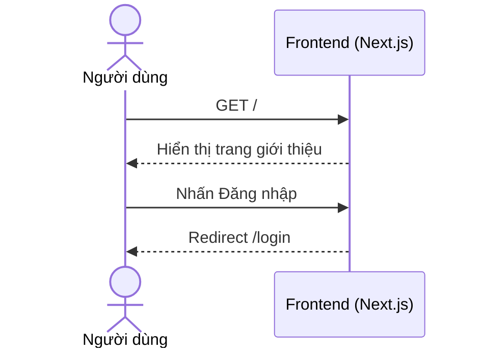
```mermaid
sequenceDiagram
    actor U as Người dùng
    participant W as Frontend (Next.js)

    U->>W: GET /
    W-->>U: Hiển thị trang giới thiệu
    U->>W: Nhấn Đăng nhập
    W-->>U: Redirect /login
```

### SD-02 — ĐC-02: Đăng nhập hệ thống

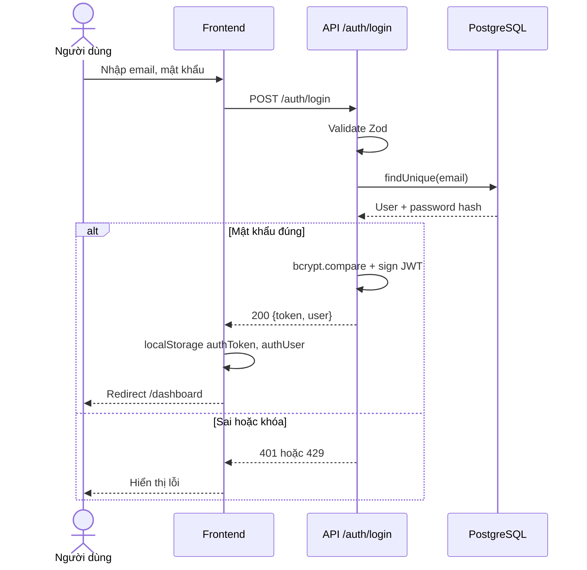
```mermaid
sequenceDiagram
    actor U as Người dùng
    participant W as Frontend
    participant A as API /auth/login
    participant DB as PostgreSQL

    U->>W: Nhập email, mật khẩu
    W->>A: POST /auth/login
    A->>A: Validate Zod
    A->>DB: findUnique(email)
    DB-->>A: User + password hash
    alt Mật khẩu đúng
        A->>A: bcrypt.compare + sign JWT
        A-->>W: 200 {token, user}
        W->>W: localStorage authToken, authUser
        W-->>U: Redirect /dashboard
    else Sai hoặc khóa
        A-->>W: 401 hoặc 429
        W-->>U: Hiển thị lỗi
    end
```

### SD-03 — ĐC-03: Đăng ký tài khoản

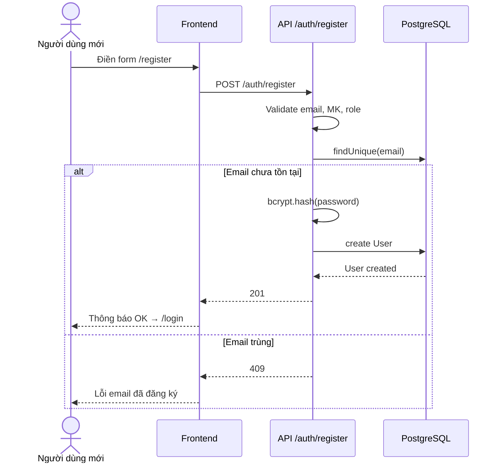
```mermaid
sequenceDiagram
    actor U as Người dùng mới
    participant W as Frontend
    participant A as API /auth/register
    participant DB as PostgreSQL

    U->>W: Điền form /register
    W->>A: POST /auth/register
    A->>A: Validate email, MK, role
    A->>DB: findUnique(email)
    alt Email chưa tồn tại
        A->>A: bcrypt.hash(password)
        A->>DB: create User
        DB-->>A: User created
        A-->>W: 201
        W-->>U: Thông báo OK → /login
    else Email trùng
        A-->>W: 409
        W-->>U: Lỗi email đã đăng ký
    end
```

### SD-04 — ĐC-04: Quên mật khẩu

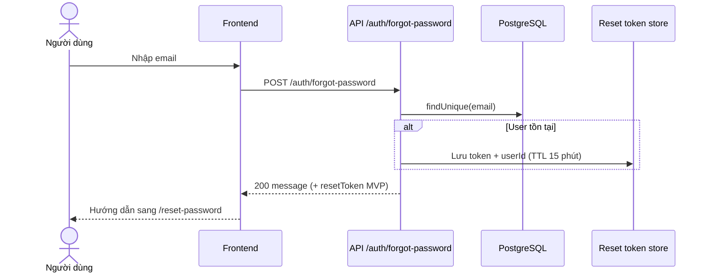
```mermaid
sequenceDiagram
    actor U as Người dùng
    participant W as Frontend
    participant A as API /auth/forgot-password
    participant DB as PostgreSQL
    participant M as Reset token store

    U->>W: Nhập email
    W->>A: POST /auth/forgot-password
    A->>DB: findUnique(email)
    alt User tồn tại
        A->>M: Lưu token + userId (TTL 15 phút)
    end
    A-->>W: 200 message (+ resetToken MVP)
    W-->>U: Hướng dẫn sang /reset-password
```

### SD-05 — ĐC-05: Đặt lại mật khẩu

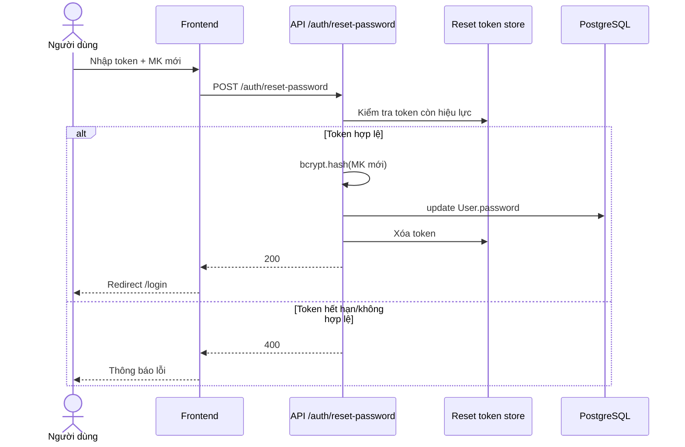
```mermaid
sequenceDiagram
    actor U as Người dùng
    participant W as Frontend
    participant A as API /auth/reset-password
    participant M as Reset token store
    participant DB as PostgreSQL

    U->>W: Nhập token + MK mới
    W->>A: POST /auth/reset-password
    A->>M: Kiểm tra token còn hiệu lực
    alt Token hợp lệ
        A->>A: bcrypt.hash(MK mới)
        A->>DB: update User.password
        A->>M: Xóa token
        A-->>W: 200
        W-->>U: Redirect /login
    else Token hết hạn/không hợp lệ
        A-->>W: 400
        W-->>U: Thông báo lỗi
    end
```

### SD-06 — ĐC-06: Đổi mật khẩu

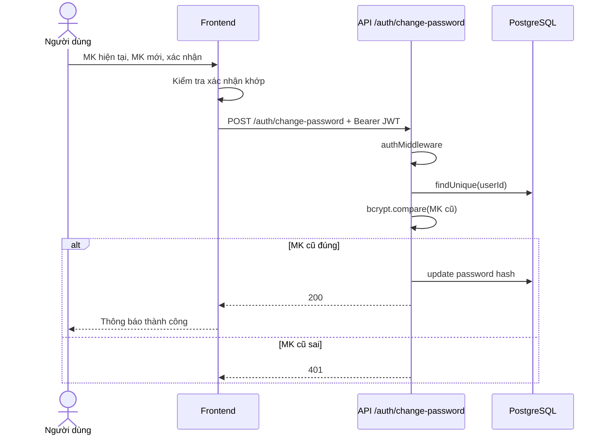
```mermaid
sequenceDiagram
    actor U as Người dùng
    participant W as Frontend
    participant A as API /auth/change-password
    participant DB as PostgreSQL

    U->>W: MK hiện tại, MK mới, xác nhận
    W->>W: Kiểm tra xác nhận khớp
    W->>A: POST /auth/change-password + Bearer JWT
    A->>A: authMiddleware
    A->>DB: findUnique(userId)
    A->>A: bcrypt.compare(MK cũ)
    alt MK cũ đúng
        A->>DB: update password hash
        A-->>W: 200
        W-->>U: Thông báo thành công
    else MK cũ sai
        A-->>W: 401
    end
```

### SD-07 — ĐC-07: Đăng xuất

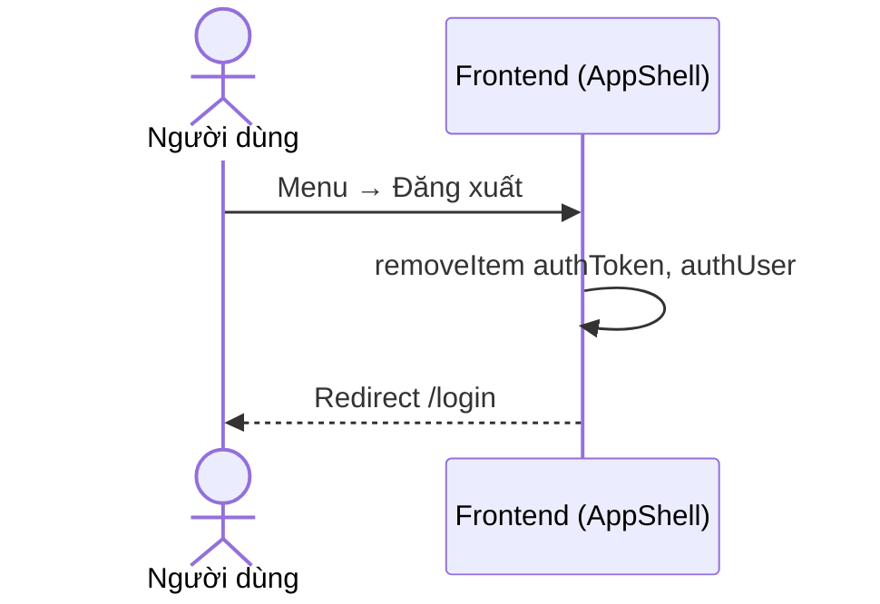
```mermaid
sequenceDiagram
    actor U as Người dùng
    participant W as Frontend (AppShell)

    U->>W: Menu → Đăng xuất
    W->>W: removeItem authToken, authUser
    W-->>U: Redirect /login
```

---

## A.2. Dashboard

### SD-08 — ĐC-08: Dashboard & analytics

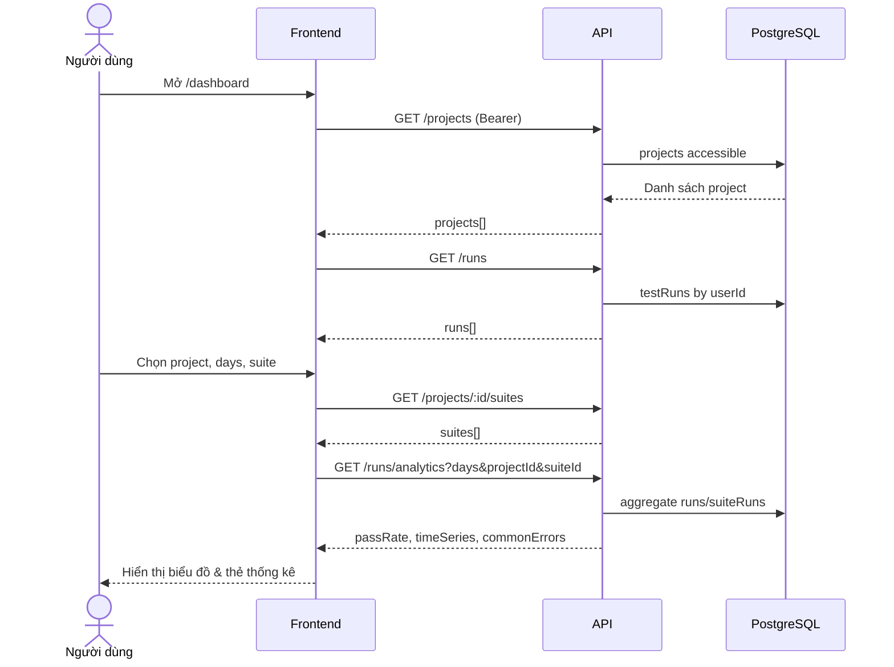
```mermaid
sequenceDiagram
    actor U as Người dùng
    participant W as Frontend
    participant A as API
    participant DB as PostgreSQL

    U->>W: Mở /dashboard
    W->>A: GET /projects (Bearer)
    A->>DB: projects accessible
    DB-->>A: Danh sách project
    A-->>W: projects[]
    W->>A: GET /runs
    A->>DB: testRuns by userId
    A-->>W: runs[]
    U->>W: Chọn project, days, suite
    W->>A: GET /projects/:id/suites
    A-->>W: suites[]
    W->>A: GET /runs/analytics?days&projectId&suiteId
    A->>DB: aggregate runs/suiteRuns
    A-->>W: passRate, timeSeries, commonErrors
    W-->>U: Hiển thị biểu đồ & thẻ thống kê
```

---

## A.3. Quản lý dự án

### SD-09 — ĐC-09: Xem danh sách dự án

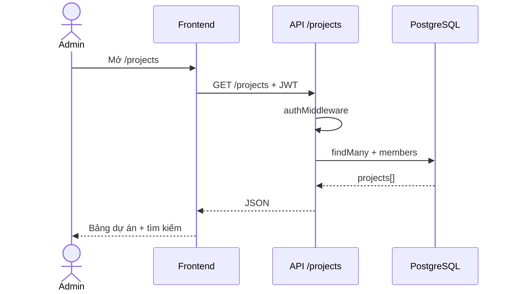
```mermaid
sequenceDiagram
    actor A as Admin
    participant W as Frontend
    participant API as API /projects
    participant DB as PostgreSQL

    A->>W: Mở /projects
    W->>API: GET /projects + JWT
    API->>API: authMiddleware
    API->>DB: findMany + members
    DB-->>API: projects[]
    API-->>W: JSON
    W-->>A: Bảng dự án + tìm kiếm
```

### SD-10 — ĐC-10: Tạo dự án

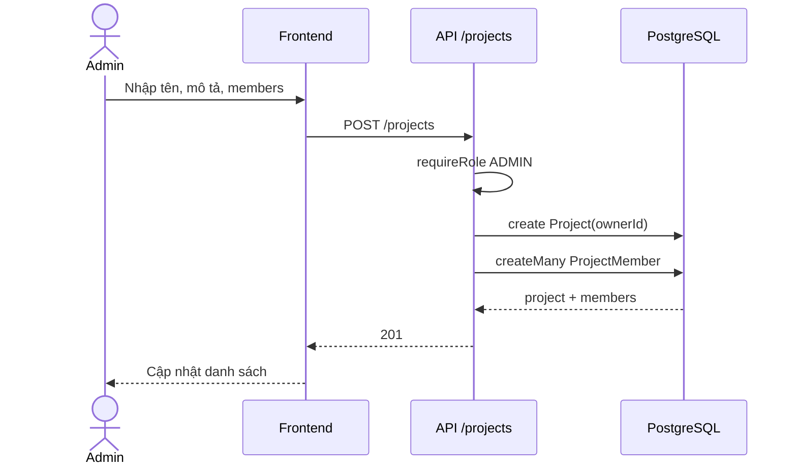
```mermaid
sequenceDiagram
    actor A as Admin
    participant W as Frontend
    participant API as API /projects
    participant DB as PostgreSQL

    A->>W: Nhập tên, mô tả, members
    W->>API: POST /projects
    API->>API: requireRole ADMIN
    API->>DB: create Project(ownerId)
    API->>DB: createMany ProjectMember
    DB-->>API: project + members
    API-->>W: 201
    W-->>A: Cập nhật danh sách
```

### SD-11 — ĐC-11: Cập nhật dự án

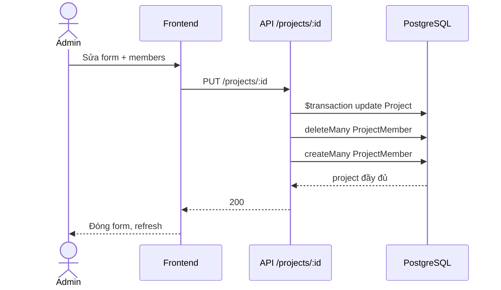
```mermaid
sequenceDiagram
    actor A as Admin
    participant W as Frontend
    participant API as API /projects/:id
    participant DB as PostgreSQL

    A->>W: Sửa form + members
    W->>API: PUT /projects/:id
    API->>DB: $transaction update Project
    API->>DB: deleteMany ProjectMember
    API->>DB: createMany ProjectMember
    DB-->>API: project đầy đủ
    API-->>W: 200
    W-->>A: Đóng form, refresh
```

### SD-12 — ĐC-12: Xóa dự án

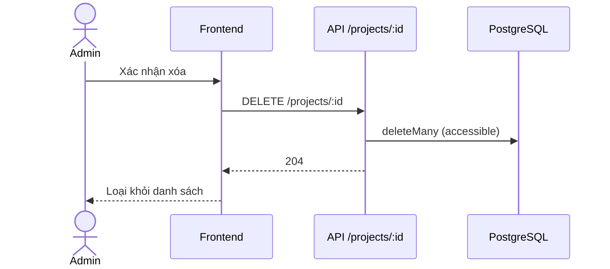
```mermaid
sequenceDiagram
    actor A as Admin
    participant W as Frontend
    participant API as API /projects/:id
    participant DB as PostgreSQL

    A->>W: Xác nhận xóa
    W->>API: DELETE /projects/:id
    API->>DB: deleteMany (accessible)
    API-->>W: 204
    W-->>A: Loại khỏi danh sách
```

---

## A.4. Quản lý kịch bản

### SD-13 — ĐC-13: Xem danh sách kịch bản

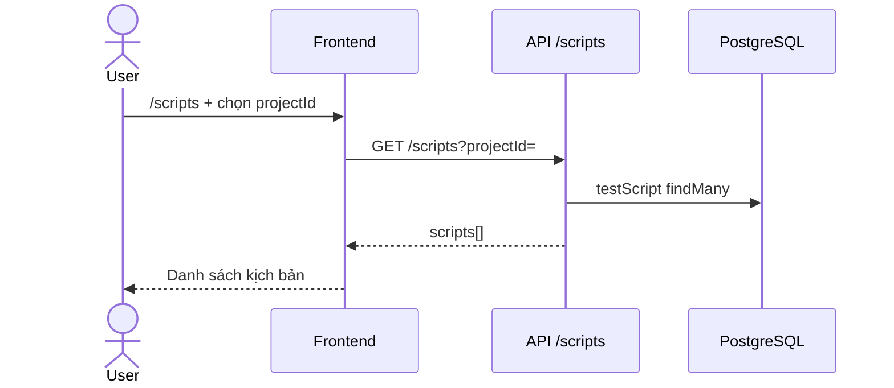
```mermaid
sequenceDiagram
    actor U as User
    participant W as Frontend
    participant API as API /scripts
    participant DB as PostgreSQL

    U->>W: /scripts + chọn projectId
    W->>API: GET /scripts?projectId=
    API->>DB: testScript findMany
    API-->>W: scripts[]
    W-->>U: Danh sách kịch bản
```

### SD-14 — ĐC-14: Tạo kịch bản

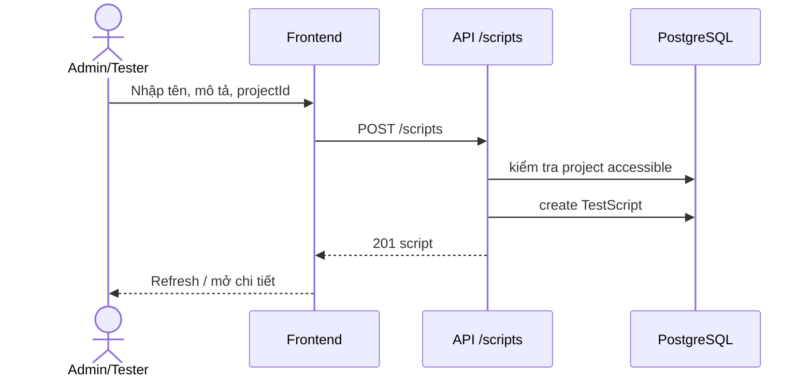
```mermaid
sequenceDiagram
    actor U as Admin/Tester
    participant W as Frontend
    participant API as API /scripts
    participant DB as PostgreSQL

    U->>W: Nhập tên, mô tả, projectId
    W->>API: POST /scripts
    API->>DB: kiểm tra project accessible
    API->>DB: create TestScript
    API-->>W: 201 script
    W-->>U: Refresh / mở chi tiết
```

### SD-15 — ĐC-15: Xóa kịch bản

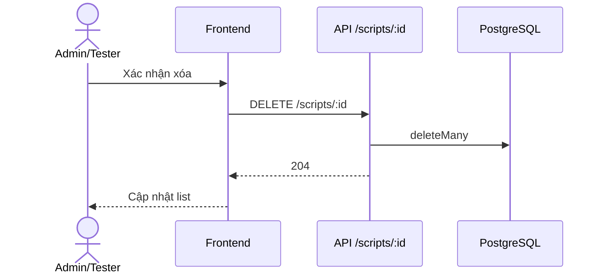
```mermaid
sequenceDiagram
    actor U as Admin/Tester
    participant W as Frontend
    participant API as API /scripts/:id
    participant DB as PostgreSQL

    U->>W: Xác nhận xóa
    W->>API: DELETE /scripts/:id
    API->>DB: deleteMany
    API-->>W: 204
    W-->>U: Cập nhật list
```

### SD-16 — ĐC-16: Xem chi tiết kịch bản

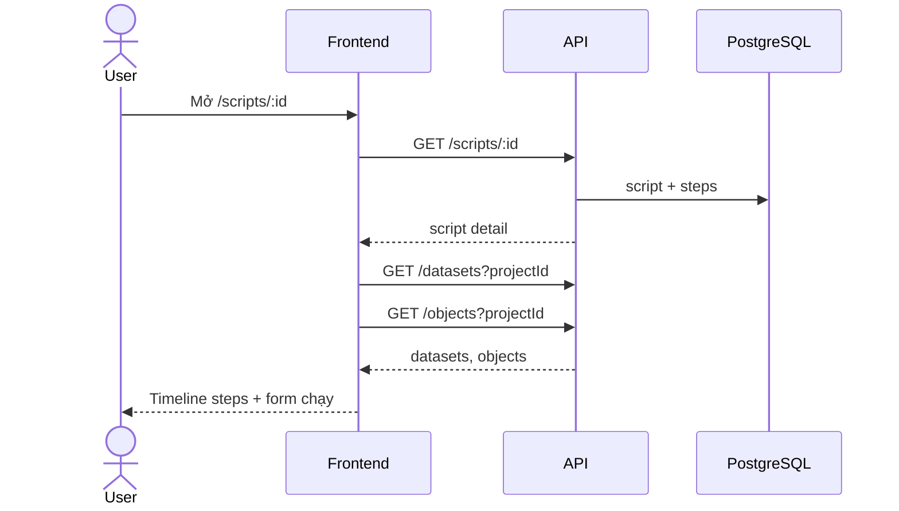
```mermaid
sequenceDiagram
    actor U as User
    participant W as Frontend
    participant API as API
    participant DB as PostgreSQL

    U->>W: Mở /scripts/:id
    W->>API: GET /scripts/:id
    API->>DB: script + steps
    API-->>W: script detail
    W->>API: GET /datasets?projectId
    W->>API: GET /objects?projectId
    API-->>W: datasets, objects
    W-->>U: Timeline steps + form chạy
```

### SD-17 — ĐC-17: Biên tập bước (client)

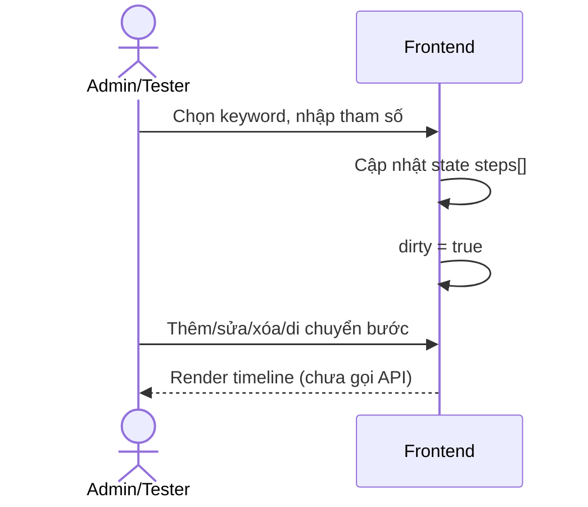
```mermaid
sequenceDiagram
    actor U as Admin/Tester
    participant W as Frontend

    U->>W: Chọn keyword, nhập tham số
    W->>W: Cập nhật state steps[]
    W->>W: dirty = true
    U->>W: Thêm/sửa/xóa/di chuyển bước
    W-->>U: Render timeline (chưa gọi API)
```

### SD-18 — ĐC-18: Lưu danh sách bước

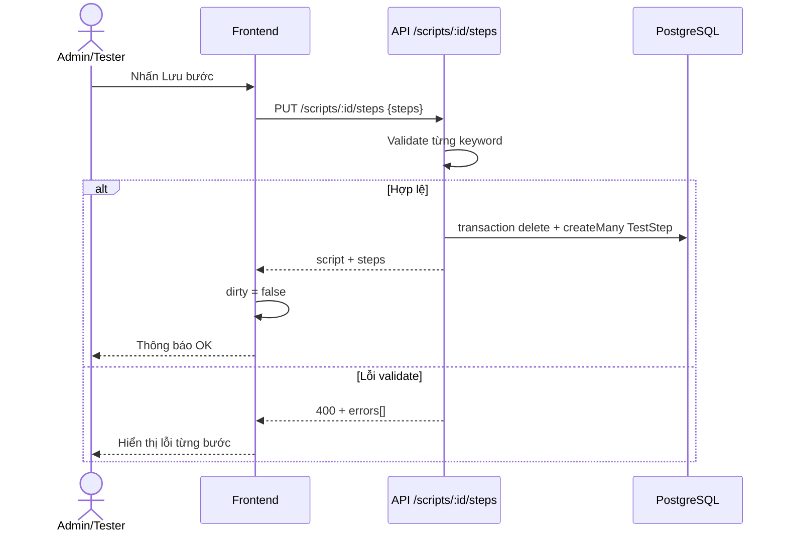
```mermaid
sequenceDiagram
    actor U as Admin/Tester
    participant W as Frontend
    participant API as API /scripts/:id/steps
    participant DB as PostgreSQL

    U->>W: Nhấn Lưu bước
    W->>API: PUT /scripts/:id/steps {steps}
    API->>API: Validate từng keyword
    alt Hợp lệ
        API->>DB: transaction delete + createMany TestStep
        API-->>W: script + steps
        W->>W: dirty = false
        W-->>U: Thông báo OK
    else Lỗi validate
        API-->>W: 400 + errors[]
        W-->>U: Hiển thị lỗi từng bước
    end
```

### SD-19 — ĐC-19: Chạy kịch bản

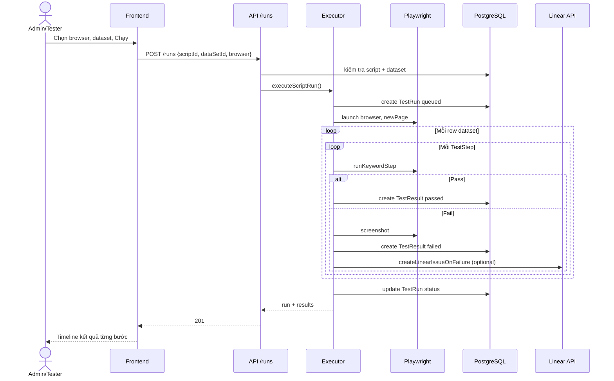
```mermaid
sequenceDiagram
    actor U as Admin/Tester
    participant W as Frontend
    participant API as API /runs
    participant EX as Executor
    participant PW as Playwright
    participant DB as PostgreSQL
    participant L as Linear API

    U->>W: Chọn browser, dataset, Chạy
    W->>API: POST /runs {scriptId, dataSetId, browser}
    API->>DB: kiểm tra script + dataset
    API->>EX: executeScriptRun()
    EX->>DB: create TestRun queued
    EX->>PW: launch browser, newPage
    loop Mỗi row dataset
        loop Mỗi TestStep
            EX->>PW: runKeywordStep
            alt Pass
                EX->>DB: create TestResult passed
            else Fail
                EX->>PW: screenshot
                EX->>DB: create TestResult failed
                EX->>L: createLinearIssueOnFailure (optional)
            end
        end
    end
    EX->>DB: update TestRun status
    EX-->>API: run + results
    API-->>W: 201
    W-->>U: Timeline kết quả từng bước
```

---

## A.5. Đối tượng UI

### SD-20 — ĐC-20: Xem danh sách object

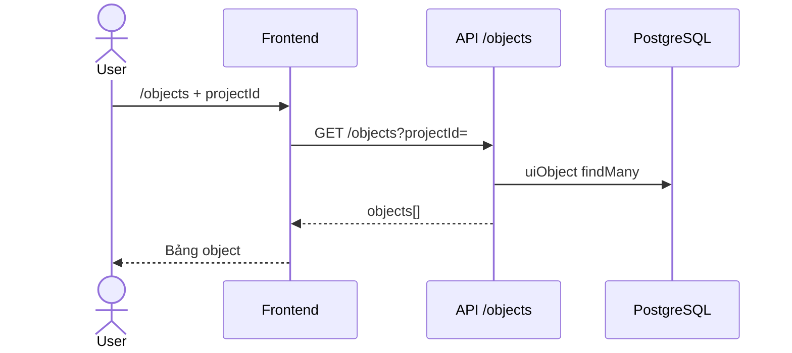
```mermaid
sequenceDiagram
    actor U as User
    participant W as Frontend
    participant API as API /objects
    participant DB as PostgreSQL

    U->>W: /objects + projectId
    W->>API: GET /objects?projectId=
    API->>DB: uiObject findMany
    API-->>W: objects[]
    W-->>U: Bảng object
```

### SD-21 — ĐC-21: Thêm object

```mermaid
sequenceDiagram
    actor U as Admin/Tester
    participant W as Frontend
    participant API as API /objects
    participant DB as PostgreSQL

    U->>W: Submit form
    W->>API: POST /objects
    API->>DB: create UiObject
    API-->>W: 201
    W-->>U: Refresh list
```

### SD-22 — ĐC-22: Sửa object

```mermaid
sequenceDiagram
    actor U as Admin/Tester
    participant W as Frontend
    participant API as API /objects/:id
    participant DB as PostgreSQL

    U->>W: Sửa + lưu
    W->>API: PUT /objects/:id
    API->>DB: update UiObject
    API-->>W: 200
    W-->>U: Cập nhật UI
```

### SD-23 — ĐC-23: Xóa object

```mermaid
sequenceDiagram
    actor U as Admin/Tester
    participant W as Frontend
    participant API as API /objects/:id
    participant DB as PostgreSQL

    U->>W: Xác nhận xóa
    W->>API: DELETE /objects/:id
    API->>DB: delete UiObject
    API-->>W: 204
    W-->>U: Refresh
```

---

## A.6. Bộ dữ liệu

### SD-24 — ĐC-24: Xem danh sách dataset

```mermaid
sequenceDiagram
    actor U as User
    participant W as Frontend
    participant API as API /datasets
    participant DB as PostgreSQL

    U->>W: /datasets
    W->>API: GET /datasets?projectId=
    API->>DB: dataSet findMany
    API-->>W: datasets[]
    W-->>U: Hiển thị
```

### SD-25 — ĐC-25: Tạo dataset

```mermaid
sequenceDiagram
    actor U as Admin/Tester
    participant W as Frontend
    participant API as API /datasets
    participant DB as PostgreSQL

    U->>W: Nhập name, rows JSON
    W->>API: POST /datasets
    API->>API: Validate rows array
    API->>DB: create DataSet
    API-->>W: 201
    W-->>U: Refresh
```

### SD-26 — ĐC-26: Cập nhật dataset

```mermaid
sequenceDiagram
    actor U as Admin/Tester
    participant W as Frontend
    participant API as API /datasets/:id
    participant DB as PostgreSQL

    U->>W: Sửa + lưu
    W->>API: PUT /datasets/:id
    API->>DB: update DataSet
    API-->>W: 200
    W-->>U: OK
```

### SD-27 — ĐC-27: Xóa dataset

```mermaid
sequenceDiagram
    actor U as Admin/Tester
    participant W as Frontend
    participant API as API /datasets/:id
    participant DB as PostgreSQL

    U->>W: Xóa
    W->>API: DELETE /datasets/:id
    API-->>W: 204
    W-->>U: Refresh
```

---

## A.7. Báo cáo

### SD-28 — ĐC-28: Xem danh sách runs

```mermaid
sequenceDiagram
    actor U as User
    participant W as Frontend
    participant API as API /runs
    participant DB as PostgreSQL

    U->>W: Mở /reports
    W->>API: GET /runs
    API->>DB: testRun findMany + script
    API-->>W: runs[]
    W->>W: Tính total/pass/fail
    W-->>U: Thẻ thống kê + bảng
```

### SD-29 — ĐC-29: Lọc báo cáo

```mermaid
sequenceDiagram
    actor U as User
    participant W as Frontend
    participant API as API /runs

    U->>W: Chọn status, scriptId
    W->>API: GET /runs?status=&scriptId=
    API-->>W: runs đã lọc
    W-->>U: Cập nhật bảng
```

### SD-30 — ĐC-30: Chi tiết kết quả run

```mermaid
sequenceDiagram
    actor U as User
    participant W as Frontend
    participant API as API /runs/:id/results
    participant DB as PostgreSQL

    U->>W: Chọn Chi tiết
    W->>API: GET /runs/:id/results
    API->>DB: run + results + steps meta
    API->>DB: uiObject map
    API-->>W: RunDetail JSON
    W-->>U: Bảng bước + screenshot URL
```

### SD-31 — ĐC-31: Tải PDF

```mermaid
sequenceDiagram
    actor U as User
    participant W as Frontend
    participant API as API /runs/:id/report.pdf
    participant PDF as reportPdf service
    participant DB as PostgreSQL

    U->>W: Nhấn Tải PDF
    W->>API: GET /runs/:id/report.pdf + Bearer
    API->>DB: load TestRun + results
    API->>PDF: generateRunPdf (Playwright HTML→PDF)
    PDF-->>API: buffer PDF
    API-->>W: application/pdf
    W-->>U: Download file
```

### SD-32 — ĐC-32: Xem suite run

```mermaid
sequenceDiagram
    actor U as Admin/Tester
    participant W as Frontend
    participant API as API /suites/:suiteId/runs/:runId
    participant DB as PostgreSQL

    U->>W: /report/:runId + nhập suiteId
    W->>API: GET /suites/:suiteId/runs/:runId
    API->>DB: suiteRun findFirst
    API-->>W: run JSON
    W-->>U: Hiển thị response thô
```

---

## A.8. Recorder & Editor

### SD-33 — ĐC-33: Ghi thao tác thủ công

```mermaid
sequenceDiagram
    actor U as Admin/Tester
    participant W as Frontend

    U->>W: Chọn action type, selector, value
    U->>W: Thêm thao tác
    W->>W: actions[] push
    W-->>U: Cập nhật danh sách (local only)
```

### SD-34 — ĐC-34: Import Playwright script

```mermaid
sequenceDiagram
    actor U as Admin/Tester
    participant W as Frontend

    U->>W: Dán script codegen
    U->>W: Nhấn Import
    W->>W: parsePlaywrightScriptToActions()
    alt Parse OK
        W->>W: setActions(parsed)
        W-->>U: Thông báo số thao tác
    else Parse fail
        W-->>U: Lỗi không phân tích được
    end
```

### SD-35 — ĐC-35: Smart record

```mermaid
sequenceDiagram
    actor U as Admin/Tester
    participant W as Frontend
    participant API as API smart-record
    participant DOM as Domain logic

    U->>W: Phân tích smart
    W->>API: POST /projects/:id/tests/smart-record
    API->>DOM: selectorScore + suggestions
    API-->>W: smartSteps, suggestions
    W-->>U: Hiển thị preview JSON
```

### SD-36 — ĐC-36: Tạo test case Draft

```mermaid
sequenceDiagram
    actor U as Admin/Tester
    participant W as Frontend
    participant API as API /projects/:id/tests
    participant DB as PostgreSQL

    U->>W: Tạo test draft
    W->>API: POST /projects/:id/tests {steps}
    API->>API: parseStep từng bước
    API->>DB: create TestCase + Version(Draft)
    API-->>W: 201 {testCaseId, version}
    W-->>U: Hiển thị kết quả
```

### SD-37 — ĐC-37: Publish test case

```mermaid
sequenceDiagram
    actor U as Admin/Tester
    participant W as Frontend
    participant API as API publish
    participant DOM as validateForPublish
    participant DB as PostgreSQL

    U->>W: Nhập projectId, testCaseId, Publish
    W->>API: POST .../tests/:id/publish
    API->>DB: load latest TestCaseVersion
    API->>DOM: validateForPublish
    alt OK
        API->>DB: update content lifecycle Published
        API-->>W: 200 {ok, lifecycle}
    else Fail
        API-->>W: 400 errors[]
    end
    W-->>U: Hiển thị kết quả
```

---

## A.9. Suite

### SD-38 — ĐC-38: Chạy test suite

```mermaid
sequenceDiagram
    actor U as Admin/Tester
    participant W as Frontend
    participant API as API /suites/:id/runs
    participant SR as Suite Runner
    participant PW as Playwright
    participant DB as PostgreSQL

    U->>W: Nhập suiteId, Chạy suite
    W->>API: POST /suites/:suiteId/runs
    API->>DB: create SuiteRun running
    API->>SR: executeSuiteRun(runId)
    loop Mỗi TestSuiteItem
        SR->>PW: newPage, runSuiteStep
        SR->>DB: ghi stepLog trong results JSON
    end
    SR->>DB: update SuiteRun passed/failed
    API-->>W: 202 {runId, status, results}
    W-->>U: Hiển thị response
```

---

## A.10. Quản trị người dùng

### SD-39 — ĐC-39: Xem danh sách user

```mermaid
sequenceDiagram
    actor A as Admin
    participant W as Frontend
    participant API as API /auth/admin/users
    participant DB as PostgreSQL

    A->>W: /admin/users
    W->>API: GET /auth/admin/users
    API->>API: requireRole ADMIN
    API->>DB: user findMany
    API-->>W: users[]
    W-->>A: Bảng + search
```

### SD-40 — ĐC-40: Tạo user

```mermaid
sequenceDiagram
    actor A as Admin
    participant W as Frontend
    participant API as API create-user
    participant DB as PostgreSQL

    A->>W: Form tạo user
    W->>API: POST /auth/admin/create-user
    API->>DB: create User
    opt Có projectId
        API->>DB: create ProjectMember
    end
    API-->>W: 201
    W-->>A: Refresh list
```

### SD-41 — ĐC-41: Cập nhật user

```mermaid
sequenceDiagram
    actor A as Admin
    participant W as Frontend
    participant API as API /auth/admin/users/:id
    participant DB as PostgreSQL

    A->>W: Sửa user
    W->>API: PUT /auth/admin/users/:id
    API->>API: Kiểm tra admin duy nhất, email trùng
    API->>DB: update User
    API-->>W: 200
    W-->>A: OK
```

### SD-42 — ĐC-42: Xóa user

```mermaid
sequenceDiagram
    actor A as Admin
    participant W as Frontend
    participant API as API DELETE user
    participant DB as PostgreSQL

    A->>W: Xác nhận xóa
    W->>API: DELETE /auth/admin/users/:id
    API->>DB: count ownedProjects, scripts, runs
    alt Vi phạm ràng buộc
        API-->>W: 400 + message
    else OK
        API->>DB: delete User
        API-->>W: 204
    end
    W-->>A: Cập nhật list
```

---

## Mục lục SD ↔ ĐC

| SD | ĐC | Use case |
|----|-----|----------|
| SD-01 | ĐC-01 | Trang giới thiệu |
| SD-02 | ĐC-02 | Đăng nhập |
| … | … | … |
| SD-42 | ĐC-42 | Xóa user |

*Tổng: **42** biểu đồ trình tự.*
