# Biểu đồ hoạt động (Activity) — 42 Use case giao diện web

Ánh xạ với `11-dac-ta-chuc-nang-giao-dien-web.md` (ĐC-01 → ĐC-42).

---

## A.1. Trang công khai & xác thực

### AD-01 — ĐC-01: Truy cập trang giới thiệu

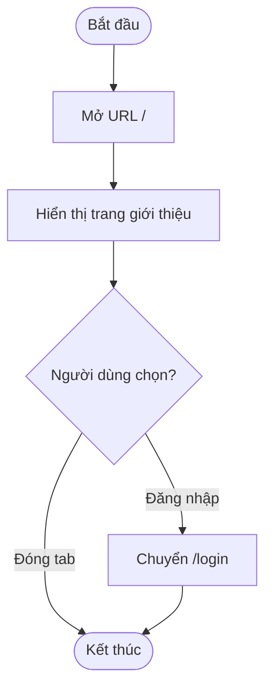
```mermaid
flowchart TD
    A([Bắt đầu]) --> B[Mở URL /]
    B --> C[Hiển thị trang giới thiệu]
    C --> D{Người dùng chọn?}
    D -- Đăng nhập --> E[Chuyển /login]
    D -- Đóng tab --> F([Kết thúc])
    E --> F
```

### AD-02 — ĐC-02: Đăng nhập hệ thống

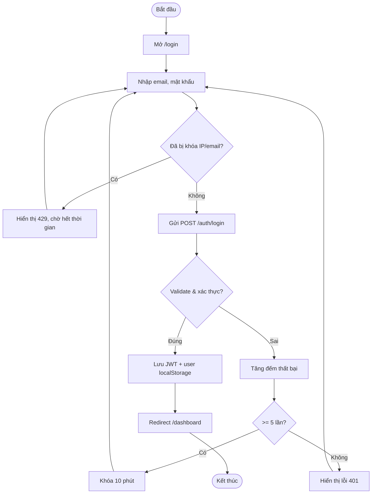
```mermaid
flowchart TD
    A([Bắt đầu]) --> B[Mở /login]
    B --> C[Nhập email, mật khẩu]
    C --> D{Đã bị khóa IP/email?}
    D -- Có --> E[Hiển thị 429, chờ hết thời gian]
    E --> C
    D -- Không --> F[Gửi POST /auth/login]
    F --> G{Validate & xác thực?}
    G -- Sai --> H[Tăng đếm thất bại]
    H --> I{>= 5 lần?}
    I -- Có --> J[Khóa 10 phút]
    I -- Không --> K[Hiển thị lỗi 401]
    K --> C
    J --> C
    G -- Đúng --> L[Lưu JWT + user localStorage]
    L --> M[Redirect /dashboard]
    M --> N([Kết thúc])
```

### AD-03 — ĐC-03: Đăng ký tài khoản

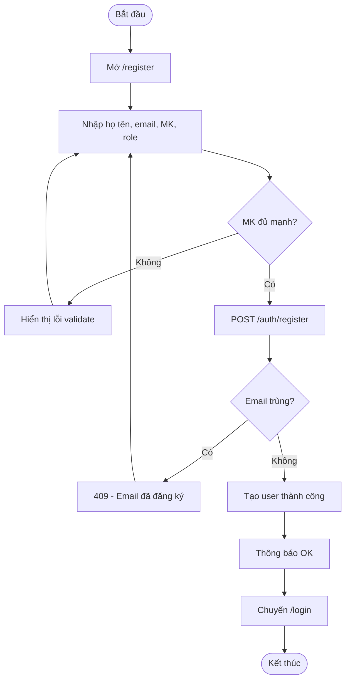
```mermaid
flowchart TD
    A([Bắt đầu]) --> B[Mở /register]
    B --> C[Nhập họ tên, email, MK, role]
    C --> D{MK đủ mạnh?}
    D -- Không --> E[Hiển thị lỗi validate]
    E --> C
    D -- Có --> F[POST /auth/register]
    F --> G{Email trùng?}
    G -- Có --> H[409 - Email đã đăng ký]
    H --> C
    G -- Không --> I[Tạo user thành công]
    I --> J[Thông báo OK]
    J --> K[Chuyển /login]
    K --> L([Kết thúc])
```

### AD-04 — ĐC-04: Quên mật khẩu

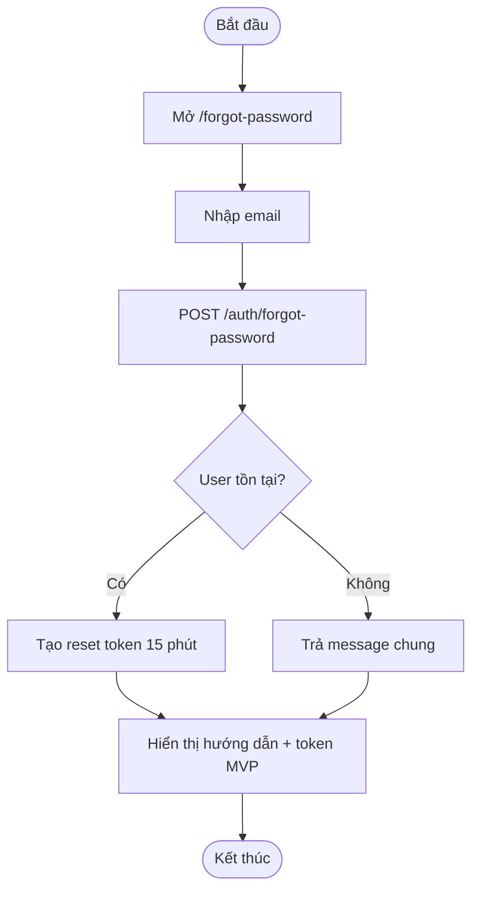
```mermaid
flowchart TD
    A([Bắt đầu]) --> B[Mở /forgot-password]
    B --> C[Nhập email]
    C --> D[POST /auth/forgot-password]
    D --> E{User tồn tại?}
    E -- Có --> F[Tạo reset token 15 phút]
    E -- Không --> G[Trả message chung]
    F --> H[Hiển thị hướng dẫn + token MVP]
    G --> H
    H --> I([Kết thúc])
```

### AD-05 — ĐC-05: Đặt lại mật khẩu

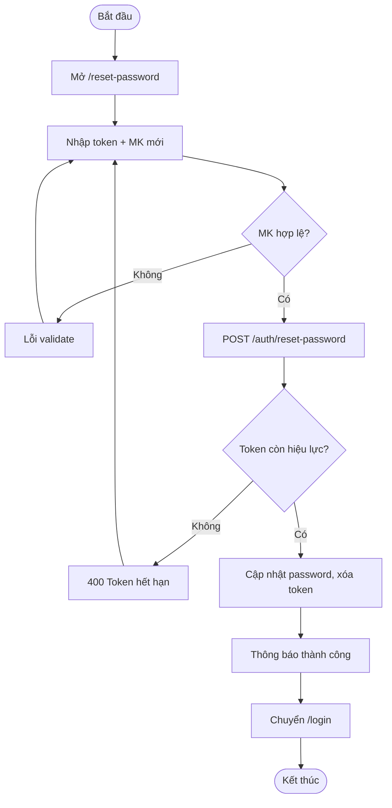
```mermaid
flowchart TD
    A([Bắt đầu]) --> B[Mở /reset-password]
    B --> C[Nhập token + MK mới]
    C --> D{MK hợp lệ?}
    D -- Không --> E[Lỗi validate]
    E --> C
    D -- Có --> F[POST /auth/reset-password]
    F --> G{Token còn hiệu lực?}
    G -- Không --> H[400 Token hết hạn]
    H --> C
    G -- Có --> I[Cập nhật password, xóa token]
    I --> J[Thông báo thành công]
    J --> K[Chuyển /login]
    K --> L([Kết thúc])
```

### AD-06 — ĐC-06: Đổi mật khẩu

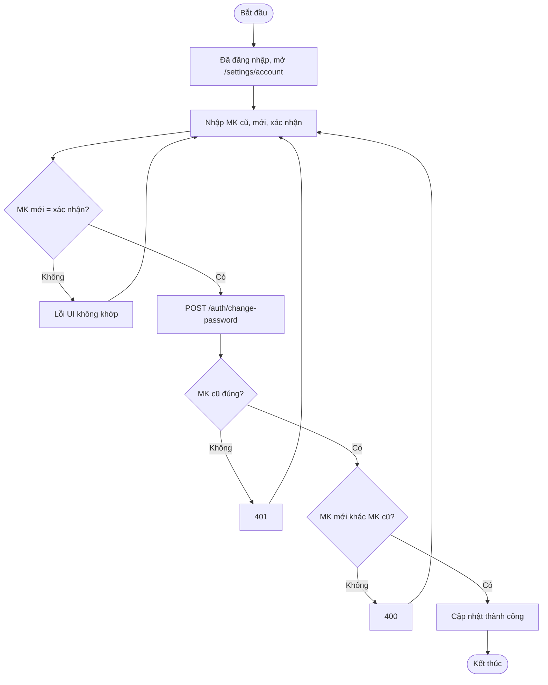
```mermaid
flowchart TD
    A([Bắt đầu]) --> B[Đã đăng nhập, mở /settings/account]
    B --> C[Nhập MK cũ, mới, xác nhận]
    C --> D{MK mới = xác nhận?}
    D -- Không --> E[Lỗi UI không khớp]
    E --> C
    D -- Có --> F[POST /auth/change-password]
    F --> G{MK cũ đúng?}
    G -- Không --> H[401]
    H --> C
    G -- Có --> I{MK mới khác MK cũ?}
    I -- Không --> J[400]
    J --> C
    I -- Có --> K[Cập nhật thành công]
    K --> L([Kết thúc])
```

### AD-07 — ĐC-07: Đăng xuất

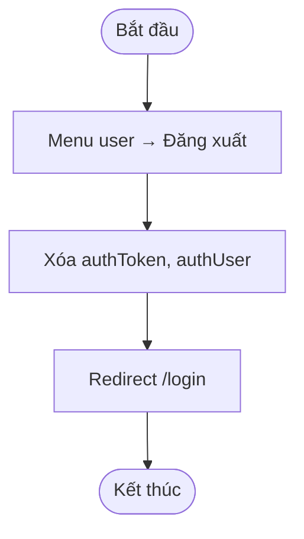
```mermaid
flowchart TD
    A([Bắt đầu]) --> B[Menu user → Đăng xuất]
    B --> C[Xóa authToken, authUser]
    C --> D[Redirect /login]
    D --> E([Kết thúc])
```

---

## A.2. Dashboard

### AD-08 — ĐC-08: Dashboard & analytics

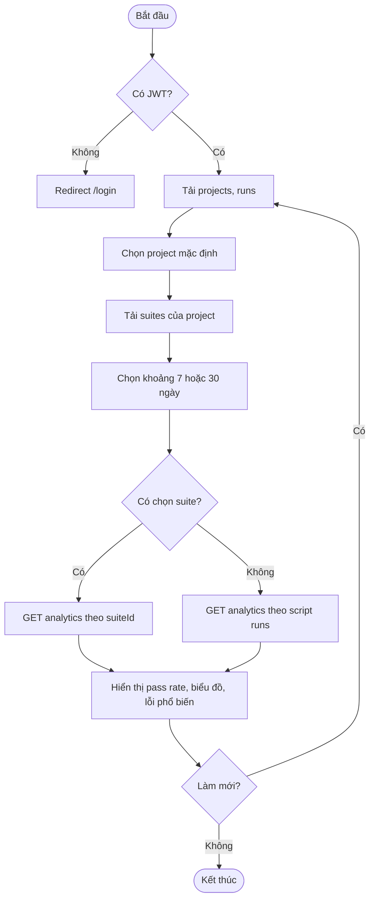
```mermaid
flowchart TD
    A([Bắt đầu]) --> B{Có JWT?}
    B -- Không --> C[Redirect /login]
    B -- Có --> D[Tải projects, runs]
    D --> E[Chọn project mặc định]
    E --> F[Tải suites của project]
    F --> G[Chọn khoảng 7 hoặc 30 ngày]
    G --> H{Có chọn suite?}
    H -- Có --> I[GET analytics theo suiteId]
    H -- Không --> J[GET analytics theo script runs]
    I --> K[Hiển thị pass rate, biểu đồ, lỗi phổ biến]
    J --> K
    K --> L{Làm mới?}
    L -- Có --> D
    L -- Không --> M([Kết thúc])
```

---

## A.3. Quản lý dự án

### AD-09 — ĐC-09: Xem danh sách dự án

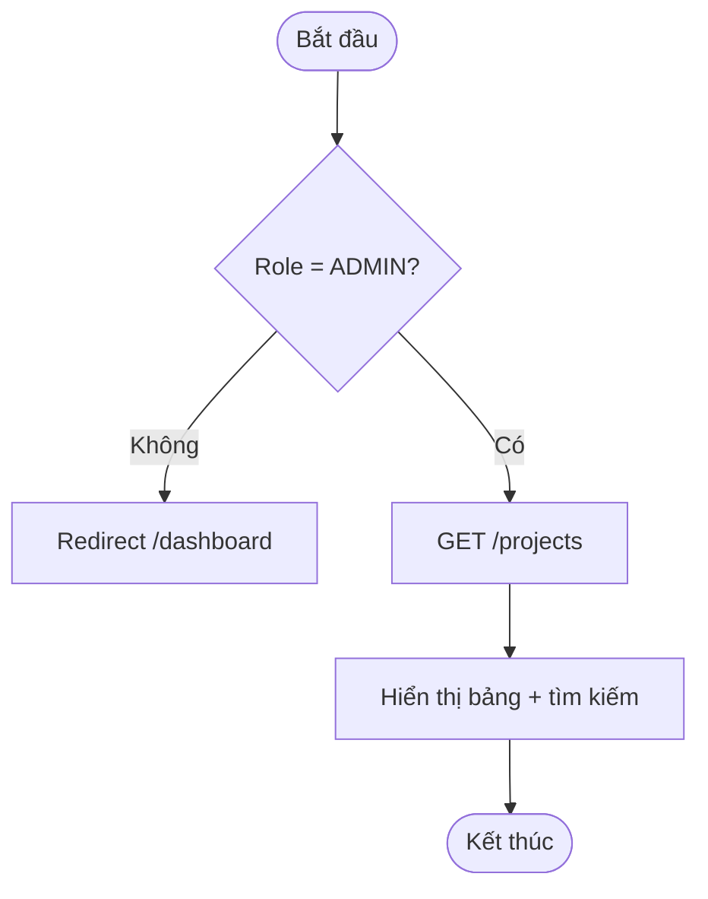
```mermaid
flowchart TD
    A([Bắt đầu]) --> B{Role = ADMIN?}
    B -- Không --> C[Redirect /dashboard]
    B -- Có --> D[GET /projects]
    D --> E[Hiển thị bảng + tìm kiếm]
    E --> F([Kết thúc])
```

### AD-10 — ĐC-10: Tạo dự án

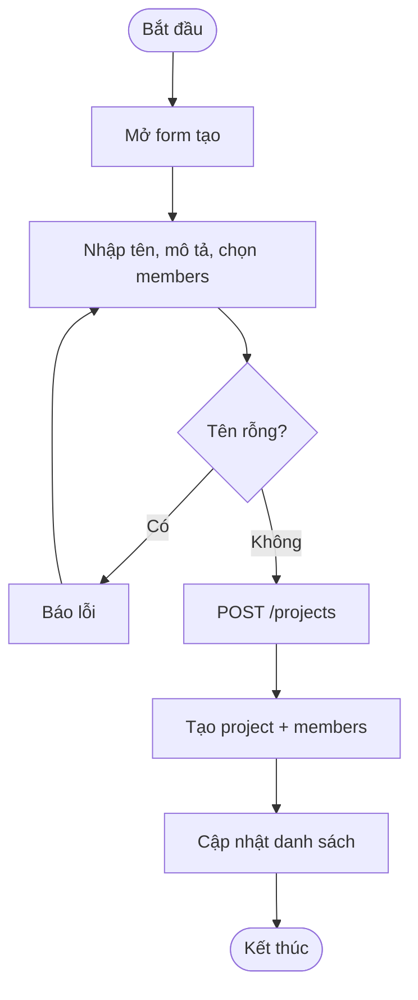
```mermaid
flowchart TD
    A([Bắt đầu]) --> B[Mở form tạo]
    B --> C[Nhập tên, mô tả, chọn members]
    C --> D{Tên rỗng?}
    D -- Có --> E[Báo lỗi]
    E --> C
    D -- Không --> F[POST /projects]
    F --> G[Tạo project + members]
    G --> H[Cập nhật danh sách]
    H --> I([Kết thúc])
```

### AD-11 — ĐC-11: Cập nhật dự án

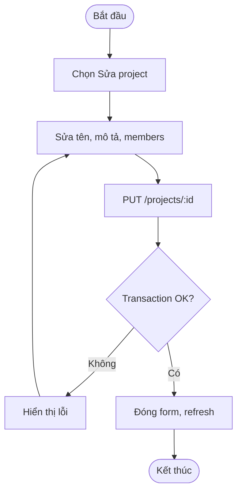
```mermaid
flowchart TD
    A([Bắt đầu]) --> B[Chọn Sửa project]
    B --> C[Sửa tên, mô tả, members]
    C --> D[PUT /projects/:id]
    D --> E{Transaction OK?}
    E -- Không --> F[Hiển thị lỗi]
    F --> C
    E -- Có --> G[Đóng form, refresh]
    G --> H([Kết thúc])
```

### AD-12 — ĐC-12: Xóa dự án

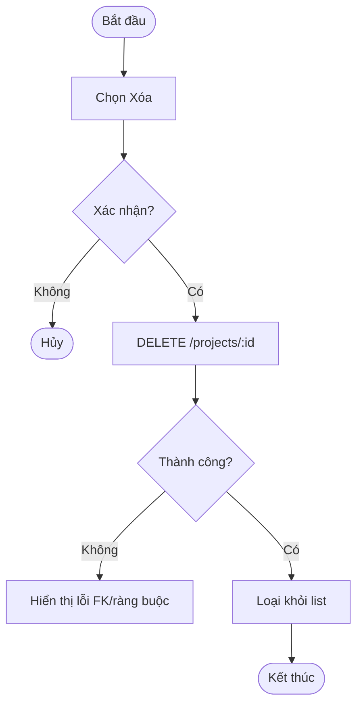
```mermaid
flowchart TD
    A([Bắt đầu]) --> B[Chọn Xóa]
    B --> C{Xác nhận?}
    C -- Không --> D([Hủy])
    C -- Có --> E[DELETE /projects/:id]
    E --> F{Thành công?}
    F -- Không --> G[Hiển thị lỗi FK/ràng buộc]
    F -- Có --> H[Loại khỏi list]
    H --> I([Kết thúc])
```

---

## A.4. Quản lý kịch bản

### AD-13 — ĐC-13: Xem danh sách kịch bản

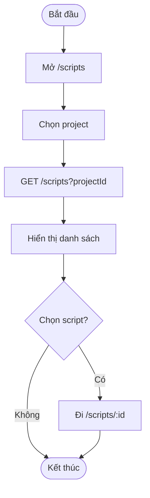
```mermaid
flowchart TD
    A([Bắt đầu]) --> B[Mở /scripts]
    B --> C[Chọn project]
    C --> D[GET /scripts?projectId]
    D --> E[Hiển thị danh sách]
    E --> F{Chọn script?}
    F -- Có --> G[Đi /scripts/:id]
    F -- Không --> H([Kết thúc])
    G --> H
```

### AD-14 — ĐC-14: Tạo kịch bản

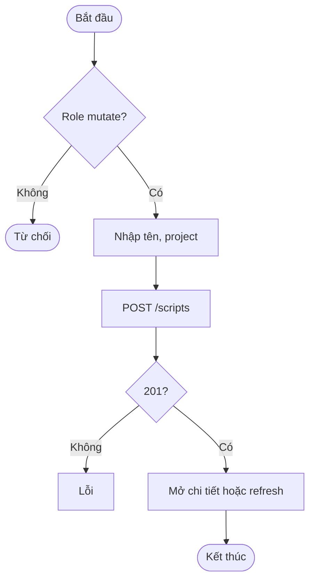
```mermaid
flowchart TD
    A([Bắt đầu]) --> B{Role mutate?}
    B -- Không --> C([Từ chối])
    B -- Có --> D[Nhập tên, project]
    D --> E[POST /scripts]
    E --> F{201?}
    F -- Không --> G[Lỗi]
    F -- Có --> H[Mở chi tiết hoặc refresh]
    H --> I([Kết thúc])
```

### AD-15 — ĐC-15: Xóa kịch bản

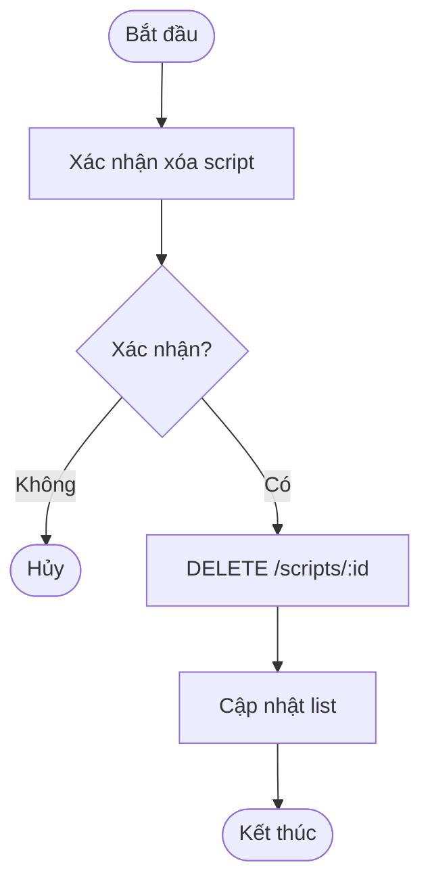
```mermaid
flowchart TD
    A([Bắt đầu]) --> B[Xác nhận xóa script]
    B --> C{Xác nhận?}
    C -- Không --> D([Hủy])
    C -- Có --> E[DELETE /scripts/:id]
    E --> F[Cập nhật list]
    F --> G([Kết thúc])
```

### AD-16 — ĐC-16: Xem chi tiết kịch bản

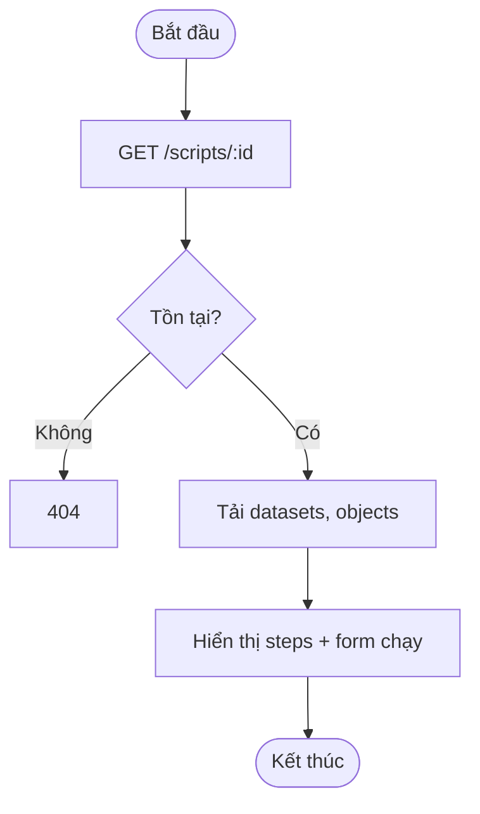
```mermaid
flowchart TD
    A([Bắt đầu]) --> B[GET /scripts/:id]
    B --> C{Tồn tại?}
    C -- Không --> D[404]
    C -- Có --> E[Tải datasets, objects]
    E --> F[Hiển thị steps + form chạy]
    F --> G([Kết thúc])
```

### AD-17 — ĐC-17: Biên tập bước

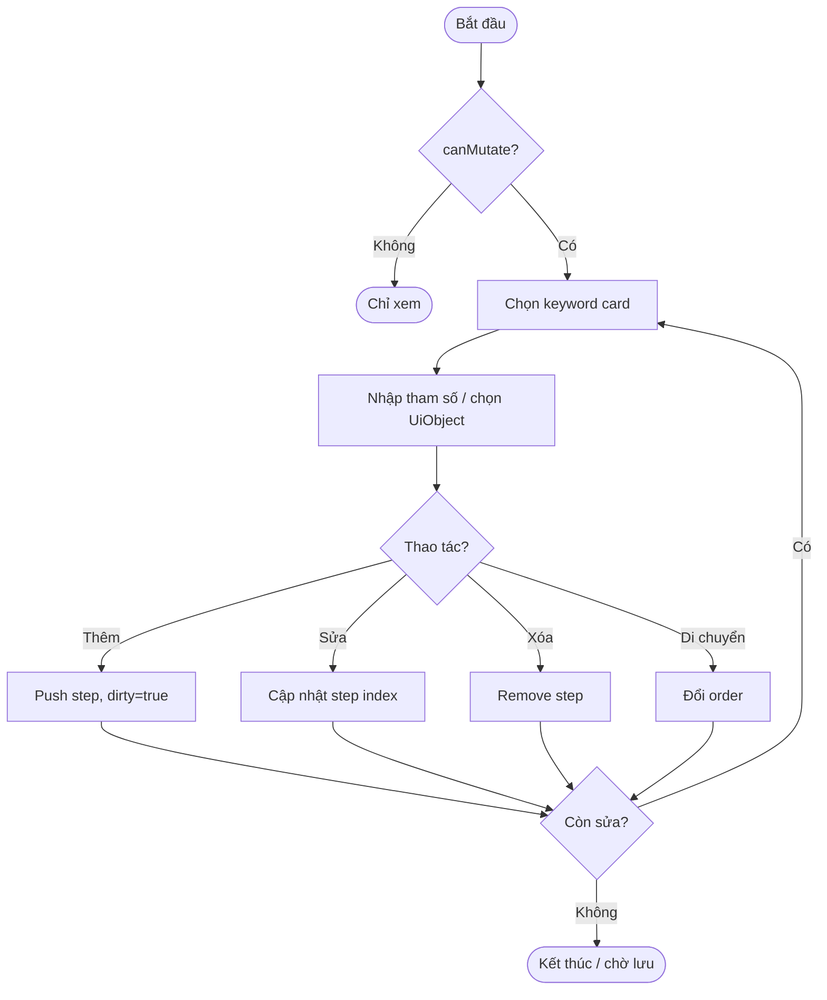
```mermaid
flowchart TD
    A([Bắt đầu]) --> B{canMutate?}
    B -- Không --> C([Chỉ xem])
    B -- Có --> D[Chọn keyword card]
    D --> E[Nhập tham số / chọn UiObject]
    E --> F{Thao tác?}
    F -- Thêm --> G[Push step, dirty=true]
    F -- Sửa --> H[Cập nhật step index]
    F -- Xóa --> I[Remove step]
    F -- Di chuyển --> J[Đổi order]
    G --> K{Còn sửa?}
    H --> K
    I --> K
    J --> K
    K -- Có --> D
    K -- Không --> L([Kết thúc / chờ lưu])
```

### AD-18 — ĐC-18: Lưu danh sách bước

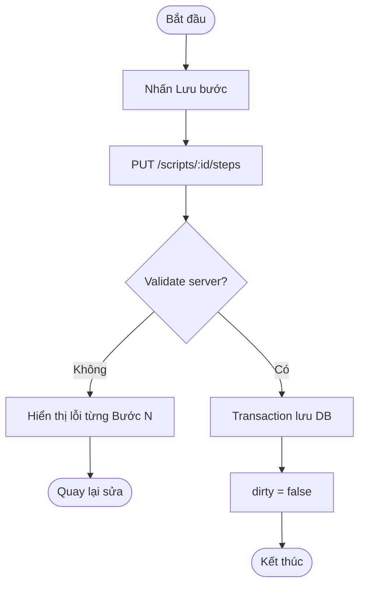
```mermaid
flowchart TD
    A([Bắt đầu]) --> B[Nhấn Lưu bước]
    B --> C[PUT /scripts/:id/steps]
    C --> D{Validate server?}
    D -- Không --> E[Hiển thị lỗi từng Bước N]
    E --> F([Quay lại sửa])
    D -- Có --> G[Transaction lưu DB]
    G --> H[dirty = false]
    H --> I([Kết thúc])
```

### AD-19 — ĐC-19: Chạy kịch bản

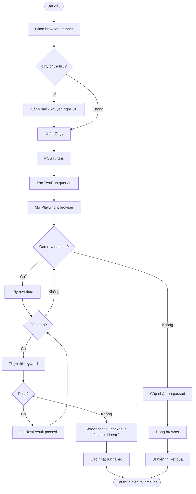
```mermaid
flowchart TD
    A([Bắt đầu]) --> B[Chọn browser, dataset]
    B --> C{dirty chưa lưu?}
    C -- Có --> D[Cảnh báo - khuyến nghị lưu]
    D --> E[Nhấn Chạy]
    C -- Không --> E
    E --> F[POST /runs]
    F --> G[Tạo TestRun queued]
    G --> H[Mở Playwright browser]
    H --> I{Còn row dataset?}
    I -- Không --> P[Cập nhật run passed]
    I -- Có --> J[Lấy row data]
    J --> K{Còn step?}
    K -- Không --> I
    K -- Có --> L[Thực thi keyword]
    L --> M{Pass?}
    M -- Có --> N[Ghi TestResult passed]
    N --> K
    M -- Không --> O[Screenshot + TestResult failed + Linear?]
    O --> Q[Cập nhật run failed]
    Q --> R([Kết thúc hiển thị timeline])
    P --> S[Đóng browser]
    S --> T[UI hiển thị kết quả]
    T --> R
```

---

## A.5. Đối tượng UI

### AD-20 — ĐC-20: Xem danh sách object

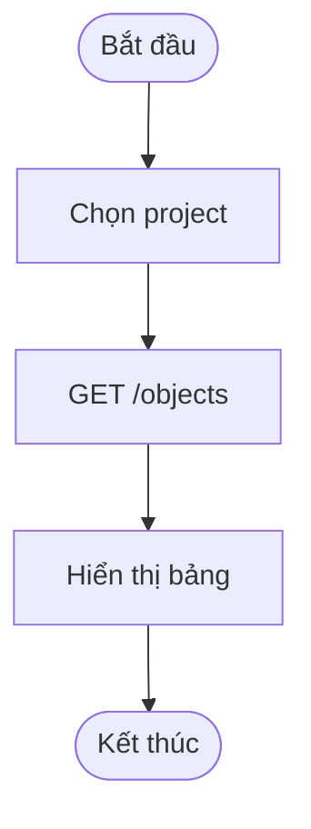
```mermaid
flowchart TD
    A([Bắt đầu]) --> B[Chọn project]
    B --> C[GET /objects]
    C --> D[Hiển thị bảng]
    D --> E([Kết thúc])
```

### AD-21 — ĐC-21: Thêm object

```mermaid
flowchart TD
    A([Bắt đầu]) --> B[Điền name, locator]
    B --> C{Locator rỗng?}
    C -- Có --> D[Lỗi UI]
    D --> B
    C -- Không --> E[POST /objects]
    E --> F[Refresh list]
    F --> G([Kết thúc])
```

### AD-22 — ĐC-22: Sửa object

```mermaid
flowchart TD
    A([Bắt đầu]) --> B[Mở form sửa]
    B --> C[Sửa field]
    C --> D[PUT /objects/:id]
    D --> E{OK?}
    E -- Không --> F[Lỗi]
    E -- Có --> G[Cập nhật UI]
    G --> H([Kết thúc])
```

### AD-23 — ĐC-23: Xóa object

```mermaid
flowchart TD
    A([Bắt đầu]) --> B{Xác nhận xóa?}
    B -- Không --> C([Hủy])
    B -- Có --> D[DELETE /objects/:id]
    D --> E[Refresh]
    E --> F([Kết thúc])
```

---

## A.6. Bộ dữ liệu

### AD-24 — ĐC-24: Xem danh sách dataset

```mermaid
flowchart TD
    A([Bắt đầu]) --> B[Chọn project]
    B --> C[GET /datasets]
    C --> D[Hiển thị]
    D --> E([Kết thúc])
```

### AD-25 — ĐC-25: Tạo dataset

```mermaid
flowchart TD
    A([Bắt đầu]) --> B[Nhập name, rows JSON]
    B --> C{rows là array?}
    C -- Không --> D[Lỗi 400]
    D --> B
    C -- Có --> E[POST /datasets]
    E --> F([Kết thúc])
```

### AD-26 — ĐC-26: Cập nhật dataset

```mermaid
flowchart TD
    A([Bắt đầu]) --> B[Sửa form]
    B --> C[PUT /datasets/:id]
    C --> D{OK?}
    D -- Không --> E[Lỗi]
    D -- Có --> F([Kết thúc])
```

### AD-27 — ĐC-27: Xóa dataset

```mermaid
flowchart TD
    A([Bắt đầu]) --> B{Xác nhận?}
    B -- Không --> C([Hủy])
    B -- Có --> D[DELETE]
    D --> E([Kết thúc])
```

---

## A.7. Báo cáo

### AD-28 — ĐC-28: Xem danh sách runs

```mermaid
flowchart TD
    A([Bắt đầu]) --> B[GET /runs]
    B --> C[Tính total, passed, failed]
    C --> D[Hiển thị thẻ + bảng]
    D --> E([Kết thúc])
```

### AD-29 — ĐC-29: Lọc báo cáo

```mermaid
flowchart TD
    A([Bắt đầu]) --> B[Chọn status và/hoặc script]
    B --> C[GET /runs với query params]
    C --> D[Cập nhật bảng và thống kê]
    D --> E{Đổi filter?}
    E -- Có --> B
    E -- Không --> F([Kết thúc])
```

### AD-30 — ĐC-30: Chi tiết kết quả run

```mermaid
flowchart TD
    A([Bắt đầu]) --> B[Chọn run → Chi tiết]
    B --> C[GET /runs/:id/results]
    C --> D[Hiển thị từng stepOrder, status, message]
    D --> E{Có screenshot?}
    E -- Có --> F[Hiển thị ảnh từ /screenshots]
    E -- Không --> G([Kết thúc])
    F --> G
```

### AD-31 — ĐC-31: Tải PDF

```mermaid
flowchart TD
    A([Bắt đầu]) --> B[Nhấn Tải PDF]
    B --> C[fetch PDF + Bearer]
    C --> D{HTTP 200?}
    D -- Không --> E[Hiển thị lỗi]
    D -- Có --> F[Tạo blob, trigger download]
    F --> G([Kết thúc])
    E --> G
```

### AD-32 — ĐC-32: Xem suite run

```mermaid
flowchart TD
    A([Bắt đầu]) --> B[Mở /report/:runId]
    B --> C[Nhập suiteId]
    C --> D{suiteId có?}
    D -- Không --> E[Message yêu cầu nhập]
    D -- Có --> F[GET suite run]
    F --> G{200?}
    G -- Không --> H[Hiển thị lỗi]
    G -- Có --> I[Hiển thị JSON results]
    E --> C
    H --> J([Kết thúc])
    I --> J
```

---

## A.8. Recorder & Editor

### AD-33 — ĐC-33: Ghi thao tác thủ công

```mermaid
flowchart TD
    A([Bắt đầu]) --> B[Chọn project, URL]
    B --> C[Chọn loại: click/fill/assert/navigate]
    C --> D[Nhập selector, value]
    D --> E{Selector rỗng?}
    E -- Có --> F[Lỗi]
    F --> D
    E -- Không --> G[Thêm vào actions[]]
    G --> H{Còn thêm?}
    H -- Có --> C
    H -- Không --> I([Kết thúc / chờ submit])
```

### AD-34 — ĐC-34: Import Playwright

```mermaid
flowchart TD
    A([Bắt đầu]) --> B[Dán script vào textarea]
    B --> C[Nhấn Import]
    C --> D[Parse từng dòng]
    D --> E{Parse được >= 1 action?}
    E -- Không --> F[Lỗi không phân tích được]
    E -- Có --> G[Gán actions, cập nhật URL từ goto]
    G --> H([Kết thúc])
    F --> B
```

### AD-35 — ĐC-35: Smart record

```mermaid
flowchart TD
    A([Bắt đầu]) --> B[Validate project, URL, actions]
    B --> C{Hợp lệ?}
    C -- Không --> D[Lỗi UI]
    C -- Có --> E[POST smart-record]
    E --> F[Tính selectorScore, suggestions]
    F --> G[Hiển thị smartSteps preview]
    G --> H([Kết thúc])
```

### AD-36 — ĐC-36: Tạo test case Draft

```mermaid
flowchart TD
    A([Bắt đầu]) --> B[Build steps: navigate + actions]
    B --> C{>= 1 action hợp lệ?}
    C -- Không --> D[Lỗi cần thêm thao tác]
    C -- Có --> E[POST /projects/:id/tests]
    E --> F{parseStep OK?}
    F -- Không --> G[400]
    F -- Có --> H[Tạo TestCase + Version Draft]
    H --> I[Hiển thị testCaseId, version]
    I --> J([Kết thúc])
```

### AD-37 — ĐC-37: Publish test case

```mermaid
flowchart TD
    A([Bắt đầu]) --> B[Nhập projectId, testCaseId]
    B --> C[POST publish]
    C --> D[validateForPublish]
    D --> E{OK?}
    E -- Không --> F[400 + danh sách errors]
    E -- Có --> G[Cập nhật lifecycle Published]
    G --> H[Hiển thị kết quả]
    H --> I([Kết thúc])
    F --> B
```

---

## A.9. Suite

### AD-38 — ĐC-38: Chạy test suite

```mermaid
flowchart TD
    A([Bắt đầu]) --> B[Nhập suiteId]
    B --> C[POST /suites/:id/runs]
    C --> D[Tạo SuiteRun running]
    D --> E[Mở Chromium]
    E --> F{Còn item trong suite?}
    F -- Không --> M[Cập nhật passed/failed]
    F -- Có --> G[newPage cho test case]
    G --> H{Còn step?}
    H -- Không --> I[Đóng page, ghi case result]
    I --> F
    H -- Có --> J[runSuiteStep]
    J --> K{Pass?}
    K -- Có --> L[Ghi stepLog passed]
    L --> H
    K -- Không --> N[Screenshot, stepLog failed, break case]
    N --> O[Đánh dấu suiteFailed]
    O --> I
    M --> P[Đóng browser]
    P --> Q[Hiển thị JSON response]
    Q --> R([Kết thúc])
```

---

## A.10. Quản trị người dùng

### AD-39 — ĐC-39: Xem danh sách user

```mermaid
flowchart TD
    A([Bắt đầu]) --> B{ADMIN?}
    B -- Không --> C[Redirect dashboard]
    B -- Có --> D[GET /auth/admin/users]
    D --> E[Hiển thị + search local]
    E --> F([Kết thúc])
```

### AD-40 — ĐC-40: Tạo user

```mermaid
flowchart TD
    A([Bắt đầu]) --> B[Form: email, MK, role, project?]
    B --> C[POST create-user]
    C --> D{Email trùng?}
    D -- Có --> E[409]
    D -- Không --> F[Tạo user]
    F --> G{Có projectId?}
    G -- Có --> H[Tạo ProjectMember]
    G -- Không --> I[Refresh list]
    H --> I
    I --> J([Kết thúc])
    E --> B
```

### AD-41 — ĐC-41: Cập nhật user

```mermaid
flowchart TD
    A([Bắt đầu]) --> B[Mở sửa user]
    B --> C[PUT /auth/admin/users/:id]
    C --> D{Hạ quyền admin cuối?}
    D -- Có --> E[400]
    D -- Không --> F{Email trùng user khác?}
    F -- Có --> G[409]
    F -- Không --> H[Cập nhật thành công]
    H --> I([Kết thúc])
    E --> B
    G --> B
```

### AD-42 — ĐC-42: Xóa user

```mermaid
flowchart TD
    A([Bắt đầu]) --> B[Xác nhận xóa]
    B --> C{Xóa chính mình?}
    C -- Có --> D[400]
    C -- Không --> E{Admin duy nhất?}
    E -- Có --> F[400]
    E -- Không --> G{Còn owned projects?}
    G -- Có --> H[400]
    G -- Không --> I{Còn scripts created?}
    I -- Có --> J[400]
    I -- Không --> K{Còn test runs?}
    K -- Có --> L[400]
    K -- Không --> M[DELETE user]
    M --> N([Kết thúc])
    D --> O([Hủy])
    F --> O
    H --> O
    J --> O
    L --> O
```

---

## Mục lục AD ↔ ĐC

| AD | ĐC | Use case |
|----|-----|----------|
| AD-01 | ĐC-01 | Trang giới thiệu |
| AD-02 | ĐC-02 | Đăng nhập |
| … | … | … |
| AD-42 | ĐC-42 | Xóa user |

*Tổng: **42** biểu đồ hoạt động.*

---

## Hướng dẫn xuất hình cho Word

1. Mở file trên bằng VS Code / Cursor preview Mermaid, hoặc [mermaid.live](https://mermaid.live).
2. Export PNG/SVG từng sơ đồ → chèn vào Word dưới mục *Hình 3.x*.
3. Đặt chú thích: *Hình 3.x — Biểu đồ trình tự/hoạt động use case ĐC-xx*.
