# Biểu đồ trình tự (gộp nhóm) — Giao diện web

Các use case **gần nhau** được gộp vào **một biểu đồ trình tự**. Tham chiếu đặc tả: `11-dac-ta-chuc-nang-giao-dien-web.md`.

| STT | Nhóm | Mã use case gộp | Số UC |
|-----|------|-----------------|-------|
| 1 | Trang chủ | ĐC-01 | 1 |
| 2 | Xác thực & tài khoản | ĐC-02 → ĐC-07 | 6 |
| 3 | Dashboard | ĐC-08 | 1 |
| 4 | Quản lý dự án | ĐC-09 → ĐC-12 | 4 |
| 5 | Quản lý kịch bản | ĐC-13 → ĐC-18 | 6 |
| 6 | Thực thi kịch bản | ĐC-19 | 1 |
| 7 | Đối tượng UI | ĐC-20 → ĐC-23 | 4 |
| 8 | Bộ dữ liệu | ĐC-24 → ĐC-27 | 4 |
| 9 | Báo cáo | ĐC-28 → ĐC-32 | 5 |
| 10 | Ghi thao tác & publish | ĐC-33 → ĐC-37 | 5 |
| 11 | Chạy suite | ĐC-38 | 1 |
| 12 | Quản trị người dùng | ĐC-39 → ĐC-42 | 4 |

**Tổng: 12 biểu đồ trình tự** (thay cho 42 biểu đồ tách riêng).

---

## STT 1 — Trang chủ (ĐC-01)

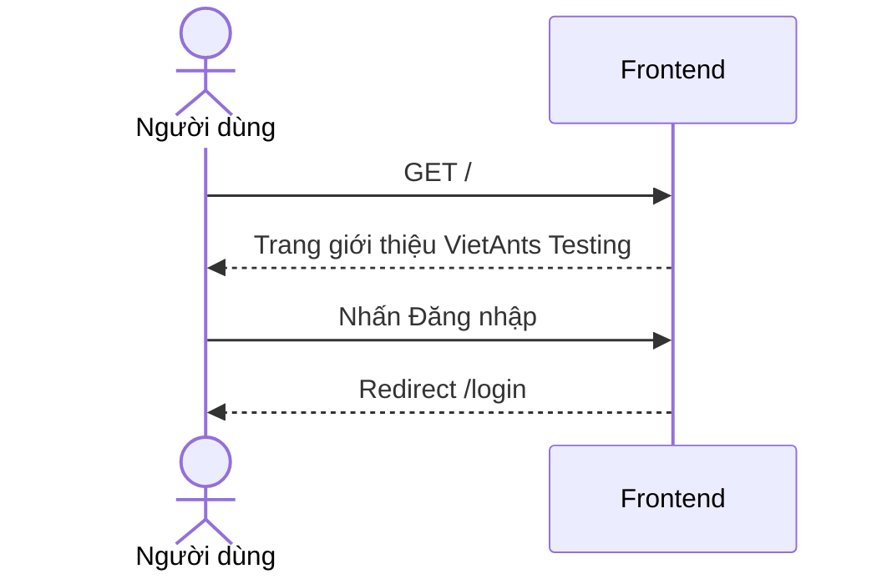

---

## STT 2 — Xác thực & quản lý tài khoản (ĐC-02 → ĐC-07)

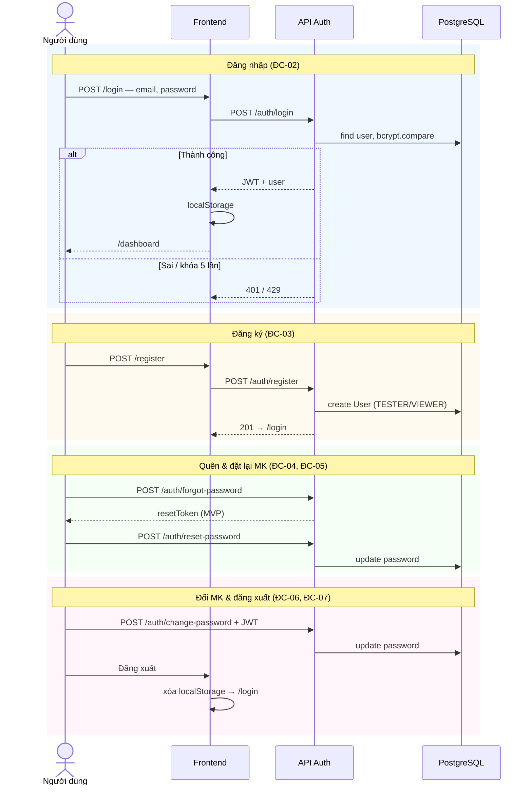

---

## STT 3 — Dashboard & thống kê (ĐC-08)

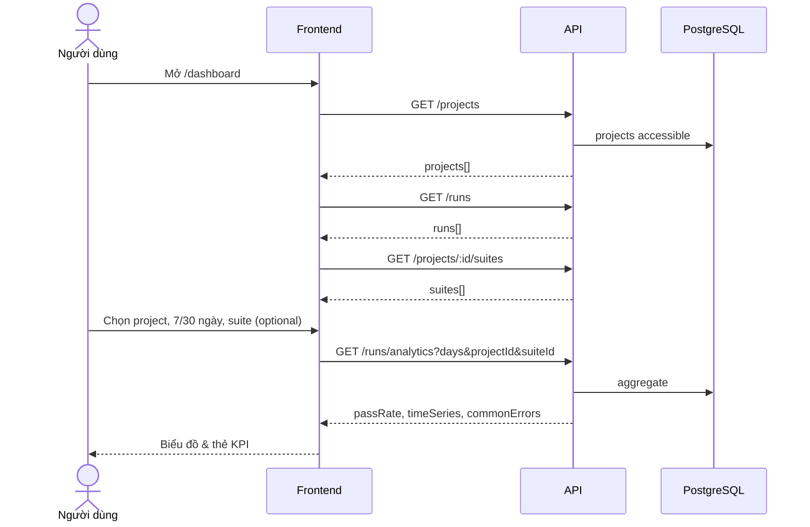

---

## STT 4 — Quản lý dự án CRUD (ĐC-09 → ĐC-12)

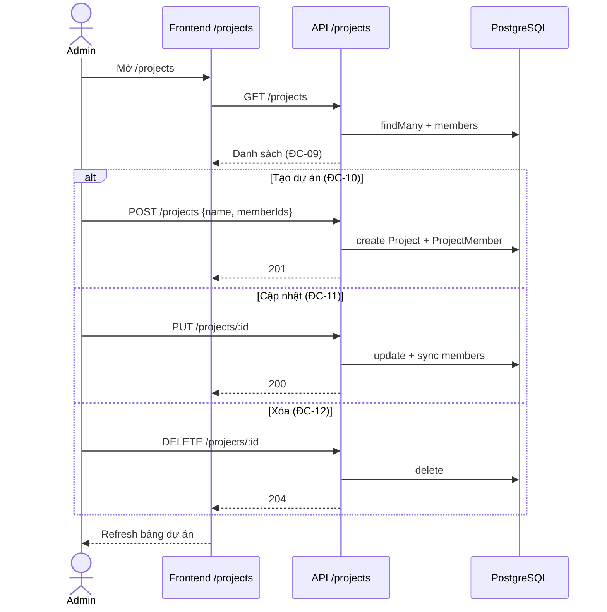

---

## STT 5 — Quản lý kịch bản kiểm thử (ĐC-13 → ĐC-18)

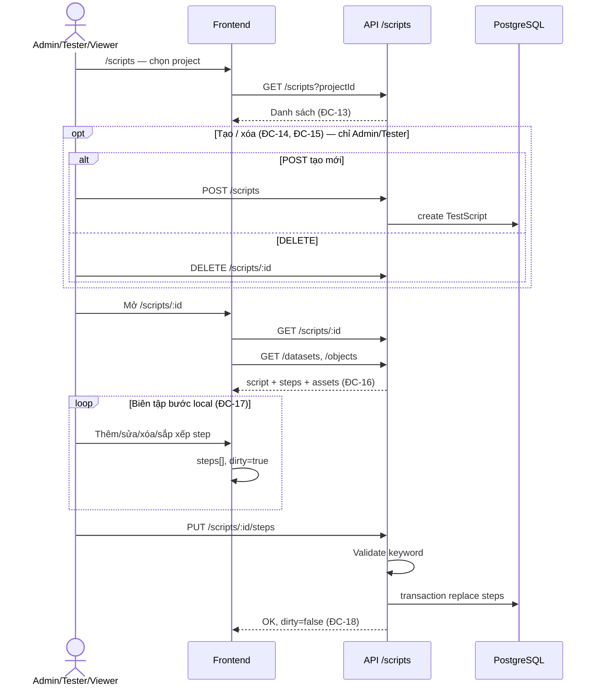

---

## STT 6 — Thực thi kịch bản (ĐC-19)

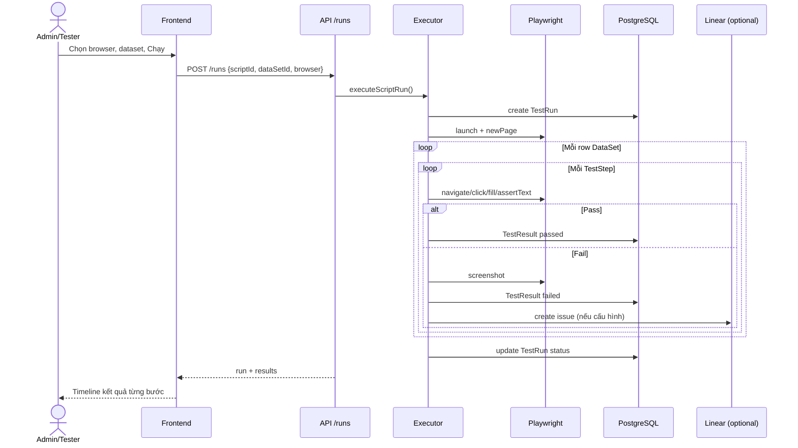

---

## STT 7 — Quản lý đối tượng UI CRUD (ĐC-20 → ĐC-23)

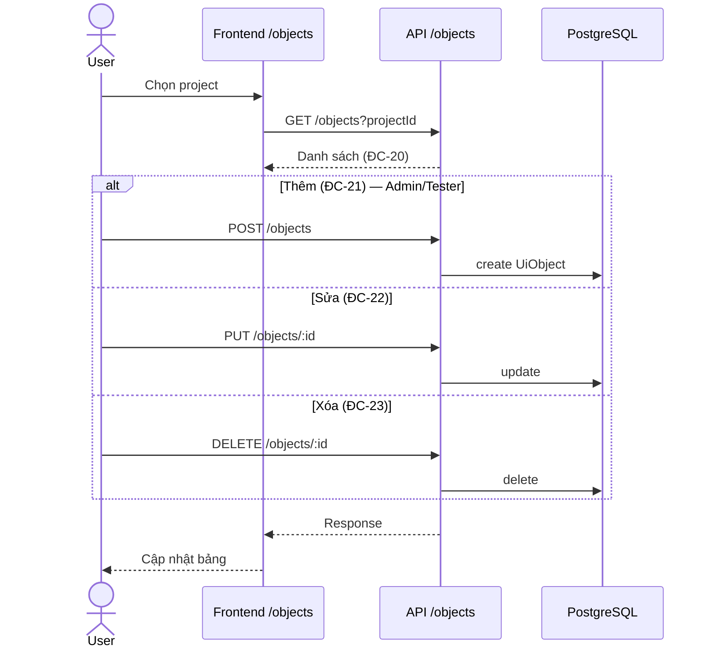

---

## STT 8 — Quản lý bộ dữ liệu CRUD (ĐC-24 → ĐC-27)

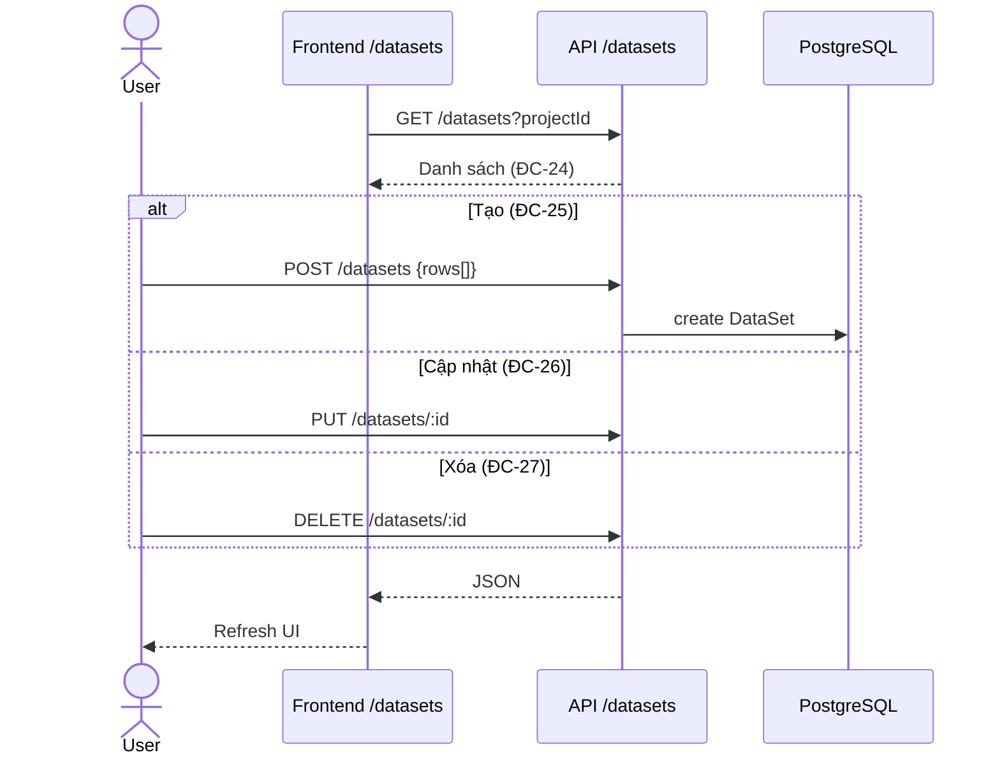

---

## STT 9 — Báo cáo & xuất PDF (ĐC-28 → ĐC-32)

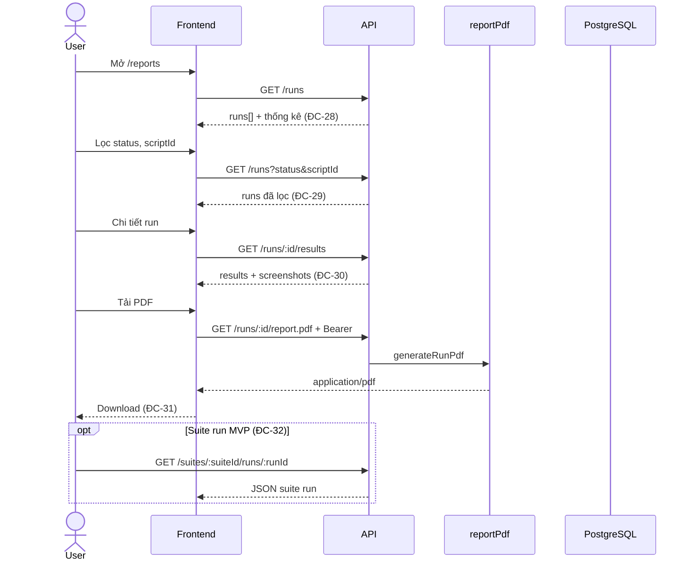

---

## STT 10 — Ghi thao tác, test case & publish (ĐC-33 → ĐC-37)

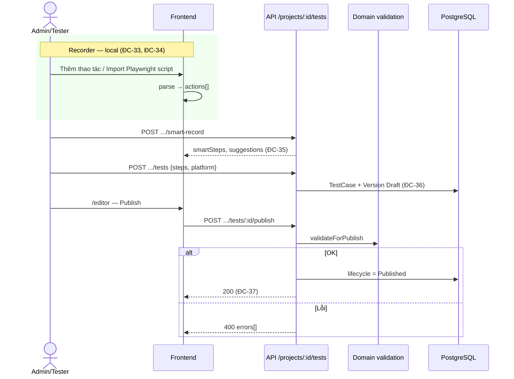

---

## STT 11 — Chạy test suite (ĐC-38)

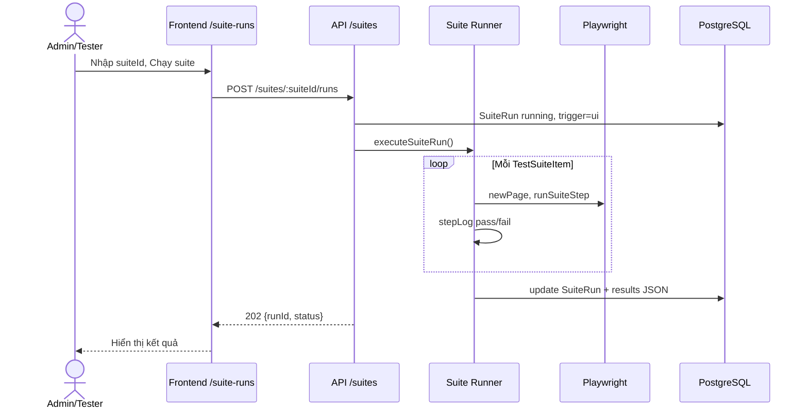

---

## STT 12 — Quản trị người dùng (ĐC-39 → ĐC-42)

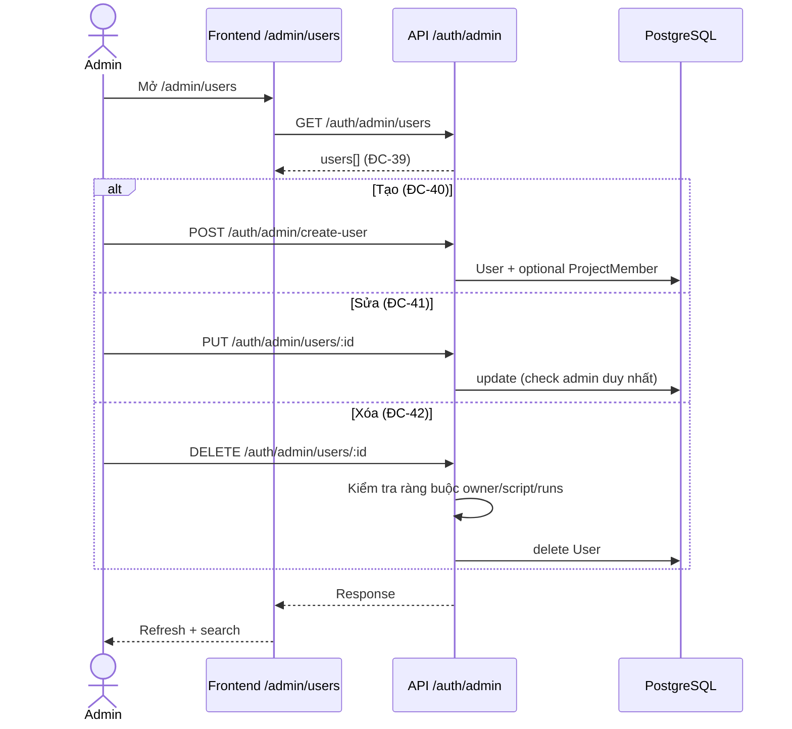

---

## Ghi chú sử dụng trong đồ án

- Mỗi **Hình 3.x** = một nhóm STT ở trên.
- Trong phần mô tả, liệt kê: *“Biểu đồ gộp các use case ĐC-02 đến ĐC-07…”*.
- Chi tiết từng bước vẫn tham chiếu **Bảng đặc tả** trong file `11-dac-ta-chuc-nang-giao-dien-web.md`.
