# Biểu đồ hoạt động (gộp nhóm) — Giao diện web

Các use case **gần nhau** gộp **một biểu đồ hoạt động**. Tham chiếu: `11-dac-ta-chuc-nang-giao-dien-web.md`.

| STT | Nhóm | Mã use case gộp |
|-----|------|-----------------|
| 1 | Trang chủ | ĐC-01 |
| 2 | Xác thực & tài khoản | ĐC-02 → ĐC-07 |
| 3 | Dashboard | ĐC-08 |
| 4 | Quản lý dự án | ĐC-09 → ĐC-12 |
| 5 | Quản lý kịch bản | ĐC-13 → ĐC-18 |
| 6 | Thực thi kịch bản | ĐC-19 |
| 7 | Đối tượng UI | ĐC-20 → ĐC-23 |
| 8 | Bộ dữ liệu | ĐC-24 → ĐC-27 |
| 9 | Báo cáo | ĐC-28 → ĐC-32 |
| 10 | Ghi thao tác & publish | ĐC-33 → ĐC-37 |
| 11 | Chạy suite | ĐC-38 |
| 12 | Quản trị người dùng | ĐC-39 → ĐC-42 |

**Tổng: 12 biểu đồ hoạt động** (thay cho 42 biểu đồ tách riêng).

---

## STT 1 — Trang chủ (ĐC-01)

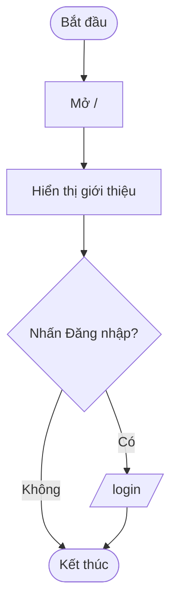

---

## STT 2 — Xác thực & quản lý tài khoản (ĐC-02 → ĐC-07)

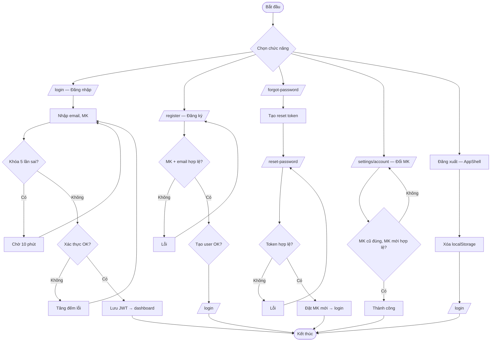

---

## STT 3 — Dashboard (ĐC-08)

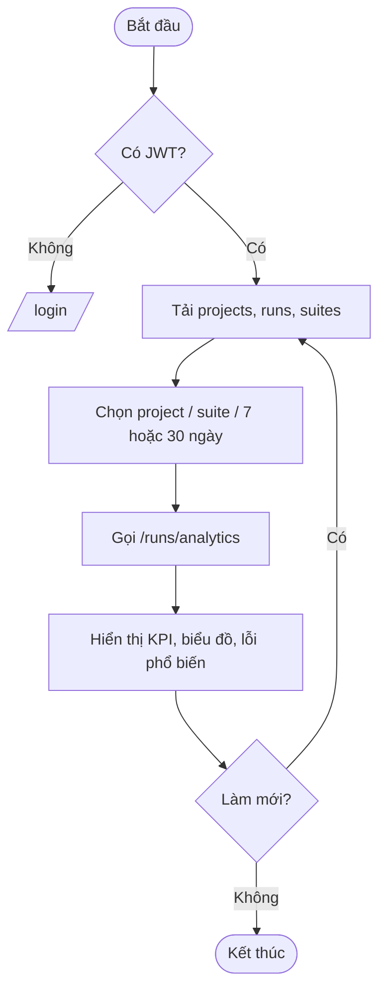

---

## STT 4 — Quản lý dự án (ĐC-09 → ĐC-12)

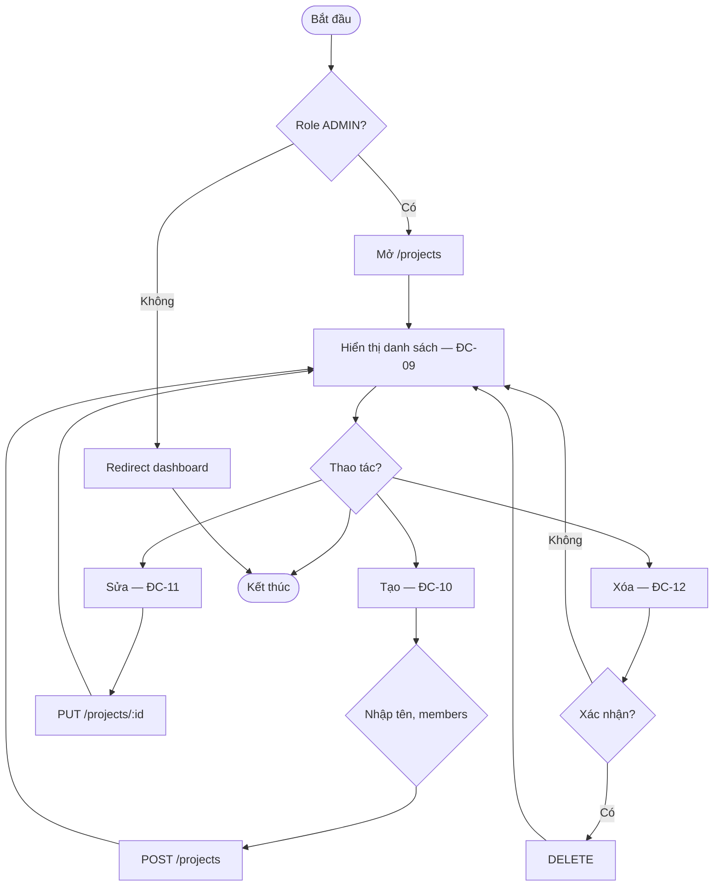

---

## STT 5 — Quản lý kịch bản (ĐC-13 → ĐC-18)

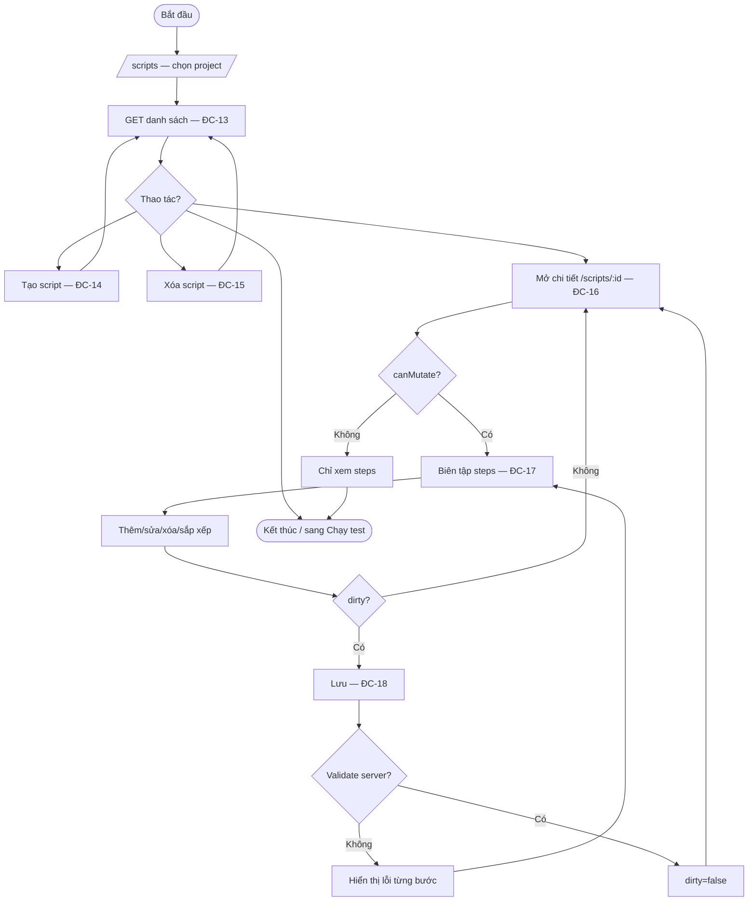

---

## STT 6 — Thực thi kịch bản (ĐC-19)

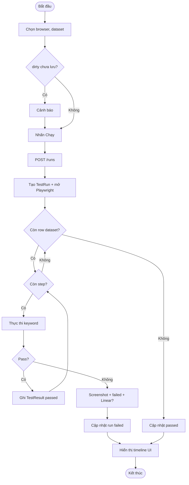

---

## STT 7 — Đối tượng UI CRUD (ĐC-20 → ĐC-23)

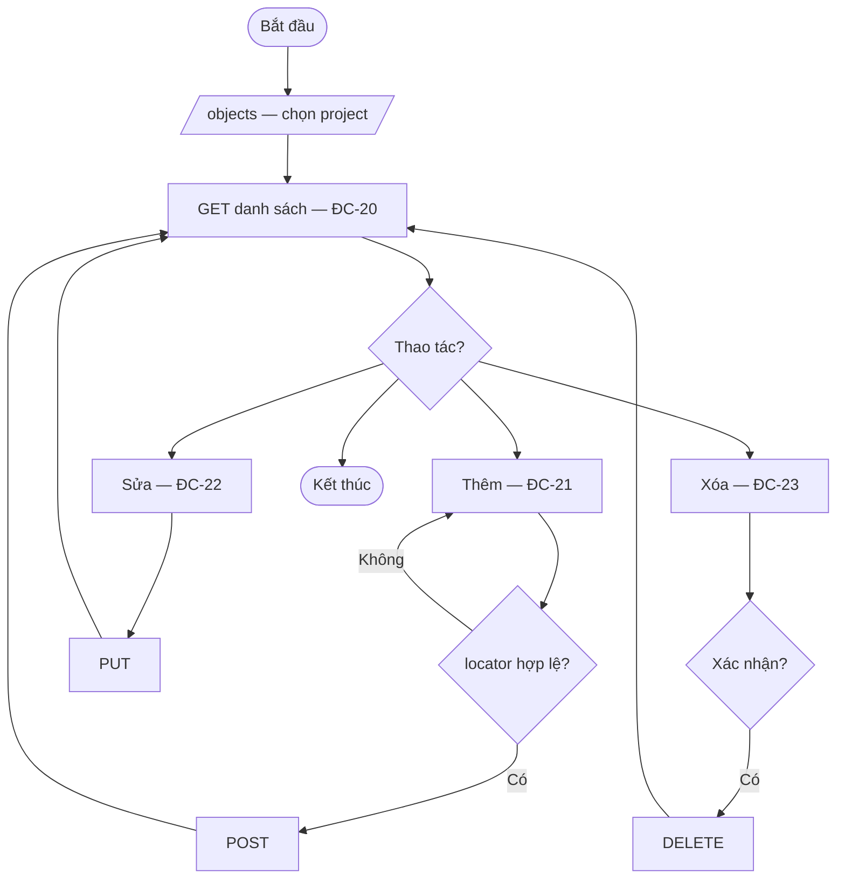

---

## STT 8 — Bộ dữ liệu CRUD (ĐC-24 → ĐC-27)

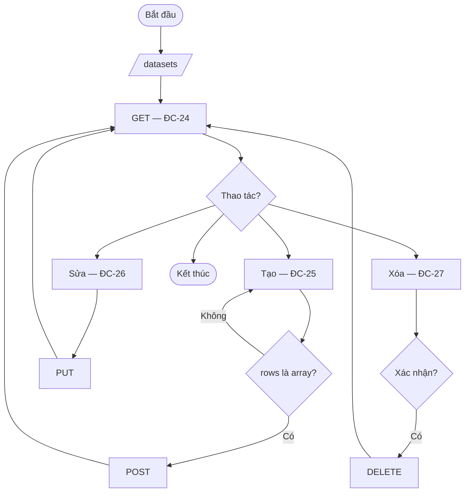

---

## STT 9 — Báo cáo (ĐC-28 → ĐC-32)

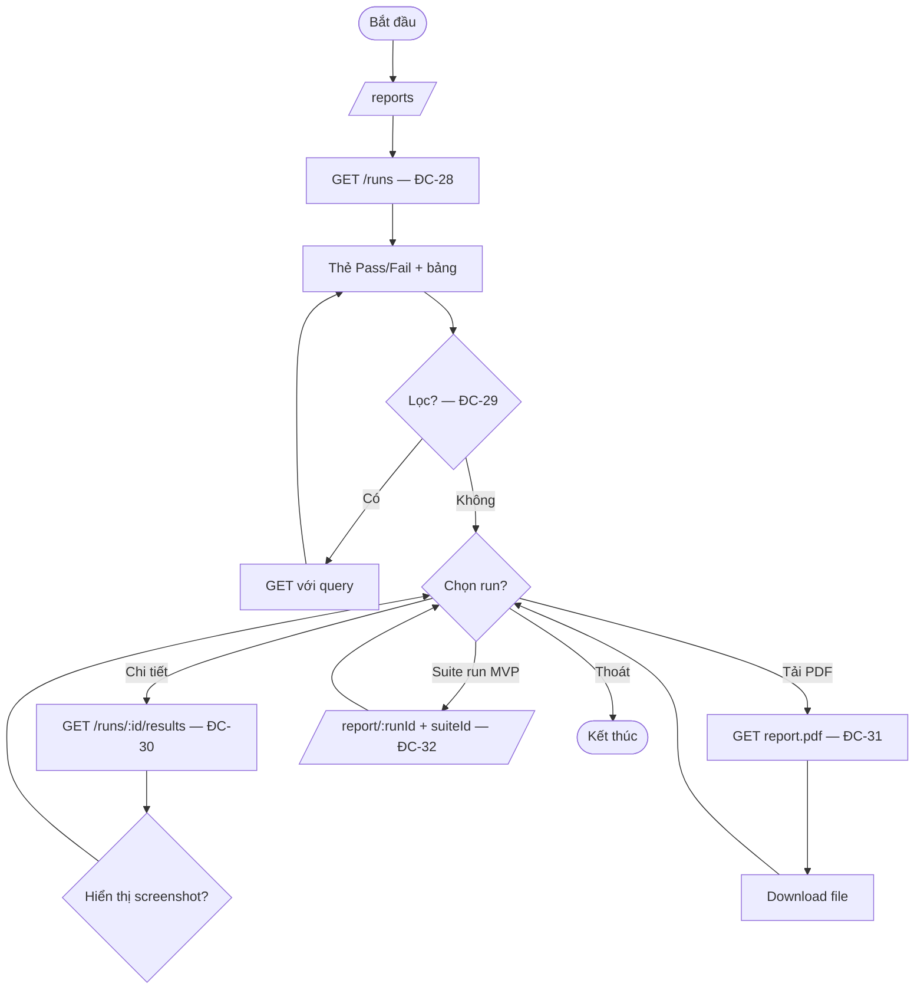

---

## STT 10 — Ghi thao tác & publish (ĐC-33 → ĐC-37)

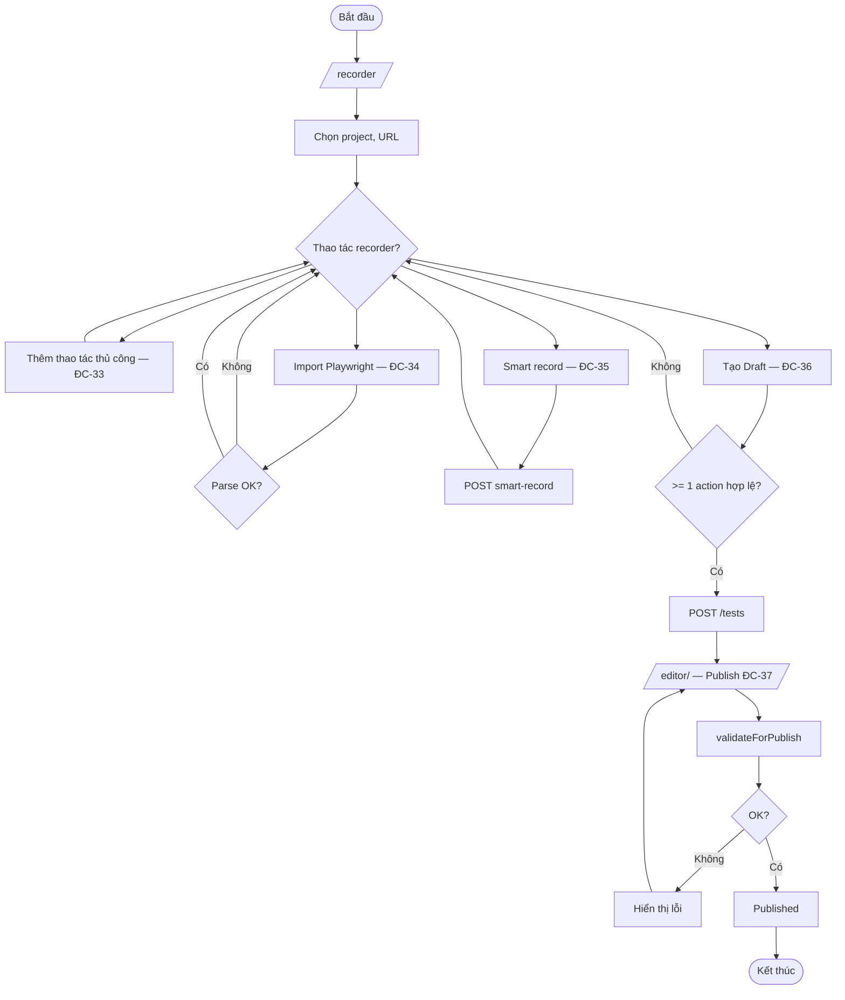

---

## STT 11 — Chạy test suite (ĐC-38)

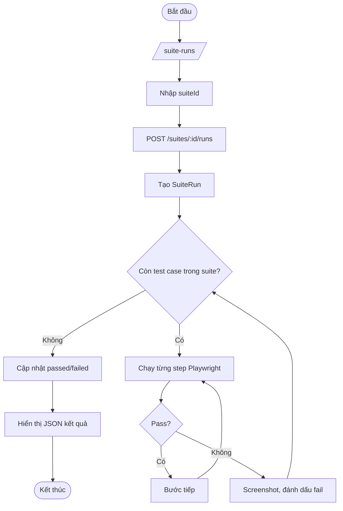

---

## STT 12 — Quản trị người dùng (ĐC-39 → ĐC-42)

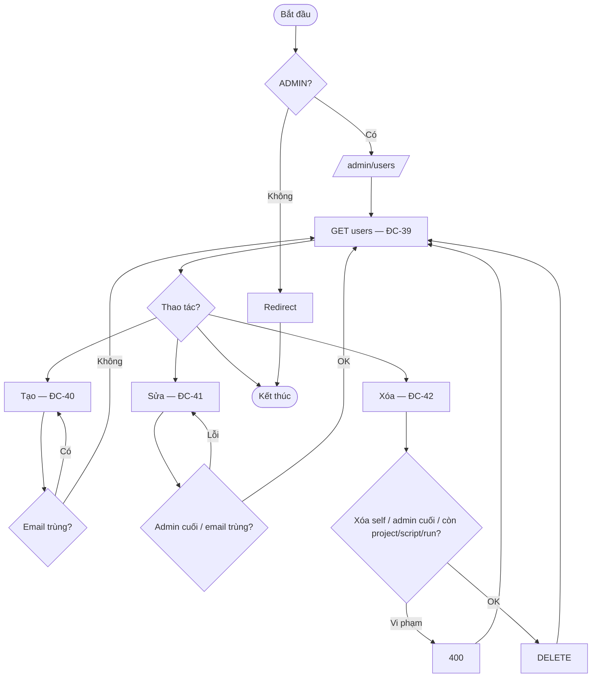

---

## So sánh với bản tách 42 sơ đồ

| | Bản tách (`12`, `13`) | Bản gộp (`14`, `15`) |
|---|----------------------|----------------------|
| Sequence | 42 | **12** |
| Activity | 42 | **12** |
| Phù hợp | Phụ lục chi tiết | **Chương thiết kế chính** |

Khuyến nghị đồ án: dùng **file 14 & 15** trong báo cáo; giữ file 12 & 13 làm phụ lục nếu cần.
