# Biểu đồ trình tự & hoạt động (gộp nhóm) — Giao diện web

Mỗi **nhóm chức năng** gồm **2 hình**: biểu đồ trình tự (Sequence) + biểu đồ hoạt động (Activity).

Tham chiếu đặc tả: `11-dac-ta-chuc-nang-giao-dien-web.md` (chi tiết) · `17-dac-ta-chuc-nang-gop-nhom.md` (gộp 12 nhóm).

| STT | Nhóm | Use case | Hình trình tự | Hình hoạt động |
|-----|------|----------|---------------|----------------|
| 1 | Trang chủ | ĐC-01 | Hình 3.5.1a | Hình 3.5.1b |
| 2 | Xác thực & tài khoản | ĐC-02 → ĐC-07 | Hình 3.5.2a | Hình 3.5.2b |
| 3 | Dashboard | ĐC-08 | Hình 3.5.3a | Hình 3.5.3b |
| 4 | Quản lý dự án | ĐC-09 → ĐC-12 | Hình 3.5.4a | Hình 3.5.4b |
| 5 | Quản lý kịch bản | ĐC-13 → ĐC-18 | Hình 3.5.5a | Hình 3.5.5b |
| 6 | Thực thi kịch bản | ĐC-19 | Hình 3.5.6a | Hình 3.5.6b |
| 7 | Đối tượng UI | ĐC-20 → ĐC-23 | Hình 3.5.7a | Hình 3.5.7b |
| 8 | Bộ dữ liệu | ĐC-24 → ĐC-27 | Hình 3.5.8a | Hình 3.5.8b |
| 9 | Báo cáo | ĐC-28 → ĐC-32 | Hình 3.5.9a | Hình 3.5.9b |
| 10 | Ghi thao tác & publish | ĐC-33 → ĐC-37 | Hình 3.5.10a | Hình 3.5.10b |
| 11 | Chạy suite | ĐC-38 | Hình 3.5.11a | Hình 3.5.11b |
| 12 | Quản trị người dùng | ĐC-39 → ĐC-42 | Hình 3.5.12a | Hình 3.5.12b |

**Tổng: 12 nhóm × 2 = 24 hình** (thay cho 84 hình khi tách từng use case).

---

## STT 1 — Trang chủ (ĐC-01)

### Biểu đồ trình tự (Sequence)

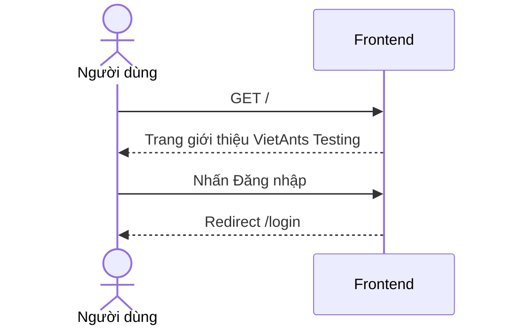
```mermaid
sequenceDiagram
    actor U as Người dùng
    participant W as Frontend

    U->>W: GET /
    W-->>U: Trang giới thiệu VietAnts Testing
    U->>W: Nhấn Đăng nhập
    W-->>U: Redirect /login
```

---

### Biểu đồ hoạt động (Activity)

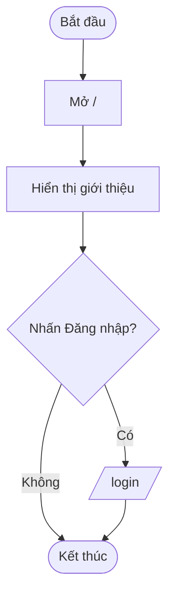
```mermaid
flowchart TD
    A([Bắt đầu]) --> B[Mở /]
    B --> C[Hiển thị giới thiệu]
    C --> D{Nhấn Đăng nhập?}
    D -- Có --> E[/login/]
    D -- Không --> F([Kết thúc])
    E --> F
```

---

---

## STT 2 — Xác thực & quản lý tài khoản (ĐC-02 → ĐC-07)

### Biểu đồ trình tự (Sequence)

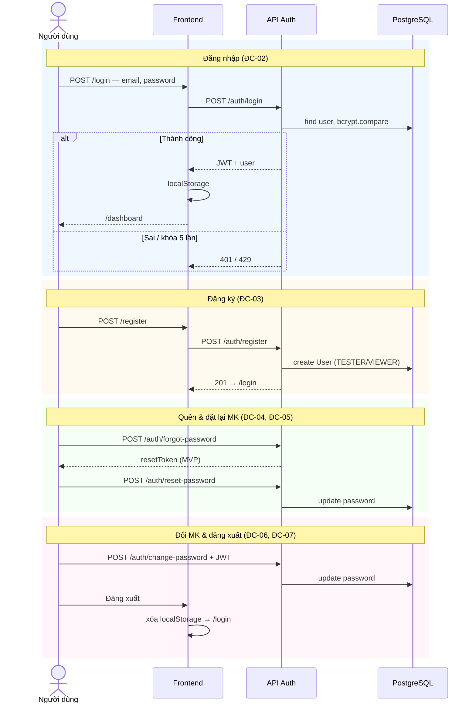
```mermaid
sequenceDiagram
    actor U as Người dùng
    participant W as Frontend
    participant A as API Auth
    participant DB as PostgreSQL

  rect rgb(240,248,255)
    Note over U,DB: Đăng nhập (ĐC-02)
    U->>W: POST /login — email, password
    W->>A: POST /auth/login
    A->>DB: find user, bcrypt.compare
    alt Thành công
        A-->>W: JWT + user
        W->>W: localStorage
        W-->>U: /dashboard
    else Sai / khóa 5 lần
        A-->>W: 401 / 429
    end
  end

  rect rgb(255,250,240)
    Note over U,DB: Đăng ký (ĐC-03)
    U->>W: POST /register
    W->>A: POST /auth/register
    A->>DB: create User (TESTER/VIEWER)
    A-->>W: 201 → /login
  end

  rect rgb(245,255,245)
    Note over U,DB: Quên & đặt lại MK (ĐC-04, ĐC-05)
    U->>A: POST /auth/forgot-password
    A-->>U: resetToken (MVP)
    U->>A: POST /auth/reset-password
    A->>DB: update password
  end

  rect rgb(255,245,250)
    Note over U,DB: Đổi MK & đăng xuất (ĐC-06, ĐC-07)
    U->>A: POST /auth/change-password + JWT
    A->>DB: update password
    U->>W: Đăng xuất
    W->>W: xóa localStorage → /login
  end
```

---

### Biểu đồ hoạt động (Activity)

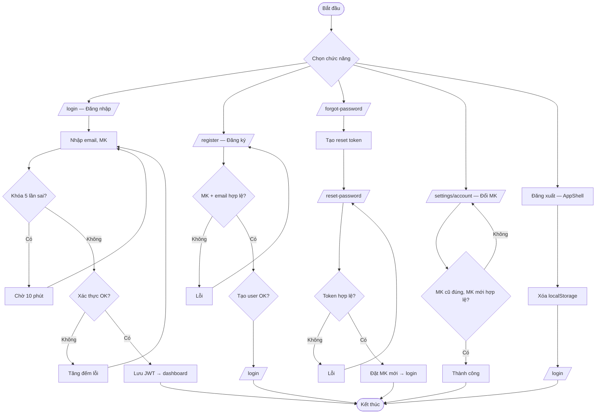
```mermaid
flowchart TD
    A([Bắt đầu]) --> B{Chọn chức năng}

    B --> C[/login — Đăng nhập/]
    C --> C1[Nhập email, MK]
    C1 --> C2{Khóa 5 lần sai?}
    C2 -- Có --> C3[Chờ 10 phút]
    C3 --> C1
    C2 -- Không --> C4{Xác thực OK?}
    C4 -- Không --> C5[Tăng đếm lỗi]
    C5 --> C1
    C4 -- Có --> C6[Lưu JWT → dashboard]

    B --> D[/register — Đăng ký/]
    D --> D1{MK + email hợp lệ?}
    D1 -- Không --> D2[Lỗi]
    D2 --> D
    D1 -- Có --> D3{Tạo user OK?}
    D3 --> D4[/login/]

    B --> E[/forgot-password/]
    E --> E1[Tạo reset token]
    E1 --> F[/reset-password/]
    F --> F1{Token hợp lệ?}
    F1 -- Không --> F2[Lỗi]
    F2 --> F
    F1 -- Có --> F3[Đặt MK mới → login]

    B --> G[/settings/account — Đổi MK/]
    G --> G1{MK cũ đúng, MK mới hợp lệ?}
    G1 -- Không --> G
    G1 -- Có --> G2[Thành công]

    B --> H[Đăng xuất — AppShell]
    H --> H1[Xóa localStorage]
    H1 --> I[/login/]

    C6 --> Z([Kết thúc])
    D4 --> Z
    F3 --> Z
    G2 --> Z
    I --> Z
```

---

---

## STT 3 — Dashboard & thống kê (ĐC-08)

### Biểu đồ trình tự (Sequence)

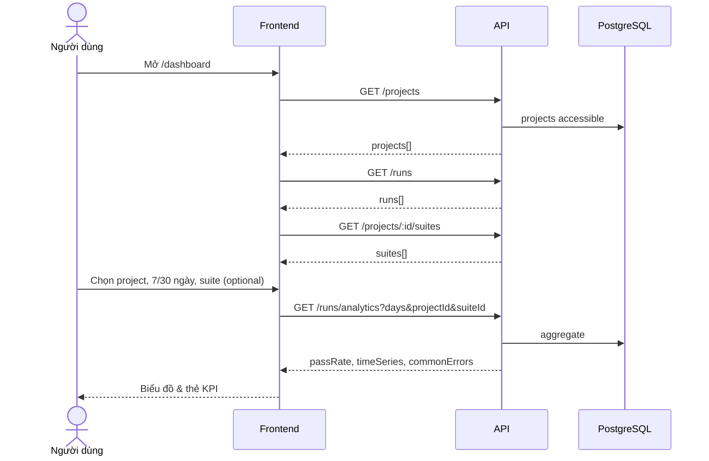
```mermaid
sequenceDiagram
    actor U as Người dùng
    participant W as Frontend
    participant A as API
    participant DB as PostgreSQL

    U->>W: Mở /dashboard
    W->>A: GET /projects
    A->>DB: projects accessible
    A-->>W: projects[]
    W->>A: GET /runs
    A-->>W: runs[]
    W->>A: GET /projects/:id/suites
    A-->>W: suites[]
    U->>W: Chọn project, 7/30 ngày, suite (optional)
    W->>A: GET /runs/analytics?days&projectId&suiteId
    A->>DB: aggregate
    A-->>W: passRate, timeSeries, commonErrors
    W-->>U: Biểu đồ & thẻ KPI
```

---

### Biểu đồ hoạt động (Activity)

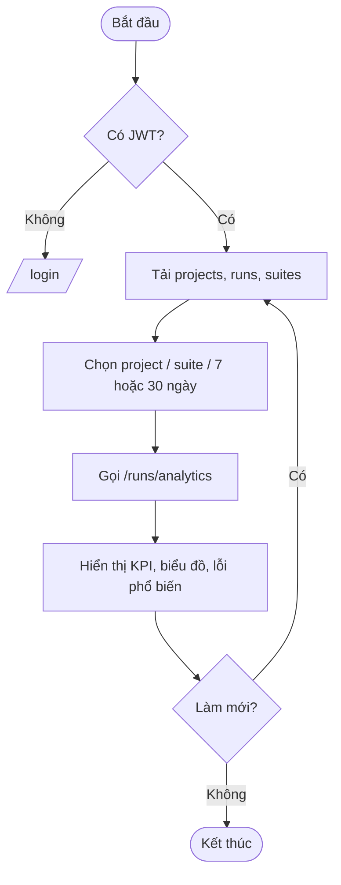
```mermaid
flowchart TD
    A([Bắt đầu]) --> B{Có JWT?}
    B -- Không --> C[/login/]
    B -- Có --> D[Tải projects, runs, suites]
    D --> E[Chọn project / suite / 7 hoặc 30 ngày]
    E --> F[Gọi /runs/analytics]
    F --> G[Hiển thị KPI, biểu đồ, lỗi phổ biến]
    G --> H{Làm mới?}
    H -- Có --> D
    H -- Không --> I([Kết thúc])
```

---

---

## STT 4 — Quản lý dự án CRUD (ĐC-09 → ĐC-12)

### Biểu đồ trình tự (Sequence)

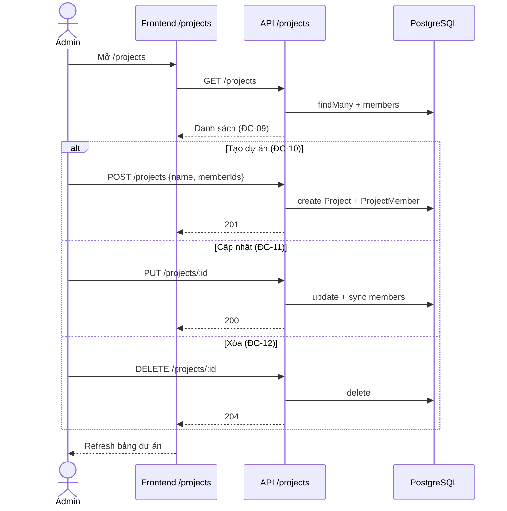
```mermaid
sequenceDiagram
    actor A as Admin
    participant W as Frontend /projects
    participant API as API /projects
    participant DB as PostgreSQL

    A->>W: Mở /projects
    W->>API: GET /projects
    API->>DB: findMany + members
    API-->>W: Danh sách (ĐC-09)

    alt Tạo dự án (ĐC-10)
        A->>API: POST /projects {name, memberIds}
        API->>DB: create Project + ProjectMember
        API-->>W: 201
    else Cập nhật (ĐC-11)
        A->>API: PUT /projects/:id
        API->>DB: update + sync members
        API-->>W: 200
    else Xóa (ĐC-12)
        A->>API: DELETE /projects/:id
        API->>DB: delete
        API-->>W: 204
    end
    W-->>A: Refresh bảng dự án
```

---

### Biểu đồ hoạt động (Activity)

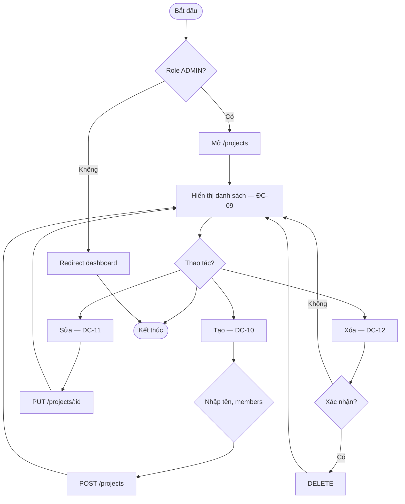
```mermaid
flowchart TD
    A([Bắt đầu]) --> B{Role ADMIN?}
    B -- Không --> C[Redirect dashboard]
    B -- Có --> D[Mở /projects]
    D --> E[Hiển thị danh sách — ĐC-09]
    E --> F{Thao tác?}

    F --> G[Tạo — ĐC-10]
    G --> G1{Nhập tên, members}
    G1 --> G2[POST /projects]
    G2 --> E

    F --> H[Sửa — ĐC-11]
    H --> H1[PUT /projects/:id]
    H1 --> E

    F --> I[Xóa — ĐC-12]
    I --> I1{Xác nhận?}
    I1 -- Không --> E
    I1 -- Có --> I2[DELETE]
    I2 --> E

    F --> J([Kết thúc])
    C --> J
```

---

---

## STT 5 — Quản lý kịch bản kiểm thử (ĐC-13 → ĐC-18)

### Biểu đồ trình tự (Sequence)

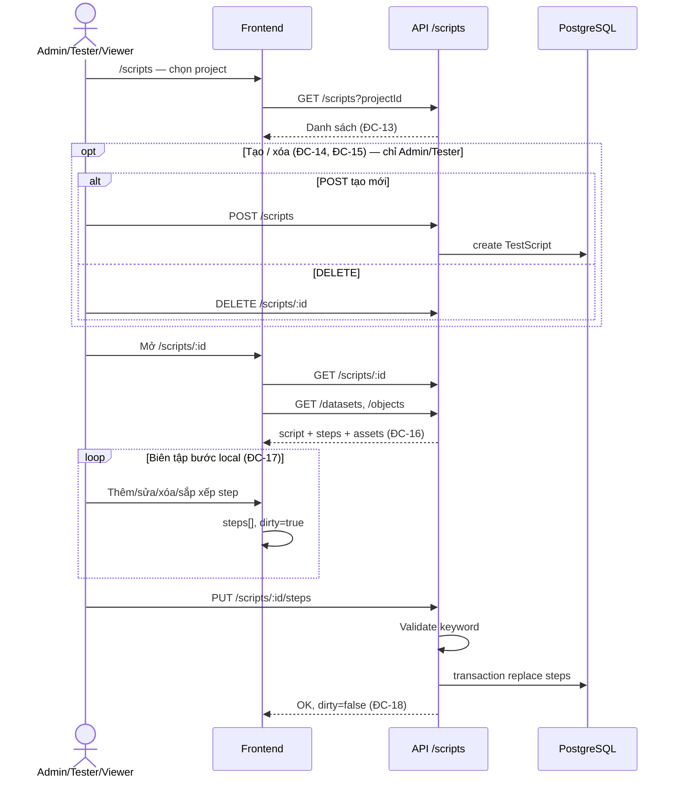
```mermaid
sequenceDiagram
    actor U as Admin/Tester/Viewer
    participant W as Frontend
    participant API as API /scripts
    participant DB as PostgreSQL

    U->>W: /scripts — chọn project
    W->>API: GET /scripts?projectId
    API-->>W: Danh sách (ĐC-13)

    opt Tạo / xóa (ĐC-14, ĐC-15) — chỉ Admin/Tester
        alt POST tạo mới
            U->>API: POST /scripts
            API->>DB: create TestScript
        else DELETE
            U->>API: DELETE /scripts/:id
        end
    end

    U->>W: Mở /scripts/:id
    W->>API: GET /scripts/:id
    W->>API: GET /datasets, /objects
    API-->>W: script + steps + assets (ĐC-16)

    loop Biên tập bước local (ĐC-17)
        U->>W: Thêm/sửa/xóa/sắp xếp step
        W->>W: steps[], dirty=true
    end

    U->>API: PUT /scripts/:id/steps
    API->>API: Validate keyword
    API->>DB: transaction replace steps
    API-->>W: OK, dirty=false (ĐC-18)
```

---

### Biểu đồ hoạt động (Activity)

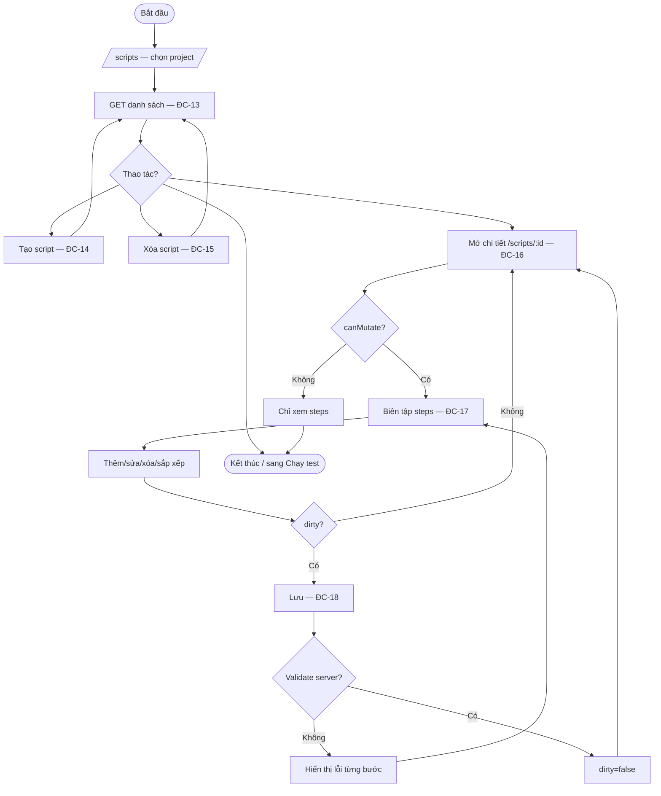
```mermaid
flowchart TD
    A([Bắt đầu]) --> B[/scripts — chọn project/]
    B --> C[GET danh sách — ĐC-13]
    C --> D{Thao tác?}

    D --> E[Tạo script — ĐC-14]
    E --> C

    D --> F[Xóa script — ĐC-15]
    F --> C

    D --> G[Mở chi tiết /scripts/:id — ĐC-16]
    G --> H{canMutate?}
    H -- Không --> I[Chỉ xem steps]
    H -- Có --> J[Biên tập steps — ĐC-17]
    J --> J1[Thêm/sửa/xóa/sắp xếp]
    J1 --> J2{dirty?}
    J2 -- Có --> K[Lưu — ĐC-18]
    K --> K1{Validate server?}
    K1 -- Không --> L[Hiển thị lỗi từng bước]
    L --> J
    K1 -- Có --> M[dirty=false]
    M --> G
    J2 -- Không --> G

    D --> N([Kết thúc / sang Chạy test])
    I --> N
```

---

---

## STT 6 — Thực thi kịch bản (ĐC-19)

### Biểu đồ trình tự (Sequence)

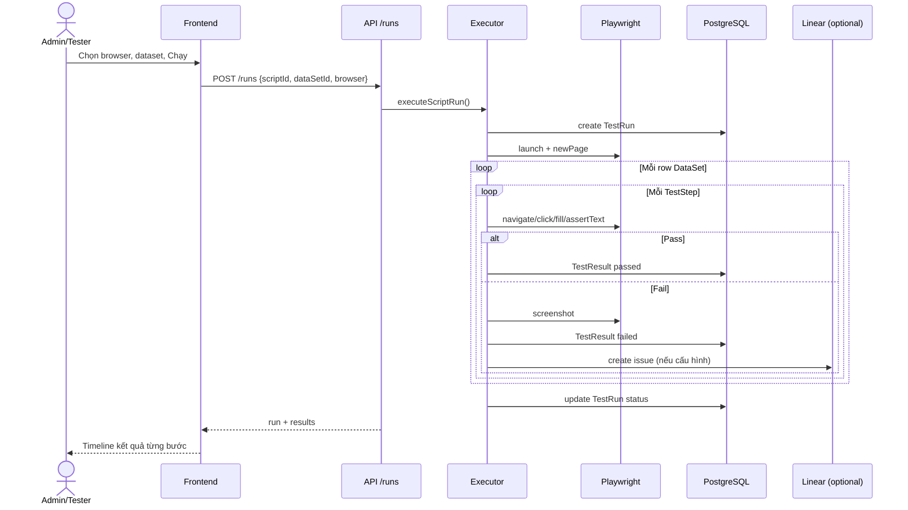
```mermaid
sequenceDiagram
    actor U as Admin/Tester
    participant W as Frontend
    participant API as API /runs
    participant EX as Executor
    participant PW as Playwright
    participant DB as PostgreSQL
    participant L as Linear (optional)

    U->>W: Chọn browser, dataset, Chạy
    W->>API: POST /runs {scriptId, dataSetId, browser}
    API->>EX: executeScriptRun()
    EX->>DB: create TestRun
    EX->>PW: launch + newPage
    loop Mỗi row DataSet
        loop Mỗi TestStep
            EX->>PW: navigate/click/fill/assertText
            alt Pass
                EX->>DB: TestResult passed
            else Fail
                EX->>PW: screenshot
                EX->>DB: TestResult failed
                EX->>L: create issue (nếu cấu hình)
            end
        end
    end
    EX->>DB: update TestRun status
    API-->>W: run + results
    W-->>U: Timeline kết quả từng bước
```

---

### Biểu đồ hoạt động (Activity)

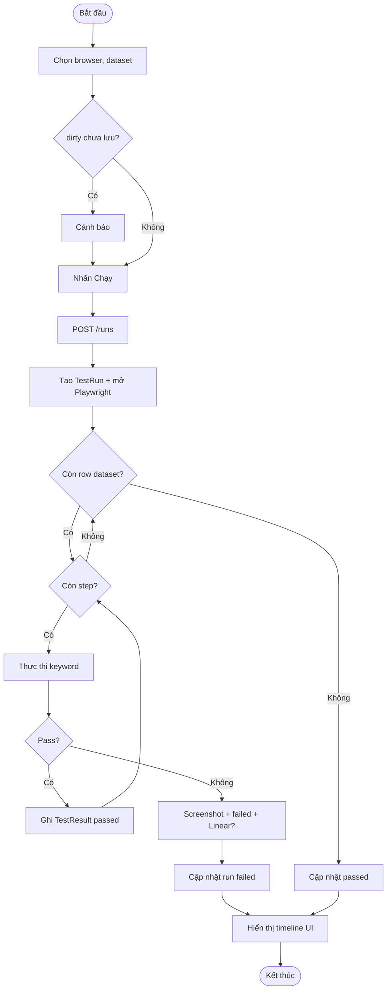
```mermaid
flowchart TD
    A([Bắt đầu]) --> B[Chọn browser, dataset]
    B --> C{dirty chưa lưu?}
    C -- Có --> D[Cảnh báo]
    D --> E[Nhấn Chạy]
    C -- Không --> E
    E --> F[POST /runs]
    F --> G[Tạo TestRun + mở Playwright]
    G --> H{Còn row dataset?}
    H -- Không --> O[Cập nhật passed]
    H -- Có --> I{Còn step?}
    I -- Không --> H
    I -- Có --> J[Thực thi keyword]
    J --> K{Pass?}
    K -- Có --> L[Ghi TestResult passed]
    L --> I
    K -- Không --> M[Screenshot + failed + Linear?]
    M --> N[Cập nhật run failed]
    N --> P[Hiển thị timeline UI]
    O --> P
    P --> Q([Kết thúc])
```

---

---

## STT 7 — Quản lý đối tượng UI CRUD (ĐC-20 → ĐC-23)

### Biểu đồ trình tự (Sequence)

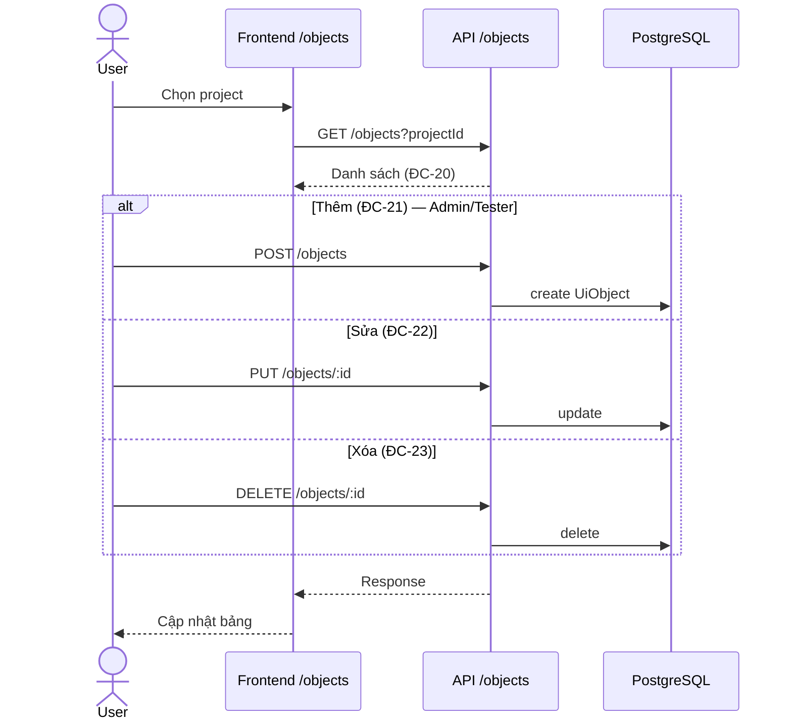
```mermaid
sequenceDiagram
    actor U as User
    participant W as Frontend /objects
    participant API as API /objects
    participant DB as PostgreSQL

    U->>W: Chọn project
    W->>API: GET /objects?projectId
    API-->>W: Danh sách (ĐC-20)

    alt Thêm (ĐC-21) — Admin/Tester
        U->>API: POST /objects
        API->>DB: create UiObject
    else Sửa (ĐC-22)
        U->>API: PUT /objects/:id
        API->>DB: update
    else Xóa (ĐC-23)
        U->>API: DELETE /objects/:id
        API->>DB: delete
    end
    API-->>W: Response
    W-->>U: Cập nhật bảng
```

---

### Biểu đồ hoạt động (Activity)

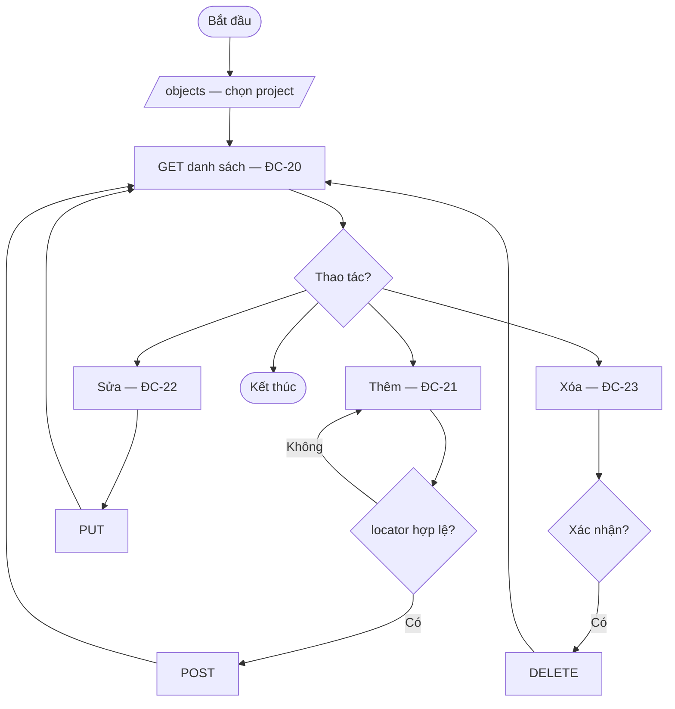
```mermaid
flowchart TD
    A([Bắt đầu]) --> B[/objects — chọn project/]
    B --> C[GET danh sách — ĐC-20]
    C --> D{Thao tác?}

    D --> E[Thêm — ĐC-21]
    E --> E1{locator hợp lệ?}
    E1 -- Không --> E
    E1 -- Có --> E2[POST]
    E2 --> C

    D --> F[Sửa — ĐC-22]
    F --> F1[PUT]
    F1 --> C

    D --> G[Xóa — ĐC-23]
    G --> G1{Xác nhận?}
    G1 -- Có --> G2[DELETE]
    G2 --> C

    D --> H([Kết thúc])
```

---

---

## STT 8 — Quản lý bộ dữ liệu CRUD (ĐC-24 → ĐC-27)

### Biểu đồ trình tự (Sequence)

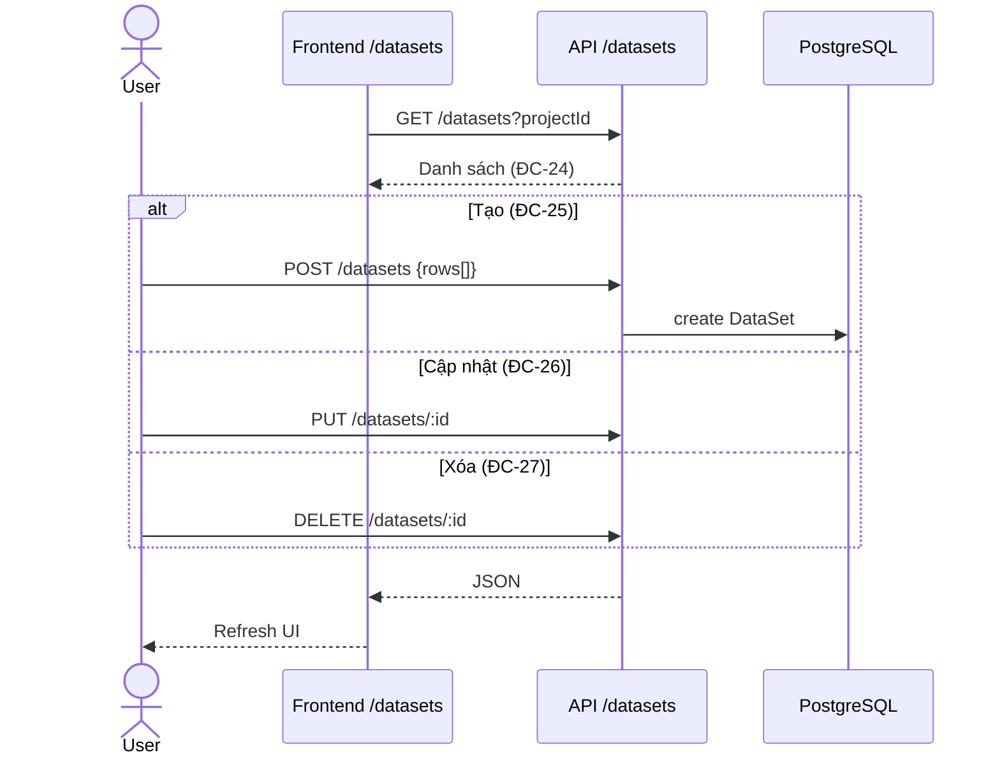
```mermaid
sequenceDiagram
    actor U as User
    participant W as Frontend /datasets
    participant API as API /datasets
    participant DB as PostgreSQL

    W->>API: GET /datasets?projectId
    API-->>W: Danh sách (ĐC-24)

    alt Tạo (ĐC-25)
        U->>API: POST /datasets {rows[]}
        API->>DB: create DataSet
    else Cập nhật (ĐC-26)
        U->>API: PUT /datasets/:id
    else Xóa (ĐC-27)
        U->>API: DELETE /datasets/:id
    end
    API-->>W: JSON
    W-->>U: Refresh UI
```

---

### Biểu đồ hoạt động (Activity)

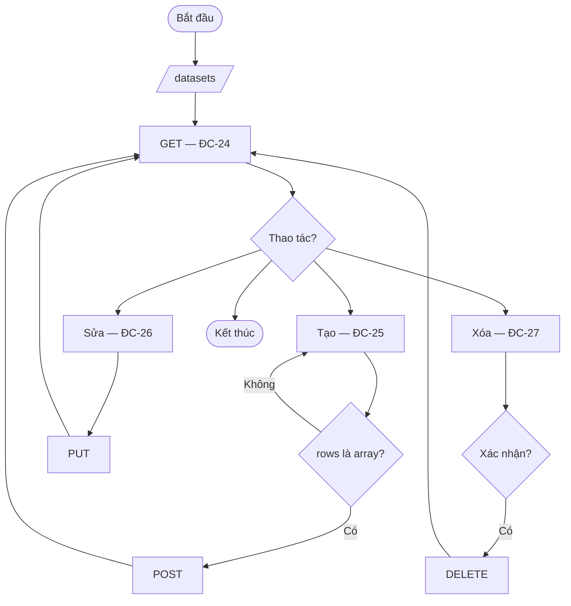
```mermaid
flowchart TD
    A([Bắt đầu]) --> B[/datasets/]
    B --> C[GET — ĐC-24]
    C --> D{Thao tác?}

    D --> E[Tạo — ĐC-25]
    E --> E1{rows là array?}
    E1 -- Không --> E
    E1 -- Có --> E2[POST]
    E2 --> C

    D --> F[Sửa — ĐC-26]
    F --> F1[PUT]
    F1 --> C

    D --> G[Xóa — ĐC-27]
    G --> G1{Xác nhận?}
    G1 -- Có --> G2[DELETE]
    G2 --> C

    D --> H([Kết thúc])
```

---

---

## STT 9 — Báo cáo & xuất PDF (ĐC-28 → ĐC-32)

### Biểu đồ trình tự (Sequence)

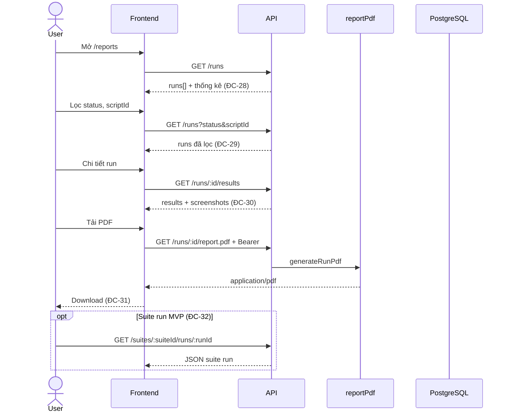
```mermaid
sequenceDiagram
    actor U as User
    participant W as Frontend
    participant API as API
    participant PDF as reportPdf
    participant DB as PostgreSQL

    U->>W: Mở /reports
    W->>API: GET /runs
    API-->>W: runs[] + thống kê (ĐC-28)

    U->>W: Lọc status, scriptId
    W->>API: GET /runs?status&scriptId
    API-->>W: runs đã lọc (ĐC-29)

    U->>W: Chi tiết run
    W->>API: GET /runs/:id/results
    API-->>W: results + screenshots (ĐC-30)

    U->>W: Tải PDF
    W->>API: GET /runs/:id/report.pdf + Bearer
    API->>PDF: generateRunPdf
    PDF-->>W: application/pdf
    W-->>U: Download (ĐC-31)

    opt Suite run MVP (ĐC-32)
        U->>API: GET /suites/:suiteId/runs/:runId
        API-->>W: JSON suite run
    end
```

---

### Biểu đồ hoạt động (Activity)

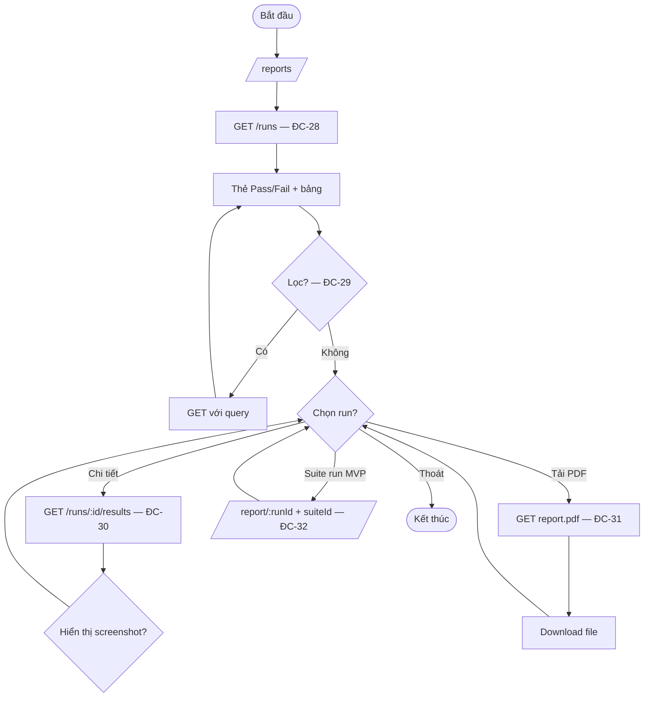
```mermaid
flowchart TD
    A([Bắt đầu]) --> B[/reports/]
    B --> C[GET /runs — ĐC-28]
    C --> D[Thẻ Pass/Fail + bảng]
    D --> E{Lọc? — ĐC-29}
    E -- Có --> F[GET với query]
    F --> D
    E -- Không --> G{Chọn run?}
    G -- Chi tiết --> H[GET /runs/:id/results — ĐC-30]
    H --> I{Hiển thị screenshot?}
    I --> G
    G -- Tải PDF --> J[GET report.pdf — ĐC-31]
    J --> K[Download file]
    K --> G
    G -- Suite run MVP --> L[/report/:runId + suiteId — ĐC-32/]
    L --> G
    G -- Thoát --> M([Kết thúc])
```

---

---

## STT 10 — Ghi thao tác, test case & publish (ĐC-33 → ĐC-37)

### Biểu đồ trình tự (Sequence)

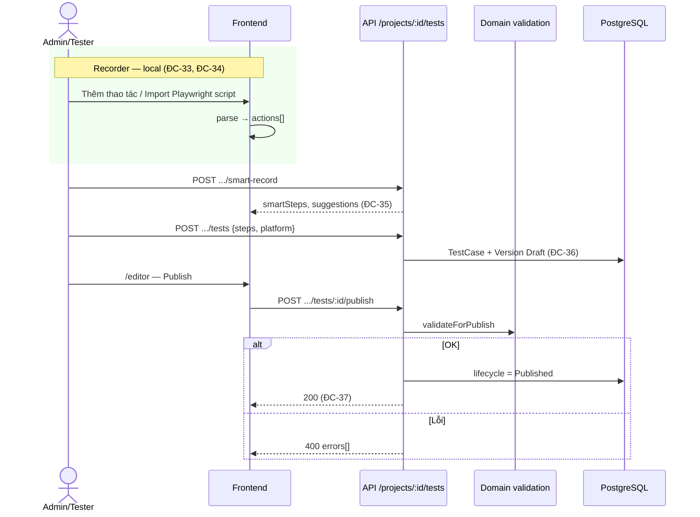
```mermaid
sequenceDiagram
    actor U as Admin/Tester
    participant W as Frontend
    participant API as API /projects/:id/tests
    participant DOM as Domain validation
    participant DB as PostgreSQL

    rect rgb(240,255,240)
        Note over U,W: Recorder — local (ĐC-33, ĐC-34)
        U->>W: Thêm thao tác / Import Playwright script
        W->>W: parse → actions[]
    end

    U->>API: POST .../smart-record
    API-->>W: smartSteps, suggestions (ĐC-35)

    U->>API: POST .../tests {steps, platform}
    API->>DB: TestCase + Version Draft (ĐC-36)

    U->>W: /editor — Publish
    W->>API: POST .../tests/:id/publish
    API->>DOM: validateForPublish
  alt OK
        API->>DB: lifecycle = Published
        API-->>W: 200 (ĐC-37)
    else Lỗi
        API-->>W: 400 errors[]
    end
```

---

### Biểu đồ hoạt động (Activity)

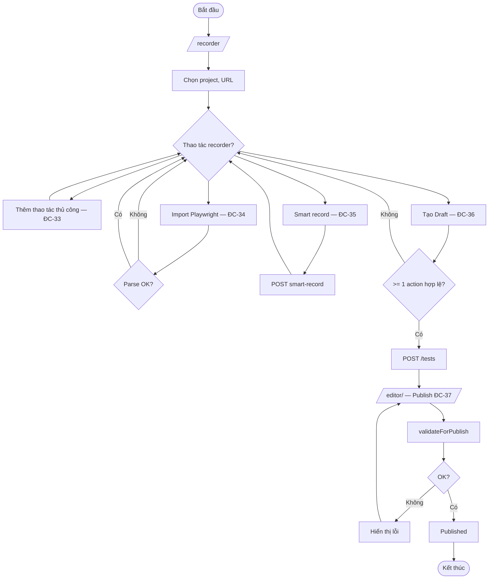
```mermaid
flowchart TD
    A([Bắt đầu]) --> B[/recorder/]
    B --> C[Chọn project, URL]
    C --> D{Thao tác recorder?}

    D --> E[Thêm thao tác thủ công — ĐC-33]
    E --> D

    D --> F[Import Playwright — ĐC-34]
    F --> F1{Parse OK?}
    F1 -- Không --> D
    F1 -- Có --> D

    D --> G[Smart record — ĐC-35]
    G --> G1[POST smart-record]
    G1 --> D

    D --> H[Tạo Draft — ĐC-36]
    H --> H1{>= 1 action hợp lệ?}
    H1 -- Không --> D
    H1 -- Có --> H2[POST /tests]
    H2 --> I[/editor/ — Publish ĐC-37/]
    I --> I1[validateForPublish]
    I1 --> I2{OK?}
    I2 -- Không --> I3[Hiển thị lỗi]
    I3 --> I
    I2 -- Có --> I4[Published]
    I4 --> J([Kết thúc])
```

---

---

## STT 11 — Chạy test suite (ĐC-38)

### Biểu đồ trình tự (Sequence)

```mermaid
sequenceDiagram
    actor U as Admin/Tester
    participant W as Frontend /suite-runs
    participant API as API /suites
    participant SR as Suite Runner
    participant PW as Playwright
    participant DB as PostgreSQL

    U->>W: Nhập suiteId, Chạy suite
    W->>API: POST /suites/:suiteId/runs
    API->>DB: SuiteRun running, trigger=ui
    API->>SR: executeSuiteRun()
    loop Mỗi TestSuiteItem
        SR->>PW: newPage, runSuiteStep
        SR->>SR: stepLog pass/fail
    end
    SR->>DB: update SuiteRun + results JSON
    API-->>W: 202 {runId, status}
    W-->>U: Hiển thị kết quả
```

---

### Biểu đồ hoạt động (Activity)

```mermaid
flowchart TD
    A([Bắt đầu]) --> B[/suite-runs/]
    B --> C[Nhập suiteId]
    C --> D[POST /suites/:id/runs]
    D --> E[Tạo SuiteRun]
    E --> F{Còn test case trong suite?}
    F -- Không --> K[Cập nhật passed/failed]
    F -- Có --> G[Chạy từng step Playwright]
    G --> H{Pass?}
    H -- Có --> I[Bước tiếp]
    I --> G
    H -- Không --> J[Screenshot, đánh dấu fail]
    J --> F
    K --> L[Hiển thị JSON kết quả]
    L --> M([Kết thúc])
```

---

---

## STT 12 — Quản trị người dùng (ĐC-39 → ĐC-42)

### Biểu đồ trình tự (Sequence)

```mermaid
sequenceDiagram
    actor A as Admin
    participant W as Frontend /admin/users
    participant API as API /auth/admin
    participant DB as PostgreSQL

    A->>W: Mở /admin/users
    W->>API: GET /auth/admin/users
    API-->>W: users[] (ĐC-39)

    alt Tạo (ĐC-40)
        A->>API: POST /auth/admin/create-user
        API->>DB: User + optional ProjectMember
    else Sửa (ĐC-41)
        A->>API: PUT /auth/admin/users/:id
        API->>DB: update (check admin duy nhất)
    else Xóa (ĐC-42)
        A->>API: DELETE /auth/admin/users/:id
        API->>API: Kiểm tra ràng buộc owner/script/runs
        API->>DB: delete User
    end
    API-->>W: Response
    W-->>A: Refresh + search
```

---

## Ghi chú sử dụng trong đồ án

- Mỗi **Hình 3.x** = một nhóm STT ở trên.
- Trong phần mô tả, liệt kê: *“Biểu đồ gộp các use case ĐC-02 đến ĐC-07…”*.
- Chi tiết từng bước vẫn tham chiếu **Bảng đặc tả** trong file `11-dac-ta-chuc-nang-giao-dien-web.md`.

### Biểu đồ hoạt động (Activity)

```mermaid
flowchart TD
    A([Bắt đầu]) --> B{ADMIN?}
    B -- Không --> C[Redirect]
    B -- Có --> D[/admin/users/]
    D --> E[GET users — ĐC-39]
    E --> F{Thao tác?}

    F --> G[Tạo — ĐC-40]
    G --> G1{Email trùng?}
    G1 -- Có --> G
    G1 -- Không --> E

    F --> H[Sửa — ĐC-41]
    H --> H1{Admin cuối / email trùng?}
    H1 -- Lỗi --> H
    H1 -- OK --> E

    F --> I[Xóa — ĐC-42]
    I --> I1{Xóa self / admin cuối / còn project/script/run?}
    I1 -- Vi phạm --> I2[400]
    I2 --> E
    I1 -- OK --> I3[DELETE]
    I3 --> E

    F --> J([Kết thúc])
    C --> J
```

---

## So sánh với bản tách 42 sơ đồ

| | Bản tách (`12`, `13`) | Bản gộp (`14`, `15`) |
|---|----------------------|----------------------|
| Sequence | 42 | **12** |
| Activity | 42 | **12** |
| Phù hợp | Phụ lục chi tiết | **Chương thiết kế chính** |

Khuyến nghị đồ án: dùng **file 14 & 15** trong báo cáo; giữ file 12 & 13 làm phụ lục nếu cần.

---

## Tài liệu liên quan

| File | Mô tả |
|------|--------|
| `11-dac-ta-chuc-nang-giao-dien-web.md` | 42 bảng đặc tả chức năng |
| `14-bieu-do-trinh-tu-gop-nhom.md` | Chỉ biểu đồ trình tự (12 nhóm) |
| `15-bieu-do-hoat-dong-gop-nhom.md` | Chỉ biểu đồ hoạt động (12 nhóm) |
| `12-bieu-do-trinh-tu-42-usecase.md` | Phụ lục: 42 sequence chi tiết |
| `13-bieu-do-hoat-dong-42-usecase.md` | Phụ lục: 42 activity chi tiết |
