# Đặc tả chức năng (gộp 12 nhóm) — Giao diện web

Tài liệu này **ánh xạ 42 use case** vào **12 nhóm**, khớp với biểu đồ trình tự/hoạt động (`14`, `15`, `16`).

Bản chi tiết từng bảng đầy đủ 8 cột: `11-dac-ta-chuc-nang-giao-dien-web.md`.

---

## Bảng ánh xạ tổng hợp (Đặc tả ↔ Biểu đồ)

| STT nhóm | Tên nhóm | Mã use case | Số UC | Bảng đặc tả (Chương 3) | Màn hình | Biểu đồ trình tự | Biểu đồ hoạt động | File |
|----------|----------|-------------|-------|------------------------|----------|------------------|-------------------|------|
| 1 | Trang chủ | ĐC-01 | 1 | Bảng 3.3 | / | Hình 3.5.1a | Hình 3.5.1b | `16` STT 1 |
| 2 | Xác thực & quản lý tài khoản | ĐC-02 → ĐC-07 | 6 | Bảng 3.4, 3.5, 3.6, 3.7, 3.8, 3.9 | /login, /register, … | Hình 3.5.2a | Hình 3.5.2b | `16` STT 2 |
| 3 | Dashboard & thống kê | ĐC-08 | 1 | Bảng 3.10 | /dashboard | Hình 3.5.3a | Hình 3.5.3b | `16` STT 3 |
| 4 | Quản lý dự án | ĐC-09 → ĐC-12 | 4 | Bảng 3.11, 3.12, 3.13, 3.14 | /projects | Hình 3.5.4a | Hình 3.5.4b | `16` STT 4 |
| 5 | Quản lý kịch bản kiểm thử | ĐC-13 → ĐC-18 | 6 | Bảng 3.15, 3.16, 3.17, 3.18, 3.19, 3.20 | /scripts, /scripts/[id] | Hình 3.5.5a | Hình 3.5.5b | `16` STT 5 |
| 6 | Thực thi kịch bản | ĐC-19 | 1 | Bảng 3.21 | /scripts/[id] | Hình 3.5.6a | Hình 3.5.6b | `16` STT 6 |
| 7 | Quản lý đối tượng UI | ĐC-20 → ĐC-23 | 4 | Bảng 3.22, 3.23, 3.24, 3.25 | /objects | Hình 3.5.7a | Hình 3.5.7b | `16` STT 7 |
| 8 | Quản lý bộ dữ liệu | ĐC-24 → ĐC-27 | 4 | Bảng 3.26, 3.27, 3.28, 3.29 | /datasets | Hình 3.5.8a | Hình 3.5.8b | `16` STT 8 |
| 9 | Báo cáo & xuất PDF | ĐC-28 → ĐC-32 | 5 | Bảng 3.30, 3.31, 3.32, 3.33, 3.34 | /reports, /report/[runId] | Hình 3.5.9a | Hình 3.5.9b | `16` STT 9 |
| 10 | Ghi thao tác & publish test case | ĐC-33 → ĐC-37 | 5 | Bảng 3.35, 3.36, 3.37, 3.38, 3.39 | /recorder, /editor | Hình 3.5.10a | Hình 3.5.10b | `16` STT 10 |
| 11 | Chạy test suite | ĐC-38 | 1 | Bảng 3.40 | /suite-runs | Hình 3.5.11a | Hình 3.5.11b | `16` STT 11 |
| 12 | Quản trị người dùng | ĐC-39 → ĐC-42 | 4 | Bảng 3.41, 3.42, 3.43, 3.44 | /admin/users | Hình 3.5.12a | Hình 3.5.12b | `16` STT 12 |

**Quy ước đánh số hình trong đồ án (gợi ý):**
- **Chương 3.4** — Bảng đặc tả: Bảng 3.3 – 3.44 (file `11` hoặc các mục STT bên dưới).
- **Chương 3.5** — Biểu đồ: 12 nhóm × (Sequence + Activity) = 24 hình (file `16`).

---

## Nhóm STT 1 — Trang chủ

| Thuộc tính nhóm | Giá trị |
|-----------------|--------|
| **Mã use case** | ĐC-01 |
| **Số use case** | 1 |
| **Bảng đặc tả** | Bảng 3.3 – 3.3 (chi tiết: `11`) |
| **Màn hình** | / |
| **Biểu đồ trình tự** | Hình 3.5.1a — file `16`, STT 1 |
| **Biểu đồ hoạt động** | Hình 3.5.1b — file `16`, STT 1 |

### Danh sách use case trong nhóm

| Mã | Tên use case | Bảng |
|----|--------------|------|
| ĐC-01 | Truy cập trang giới thiệu hệ thống | Bảng 3.3 |

### Biểu đồ trình tự (Sequence) — 3.5.1a

> **Hình 3.5.1a** — Trang chủ

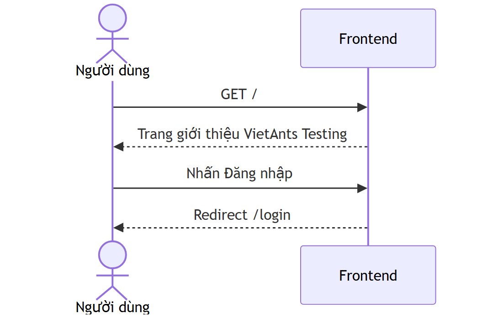

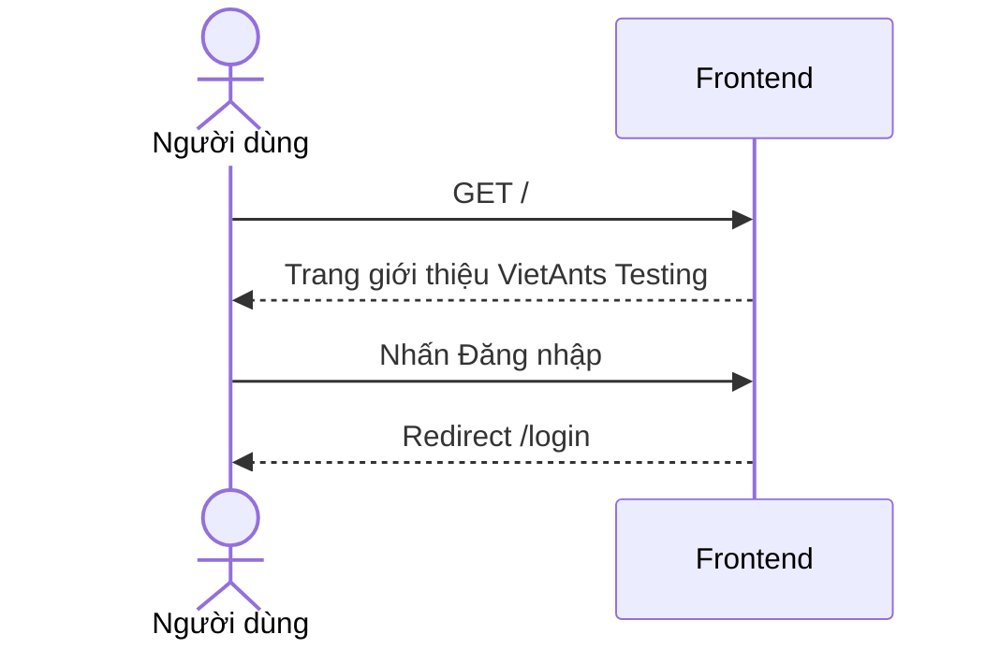
```mermaid
sequenceDiagram
    actor U as Người dùng
    participant W as Frontend

    U->>W: GET /
    W-->>U: Trang giới thiệu VietAnts Testing
    U->>W: Nhấn Đăng nhập
    W-->>U: Redirect /login
```

### Biểu đồ hoạt động (Activity) — 3.5.1b

> **Hình 3.5.1b** — Trang chủ

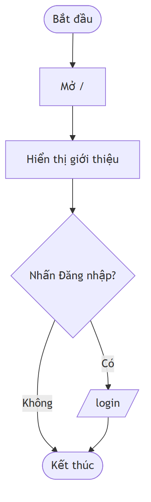

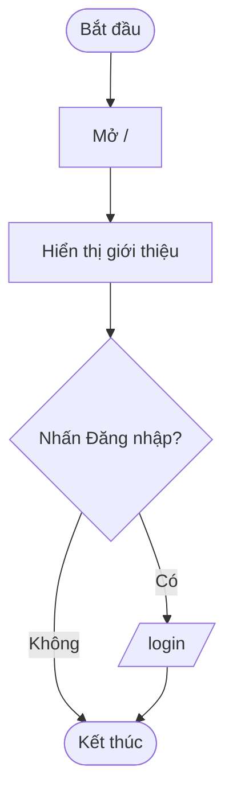
```mermaid
flowchart TD
    A([Bắt đầu]) --> B[Mở /]
    B --> C[Hiển thị giới thiệu]
    C --> D{Nhấn Đăng nhập?}
    D -- Có --> E[/login/]
    D -- Không --> F([Kết thúc])
    E --> F
```

### Đặc tả chi tiết (8 cột)

### Bảng 3.3 — ĐC-01: Truy cập trang giới thiệu hệ thống

| Cột | Nội dung |
|-----|----------|
| **Tên Usecase** | Truy cập trang giới thiệu hệ thống |
| **Tác nhân** | Khách (chưa đăng nhập), Admin, Tester, Viewer |
| **Mục đích** | Giới thiệu hệ thống và điều hướng người dùng tới trang đăng nhập |
| **Điều kiện tiên quyết** | Frontend đang chạy; người dùng truy cập được URL gốc `/` |
| **Mô tả chung** | Trang chủ hiển thị tên sản phẩm, mô tả ngắn về kiểm thử no-code và nút **Đăng nhập**. Không gọi API backend |
| **Luồng sự kiện** | 1. Người dùng mở URL `/`. 2. Hệ thống hiển thị trang giới thiệu. 3. Người dùng nhấn **Đăng nhập**. 4. Hệ thống chuyển hướng sang `/login` |
| **Ngoại lệ** | Không có ngoại lệ nghiệp vụ; lỗi mạng khi tải trang do lỗi hạ tầng frontend |
| **Các yêu cầu đặc biệt** | Giao diện responsive; không yêu cầu xác thực; layout không dùng AppShell sidebar |

#### Biểu đồ trình tự — ĐC-01

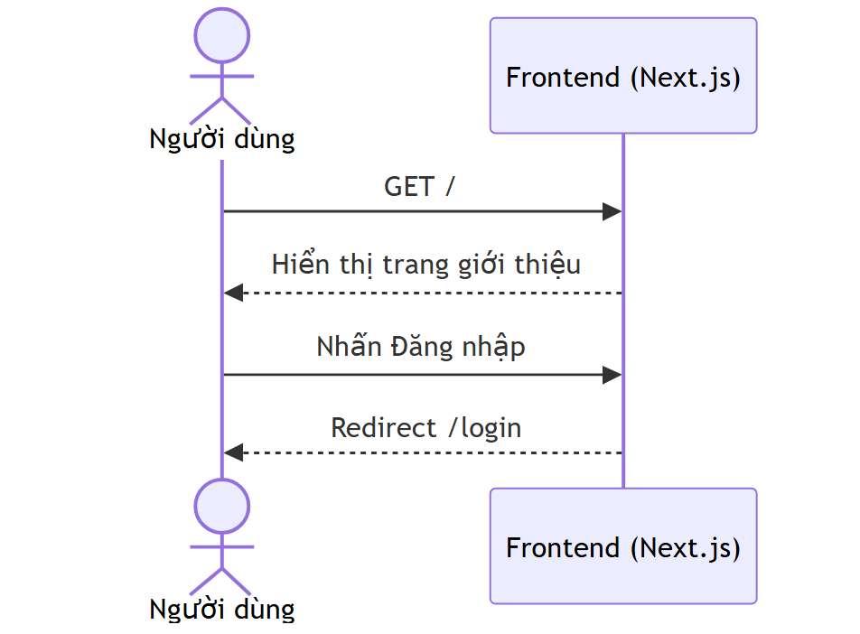

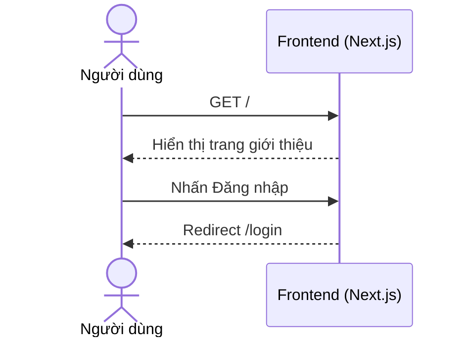
```mermaid
sequenceDiagram
    actor U as Người dùng
    participant W as Frontend (Next.js)

    U->>W: GET /
    W-->>U: Hiển thị trang giới thiệu
    U->>W: Nhấn Đăng nhập
    W-->>U: Redirect /login
```

#### Biểu đồ hoạt động — ĐC-01

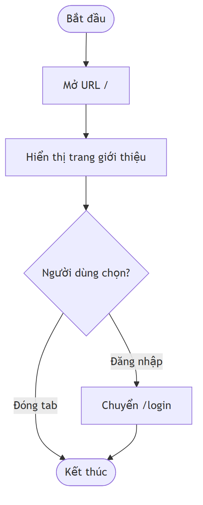

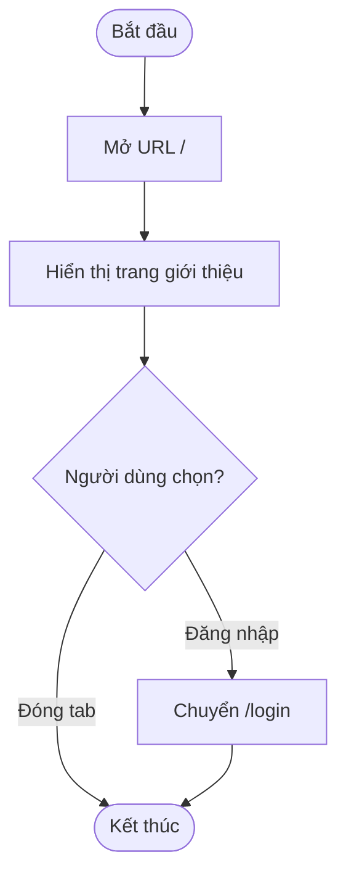
```mermaid
flowchart TD
    A([Bắt đầu]) --> B[Mở URL /]
    B --> C[Hiển thị trang giới thiệu]
    C --> D{Người dùng chọn?}
    D -- Đăng nhập --> E[Chuyển /login]
    D -- Đóng tab --> F([Kết thúc])
    E --> F
```

---

---

## Nhóm STT 2 — Xác thực & quản lý tài khoản

| Thuộc tính nhóm | Giá trị |
|-----------------|--------|
| **Mã use case** | ĐC-02 → ĐC-07 |
| **Số use case** | 6 |
| **Bảng đặc tả** | Bảng 3.4 – 3.9 (chi tiết: `11`) |
| **Màn hình** | /login, /register, … |
| **Biểu đồ trình tự** | Hình 3.5.2a — file `16`, STT 2 |
| **Biểu đồ hoạt động** | Hình 3.5.2b — file `16`, STT 2 |

### Danh sách use case trong nhóm

| Mã | Tên use case | Bảng |
|----|--------------|------|
| ĐC-02 | Đăng nhập hệ thống | Bảng 3.4 |
| ĐC-03 | Đăng ký tài khoản mới | Bảng 3.5 |
| ĐC-04 | Yêu cầu quên mật khẩu | Bảng 3.6 |
| ĐC-05 | Đặt lại mật khẩu bằng token | Bảng 3.7 |
| ĐC-06 | Đổi mật khẩu (tài khoản đang đăng nhập) | Bảng 3.8 |
| ĐC-07 | Đăng xuất | Bảng 3.9 |

### Biểu đồ trình tự (Sequence) — 3.5.2a

> **Hình 3.5.2a** — Xác thực & quản lý tài khoản

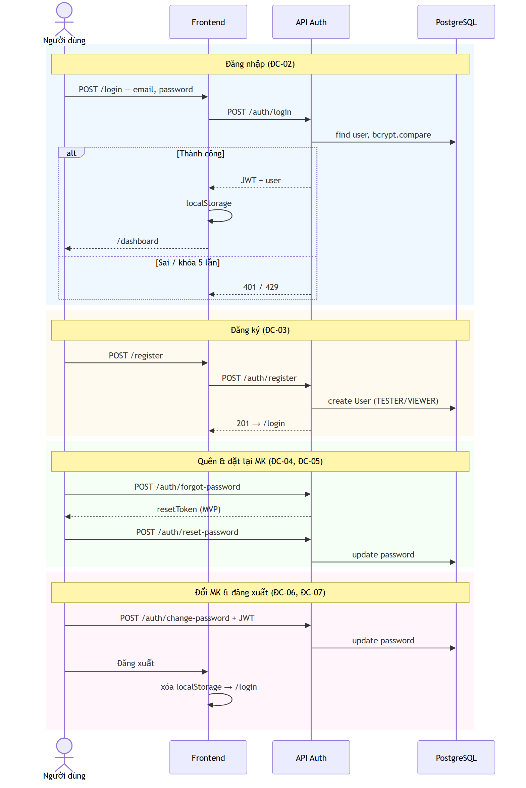

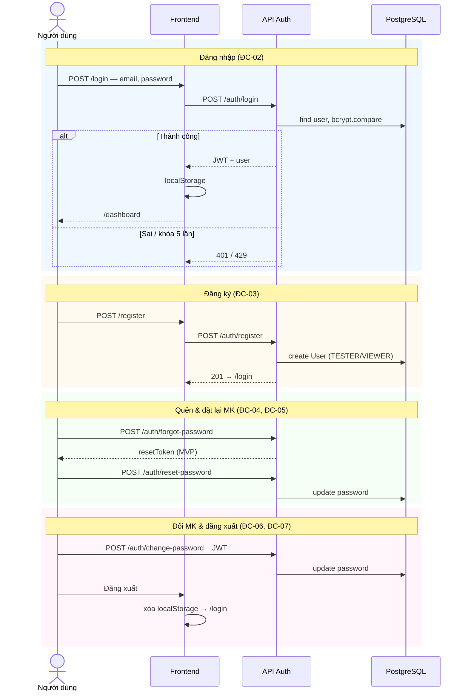
```mermaid
sequenceDiagram
    actor U as Người dùng
    participant W as Frontend
    participant A as API Auth
    participant DB as PostgreSQL

  rect rgb(240,248,255)
    Note over U,DB: Đăng nhập (ĐC-02)
    U->>W: POST /login — email, password
    W->>A: POST /auth/login
    A->>DB: find user, bcrypt.compare
    alt Thành công
        A-->>W: JWT + user
        W->>W: localStorage
        W-->>U: /dashboard
    else Sai / khóa 5 lần
        A-->>W: 401 / 429
    end
  end

  rect rgb(255,250,240)
    Note over U,DB: Đăng ký (ĐC-03)
    U->>W: POST /register
    W->>A: POST /auth/register
    A->>DB: create User (TESTER/VIEWER)
    A-->>W: 201 → /login
  end

  rect rgb(245,255,245)
    Note over U,DB: Quên & đặt lại MK (ĐC-04, ĐC-05)
    U->>A: POST /auth/forgot-password
    A-->>U: resetToken (MVP)
    U->>A: POST /auth/reset-password
    A->>DB: update password
  end

  rect rgb(255,245,250)
    Note over U,DB: Đổi MK & đăng xuất (ĐC-06, ĐC-07)
    U->>A: POST /auth/change-password + JWT
    A->>DB: update password
    U->>W: Đăng xuất
    W->>W: xóa localStorage → /login
  end
```

### Biểu đồ hoạt động (Activity) — 3.5.2b

> **Hình 3.5.2b** — Xác thực & quản lý tài khoản

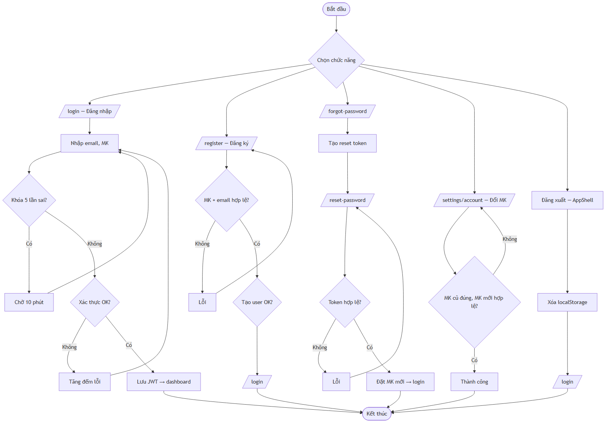

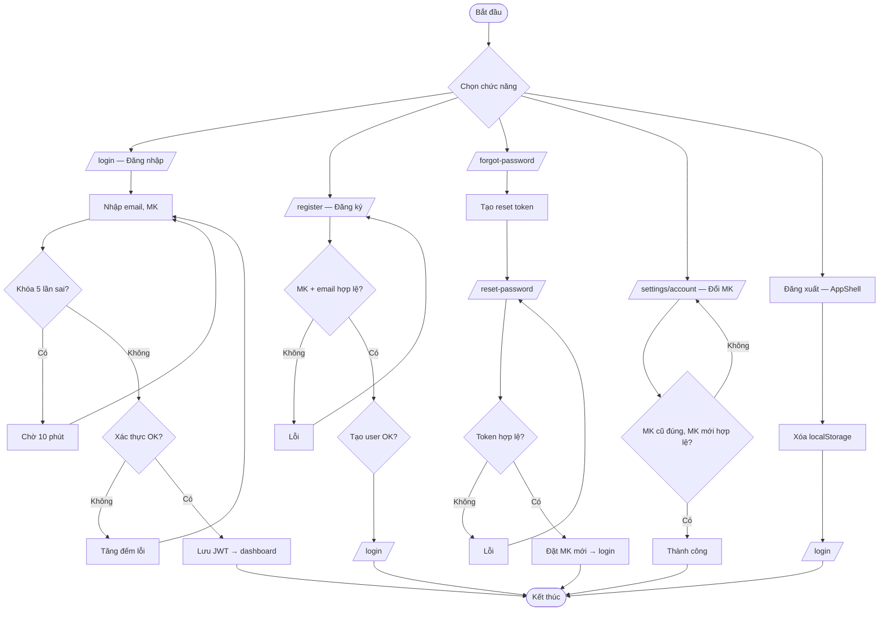
```mermaid
flowchart TD
    A([Bắt đầu]) --> B{Chọn chức năng}

    B --> C[/login — Đăng nhập/]
    C --> C1[Nhập email, MK]
    C1 --> C2{Khóa 5 lần sai?}
    C2 -- Có --> C3[Chờ 10 phút]
    C3 --> C1
    C2 -- Không --> C4{Xác thực OK?}
    C4 -- Không --> C5[Tăng đếm lỗi]
    C5 --> C1
    C4 -- Có --> C6[Lưu JWT → dashboard]

    B --> D[/register — Đăng ký/]
    D --> D1{MK + email hợp lệ?}
    D1 -- Không --> D2[Lỗi]
    D2 --> D
    D1 -- Có --> D3{Tạo user OK?}
    D3 --> D4[/login/]

    B --> E[/forgot-password/]
    E --> E1[Tạo reset token]
    E1 --> F[/reset-password/]
    F --> F1{Token hợp lệ?}
    F1 -- Không --> F2[Lỗi]
    F2 --> F
    F1 -- Có --> F3[Đặt MK mới → login]

    B --> G[/settings/account — Đổi MK/]
    G --> G1{MK cũ đúng, MK mới hợp lệ?}
    G1 -- Không --> G
    G1 -- Có --> G2[Thành công]

    B --> H[Đăng xuất — AppShell]
    H --> H1[Xóa localStorage]
    H1 --> I[/login/]

    C6 --> Z([Kết thúc])
    D4 --> Z
    F3 --> Z
    G2 --> Z
    I --> Z
```

### Đặc tả chi tiết (8 cột)

### Bảng 3.4 — ĐC-02: Đăng nhập hệ thống

| Cột | Nội dung |
|-----|----------|
| **Tên Usecase** | Đăng nhập hệ thống |
| **Tác nhân** | Admin, Tester, Viewer |
| **Mục đích** | Xác thực danh tính và cấp quyền truy cập theo vai trò |
| **Điều kiện tiên quyết** | Tài khoản đã tồn tại; API có cấu hình `JWT_SECRET`; email/mật khẩu hợp lệ |
| **Mô tả chung** | Người dùng nhập email và mật khẩu. Backend kiểm tra hash bcrypt, sinh JWT (8 giờ), trả token và profile. Frontend lưu `authToken`, `authUser` vào localStorage |
| **Luồng sự kiện** | 1. Mở `/login`. 2. Nhập email, mật khẩu. 3. Nhấn **Đăng nhập** → `POST /auth/login`. 4. API validate (Zod), tìm user, so sánh mật khẩu. 5. Sinh JWT gồm `sub`, `email`, `role`. 6. Frontend lưu token và thông tin user. 7. Chuyển hướng `/dashboard` |
| **Ngoại lệ** | E1: Sai email/mật khẩu → 401, tăng bộ đếm thất bại. E2: Sau 5 lần sai trong 10 phút → 429, tạm khóa đăng nhập. E3: Thiếu `JWT_SECRET` → 500. E4: Không kết nối API → thông báo lỗi trên UI |
| **Các yêu cầu đặc biệt** | Khóa theo cặp email + IP; không tiết lộ user tồn tại hay không khi sai MK; mật khẩu không lưu plain text phía client |

#### Biểu đồ trình tự — ĐC-02

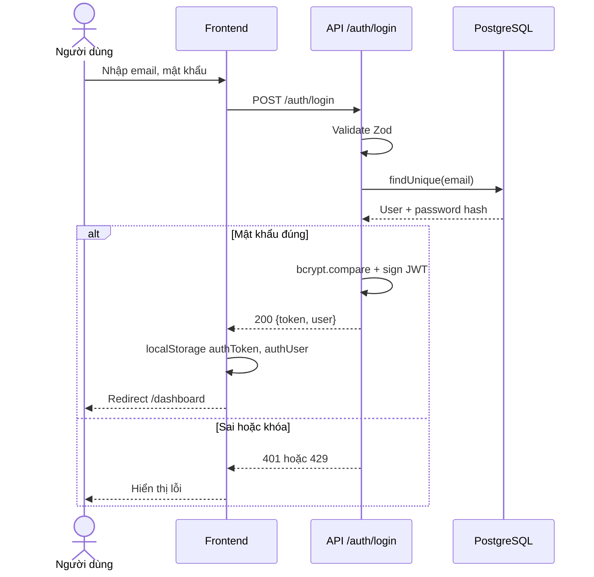
```mermaid
sequenceDiagram
    actor U as Người dùng
    participant W as Frontend
    participant A as API /auth/login
    participant DB as PostgreSQL

    U->>W: Nhập email, mật khẩu
    W->>A: POST /auth/login
    A->>A: Validate Zod
    A->>DB: findUnique(email)
    DB-->>A: User + password hash
    alt Mật khẩu đúng
        A->>A: bcrypt.compare + sign JWT
        A-->>W: 200 {token, user}
        W->>W: localStorage authToken, authUser
        W-->>U: Redirect /dashboard
    else Sai hoặc khóa
        A-->>W: 401 hoặc 429
        W-->>U: Hiển thị lỗi
    end
```

#### Biểu đồ hoạt động — ĐC-02

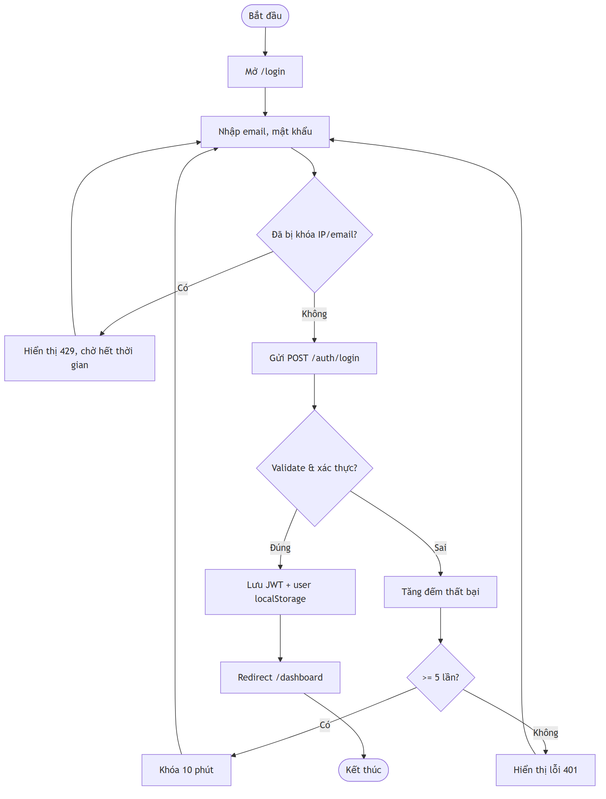

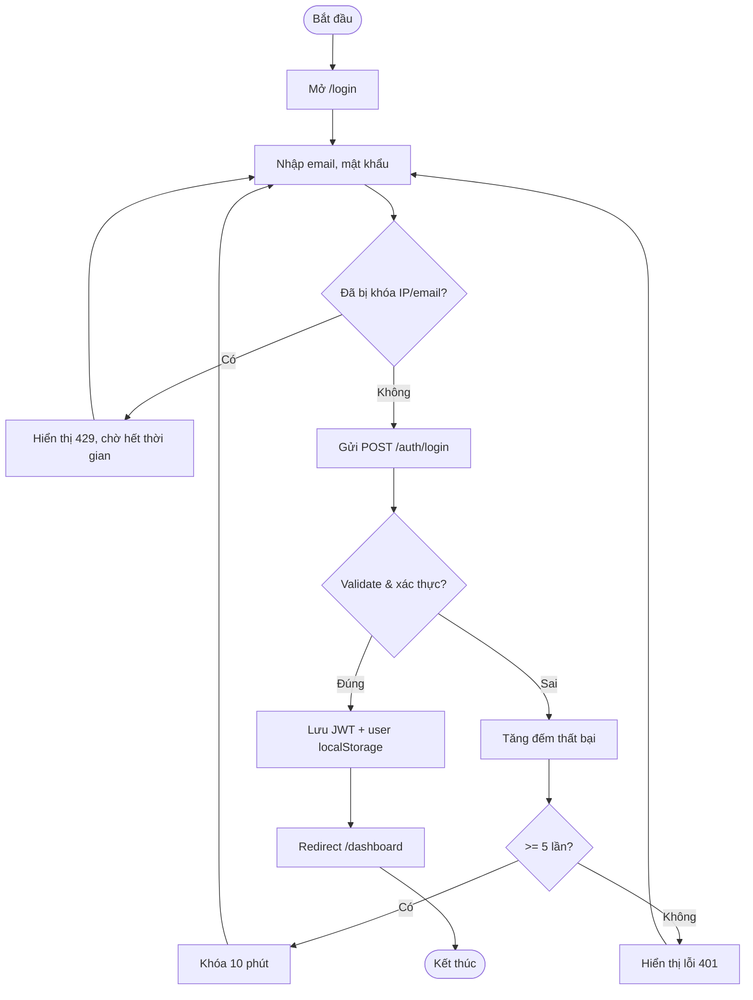
```mermaid
flowchart TD
    A([Bắt đầu]) --> B[Mở /login]
    B --> C[Nhập email, mật khẩu]
    C --> D{Đã bị khóa IP/email?}
    D -- Có --> E[Hiển thị 429, chờ hết thời gian]
    E --> C
    D -- Không --> F[Gửi POST /auth/login]
    F --> G{Validate & xác thực?}
    G -- Sai --> H[Tăng đếm thất bại]
    H --> I{>= 5 lần?}
    I -- Có --> J[Khóa 10 phút]
    I -- Không --> K[Hiển thị lỗi 401]
    K --> C
    J --> C
    G -- Đúng --> L[Lưu JWT + user localStorage]
    L --> M[Redirect /dashboard]
    M --> N([Kết thúc])
```

---

---

### Bảng 3.5 — ĐC-03: Đăng ký tài khoản mới

| Cột | Nội dung |
|-----|----------|
| **Tên Usecase** | Đăng ký tài khoản mới |
| **Tác nhân** | Người dùng mới (đăng ký tự phục vụ) |
| **Mục đích** | Tạo tài khoản TESTER hoặc VIEWER để sử dụng hệ thống |
| **Điều kiện tiên quyết** | Email chưa được đăng ký; mật khẩu đáp ứng quy tắc độ mạnh |
| **Mô tả chung** | Form đăng ký gồm họ tên, email, mật khẩu, vai trò (TESTER/VIEWER). API hash mật khẩu bcrypt và tạo bản ghi User |
| **Luồng sự kiện** | 1. Mở `/register`. 2. Nhập họ tên, email, mật khẩu, chọn role. 3. Submit → `POST /auth/register`. 4. API validate: email hợp lệ, MK ≥8 ký tự, có hoa/thường/số. 5. Kiểm tra email trùng. 6. Tạo user, trả 201. 7. UI thông báo thành công, chuyển `/login` sau ~800ms |
| **Ngoại lệ** | E1: Email đã tồn tại → 409. E2: Dữ liệu không hợp lệ → 400 kèm chi tiết Zod. E3: Không kết nối API → hướng dẫn bật server |
| **Các yêu cầu đặc biệt** | Không cho đăng ký role ADMIN qua form công khai; mật khẩu lưu dạng hash trên server |

#### Biểu đồ trình tự — ĐC-03

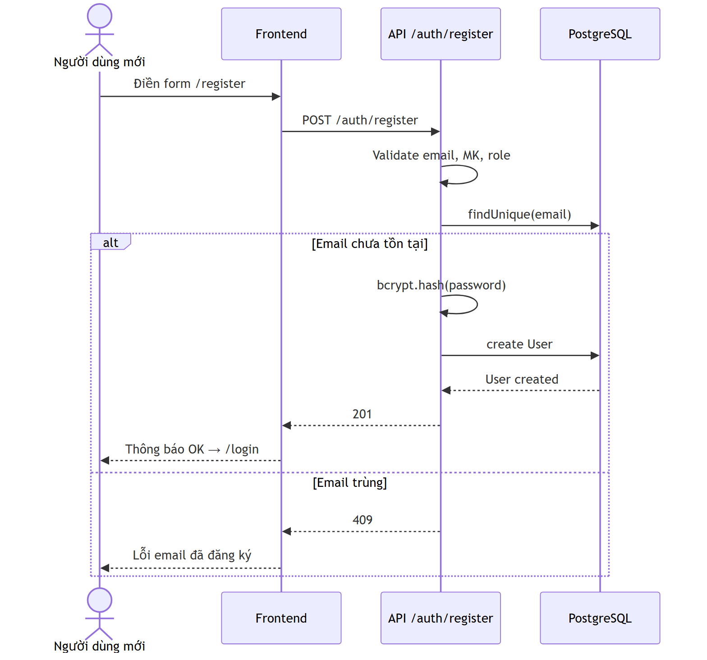

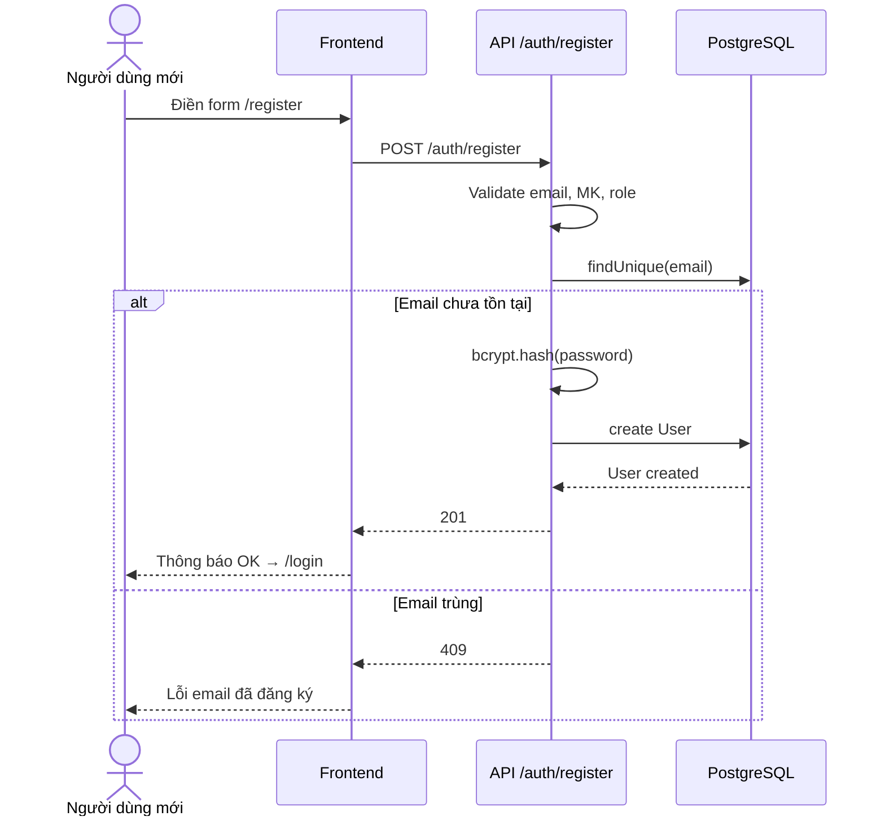
```mermaid
sequenceDiagram
    actor U as Người dùng mới
    participant W as Frontend
    participant A as API /auth/register
    participant DB as PostgreSQL

    U->>W: Điền form /register
    W->>A: POST /auth/register
    A->>A: Validate email, MK, role
    A->>DB: findUnique(email)
    alt Email chưa tồn tại
        A->>A: bcrypt.hash(password)
        A->>DB: create User
        DB-->>A: User created
        A-->>W: 201
        W-->>U: Thông báo OK → /login
    else Email trùng
        A-->>W: 409
        W-->>U: Lỗi email đã đăng ký
    end
```

#### Biểu đồ hoạt động — ĐC-03

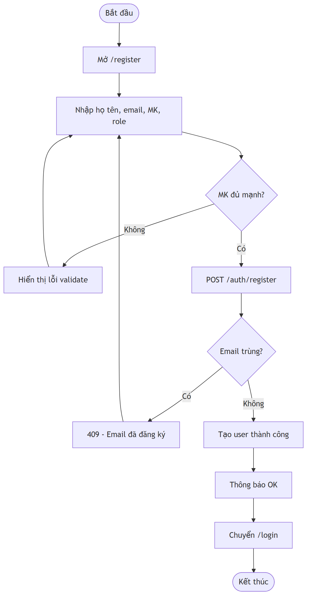

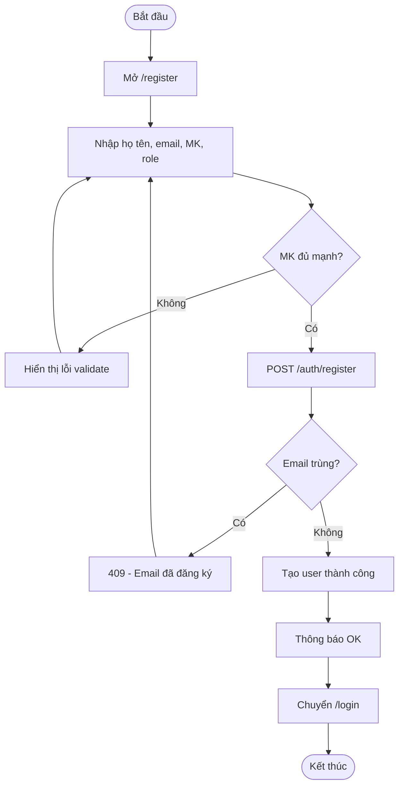
```mermaid
flowchart TD
    A([Bắt đầu]) --> B[Mở /register]
    B --> C[Nhập họ tên, email, MK, role]
    C --> D{MK đủ mạnh?}
    D -- Không --> E[Hiển thị lỗi validate]
    E --> C
    D -- Có --> F[POST /auth/register]
    F --> G{Email trùng?}
    G -- Có --> H[409 - Email đã đăng ký]
    H --> C
    G -- Không --> I[Tạo user thành công]
    I --> J[Thông báo OK]
    J --> K[Chuyển /login]
    K --> L([Kết thúc])
```

---

---

### Bảng 3.6 — ĐC-04: Yêu cầu quên mật khẩu

| Cột | Nội dung |
|-----|----------|
| **Tên Usecase** | Yêu cầu quên mật khẩu |
| **Tác nhân** | Admin, Tester, Viewer (quên mật khẩu) |
| **Mục đích** | Khởi tạo quy trình đặt lại mật khẩu an toàn |
| **Điều kiện tiên quyết** | Người dùng biết email đã đăng ký; API đang hoạt động |
| **Mô tả chung** | Người dùng nhập email. Hệ thống tạo reset token (TTL 15 phút) lưu in-memory. Phản hồi không tiết lộ email có tồn tại (ngoại trừ MVP trả token trong response để demo) |
| **Luồng sự kiện** | 1. Mở `/forgot-password`. 2. Nhập email. 3. Submit → `POST /auth/forgot-password`. 4. API validate email. 5. Nếu user tồn tại: sinh token ngẫu nhiên, lưu map token→userId. 6. Trả message thành công (+ `resetToken` trong MVP). 7. Người dùng chuyển sang `/reset-password` với token |
| **Ngoại lệ** | E1: Email không hợp lệ → 400. E2: Email không tồn tại → vẫn 200 với message chung (bảo mật) |
| **Các yêu cầu đặc biệt** | Token một lần, hết hạn 15 phút; production nên gửi token qua email thay vì trả trong JSON |

#### Biểu đồ trình tự — ĐC-04

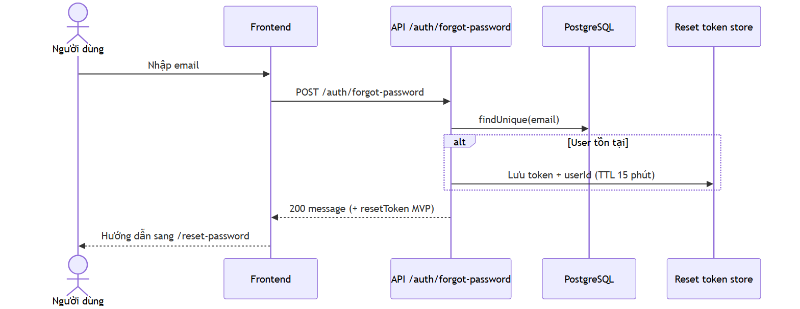

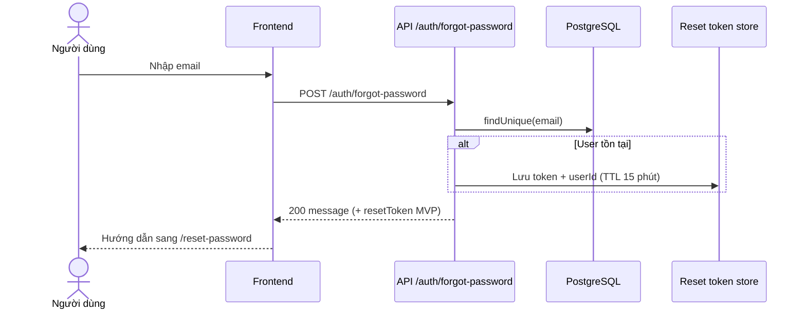
```mermaid
sequenceDiagram
    actor U as Người dùng
    participant W as Frontend
    participant A as API /auth/forgot-password
    participant DB as PostgreSQL
    participant M as Reset token store

    U->>W: Nhập email
    W->>A: POST /auth/forgot-password
    A->>DB: findUnique(email)
    alt User tồn tại
        A->>M: Lưu token + userId (TTL 15 phút)
    end
    A-->>W: 200 message (+ resetToken MVP)
    W-->>U: Hướng dẫn sang /reset-password
```

#### Biểu đồ hoạt động — ĐC-04

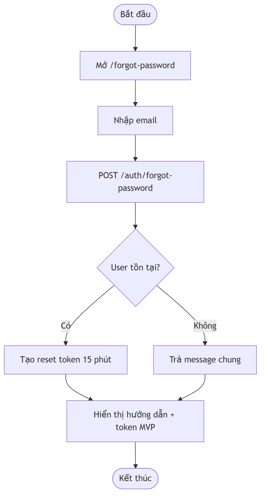

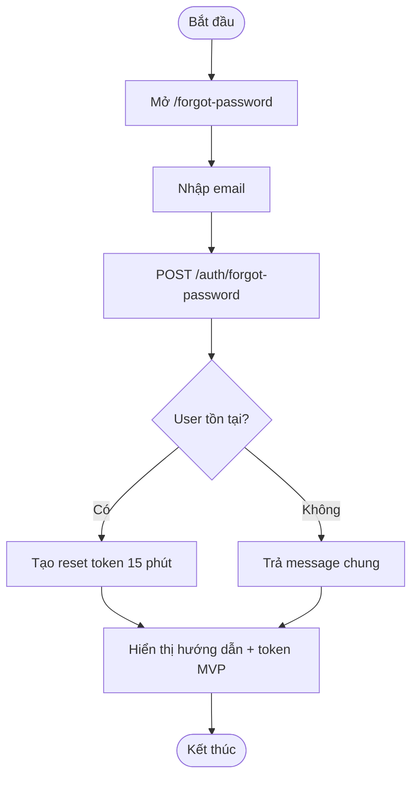
```mermaid
flowchart TD
    A([Bắt đầu]) --> B[Mở /forgot-password]
    B --> C[Nhập email]
    C --> D[POST /auth/forgot-password]
    D --> E{User tồn tại?}
    E -- Có --> F[Tạo reset token 15 phút]
    E -- Không --> G[Trả message chung]
    F --> H[Hiển thị hướng dẫn + token MVP]
    G --> H
    H --> I([Kết thúc])
```

---

---

### Bảng 3.7 — ĐC-05: Đặt lại mật khẩu bằng token

| Cột | Nội dung |
|-----|----------|
| **Tên Usecase** | Đặt lại mật khẩu bằng token |
| **Tác nhân** | Admin, Tester, Viewer |
| **Mục đích** | Gán mật khẩu mới sau khi quên mật khẩu |
| **Điều kiện tiên quyết** | Có reset token còn hiệu lực; mật khẩu mới đáp ứng quy tắc độ mạnh |
| **Mô tả chung** | Form nhận token và mật khẩu mới. API xác minh token, hash và cập nhật user, xóa token |
| **Luồng sự kiện** | 1. Mở `/reset-password`. 2. Nhập token, mật khẩu mới (và xác nhận trên UI). 3. Submit → `POST /auth/reset-password`. 4. API kiểm tra token tồn tại và chưa hết hạn. 5. Hash MK mới, cập nhật DB. 6. Xóa token. 7. Thông báo thành công, chuyển login |
| **Ngoại lệ** | E1: Token không hợp lệ/hết hạn → 400. E2: MK không đủ mạnh → 400. E3: Token đã dùng → 400 |
| **Các yêu cầu đặc biệt** | Token dùng một lần; invalidate sau khi đặt lại thành công |

#### Biểu đồ trình tự — ĐC-05

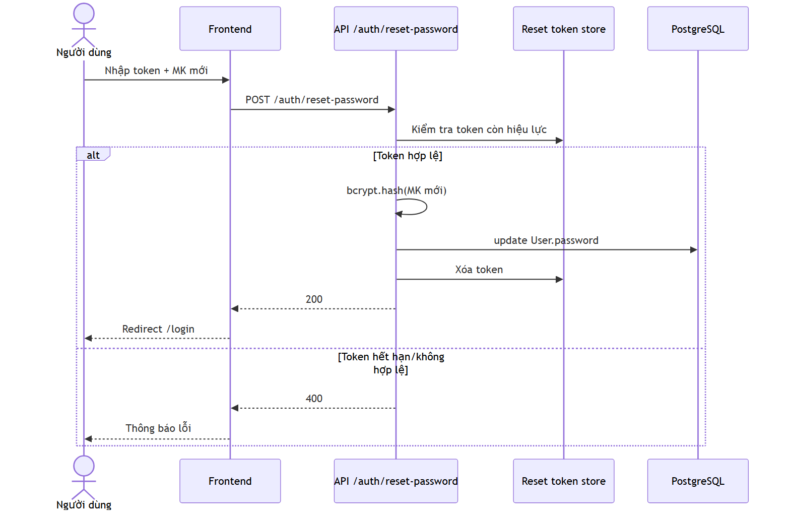

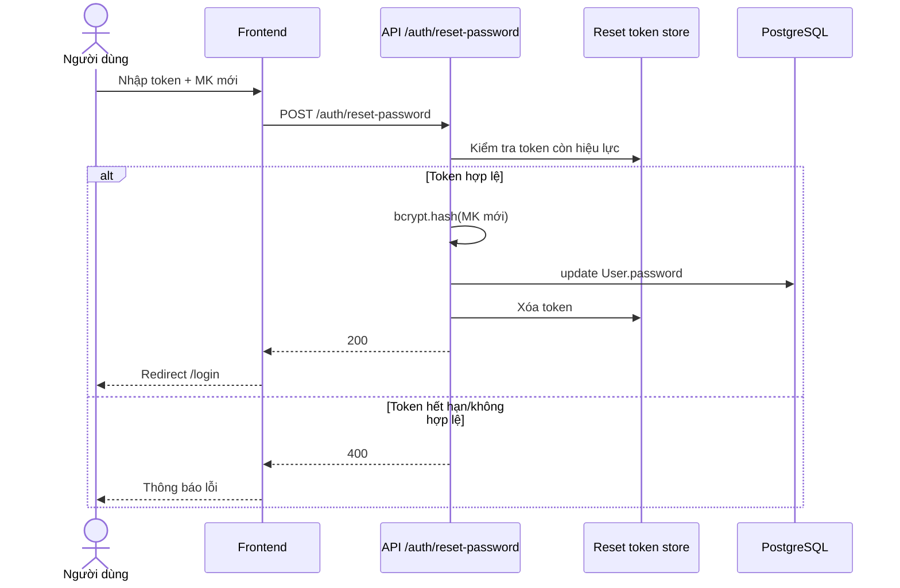
```mermaid
sequenceDiagram
    actor U as Người dùng
    participant W as Frontend
    participant A as API /auth/reset-password
    participant M as Reset token store
    participant DB as PostgreSQL

    U->>W: Nhập token + MK mới
    W->>A: POST /auth/reset-password
    A->>M: Kiểm tra token còn hiệu lực
    alt Token hợp lệ
        A->>A: bcrypt.hash(MK mới)
        A->>DB: update User.password
        A->>M: Xóa token
        A-->>W: 200
        W-->>U: Redirect /login
    else Token hết hạn/không hợp lệ
        A-->>W: 400
        W-->>U: Thông báo lỗi
    end
```

#### Biểu đồ hoạt động — ĐC-05

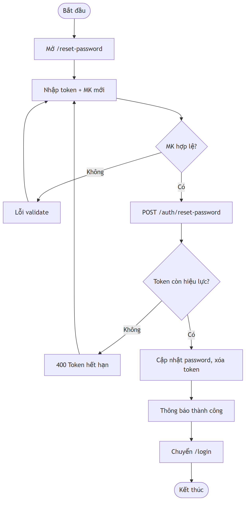

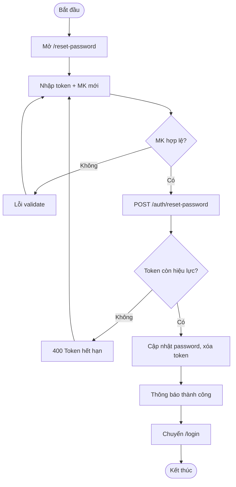
```mermaid
flowchart TD
    A([Bắt đầu]) --> B[Mở /reset-password]
    B --> C[Nhập token + MK mới]
    C --> D{MK hợp lệ?}
    D -- Không --> E[Lỗi validate]
    E --> C
    D -- Có --> F[POST /auth/reset-password]
    F --> G{Token còn hiệu lực?}
    G -- Không --> H[400 Token hết hạn]
    H --> C
    G -- Có --> I[Cập nhật password, xóa token]
    I --> J[Thông báo thành công]
    J --> K[Chuyển /login]
    K --> L([Kết thúc])
```

---

---

### Bảng 3.8 — ĐC-06: Đổi mật khẩu (tài khoản đang đăng nhập)

| Cột | Nội dung |
|-----|----------|
| **Tên Usecase** | Đổi mật khẩu |
| **Tác nhân** | Admin, Tester, Viewer |
| **Mục đích** | Người dùng tự cập nhật mật khẩu khi đã đăng nhập |
| **Điều kiện tiên quyết** | Đã đăng nhập (JWT hợp lệ); biết mật khẩu hiện tại |
| **Mô tả chung** | Màn `/settings/account` cho phép đổi MK với xác nhận MK mới trùng khớp trên client |
| **Luồng sự kiện** | 1. Đăng nhập, mở `/settings/account`. 2. Nhập MK hiện tại, MK mới, xác nhận. 3. UI kiểm tra xác nhận khớp. 4. Submit → `POST /auth/change-password` kèm Bearer token. 5. API so sánh MK cũ, validate MK mới, cập nhật hash. 6. Thông báo thành công, xóa form |
| **Ngoại lệ** | E1: MK hiện tại sai → 401. E2: MK mới trùng MK cũ → 400. E3: MK mới không đủ mạnh → 400. E4: Xác nhận không khớp → lỗi UI, không gọi API |
| **Các yêu cầu đặc biệt** | MK tối thiểu 8 ký tự, có hoa/thường/số; giới hạn độ dài input 255 ký tự trên UI |

#### Biểu đồ trình tự — ĐC-06

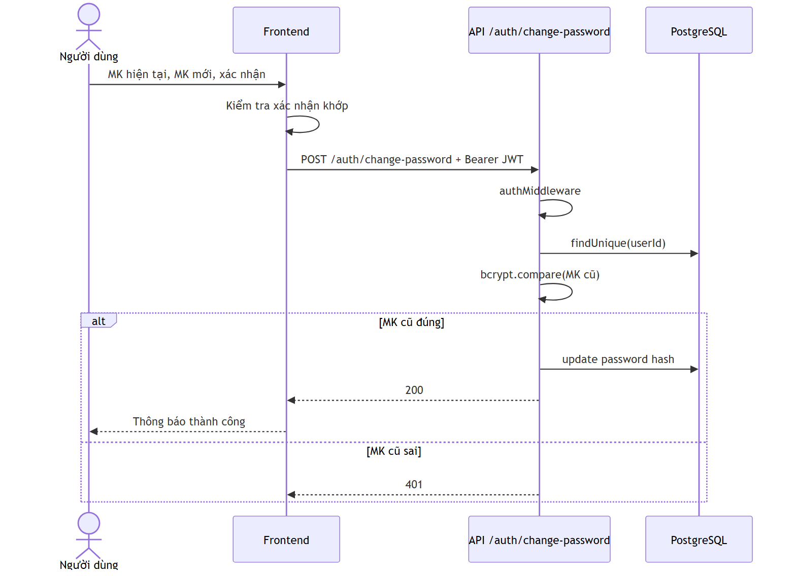

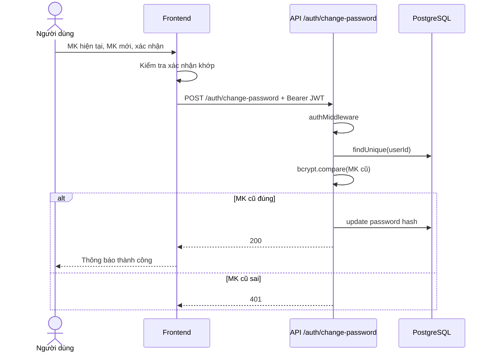
```mermaid
sequenceDiagram
    actor U as Người dùng
    participant W as Frontend
    participant A as API /auth/change-password
    participant DB as PostgreSQL

    U->>W: MK hiện tại, MK mới, xác nhận
    W->>W: Kiểm tra xác nhận khớp
    W->>A: POST /auth/change-password + Bearer JWT
    A->>A: authMiddleware
    A->>DB: findUnique(userId)
    A->>A: bcrypt.compare(MK cũ)
    alt MK cũ đúng
        A->>DB: update password hash
        A-->>W: 200
        W-->>U: Thông báo thành công
    else MK cũ sai
        A-->>W: 401
    end
```

#### Biểu đồ hoạt động — ĐC-06

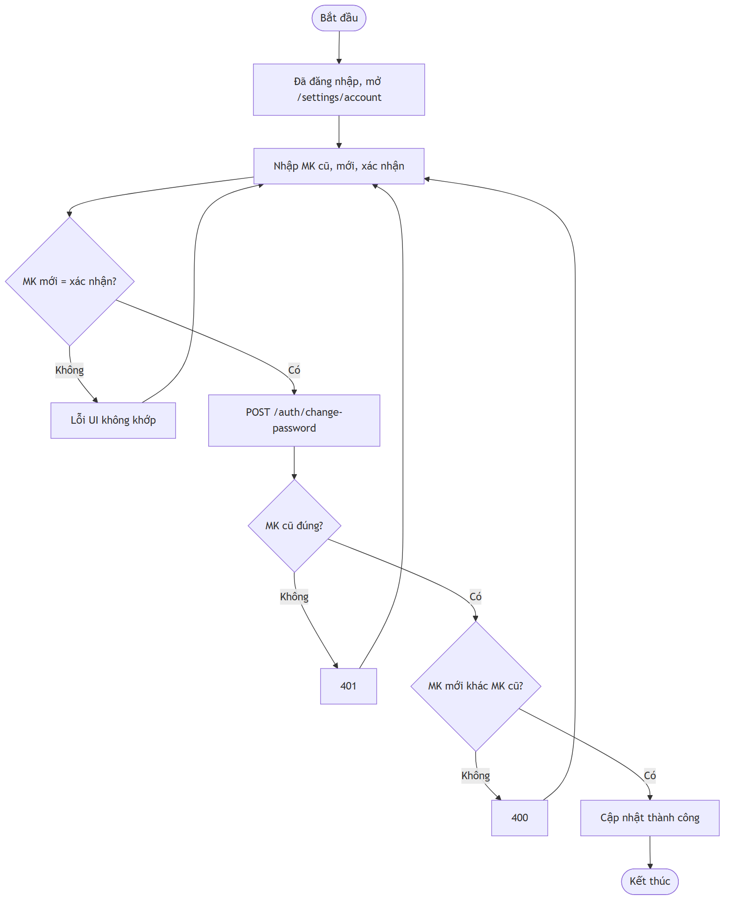

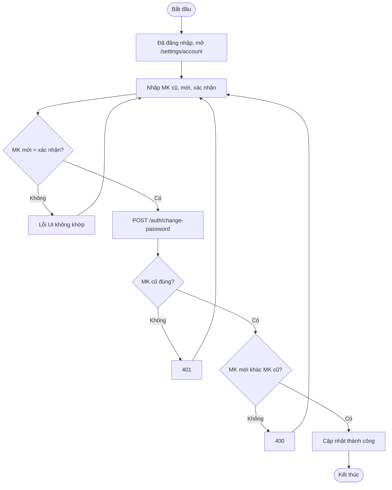
```mermaid
flowchart TD
    A([Bắt đầu]) --> B[Đã đăng nhập, mở /settings/account]
    B --> C[Nhập MK cũ, mới, xác nhận]
    C --> D{MK mới = xác nhận?}
    D -- Không --> E[Lỗi UI không khớp]
    E --> C
    D -- Có --> F[POST /auth/change-password]
    F --> G{MK cũ đúng?}
    G -- Không --> H[401]
    H --> C
    G -- Có --> I{MK mới khác MK cũ?}
    I -- Không --> J[400]
    J --> C
    I -- Có --> K[Cập nhật thành công]
    K --> L([Kết thúc])
```

---

---

### Bảng 3.9 — ĐC-07: Đăng xuất

| Cột | Nội dung |
|-----|----------|
| **Tên Usecase** | Đăng xuất |
| **Tác nhân** | Admin, Tester, Viewer |
| **Mục đích** | Kết thúc phiên làm việc và xóa thông tin xác thực cục bộ |
| **Điều kiện tiên quyết** | Đang đăng nhập (có token trong localStorage) |
| **Mô tả chung** | Thao tác từ menu user trên AppShell; không gọi API revoke server-side (stateless JWT) |
| **Luồng sự kiện** | 1. Người dùng mở menu avatar. 2. Chọn **Đăng xuất**. 3. Frontend xóa `authToken`, `authUser`. 4. Chuyển hướng `/login` |
| **Ngoại lệ** | Không có ngoại lệ nghiệp vụ |
| **Các yêu cầu đặc biệt** | JWT vẫn còn hiệu lực trên server đến khi hết hạn; có thể bổ sung blacklist token ở phiên bản sau |

#### Biểu đồ trình tự — ĐC-07

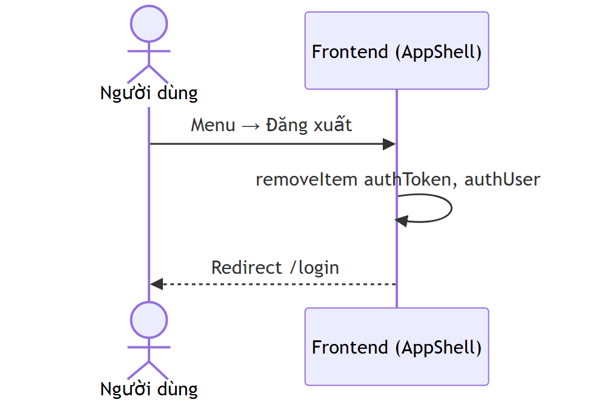

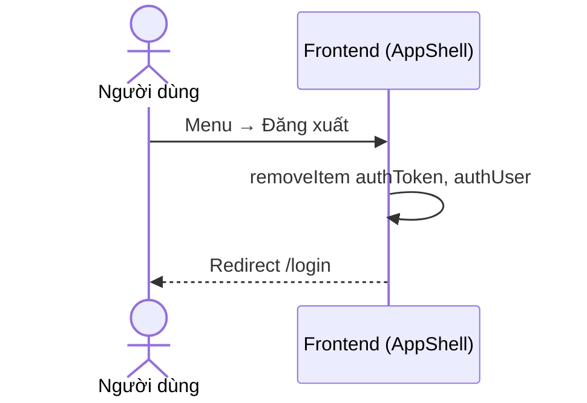
```mermaid
sequenceDiagram
    actor U as Người dùng
    participant W as Frontend (AppShell)

    U->>W: Menu → Đăng xuất
    W->>W: removeItem authToken, authUser
    W-->>U: Redirect /login
```

#### Biểu đồ hoạt động — ĐC-07

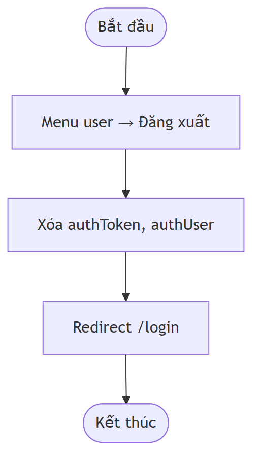

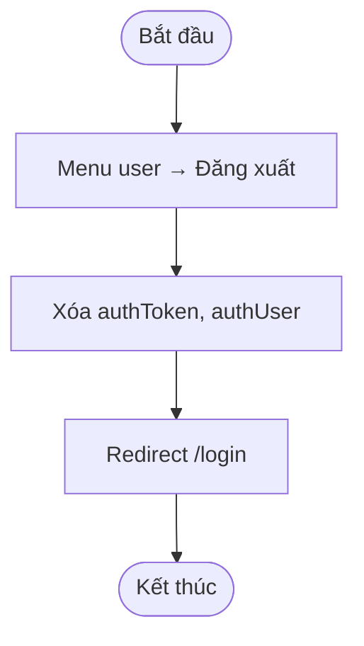
```mermaid
flowchart TD
    A([Bắt đầu]) --> B[Menu user → Đăng xuất]
    B --> C[Xóa authToken, authUser]
    C --> D[Redirect /login]
    D --> E([Kết thúc])
```

---

## A.2. Dashboard

---

## Nhóm STT 3 — Dashboard & thống kê

| Thuộc tính nhóm | Giá trị |
|-----------------|--------|
| **Mã use case** | ĐC-08 |
| **Số use case** | 1 |
| **Bảng đặc tả** | Bảng 3.10 – 3.10 (chi tiết: `11`) |
| **Màn hình** | /dashboard |
| **Biểu đồ trình tự** | Hình 3.5.3a — file `16`, STT 3 |
| **Biểu đồ hoạt động** | Hình 3.5.3b — file `16`, STT 3 |

### Danh sách use case trong nhóm

| Mã | Tên use case | Bảng |
|----|--------------|------|
| ĐC-08 | Xem dashboard & thống kê analytics | Bảng 3.10 |

### Biểu đồ trình tự (Sequence) — 3.5.3a

> **Hình 3.5.3a** — Dashboard & thống kê

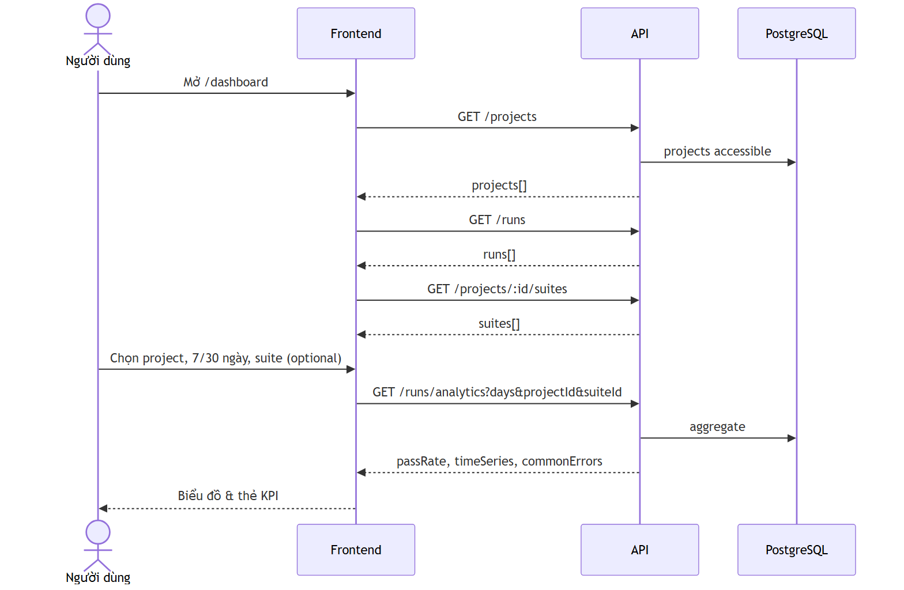

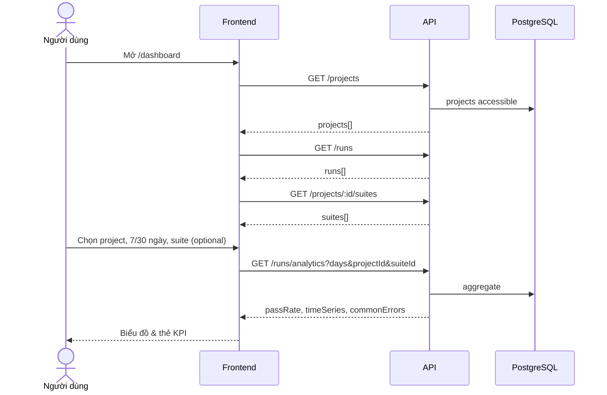
```mermaid
sequenceDiagram
    actor U as Người dùng
    participant W as Frontend
    participant A as API
    participant DB as PostgreSQL

    U->>W: Mở /dashboard
    W->>A: GET /projects
    A->>DB: projects accessible
    A-->>W: projects[]
    W->>A: GET /runs
    A-->>W: runs[]
    W->>A: GET /projects/:id/suites
    A-->>W: suites[]
    U->>W: Chọn project, 7/30 ngày, suite (optional)
    W->>A: GET /runs/analytics?days&projectId&suiteId
    A->>DB: aggregate
    A-->>W: passRate, timeSeries, commonErrors
    W-->>U: Biểu đồ & thẻ KPI
```

### Biểu đồ hoạt động (Activity) — 3.5.3b

> **Hình 3.5.3b** — Dashboard & thống kê

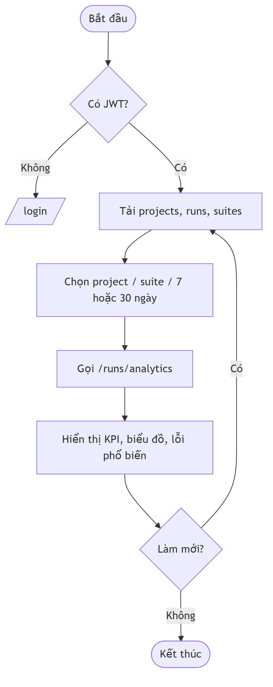

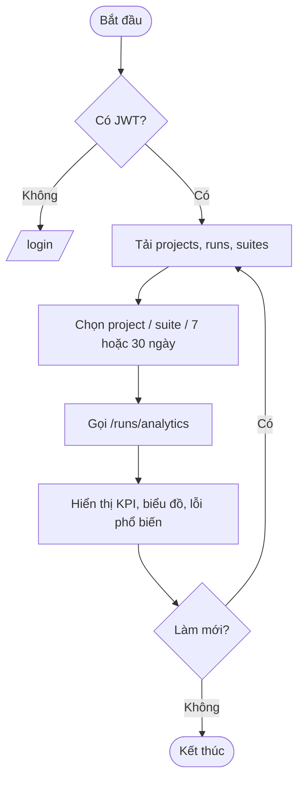
```mermaid
flowchart TD
    A([Bắt đầu]) --> B{Có JWT?}
    B -- Không --> C[/login/]
    B -- Có --> D[Tải projects, runs, suites]
    D --> E[Chọn project / suite / 7 hoặc 30 ngày]
    E --> F[Gọi /runs/analytics]
    F --> G[Hiển thị KPI, biểu đồ, lỗi phổ biến]
    G --> H{Làm mới?}
    H -- Có --> D
    H -- Không --> I([Kết thúc])
```

### Đặc tả chi tiết (8 cột)

### Bảng 3.10 — ĐC-08: Xem dashboard & thống kê analytics

| Cột | Nội dung |
|-----|----------|
| **Tên Usecase** | Xem dashboard & thống kê analytics |
| **Tác nhân** | Admin, Tester, Viewer |
| **Mục đích** | Tổng quan dự án, lần chạy và chỉ số Pass/Fail theo thời gian |
| **Điều kiện tiên quyết** | Đã đăng nhập; user có quyền truy cập ít nhất một project (hoặc danh sách rỗng) |
| **Mô tả chung** | Dashboard tải projects, runs, suites và gọi `GET /runs/analytics` với khoảng 7 hoặc 30 ngày, có thể lọc theo project/suite |
| **Luồng sự kiện** | 1. Sau login vào `/dashboard`. 2. Gọi `GET /projects`, `GET /runs`. 3. Chọn project mặc định hoặc project khác. 4. Gọi `GET /projects/:id/suites`. 5. Chọn khoảng 7/30 ngày và/hoặc suite. 6. Gọi `GET /runs/analytics?days=&projectId=&suiteId=`. 7. Hiển thị tổng run, pass, fail, pass rate, lỗi phổ biến, time series |
| **Ngoại lệ** | E1: Token hết hạn → redirect login. E2: Lỗi API → hiển thị thông báo lỗi. E3: Không có dữ liệu → hiển thị 0 và biểu đồ rỗng |
| **Các yêu cầu đặc biệt** | Viewer chỉ xem, không thao tác mutate; nút làm mới dữ liệu; Admin thấy link tới quản lý dự án |

#### Biểu đồ trình tự — ĐC-08

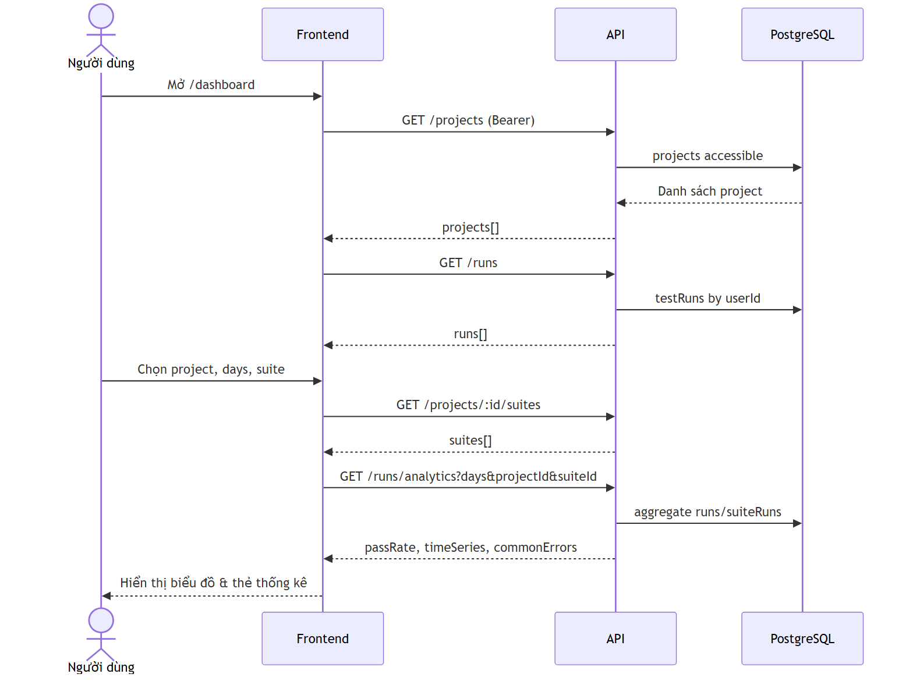

```mermaid
sequenceDiagram
    actor U as Người dùng
    participant W as Frontend
    participant A as API
    participant DB as PostgreSQL

    U->>W: Mở /dashboard
    W->>A: GET /projects (Bearer)
    A->>DB: projects accessible
    DB-->>A: Danh sách project
    A-->>W: projects[]
    W->>A: GET /runs
    A->>DB: testRuns by userId
    A-->>W: runs[]
    U->>W: Chọn project, days, suite
    W->>A: GET /projects/:id/suites
    A-->>W: suites[]
    W->>A: GET /runs/analytics?days&projectId&suiteId
    A->>DB: aggregate runs/suiteRuns
    A-->>W: passRate, timeSeries, commonErrors
    W-->>U: Hiển thị biểu đồ & thẻ thống kê
```

#### Biểu đồ hoạt động — ĐC-08

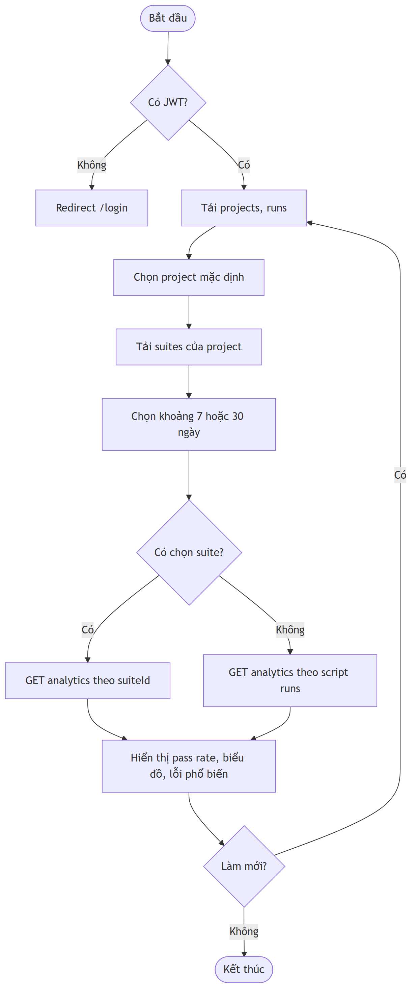

```mermaid
flowchart TD
    A([Bắt đầu]) --> B{Có JWT?}
    B -- Không --> C[Redirect /login]
    B -- Có --> D[Tải projects, runs]
    D --> E[Chọn project mặc định]
    E --> F[Tải suites của project]
    F --> G[Chọn khoảng 7 hoặc 30 ngày]
    G --> H{Có chọn suite?}
    H -- Có --> I[GET analytics theo suiteId]
    H -- Không --> J[GET analytics theo script runs]
    I --> K[Hiển thị pass rate, biểu đồ, lỗi phổ biến]
    J --> K
    K --> L{Làm mới?}
    L -- Có --> D
    L -- Không --> M([Kết thúc])
```

---

## A.3. Quản lý dự án

---

## Nhóm STT 4 — Quản lý dự án

| Thuộc tính nhóm | Giá trị |
|-----------------|--------|
| **Mã use case** | ĐC-09 → ĐC-12 |
| **Số use case** | 4 |
| **Bảng đặc tả** | Bảng 3.11 – 3.14 (chi tiết: `11`) |
| **Màn hình** | /projects |
| **Biểu đồ trình tự** | Hình 3.5.4a — file `16`, STT 4 |
| **Biểu đồ hoạt động** | Hình 3.5.4b — file `16`, STT 4 |

### Danh sách use case trong nhóm

| Mã | Tên use case | Bảng |
|----|--------------|------|
| ĐC-09 | Xem danh sách dự án | Bảng 3.11 |
| ĐC-10 | Tạo dự án mới | Bảng 3.12 |
| ĐC-11 | Cập nhật dự án và gán thành viên | Bảng 3.13 |
| ĐC-12 | Xóa dự án | Bảng 3.14 |

### Biểu đồ trình tự (Sequence) — 3.5.4a

> **Hình 3.5.4a** — Quản lý dự án

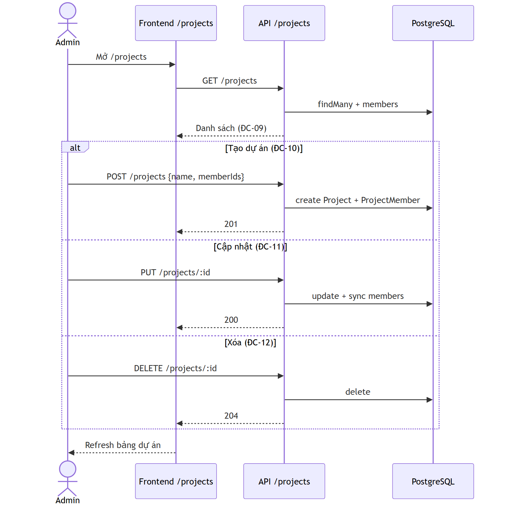

```mermaid
sequenceDiagram
    actor A as Admin
    participant W as Frontend /projects
    participant API as API /projects
    participant DB as PostgreSQL

    A->>W: Mở /projects
    W->>API: GET /projects
    API->>DB: findMany + members
    API-->>W: Danh sách (ĐC-09)

    alt Tạo dự án (ĐC-10)
        A->>API: POST /projects {name, memberIds}
        API->>DB: create Project + ProjectMember
        API-->>W: 201
    else Cập nhật (ĐC-11)
        A->>API: PUT /projects/:id
        API->>DB: update + sync members
        API-->>W: 200
    else Xóa (ĐC-12)
        A->>API: DELETE /projects/:id
        API->>DB: delete
        API-->>W: 204
    end
    W-->>A: Refresh bảng dự án
```

### Biểu đồ hoạt động (Activity) — 3.5.4b

> **Hình 3.5.4b** — Quản lý dự án

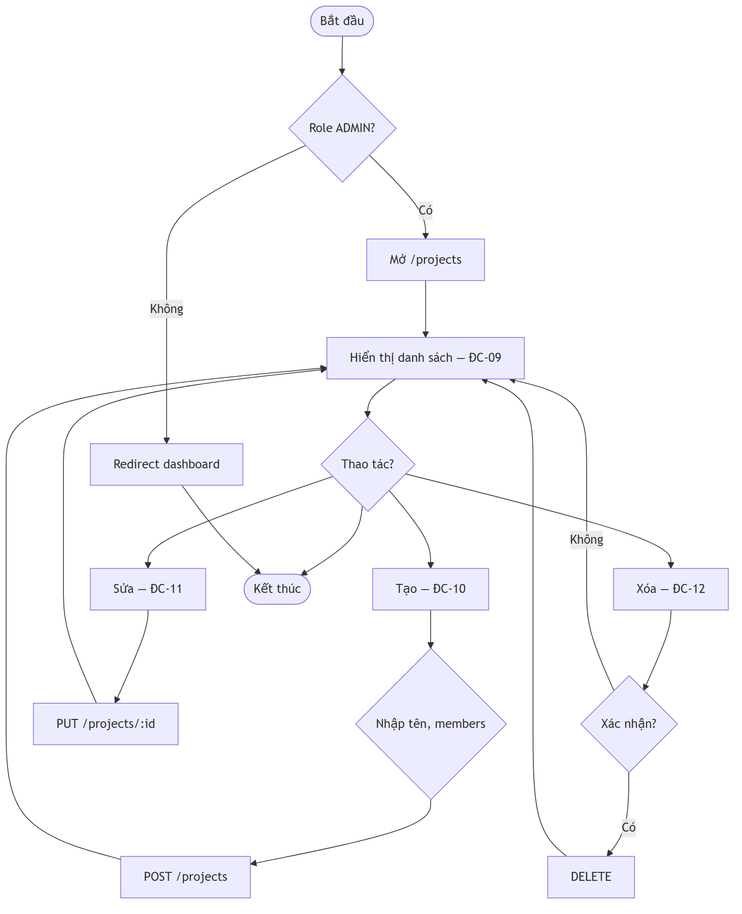

```mermaid
flowchart TD
    A([Bắt đầu]) --> B{Role ADMIN?}
    B -- Không --> C[Redirect dashboard]
    B -- Có --> D[Mở /projects]
    D --> E[Hiển thị danh sách — ĐC-09]
    E --> F{Thao tác?}

    F --> G[Tạo — ĐC-10]
    G --> G1{Nhập tên, members}
    G1 --> G2[POST /projects]
    G2 --> E

    F --> H[Sửa — ĐC-11]
    H --> H1[PUT /projects/:id]
    H1 --> E

    F --> I[Xóa — ĐC-12]
    I --> I1{Xác nhận?}
    I1 -- Không --> E
    I1 -- Có --> I2[DELETE]
    I2 --> E

    F --> J([Kết thúc])
    C --> J
```

### Đặc tả chi tiết (8 cột)

### Bảng 3.11 — ĐC-09: Xem danh sách dự án

| Cột | Nội dung |
|-----|----------|
| **Tên Usecase** | Xem danh sách dự án |
| **Tác nhân** | Admin |
| **Mục đích** | Xem các dự án user được phép truy cập (owner hoặc member) |
| **Điều kiện tiên quyết** | Đăng nhập role ADMIN; có JWT hợp lệ |
| **Mô tả chung** | Trang `/projects` gọi API lấy project kèm danh sách members và thông tin user |
| **Luồng sự kiện** | 1. Admin mở `/projects`. 2. `GET /projects` với Bearer token. 3. Backend lọc theo `projectAccessibleWhere`. 4. Trả danh sách project + members. 5. UI hiển thị bảng, hỗ trợ tìm kiếm theo tên |
| **Ngoại lệ** | E1: Không phải ADMIN → AppShell chuyển `/dashboard`. E2: 401 → login |
| **Các yêu cầu đặc biệt** | Chỉ ADMIN thấy menu Dự án; hiển thị owner và danh sách thành viên |

#### Biểu đồ trình tự — ĐC-09

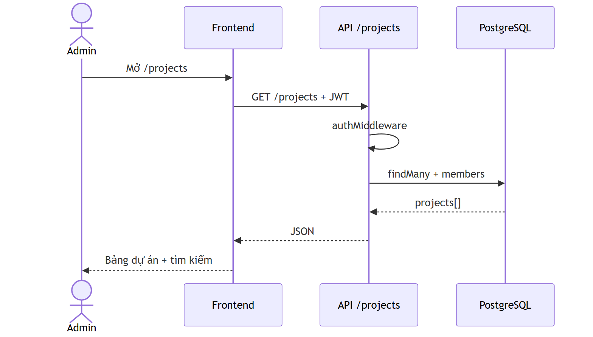

```mermaid
sequenceDiagram
    actor A as Admin
    participant W as Frontend
    participant API as API /projects
    participant DB as PostgreSQL

    A->>W: Mở /projects
    W->>API: GET /projects + JWT
    API->>API: authMiddleware
    API->>DB: findMany + members
    DB-->>API: projects[]
    API-->>W: JSON
    W-->>A: Bảng dự án + tìm kiếm
```

#### Biểu đồ hoạt động — ĐC-09

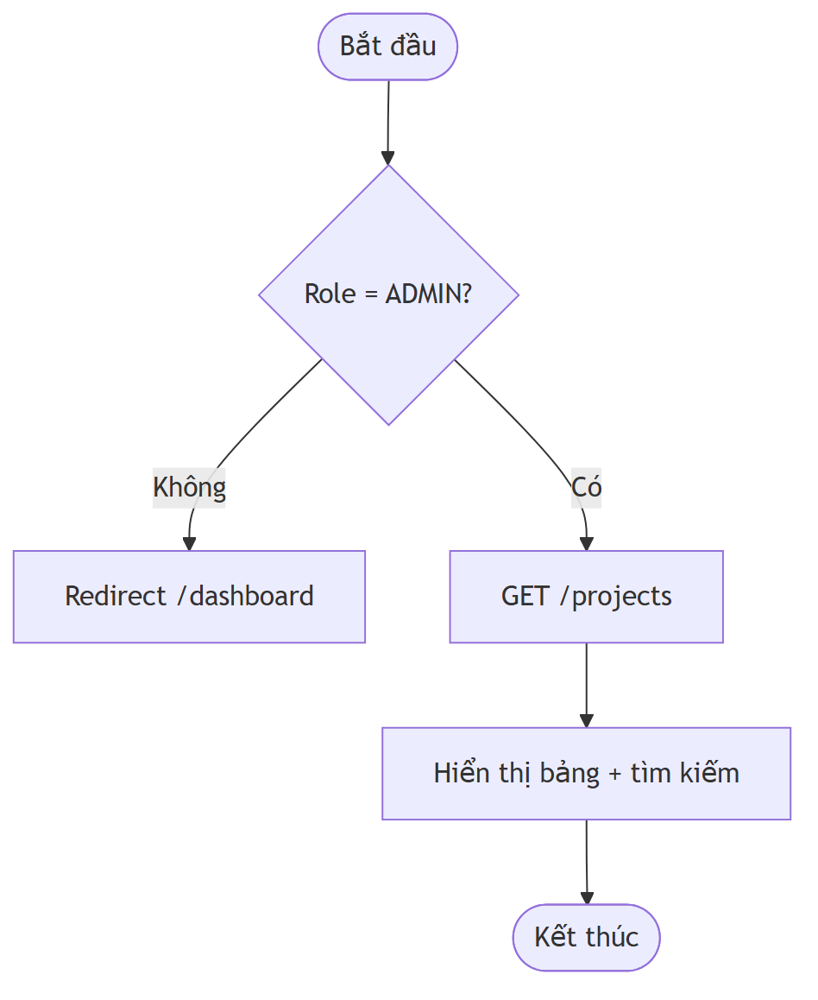

```mermaid
flowchart TD
    A([Bắt đầu]) --> B{Role = ADMIN?}
    B -- Không --> C[Redirect /dashboard]
    B -- Có --> D[GET /projects]
    D --> E[Hiển thị bảng + tìm kiếm]
    E --> F([Kết thúc])
```

---

---

### Bảng 3.12 — ĐC-10: Tạo dự án mới

| Cột | Nội dung |
|-----|----------|
| **Tên Usecase** | Tạo dự án mới |
| **Tác nhân** | Admin |
| **Mục đích** | Tạo không gian làm việc chứa kịch bản, object, dataset |
| **Điều kiện tiên quyết** | Role ADMIN; tên dự án không rỗng |
| **Mô tả chung** | Form tạo project: tên, mô tả, chọn memberIds. Owner là admin đang đăng nhập |
| **Luồng sự kiện** | 1. Admin mở form tạo trên `/projects`. 2. Nhập tên, mô tả, chọn thành viên. 3. Submit → `POST /projects`. 4. API tạo Project, `ownerId = req.user.id`. 5. Tạo ProjectMember cho memberIds (trừ owner trùng). 6. Trả project kèm members. 7. UI cập nhật danh sách |
| **Ngoại lệ** | E1: Tên rỗng → 400. E2: Không đủ quyền → 403 |
| **Các yêu cầu đặc biệt** | Giới hạn tên 255 ký tự, mô tả 2000 ký tự trên UI |

#### Biểu đồ trình tự — ĐC-10

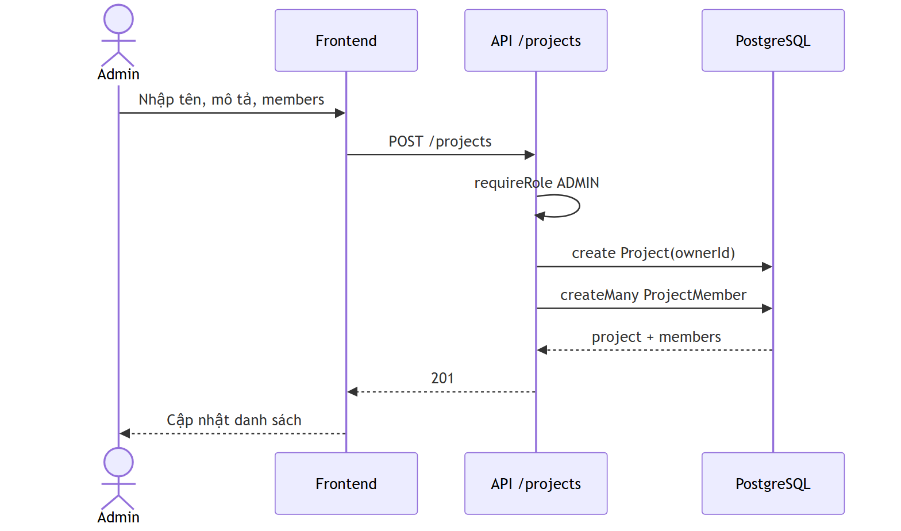

```mermaid
sequenceDiagram
    actor A as Admin
    participant W as Frontend
    participant API as API /projects
    participant DB as PostgreSQL

    A->>W: Nhập tên, mô tả, members
    W->>API: POST /projects
    API->>API: requireRole ADMIN
    API->>DB: create Project(ownerId)
    API->>DB: createMany ProjectMember
    DB-->>API: project + members
    API-->>W: 201
    W-->>A: Cập nhật danh sách
```

#### Biểu đồ hoạt động — ĐC-10

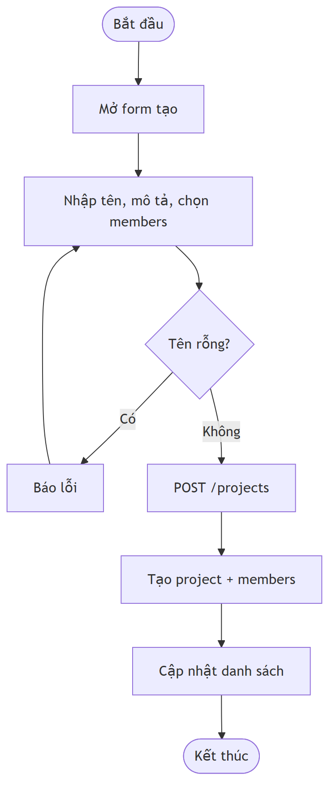

```mermaid
flowchart TD
    A([Bắt đầu]) --> B[Mở form tạo]
    B --> C[Nhập tên, mô tả, chọn members]
    C --> D{Tên rỗng?}
    D -- Có --> E[Báo lỗi]
    E --> C
    D -- Không --> F[POST /projects]
    F --> G[Tạo project + members]
    G --> H[Cập nhật danh sách]
    H --> I([Kết thúc])
```

---

---

### Bảng 3.13 — ĐC-11: Cập nhật dự án và gán thành viên

| Cột | Nội dung |
|-----|----------|
| **Tên Usecase** | Cập nhật dự án và gán thành viên |
| **Tác nhân** | Admin |
| **Mục đích** | Sửa thông tin dự án và đồng bộ danh sách thành viên |
| **Điều kiện tiên quyết** | Project tồn tại; admin có quyền truy cập project |
| **Mô tả chung** | `PUT /projects/:id` cập nhật name/description; nếu có memberIds thì xóa hết member cũ và tạo lại (transaction) |
| **Luồng sự kiện** | 1. Admin chọn **Sửa** trên một project. 2. Sửa tên, mô tả, tick thành viên. 3. Submit → `PUT /projects/:id`. 4. API kiểm tra quyền, cập nhật project. 5. Nếu có memberIds: deleteMany ProjectMember, createMany mới. 6. Trả project đầy đủ. 7. UI đóng form, refresh |
| **Ngoại lệ** | E1: Project không tồn tại → 404. E2: memberId không hợp lệ → lỗi transaction/400 |
| **Các yêu cầu đặc biệt** | Owner không bị loại khỏi project khi sync member |

#### Biểu đồ trình tự — ĐC-11

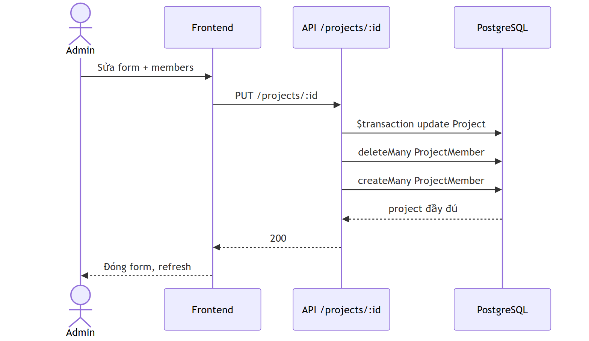

```mermaid
sequenceDiagram
    actor A as Admin
    participant W as Frontend
    participant API as API /projects/:id
    participant DB as PostgreSQL

    A->>W: Sửa form + members
    W->>API: PUT /projects/:id
    API->>DB: $transaction update Project
    API->>DB: deleteMany ProjectMember
    API->>DB: createMany ProjectMember
    DB-->>API: project đầy đủ
    API-->>W: 200
    W-->>A: Đóng form, refresh
```

#### Biểu đồ hoạt động — ĐC-11

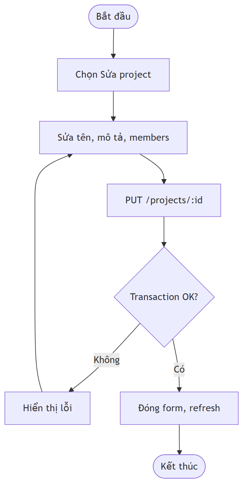

```mermaid
flowchart TD
    A([Bắt đầu]) --> B[Chọn Sửa project]
    B --> C[Sửa tên, mô tả, members]
    C --> D[PUT /projects/:id]
    D --> E{Transaction OK?}
    E -- Không --> F[Hiển thị lỗi]
    F --> C
    E -- Có --> G[Đóng form, refresh]
    G --> H([Kết thúc])
```

---

---

### Bảng 3.14 — ĐC-12: Xóa dự án

| Cột | Nội dung |
|-----|----------|
| **Tên Usecase** | Xóa dự án |
| **Tác nhân** | Admin |
| **Mục đích** | Xóa dự án không còn sử dụng |
| **Điều kiện tiên quyết** | Admin xác nhận xóa trên UI |
| **Mô tả chung** | `DELETE /projects/:id` với kiểm tra quyền truy cập |
| **Luồng sự kiện** | 1. Admin chọn **Xóa**, xác nhận dialog. 2. `DELETE /projects/:id`. 3. API deleteMany theo accessible where. 4. Trả 204. 5. UI loại project khỏi danh sách |
| **Ngoại lệ** | E1: Không tìm thấy/không quyền → không xóa. E2: Ràng buộc FK DB (script/object còn) → lỗi server tùy cấu hình cascade |
| **Các yêu cầu đặc biệt** | Nên cảnh báo dữ liệu con (script, run) trước khi xóa |

#### Biểu đồ trình tự — ĐC-12

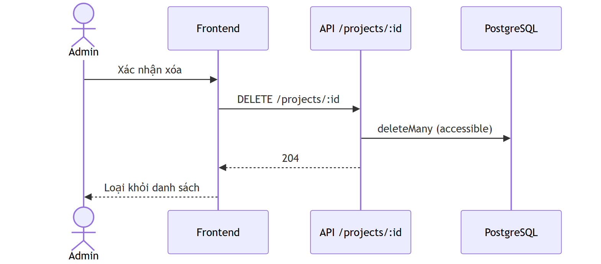

```mermaid
sequenceDiagram
    actor A as Admin
    participant W as Frontend
    participant API as API /projects/:id
    participant DB as PostgreSQL

    A->>W: Xác nhận xóa
    W->>API: DELETE /projects/:id
    API->>DB: deleteMany (accessible)
    API-->>W: 204
    W-->>A: Loại khỏi danh sách
```

#### Biểu đồ hoạt động — ĐC-12

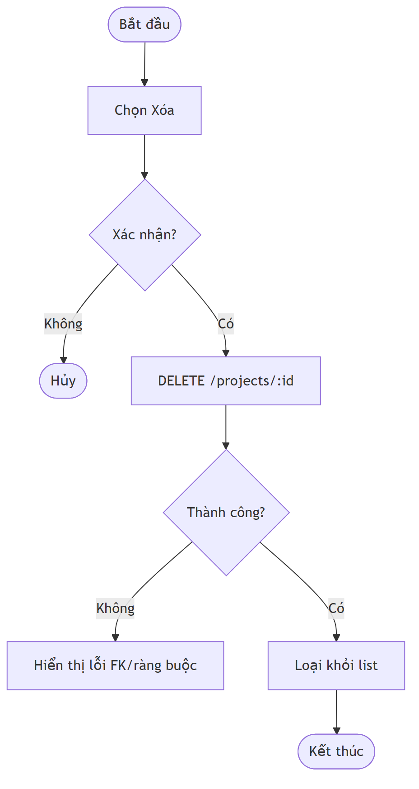

```mermaid
flowchart TD
    A([Bắt đầu]) --> B[Chọn Xóa]
    B --> C{Xác nhận?}
    C -- Không --> D([Hủy])
    C -- Có --> E[DELETE /projects/:id]
    E --> F{Thành công?}
    F -- Không --> G[Hiển thị lỗi FK/ràng buộc]
    F -- Có --> H[Loại khỏi list]
    H --> I([Kết thúc])
```

---

## A.4. Quản lý kịch bản kiểm thử

---

## Nhóm STT 5 — Quản lý kịch bản kiểm thử

| Thuộc tính nhóm | Giá trị |
|-----------------|--------|
| **Mã use case** | ĐC-13 → ĐC-18 |
| **Số use case** | 6 |
| **Bảng đặc tả** | Bảng 3.15 – 3.20 (chi tiết: `11`) |
| **Màn hình** | /scripts, /scripts/[id] |
| **Biểu đồ trình tự** | Hình 3.5.5a — file `16`, STT 5 |
| **Biểu đồ hoạt động** | Hình 3.5.5b — file `16`, STT 5 |

### Danh sách use case trong nhóm

| Mã | Tên use case | Bảng |
|----|--------------|------|
| ĐC-13 | Xem danh sách kịch bản theo dự án | Bảng 3.15 |
| ĐC-14 | Tạo kịch bản mới | Bảng 3.16 |
| ĐC-15 | Xóa kịch bản | Bảng 3.17 |
| ĐC-16 | Xem chi tiết kịch bản | Bảng 3.18 |
| ĐC-17 | Thêm / sửa / xóa / sắp xếp bước kiểm thử | Bảng 3.19 |
| ĐC-18 | Lưu danh sách bước lên server | Bảng 3.20 |

### Biểu đồ trình tự (Sequence) — 3.5.5a

> **Hình 3.5.5a** — Quản lý kịch bản kiểm thử

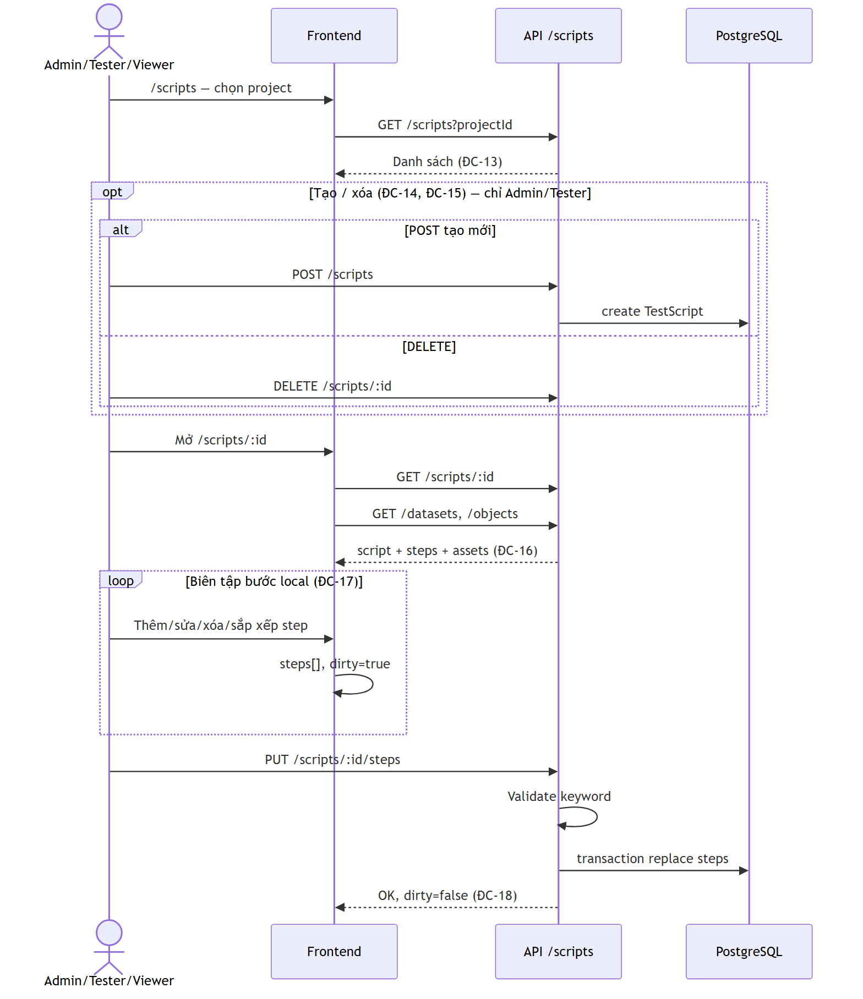

```mermaid
sequenceDiagram
    actor U as Admin/Tester/Viewer
    participant W as Frontend
    participant API as API /scripts
    participant DB as PostgreSQL

    U->>W: /scripts — chọn project
    W->>API: GET /scripts?projectId
    API-->>W: Danh sách (ĐC-13)

    opt Tạo / xóa (ĐC-14, ĐC-15) — chỉ Admin/Tester
        alt POST tạo mới
            U->>API: POST /scripts
            API->>DB: create TestScript
        else DELETE
            U->>API: DELETE /scripts/:id
        end
    end

    U->>W: Mở /scripts/:id
    W->>API: GET /scripts/:id
    W->>API: GET /datasets, /objects
    API-->>W: script + steps + assets (ĐC-16)

    loop Biên tập bước local (ĐC-17)
        U->>W: Thêm/sửa/xóa/sắp xếp step
        W->>W: steps[], dirty=true
    end

    U->>API: PUT /scripts/:id/steps
    API->>API: Validate keyword
    API->>DB: transaction replace steps
    API-->>W: OK, dirty=false (ĐC-18)
```

### Biểu đồ hoạt động (Activity) — 3.5.5b

> **Hình 3.5.5b** — Quản lý kịch bản kiểm thử

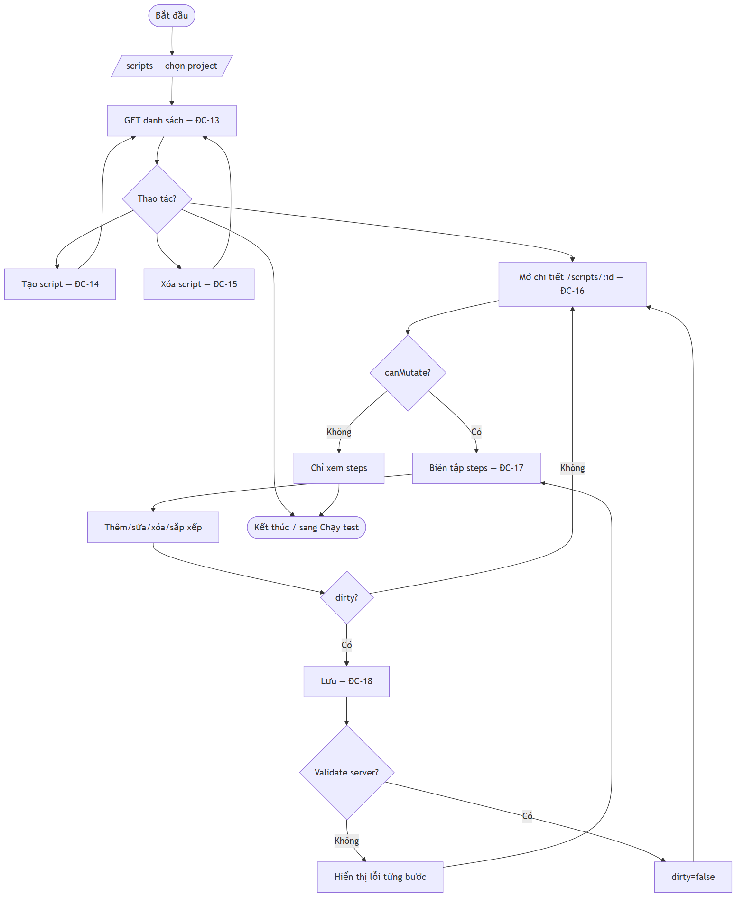

```mermaid
flowchart TD
    A([Bắt đầu]) --> B[/scripts — chọn project/]
    B --> C[GET danh sách — ĐC-13]
    C --> D{Thao tác?}

    D --> E[Tạo script — ĐC-14]
    E --> C

    D --> F[Xóa script — ĐC-15]
    F --> C

    D --> G[Mở chi tiết /scripts/:id — ĐC-16]
    G --> H{canMutate?}
    H -- Không --> I[Chỉ xem steps]
    H -- Có --> J[Biên tập steps — ĐC-17]
    J --> J1[Thêm/sửa/xóa/sắp xếp]
    J1 --> J2{dirty?}
    J2 -- Có --> K[Lưu — ĐC-18]
    K --> K1{Validate server?}
    K1 -- Không --> L[Hiển thị lỗi từng bước]
    L --> J
    K1 -- Có --> M[dirty=false]
    M --> G
    J2 -- Không --> G

    D --> N([Kết thúc / sang Chạy test])
    I --> N
```

### Đặc tả chi tiết (8 cột)

### Bảng 3.15 — ĐC-13: Xem danh sách kịch bản theo dự án

| Cột | Nội dung |
|-----|----------|
| **Tên Usecase** | Xem danh sách kịch bản theo dự án |
| **Tác nhân** | Admin, Tester, Viewer |
| **Mục đích** | Tra cứu kịch bản thuộc project user được phép |
| **Điều kiện tiên quyết** | Đã đăng nhập; có ít nhất một project accessible |
| **Mô tả chung** | `/scripts` lọc theo projectId query, hiển thị tên, mô tả, project |
| **Luồng sự kiện** | 1. Mở `/scripts`. 2. Chọn project (dropdown). 3. `GET /scripts?projectId=`. 4. Backend lọc script thuộc project accessible. 5. Hiển thị danh sách, link tới chi tiết |
| **Ngoại lệ** | E1: Project không accessible → danh sách rỗng hoặc 403 |
| **Các yêu cầu đặc biệt** | Viewer chỉ xem, không nút tạo/xóa |

#### Biểu đồ trình tự — ĐC-13

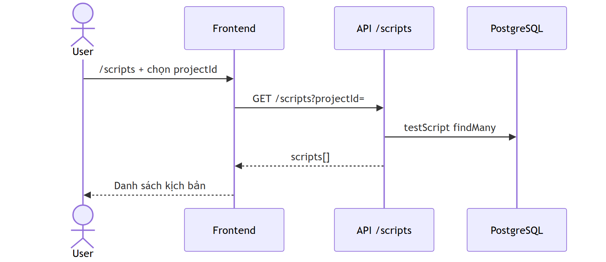

```mermaid
sequenceDiagram
    actor U as User
    participant W as Frontend
    participant API as API /scripts
    participant DB as PostgreSQL

    U->>W: /scripts + chọn projectId
    W->>API: GET /scripts?projectId=
    API->>DB: testScript findMany
    API-->>W: scripts[]
    W-->>U: Danh sách kịch bản
```

#### Biểu đồ hoạt động — ĐC-13

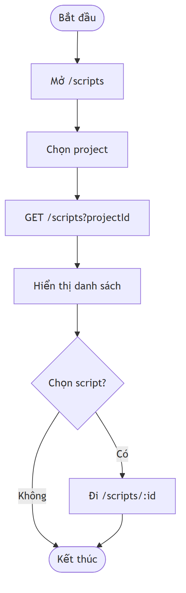

```mermaid
flowchart TD
    A([Bắt đầu]) --> B[Mở /scripts]
    B --> C[Chọn project]
    C --> D[GET /scripts?projectId]
    D --> E[Hiển thị danh sách]
    E --> F{Chọn script?}
    F -- Có --> G[Đi /scripts/:id]
    F -- Không --> H([Kết thúc])
    G --> H
```

---

---

### Bảng 3.16 — ĐC-14: Tạo kịch bản mới

| Cột | Nội dung |
|-----|----------|
| **Tên Usecase** | Tạo kịch bản mới |
| **Tác nhân** | Admin, Tester |
| **Mục đích** | Khởi tạo TestScript rỗng để thiết kế bước |
| **Điều kiện tiên quyết** | Role ADMIN hoặc TESTER; projectId hợp lệ và accessible |
| **Mô tả chung** | Tạo script với name, description, projectId, createdById |
| **Luồng sự kiện** | 1. Trên `/scripts`, chọn project, nhập tên/mô tả. 2. Submit → `POST /scripts`. 3. API kiểm tra quyền project. 4. Tạo TestScript. 5. Trả 201. 6. UI refresh hoặc chuyển `/scripts/:id` |
| **Ngoại lệ** | E1: Thiếu tên → 400. E2: Không quyền project → 403 |
| **Các yêu cầu đặc biệt** | Viewer không được tạo |

#### Biểu đồ trình tự — ĐC-14

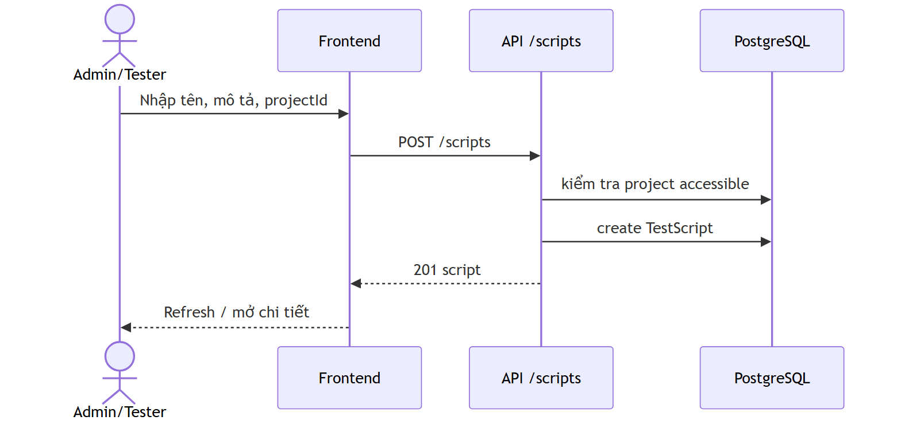

```mermaid
sequenceDiagram
    actor U as Admin/Tester
    participant W as Frontend
    participant API as API /scripts
    participant DB as PostgreSQL

    U->>W: Nhập tên, mô tả, projectId
    W->>API: POST /scripts
    API->>DB: kiểm tra project accessible
    API->>DB: create TestScript
    API-->>W: 201 script
    W-->>U: Refresh / mở chi tiết
```

#### Biểu đồ hoạt động — ĐC-14

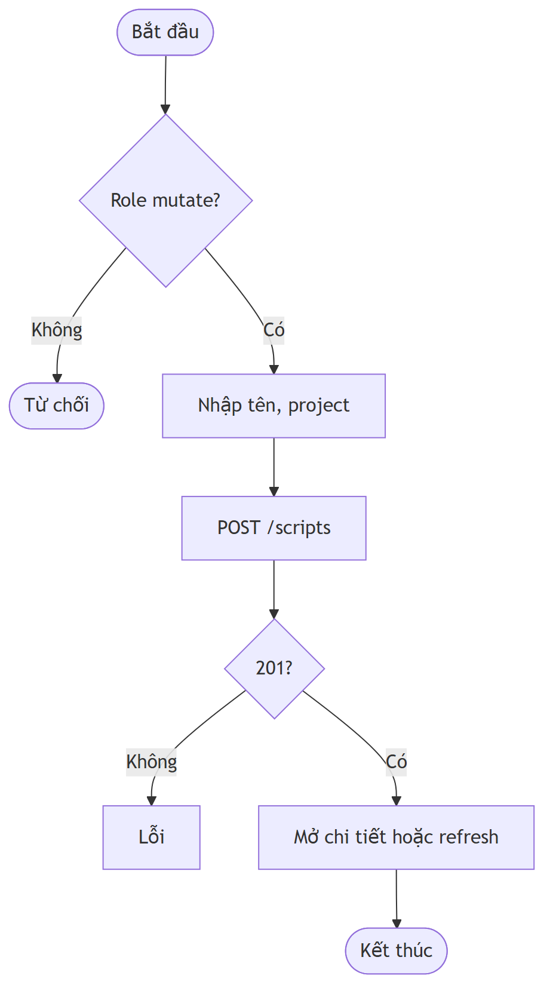

```mermaid
flowchart TD
    A([Bắt đầu]) --> B{Role mutate?}
    B -- Không --> C([Từ chối])
    B -- Có --> D[Nhập tên, project]
    D --> E[POST /scripts]
    E --> F{201?}
    F -- Không --> G[Lỗi]
    F -- Có --> H[Mở chi tiết hoặc refresh]
    H --> I([Kết thúc])
```

---

---

### Bảng 3.17 — ĐC-15: Xóa kịch bản

| Cột | Nội dung |
|-----|----------|
| **Tên Usecase** | Xóa kịch bản |
| **Tác nhân** | Admin, Tester |
| **Mục đích** | Loại bỏ kịch bản không dùng |
| **Điều kiện tiên quyết** | Script thuộc project accessible; user có quyền mutate |
| **Mô tả chung** | `DELETE /scripts/:id` |
| **Luồng sự kiện** | 1. Chọn xóa trên danh sách. 2. Xác nhận. 3. `DELETE /scripts/:id`. 4. 204. 5. Cập nhật UI |
| **Ngoại lệ** | E1: Script không tồn tại → 404. E2: Còn TestRun liên quan → có thể lỗi FK tùy DB |
| **Các yêu cầu đặc biệt** | Cảnh báo nếu script đã có lịch sử chạy |

#### Biểu đồ trình tự — ĐC-15

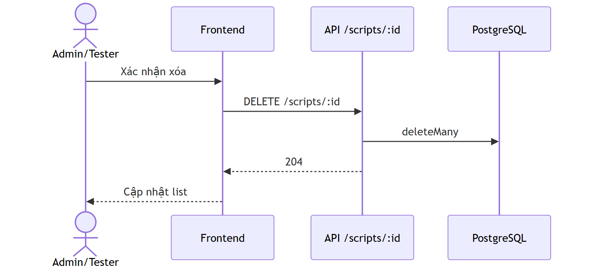

```mermaid
sequenceDiagram
    actor U as Admin/Tester
    participant W as Frontend
    participant API as API /scripts/:id
    participant DB as PostgreSQL

    U->>W: Xác nhận xóa
    W->>API: DELETE /scripts/:id
    API->>DB: deleteMany
    API-->>W: 204
    W-->>U: Cập nhật list
```

#### Biểu đồ hoạt động — ĐC-15

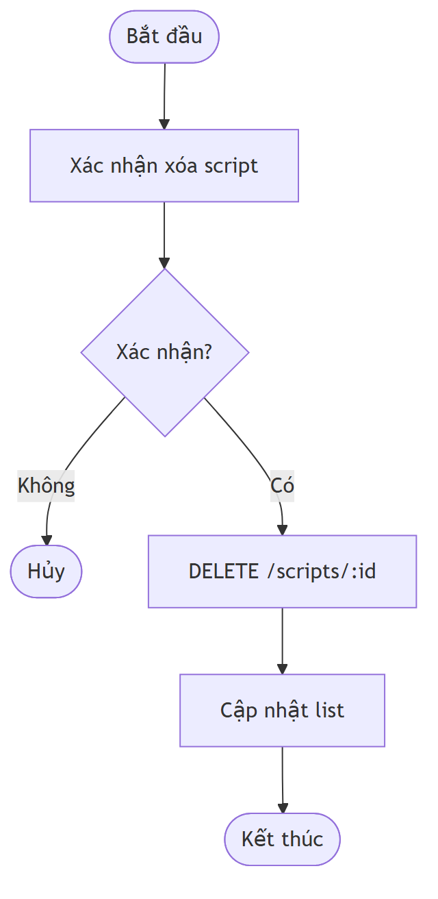

```mermaid
flowchart TD
    A([Bắt đầu]) --> B[Xác nhận xóa script]
    B --> C{Xác nhận?}
    C -- Không --> D([Hủy])
    C -- Có --> E[DELETE /scripts/:id]
    E --> F[Cập nhật list]
    F --> G([Kết thúc])
```

---

---

### Bảng 3.18 — ĐC-16: Xem chi tiết kịch bản

| Cột | Nội dung |
|-----|----------|
| **Tên Usecase** | Xem chi tiết kịch bản |
| **Tác nhân** | Admin, Tester, Viewer |
| **Mục đích** | Xem metadata và danh sách bước kiểm thử |
| **Điều kiện tiên quyết** | Script id hợp lệ; quyền truy cập project |
| **Mô tả chung** | `/scripts/[id]` tải script + steps, datasets và ui objects của project |
| **Luồng sự kiện** | 1. Mở `/scripts/:id`. 2. `GET /scripts/:id`. 3. `GET /datasets?projectId=`, `GET /objects?projectId=`. 4. Hiển thị timeline steps, form chạy test |
| **Ngoại lệ** | E1: 404 script. E2: 401/403 |
| **Các yêu cầu đặc biệt** | Viewer ẩn nút sửa/lưu/chạy |

#### Biểu đồ trình tự — ĐC-16

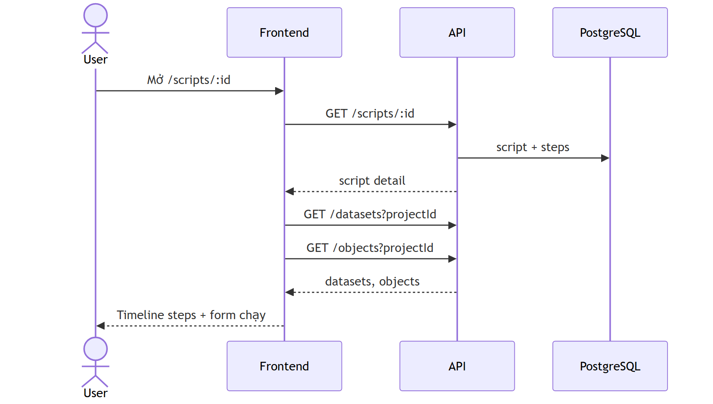

```mermaid
sequenceDiagram
    actor U as User
    participant W as Frontend
    participant API as API
    participant DB as PostgreSQL

    U->>W: Mở /scripts/:id
    W->>API: GET /scripts/:id
    API->>DB: script + steps
    API-->>W: script detail
    W->>API: GET /datasets?projectId
    W->>API: GET /objects?projectId
    API-->>W: datasets, objects
    W-->>U: Timeline steps + form chạy
```

#### Biểu đồ hoạt động — ĐC-16

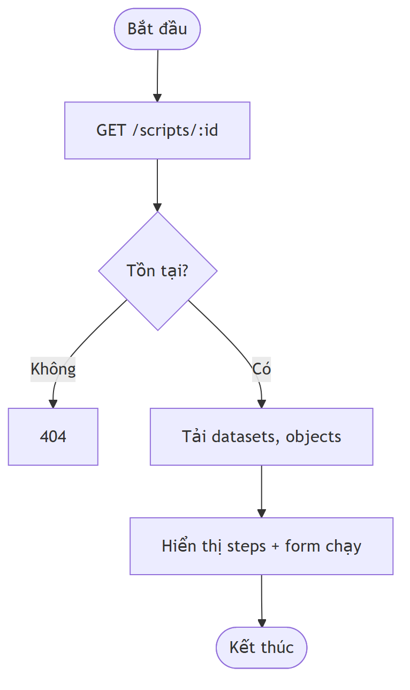

```mermaid
flowchart TD
    A([Bắt đầu]) --> B[GET /scripts/:id]
    B --> C{Tồn tại?}
    C -- Không --> D[404]
    C -- Có --> E[Tải datasets, objects]
    E --> F[Hiển thị steps + form chạy]
    F --> G([Kết thúc])
```

---

---

### Bảng 3.19 — ĐC-17: Thêm / sửa / xóa / sắp xếp bước kiểm thử

| Cột | Nội dung |
|-----|----------|
| **Tên Usecase** | Biên tập bước kiểm thử trên giao diện |
| **Tác nhân** | Admin, Tester |
| **Mục đích** | Thiết kế luồng test bằng keyword no-code |
| **Điều kiện tiên quyết** | Đang xem chi tiết script; role mutate |
| **Mô tả chung** | Hỗ trợ keyword: navigate, click, fill, assertText. State `dirty` trên FE cho đến khi lưu |
| **Luồng sự kiện** | 1. Chọn keyword trên card. 2. Nhập tham số (url, selector, value, expected, dataKey, timeout). 3. Có thể chọn UiObject để điền selector. 4. Thêm bước / sửa bước / xóa / move up-down. 5. Đánh dấu dirty=true |
| **Ngoại lệ** | E1: Keyword navigate thiếu url → chặn khi lưu. E2: fill thiếu value và dataKey → chặt khi lưu |
| **Các yêu cầu đặc biệt** | timeoutMs 1000–180000 ms; semantic label cho selector dạng text thuần |

#### Biểu đồ trình tự — ĐC-17

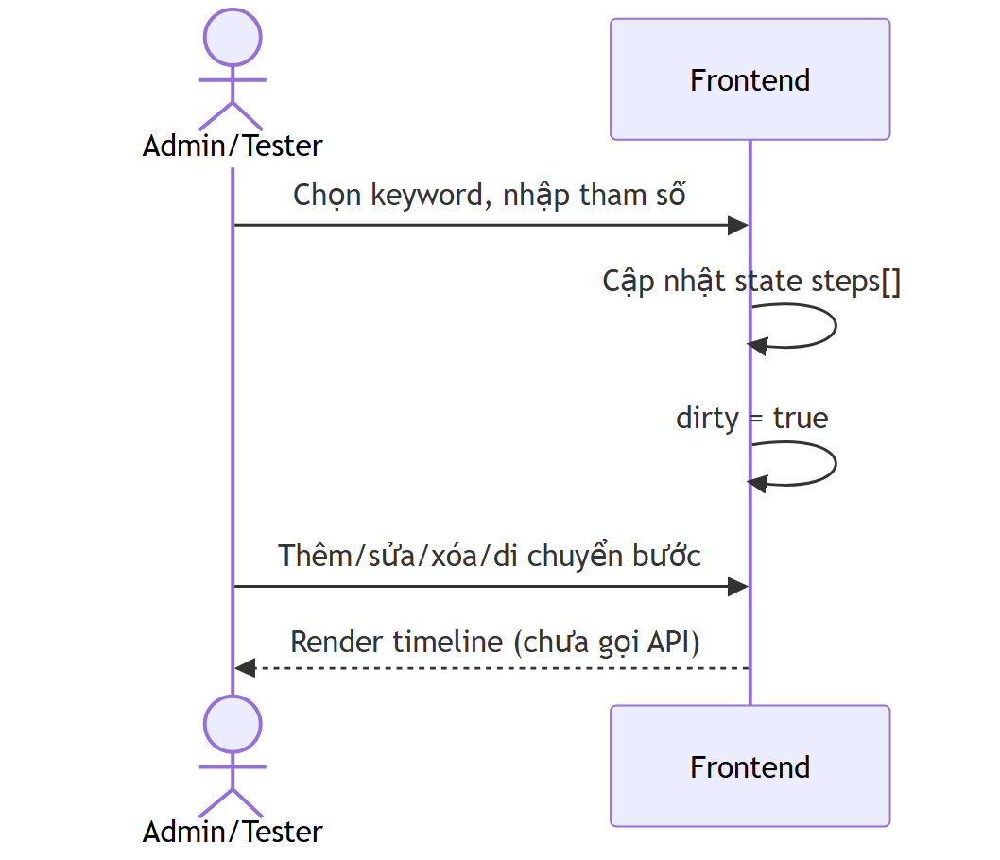

```mermaid
sequenceDiagram
    actor U as Admin/Tester
    participant W as Frontend

    U->>W: Chọn keyword, nhập tham số
    W->>W: Cập nhật state steps[]
    W->>W: dirty = true
    U->>W: Thêm/sửa/xóa/di chuyển bước
    W-->>U: Render timeline (chưa gọi API)
```

#### Biểu đồ hoạt động — ĐC-17

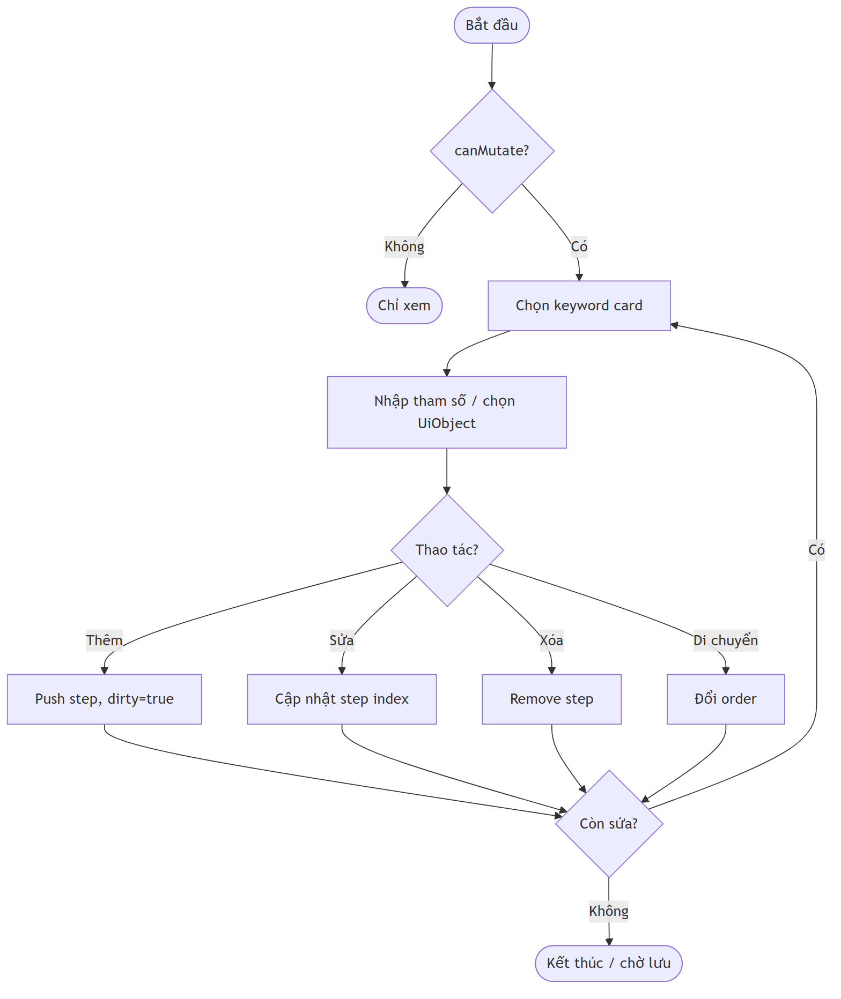

```mermaid
flowchart TD
    A([Bắt đầu]) --> B{canMutate?}
    B -- Không --> C([Chỉ xem])
    B -- Có --> D[Chọn keyword card]
    D --> E[Nhập tham số / chọn UiObject]
    E --> F{Thao tác?}
    F -- Thêm --> G[Push step, dirty=true]
    F -- Sửa --> H[Cập nhật step index]
    F -- Xóa --> I[Remove step]
    F -- Di chuyển --> J[Đổi order]
    G --> K{Còn sửa?}
    H --> K
    I --> K
    J --> K
    K -- Có --> D
    K -- Không --> L([Kết thúc / chờ lưu])
```

---

---

### Bảng 3.20 — ĐC-18: Lưu danh sách bước lên server

| Cột | Nội dung |
|-----|----------|
| **Tên Usecase** | Lưu danh sách bước kiểm thử |
| **Tác nhân** | Admin, Tester |
| **Mục đích** | Persist toàn bộ steps sau khi biên tập |
| **Điều kiện tiên quyết** | Có thay đổi dirty; steps hợp lệ theo rule API |
| **Mô tả chung** | `PUT /scripts/:id/steps` thay thế toàn bộ steps (delete + createMany trong transaction) |
| **Luồng sự kiện** | 1. Nhấn **Lưu bước**. 2. Gửi mảng steps (order, keyword, targetId, parameters). 3. API validate từng keyword. 4. Transaction xóa steps cũ, tạo mới. 5. Trả script kèm steps. 6. dirty=false |
| **Ngoại lệ** | E1: Validation lỗi → 400 + danh sách lỗi từng bước. E2: Script không tồn tại → 404 |
| **Các yêu cầu đặc biệt** | Lưu atomically; order 0-based trên DB, hiển thị Bước 1,2,... trên UI |

#### Biểu đồ trình tự — ĐC-18

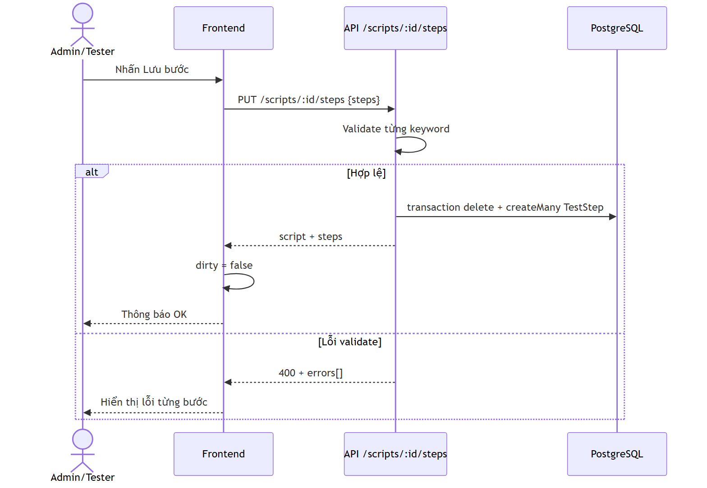

```mermaid
sequenceDiagram
    actor U as Admin/Tester
    participant W as Frontend
    participant API as API /scripts/:id/steps
    participant DB as PostgreSQL

    U->>W: Nhấn Lưu bước
    W->>API: PUT /scripts/:id/steps {steps}
    API->>API: Validate từng keyword
    alt Hợp lệ
        API->>DB: transaction delete + createMany TestStep
        API-->>W: script + steps
        W->>W: dirty = false
        W-->>U: Thông báo OK
    else Lỗi validate
        API-->>W: 400 + errors[]
        W-->>U: Hiển thị lỗi từng bước
    end
```

#### Biểu đồ hoạt động — ĐC-18

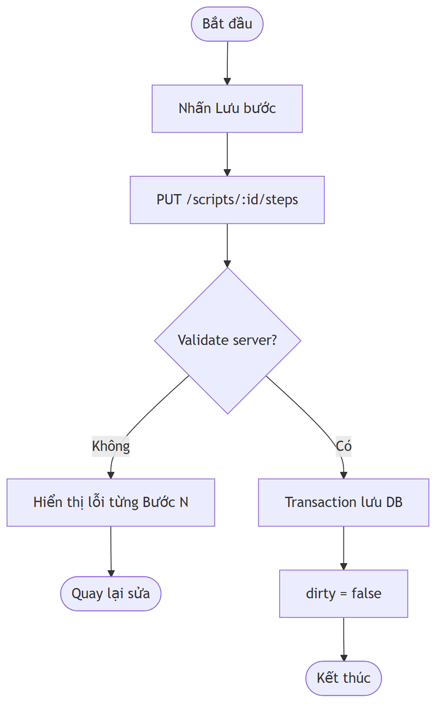

```mermaid
flowchart TD
    A([Bắt đầu]) --> B[Nhấn Lưu bước]
    B --> C[PUT /scripts/:id/steps]
    C --> D{Validate server?}
    D -- Không --> E[Hiển thị lỗi từng Bước N]
    E --> F([Quay lại sửa])
    D -- Có --> G[Transaction lưu DB]
    G --> H[dirty = false]
    H --> I([Kết thúc])
```

---

---

## Nhóm STT 6 — Thực thi kịch bản

| Thuộc tính nhóm | Giá trị |
|-----------------|--------|
| **Mã use case** | ĐC-19 |
| **Số use case** | 1 |
| **Bảng đặc tả** | Bảng 3.21 – 3.21 (chi tiết: `11`) |
| **Màn hình** | /scripts/[id] |
| **Biểu đồ trình tự** | Hình 3.5.6a — file `16`, STT 6 |
| **Biểu đồ hoạt động** | Hình 3.5.6b — file `16`, STT 6 |

### Danh sách use case trong nhóm

| Mã | Tên use case | Bảng |
|----|--------------|------|
| ĐC-19 | Chạy kịch bản kiểm thử | Bảng 3.21 |

### Biểu đồ trình tự (Sequence) — 3.5.6a

> **Hình 3.5.6a** — Thực thi kịch bản

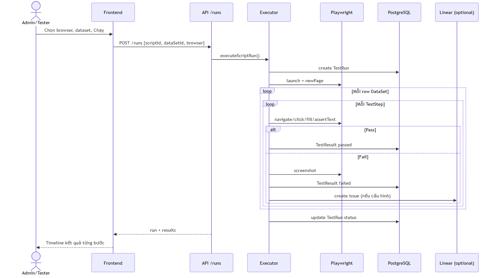

```mermaid
sequenceDiagram
    actor U as Admin/Tester
    participant W as Frontend
    participant API as API /runs
    participant EX as Executor
    participant PW as Playwright
    participant DB as PostgreSQL
    participant L as Linear (optional)

    U->>W: Chọn browser, dataset, Chạy
    W->>API: POST /runs {scriptId, dataSetId, browser}
    API->>EX: executeScriptRun()
    EX->>DB: create TestRun
    EX->>PW: launch + newPage
    loop Mỗi row DataSet
        loop Mỗi TestStep
            EX->>PW: navigate/click/fill/assertText
            alt Pass
                EX->>DB: TestResult passed
            else Fail
                EX->>PW: screenshot
                EX->>DB: TestResult failed
                EX->>L: create issue (nếu cấu hình)
            end
        end
    end
    EX->>DB: update TestRun status
    API-->>W: run + results
    W-->>U: Timeline kết quả từng bước
```

### Biểu đồ hoạt động (Activity) — 3.5.6b

> **Hình 3.5.6b** — Thực thi kịch bản

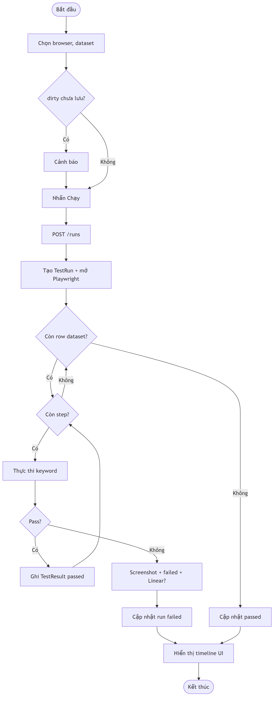

```mermaid
flowchart TD
    A([Bắt đầu]) --> B[Chọn browser, dataset]
    B --> C{dirty chưa lưu?}
    C -- Có --> D[Cảnh báo]
    D --> E[Nhấn Chạy]
    C -- Không --> E
    E --> F[POST /runs]
    F --> G[Tạo TestRun + mở Playwright]
    G --> H{Còn row dataset?}
    H -- Không --> O[Cập nhật passed]
    H -- Có --> I{Còn step?}
    I -- Không --> H
    I -- Có --> J[Thực thi keyword]
    J --> K{Pass?}
    K -- Có --> L[Ghi TestResult passed]
    L --> I
    K -- Không --> M[Screenshot + failed + Linear?]
    M --> N[Cập nhật run failed]
    N --> P[Hiển thị timeline UI]
    O --> P
    P --> Q([Kết thúc])
```

### Đặc tả chi tiết (8 cột)

### Bảng 3.21 — ĐC-19: Chạy kịch bản kiểm thử

| Cột | Nội dung |
|-----|----------|
| **Tên Usecase** | Chạy kịch bản kiểm thử |
| **Tác nhân** | Admin, Tester |
| **Mục đích** | Thực thi tự động script trên Playwright và ghi kết quả |
| **Điều kiện tiên quyết** | Script có ít nhất một bước hợp lệ; đã lưu thay đổi (khuyến nghị) |
| **Mô tả chung** | Chọn browser (chromium/firefox/webkit) và dataset tuỳ chọn. `POST /runs` → executor |
| **Luồng sự kiện** | 1. Chọn dataset (optional), browser. 2. Nhấn **Chạy**. 3. `POST /runs` {scriptId, dataSetId?, browser}. 4. API kiểm tra script & dataset cùng project. 5. Executor tạo TestRun, mở browser, lặp rows dataset, chạy từng step. 6. Ghi TestResult pass/fail; fail → screenshot + Linear issue (nếu cấu hình). 7. Cập nhật TestRun status. 8. UI hiển thị timeline kết quả từng bước |
| **Ngoại lệ** | E1: Dataset không cùng project → 400. E2: Step fail → run failed, dừng bước hiện tại. E3: Selector không tìm thấy → message lỗi Playwright |
| **Các yêu cầu đặc biệt** | Data-driven: lặp từng row; chặn image/font/media để tăng tốc; tạo Linear issue không làm fail luồng chính |

#### Biểu đồ trình tự — ĐC-19

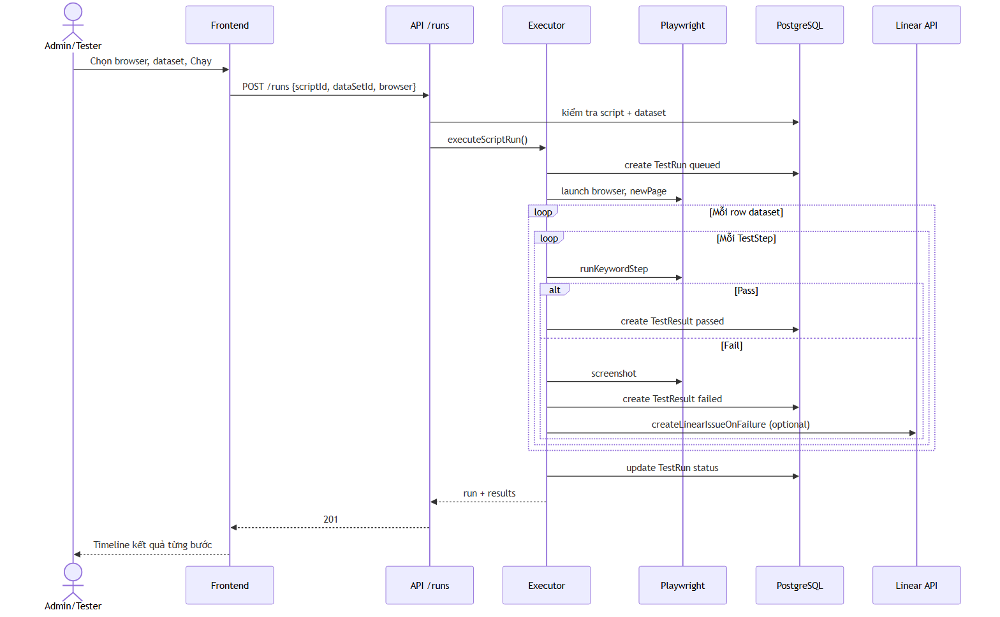

```mermaid
sequenceDiagram
    actor U as Admin/Tester
    participant W as Frontend
    participant API as API /runs
    participant EX as Executor
    participant PW as Playwright
    participant DB as PostgreSQL
    participant L as Linear API

    U->>W: Chọn browser, dataset, Chạy
    W->>API: POST /runs {scriptId, dataSetId, browser}
    API->>DB: kiểm tra script + dataset
    API->>EX: executeScriptRun()
    EX->>DB: create TestRun queued
    EX->>PW: launch browser, newPage
    loop Mỗi row dataset
        loop Mỗi TestStep
            EX->>PW: runKeywordStep
            alt Pass
                EX->>DB: create TestResult passed
            else Fail
                EX->>PW: screenshot
                EX->>DB: create TestResult failed
                EX->>L: createLinearIssueOnFailure (optional)
            end
        end
    end
    EX->>DB: update TestRun status
    EX-->>API: run + results
    API-->>W: 201
    W-->>U: Timeline kết quả từng bước
```

#### Biểu đồ hoạt động — ĐC-19

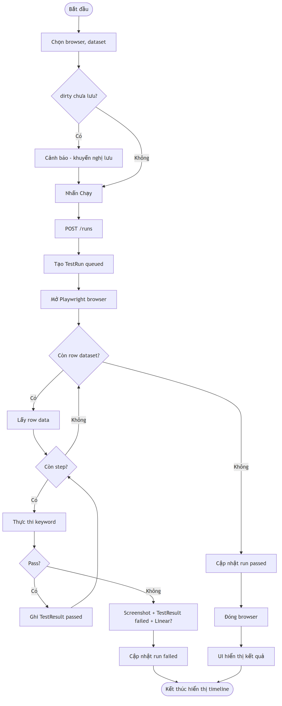

```mermaid
flowchart TD
    A([Bắt đầu]) --> B[Chọn browser, dataset]
    B --> C{dirty chưa lưu?}
    C -- Có --> D[Cảnh báo - khuyến nghị lưu]
    D --> E[Nhấn Chạy]
    C -- Không --> E
    E --> F[POST /runs]
    F --> G[Tạo TestRun queued]
    G --> H[Mở Playwright browser]
    H --> I{Còn row dataset?}
    I -- Không --> P[Cập nhật run passed]
    I -- Có --> J[Lấy row data]
    J --> K{Còn step?}
    K -- Không --> I
    K -- Có --> L[Thực thi keyword]
    L --> M{Pass?}
    M -- Có --> N[Ghi TestResult passed]
    N --> K
    M -- Không --> O[Screenshot + TestResult failed + Linear?]
    O --> Q[Cập nhật run failed]
    Q --> R([Kết thúc hiển thị timeline])
    P --> S[Đóng browser]
    S --> T[UI hiển thị kết quả]
    T --> R
```

---

## A.5. Đối tượng UI

---

## Nhóm STT 7 — Quản lý đối tượng UI

| Thuộc tính nhóm | Giá trị |
|-----------------|--------|
| **Mã use case** | ĐC-20 → ĐC-23 |
| **Số use case** | 4 |
| **Bảng đặc tả** | Bảng 3.22 – 3.25 (chi tiết: `11`) |
| **Màn hình** | /objects |
| **Biểu đồ trình tự** | Hình 3.5.7a — file `16`, STT 7 |
| **Biểu đồ hoạt động** | Hình 3.5.7b — file `16`, STT 7 |

### Danh sách use case trong nhóm

| Mã | Tên use case | Bảng |
|----|--------------|------|
| ĐC-20 | Xem danh sách đối tượng UI | Bảng 3.22 |
| ĐC-21 | Thêm đối tượng UI | Bảng 3.23 |
| ĐC-22 | Sửa đối tượng UI | Bảng 3.24 |
| ĐC-23 | Xóa đối tượng UI | Bảng 3.25 |

### Biểu đồ trình tự (Sequence) — 3.5.7a

> **Hình 3.5.7a** — Quản lý đối tượng UI

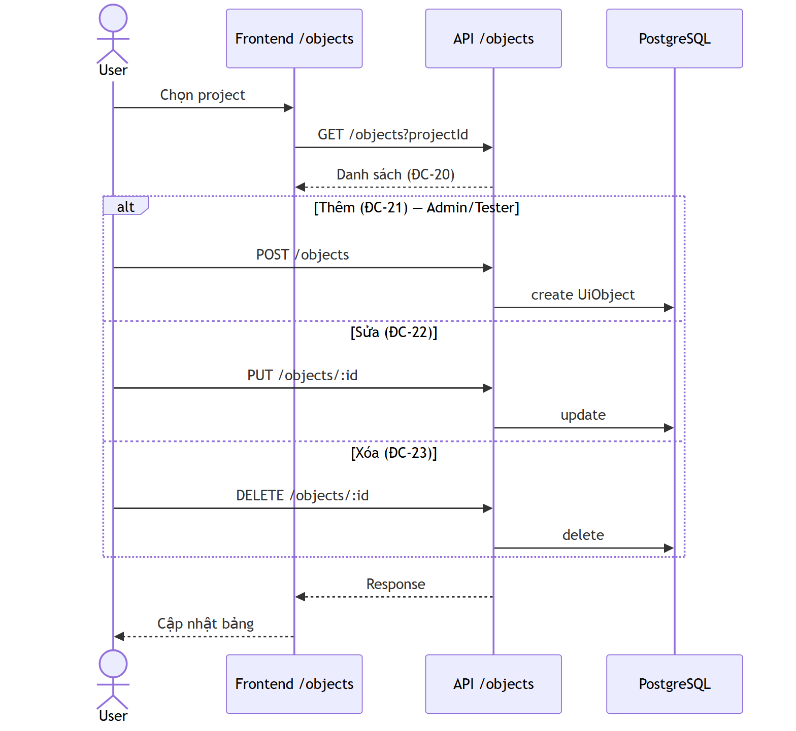

```mermaid
sequenceDiagram
    actor U as User
    participant W as Frontend /objects
    participant API as API /objects
    participant DB as PostgreSQL

    U->>W: Chọn project
    W->>API: GET /objects?projectId
    API-->>W: Danh sách (ĐC-20)

    alt Thêm (ĐC-21) — Admin/Tester
        U->>API: POST /objects
        API->>DB: create UiObject
    else Sửa (ĐC-22)
        U->>API: PUT /objects/:id
        API->>DB: update
    else Xóa (ĐC-23)
        U->>API: DELETE /objects/:id
        API->>DB: delete
    end
    API-->>W: Response
    W-->>U: Cập nhật bảng
```

### Biểu đồ hoạt động (Activity) — 3.5.7b

> **Hình 3.5.7b** — Quản lý đối tượng UI

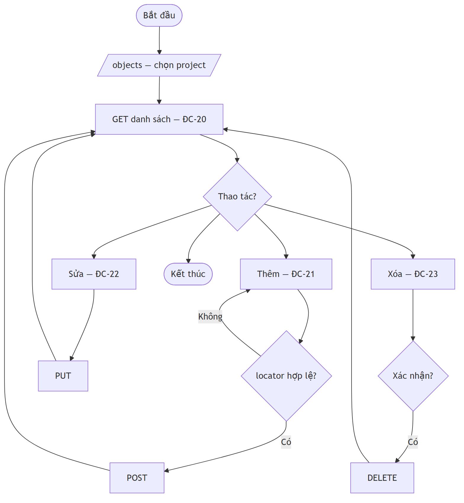

```mermaid
flowchart TD
    A([Bắt đầu]) --> B[/objects — chọn project/]
    B --> C[GET danh sách — ĐC-20]
    C --> D{Thao tác?}

    D --> E[Thêm — ĐC-21]
    E --> E1{locator hợp lệ?}
    E1 -- Không --> E
    E1 -- Có --> E2[POST]
    E2 --> C

    D --> F[Sửa — ĐC-22]
    F --> F1[PUT]
    F1 --> C

    D --> G[Xóa — ĐC-23]
    G --> G1{Xác nhận?}
    G1 -- Có --> G2[DELETE]
    G2 --> C

    D --> H([Kết thúc])
```

### Đặc tả chi tiết (8 cột)

### Bảng 3.22 — ĐC-20: Xem danh sách đối tượng UI

| Cột | Nội dung |
|-----|----------|
| **Tên Usecase** | Xem danh sách đối tượng UI |
| **Tác nhân** | Admin, Tester, Viewer |
| **Mục đích** | Tra cứu object repository theo project |
| **Điều kiện tiên quyết** | Đăng nhập; chọn project accessible |
| **Mô tả chung** | `/objects` — `GET /objects?projectId=` |
| **Luồng sự kiện** | 1. Mở `/objects`. 2. Chọn project. 3. Gọi API. 4. Hiển thị name, locator, mô tả |
| **Ngoại lệ** | E1: Project không accessible → 403 |
| **Các yêu cầu đặc biệt** | Sắp xếp createdAt desc |

#### Biểu đồ trình tự — ĐC-20

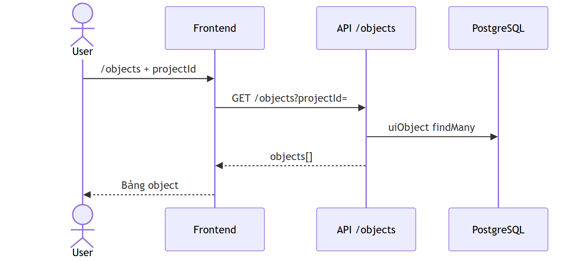

```mermaid
sequenceDiagram
    actor U as User
    participant W as Frontend
    participant API as API /objects
    participant DB as PostgreSQL

    U->>W: /objects + projectId
    W->>API: GET /objects?projectId=
    API->>DB: uiObject findMany
    API-->>W: objects[]
    W-->>U: Bảng object
```

#### Biểu đồ hoạt động — ĐC-20

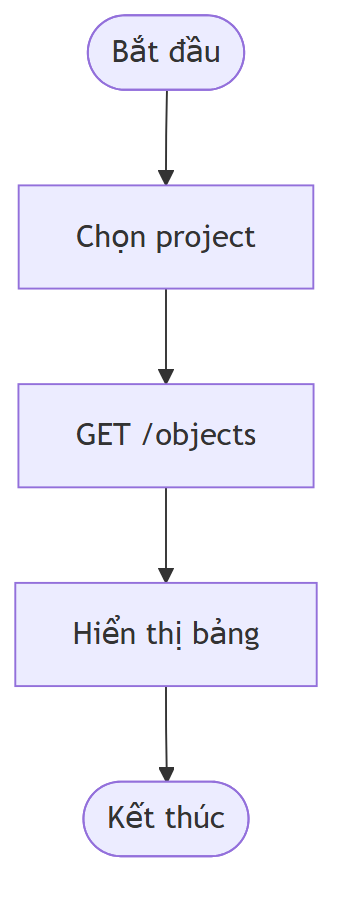

```mermaid
flowchart TD
    A([Bắt đầu]) --> B[Chọn project]
    B --> C[GET /objects]
    C --> D[Hiển thị bảng]
    D --> E([Kết thúc])
```

---

---

### Bảng 3.23 — ĐC-21: Thêm đối tượng UI

| Cột | Nội dung |
|-----|----------|
| **Tên Usecase** | Thêm đối tượng UI |
| **Tác nhân** | Admin, Tester |
| **Mục đích** | Lưu locator tái sử dụng cho nhiều kịch bản |
| **Điều kiện tiên quyết** | name và locator không rỗng |
| **Mô tả chung** | `POST /objects` {projectId, name, description?, locator} |
| **Luồng sự kiện** | 1. Nhập form trên `/objects`. 2. Submit → POST. 3. Kiểm tra quyền project. 4. Tạo UiObject. 5. Refresh danh sách |
| **Ngoại lệ** | E1: Locator rỗng → 400 |
| **Các yêu cầu đặc biệt** | Locator thường là CSS selector hoặc text label |

#### Biểu đồ trình tự — ĐC-21

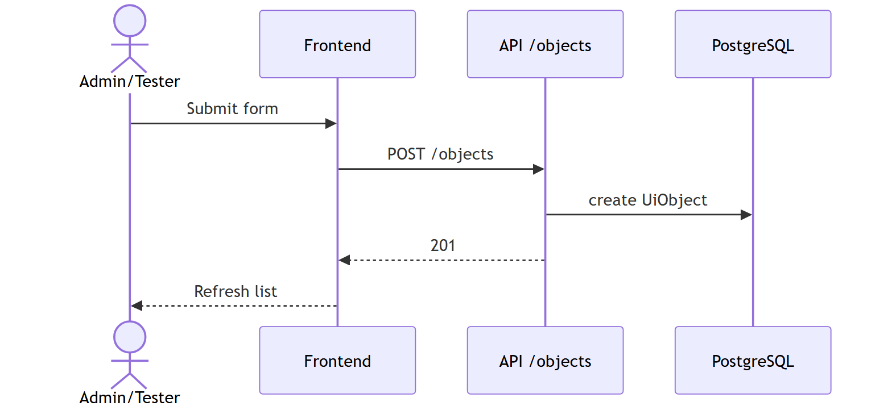

```mermaid
sequenceDiagram
    actor U as Admin/Tester
    participant W as Frontend
    participant API as API /objects
    participant DB as PostgreSQL

    U->>W: Submit form
    W->>API: POST /objects
    API->>DB: create UiObject
    API-->>W: 201
    W-->>U: Refresh list
```

#### Biểu đồ hoạt động — ĐC-21

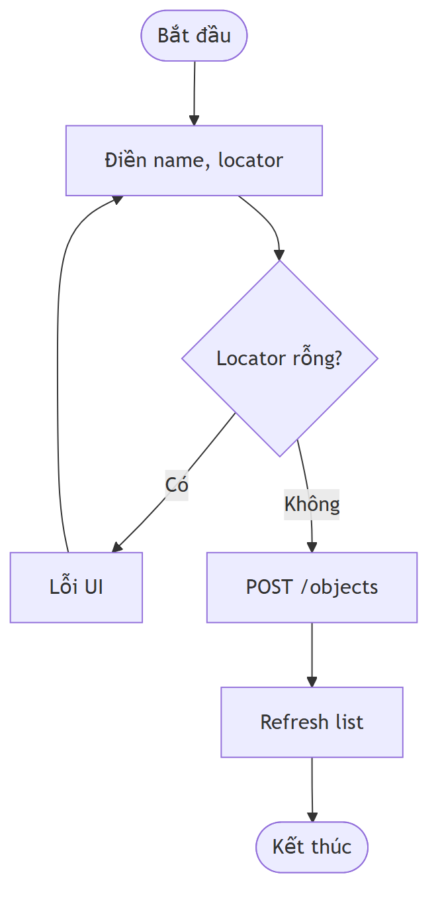

```mermaid
flowchart TD
    A([Bắt đầu]) --> B[Điền name, locator]
    B --> C{Locator rỗng?}
    C -- Có --> D[Lỗi UI]
    D --> B
    C -- Không --> E[POST /objects]
    E --> F[Refresh list]
    F --> G([Kết thúc])
```

---

---

### Bảng 3.24 — ĐC-22: Sửa đối tượng UI

| Cột | Nội dung |
|-----|----------|
| **Tên Usecase** | Sửa đối tượng UI |
| **Tác nhân** | Admin, Tester |
| **Mục đích** | Cập nhật locator/name khi UI app thay đổi |
| **Điều kiện tiên quyết** | Object tồn tại; user access project |
| **Mô tả chung** | `PUT /objects/:id` |
| **Luồng sự kiện** | 1. Chọn sửa. 2. Sửa field. 3. PUT. 4. Cập nhật UI |
| **Ngoại lệ** | E1: Không tìm thấy → 404. E2: Đổi projectId sang project không quyền → 403 |
| **Các yêu cầu đặc biệt** | Steps đang reference targetId vẫn trỏ tới object id |

#### Biểu đồ trình tự — ĐC-22

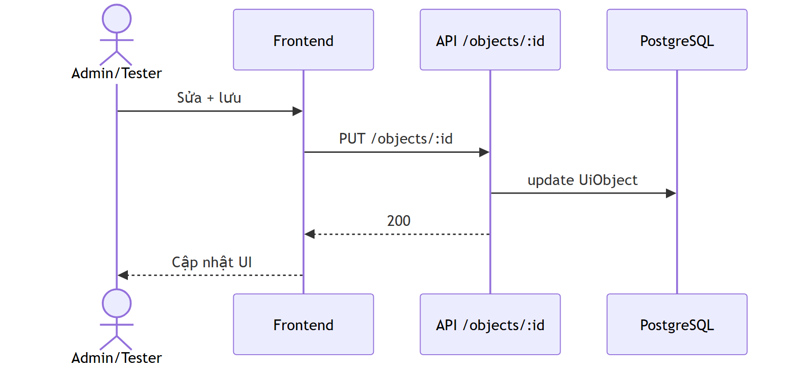

```mermaid
sequenceDiagram
    actor U as Admin/Tester
    participant W as Frontend
    participant API as API /objects/:id
    participant DB as PostgreSQL

    U->>W: Sửa + lưu
    W->>API: PUT /objects/:id
    API->>DB: update UiObject
    API-->>W: 200
    W-->>U: Cập nhật UI
```

#### Biểu đồ hoạt động — ĐC-22

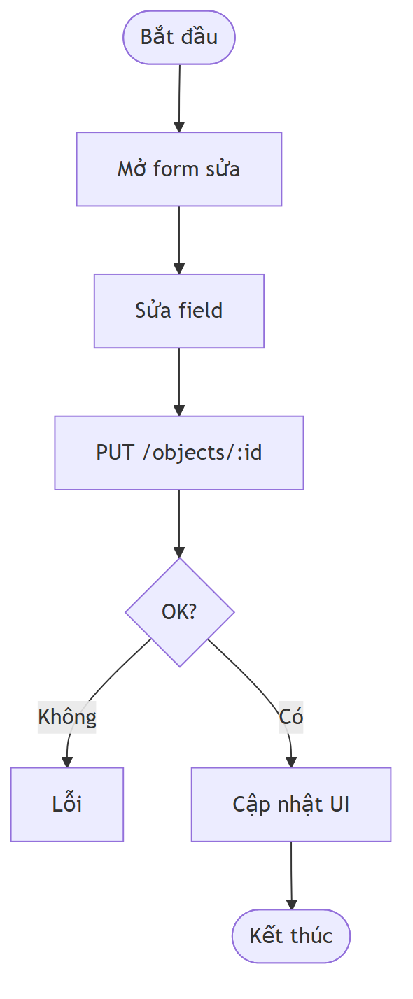

```mermaid
flowchart TD
    A([Bắt đầu]) --> B[Mở form sửa]
    B --> C[Sửa field]
    C --> D[PUT /objects/:id]
    D --> E{OK?}
    E -- Không --> F[Lỗi]
    E -- Có --> G[Cập nhật UI]
    G --> H([Kết thúc])
```

---

---

### Bảng 3.25 — ĐC-23: Xóa đối tượng UI

| Cột | Nội dung |
|-----|----------|
| **Tên Usecase** | Xóa đối tượng UI |
| **Tác nhân** | Admin, Tester |
| **Mục đích** | Dọn object không còn dùng |
| **Điều kiện tiên quyết** | Xác nhận trên UI |
| **Mô tả chung** | `DELETE /objects/:id`; FK step targetId SetNull |
| **Luồng sự kiện** | 1. Xác nhận xóa. 2. DELETE. 3. 204. 4. Refresh |
| **Ngoại lệ** | E1: Không quyền → 404 |
| **Các yêu cầu đặc biệt** | Cảnh báo step đang liên kết object |

#### Biểu đồ trình tự — ĐC-23

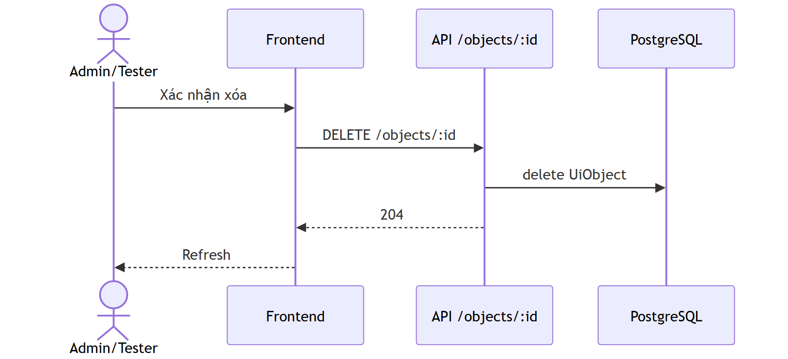

```mermaid
sequenceDiagram
    actor U as Admin/Tester
    participant W as Frontend
    participant API as API /objects/:id
    participant DB as PostgreSQL

    U->>W: Xác nhận xóa
    W->>API: DELETE /objects/:id
    API->>DB: delete UiObject
    API-->>W: 204
    W-->>U: Refresh
```

#### Biểu đồ hoạt động — ĐC-23

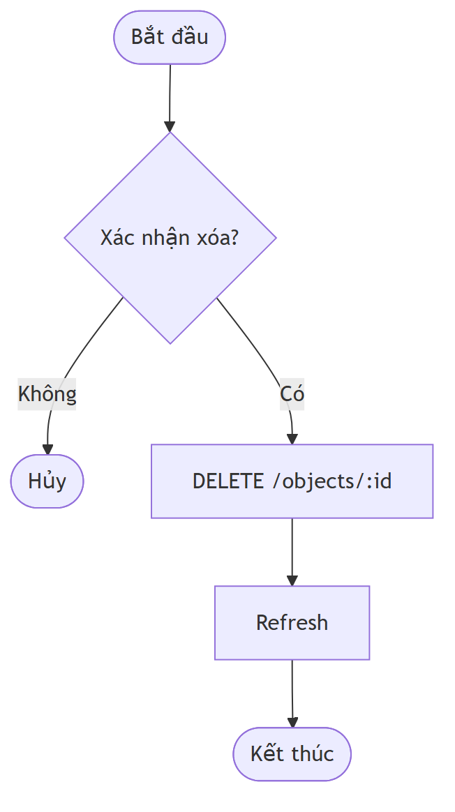

```mermaid
flowchart TD
    A([Bắt đầu]) --> B{Xác nhận xóa?}
    B -- Không --> C([Hủy])
    B -- Có --> D[DELETE /objects/:id]
    D --> E[Refresh]
    E --> F([Kết thúc])
```

---

## A.6. Bộ dữ liệu

---

## Nhóm STT 8 — Quản lý bộ dữ liệu

| Thuộc tính nhóm | Giá trị |
|-----------------|--------|
| **Mã use case** | ĐC-24 → ĐC-27 |
| **Số use case** | 4 |
| **Bảng đặc tả** | Bảng 3.26 – 3.29 (chi tiết: `11`) |
| **Màn hình** | /datasets |
| **Biểu đồ trình tự** | Hình 3.5.8a — file `16`, STT 8 |
| **Biểu đồ hoạt động** | Hình 3.5.8b — file `16`, STT 8 |

### Danh sách use case trong nhóm

| Mã | Tên use case | Bảng |
|----|--------------|------|
| ĐC-24 | Xem danh sách bộ dữ liệu | Bảng 3.26 |
| ĐC-25 | Tạo bộ dữ liệu | Bảng 3.27 |
| ĐC-26 | Cập nhật bộ dữ liệu | Bảng 3.28 |
| ĐC-27 | Xóa bộ dữ liệu | Bảng 3.29 |

### Biểu đồ trình tự (Sequence) — 3.5.8a

> **Hình 3.5.8a** — Quản lý bộ dữ liệu

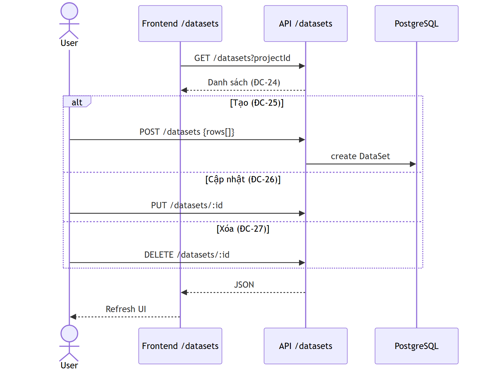

```mermaid
sequenceDiagram
    actor U as User
    participant W as Frontend /datasets
    participant API as API /datasets
    participant DB as PostgreSQL

    W->>API: GET /datasets?projectId
    API-->>W: Danh sách (ĐC-24)

    alt Tạo (ĐC-25)
        U->>API: POST /datasets {rows[]}
        API->>DB: create DataSet
    else Cập nhật (ĐC-26)
        U->>API: PUT /datasets/:id
    else Xóa (ĐC-27)
        U->>API: DELETE /datasets/:id
    end
    API-->>W: JSON
    W-->>U: Refresh UI
```

### Biểu đồ hoạt động (Activity) — 3.5.8b

> **Hình 3.5.8b** — Quản lý bộ dữ liệu

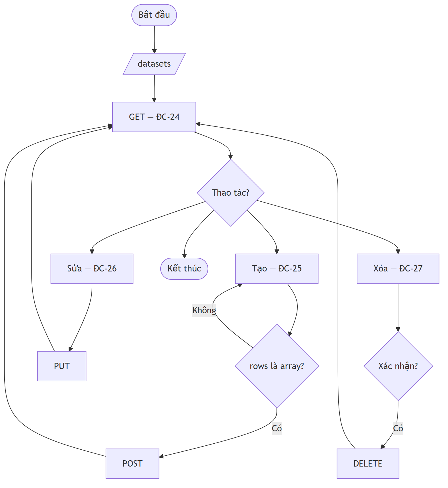

```mermaid
flowchart TD
    A([Bắt đầu]) --> B[/datasets/]
    B --> C[GET — ĐC-24]
    C --> D{Thao tác?}

    D --> E[Tạo — ĐC-25]
    E --> E1{rows là array?}
    E1 -- Không --> E
    E1 -- Có --> E2[POST]
    E2 --> C

    D --> F[Sửa — ĐC-26]
    F --> F1[PUT]
    F1 --> C

    D --> G[Xóa — ĐC-27]
    G --> G1{Xác nhận?}
    G1 -- Có --> G2[DELETE]
    G2 --> C

    D --> H([Kết thúc])
```

### Đặc tả chi tiết (8 cột)

### Bảng 3.26 — ĐC-24: Xem danh sách bộ dữ liệu

| Cột | Nội dung |
|-----|----------|
| **Tên Usecase** | Xem danh sách bộ dữ liệu |
| **Tác nhân** | Admin, Tester, Viewer |
| **Mục đích** | Xem các dataset phục vụ data-driven testing |
| **Điều kiện tiên quyết** | Project accessible |
| **Mô tả chung** | `/datasets` — GET với projectId |
| **Luồng sự kiện** | 1. Mở trang. 2. Chọn project. 3. GET /datasets. 4. Hiển thị name, rows preview |
| **Ngoại lệ** | E1: 403 project |
| **Các yêu cầu đặc biệt** | rows lưu dạng JSON array |

#### Biểu đồ trình tự — ĐC-24

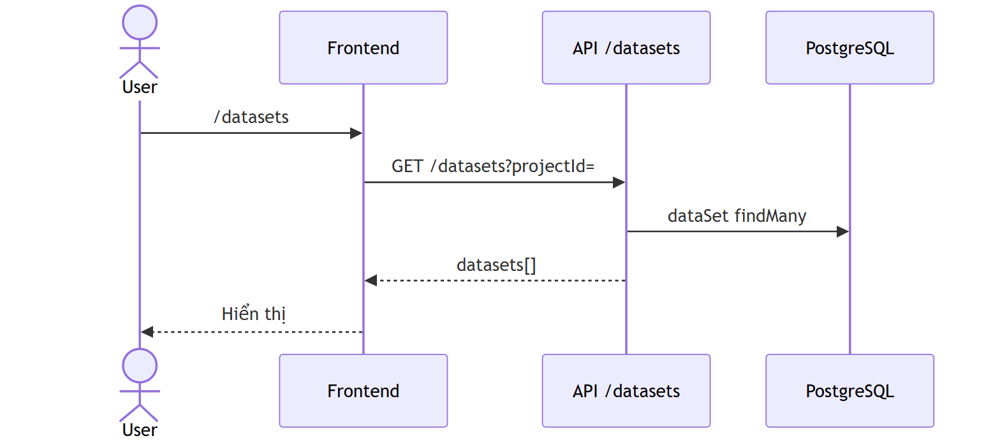

```mermaid
sequenceDiagram
    actor U as User
    participant W as Frontend
    participant API as API /datasets
    participant DB as PostgreSQL

    U->>W: /datasets
    W->>API: GET /datasets?projectId=
    API->>DB: dataSet findMany
    API-->>W: datasets[]
    W-->>U: Hiển thị
```

#### Biểu đồ hoạt động — ĐC-24

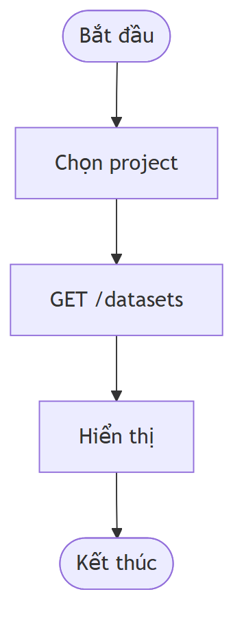

```mermaid
flowchart TD
    A([Bắt đầu]) --> B[Chọn project]
    B --> C[GET /datasets]
    C --> D[Hiển thị]
    D --> E([Kết thúc])
```

---

---

### Bảng 3.27 — ĐC-25: Tạo bộ dữ liệu

| Cột | Nội dung |
|-----|----------|
| **Tên Usecase** | Tạo bộ dữ liệu |
| **Tác nhân** | Admin, Tester |
| **Mục đích** | Định nghĩa nhiều bộ input cho cùng script |
| **Điều kiện tiên quyết** | rows là mảng object; name không rỗng |
| **Mô tả chung** | POST /datasets |
| **Luồng sự kiện** | 1. Nhập tên, mô tả, rows (JSON/editor). 2. POST. 3. Validate Zod. 4. Tạo DataSet. 5. Hiển thị |
| **Ngoại lệ** | E1: rows không phải array → 400 |
| **Các yêu cầu đặc biệt** | Key trong row khớp dataKey trên step fill/assertText |

#### Biểu đồ trình tự — ĐC-25

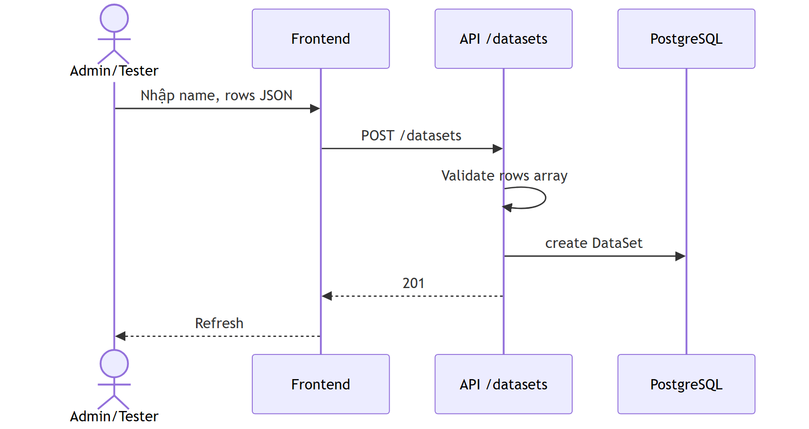

```mermaid
sequenceDiagram
    actor U as Admin/Tester
    participant W as Frontend
    participant API as API /datasets
    participant DB as PostgreSQL

    U->>W: Nhập name, rows JSON
    W->>API: POST /datasets
    API->>API: Validate rows array
    API->>DB: create DataSet
    API-->>W: 201
    W-->>U: Refresh
```

#### Biểu đồ hoạt động — ĐC-25

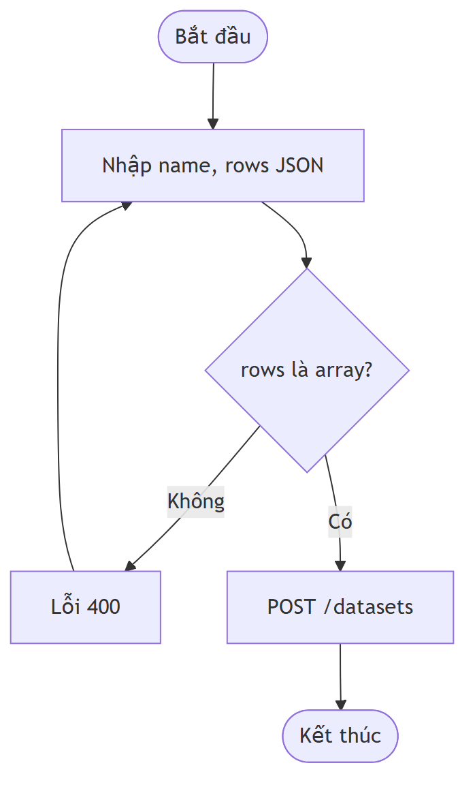

```mermaid
flowchart TD
    A([Bắt đầu]) --> B[Nhập name, rows JSON]
    B --> C{rows là array?}
    C -- Không --> D[Lỗi 400]
    D --> B
    C -- Có --> E[POST /datasets]
    E --> F([Kết thúc])
```

---

---

### Bảng 3.28 — ĐC-26: Cập nhật bộ dữ liệu

| Cột | Nội dung |
|-----|----------|
| **Tên Usecase** | Cập nhật bộ dữ liệu |
| **Tác nhân** | Admin, Tester |
| **Mục đích** | Sửa dữ liệu test mà không đổi script |
| **Điều kiện tiên quyết** | Dataset tồn tại |
| **Mô tả chung** | PUT /datasets/:id |
| **Luồng sự kiện** | 1. Sửa form. 2. PUT. 3. Cập nhật DB. 4. Refresh |
| **Ngoại lệ** | E1: 404/403 |
| **Các yêu cầu đặc biệt** | Run cũ vẫn giữ dataSetId snapshot |

#### Biểu đồ trình tự — ĐC-26

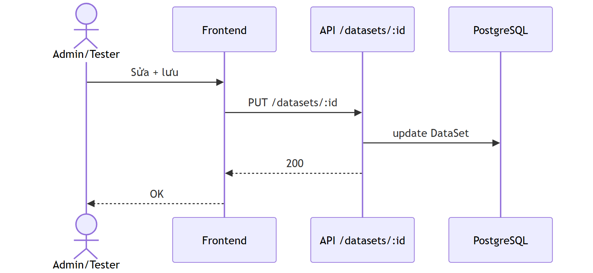

```mermaid
sequenceDiagram
    actor U as Admin/Tester
    participant W as Frontend
    participant API as API /datasets/:id
    participant DB as PostgreSQL

    U->>W: Sửa + lưu
    W->>API: PUT /datasets/:id
    API->>DB: update DataSet
    API-->>W: 200
    W-->>U: OK
```

#### Biểu đồ hoạt động — ĐC-26

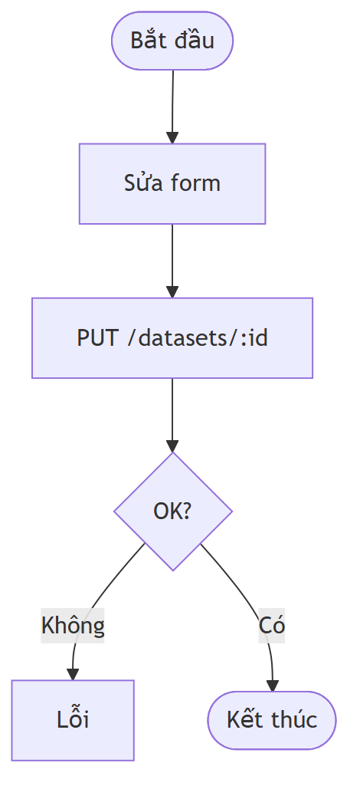

```mermaid
flowchart TD
    A([Bắt đầu]) --> B[Sửa form]
    B --> C[PUT /datasets/:id]
    C --> D{OK?}
    D -- Không --> E[Lỗi]
    D -- Có --> F([Kết thúc])
```

---

---

### Bảng 3.29 — ĐC-27: Xóa bộ dữ liệu

| Cột | Nội dung |
|-----|----------|
| **Tên Usecase** | Xóa bộ dữ liệu |
| **Tác nhân** | Admin, Tester |
| **Mục đích** | Loại dataset obsolete |
| **Điều kiện tiên quyết** | Xác nhận UI |
| **Mô tả chung** | DELETE /datasets/:id |
| **Luồng sự kiện** | 1. Xóa → DELETE. 2. 204. 3. Refresh |
| **Ngoại lệ** | E1: Run đang reference → SetNull trên run |
| **Các yêu cầu đặc biệt** | Không xóa nếu policy business yêu cầu giữ lịch sử |

#### Biểu đồ trình tự — ĐC-27

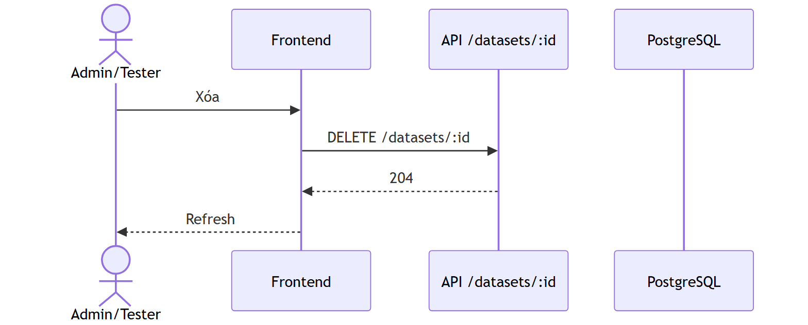

```mermaid
sequenceDiagram
    actor U as Admin/Tester
    participant W as Frontend
    participant API as API /datasets/:id
    participant DB as PostgreSQL

    U->>W: Xóa
    W->>API: DELETE /datasets/:id
    API-->>W: 204
    W-->>U: Refresh
```

#### Biểu đồ hoạt động — ĐC-27

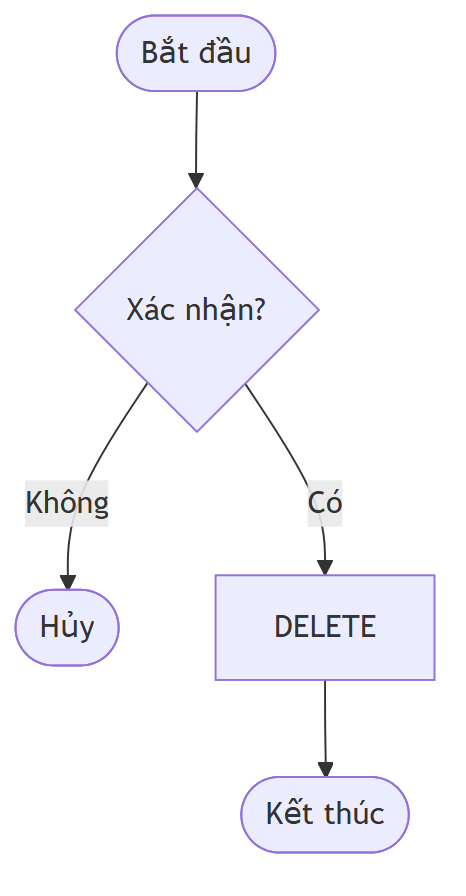

```mermaid
flowchart TD
    A([Bắt đầu]) --> B{Xác nhận?}
    B -- Không --> C([Hủy])
    B -- Có --> D[DELETE]
    D --> E([Kết thúc])
```

---

## A.7. Báo cáo

---

## Nhóm STT 9 — Báo cáo & xuất PDF

| Thuộc tính nhóm | Giá trị |
|-----------------|--------|
| **Mã use case** | ĐC-28 → ĐC-32 |
| **Số use case** | 5 |
| **Bảng đặc tả** | Bảng 3.30 – 3.34 (chi tiết: `11`) |
| **Màn hình** | /reports, /report/[runId] |
| **Biểu đồ trình tự** | Hình 3.5.9a — file `16`, STT 9 |
| **Biểu đồ hoạt động** | Hình 3.5.9b — file `16`, STT 9 |

### Danh sách use case trong nhóm

| Mã | Tên use case | Bảng |
|----|--------------|------|
| ĐC-28 | Xem danh sách lần chạy & thống kê Pass/Fail | Bảng 3.30 |
| ĐC-29 | Lọc báo cáo theo trạng thái / kịch bản | Bảng 3.31 |
| ĐC-30 | Xem chi tiết kết quả từng bước | Bảng 3.32 |
| ĐC-31 | Tải báo cáo PDF một lần chạy | Bảng 3.33 |
| ĐC-32 | Xem chi tiết suite run theo Run ID | Bảng 3.34 |

### Biểu đồ trình tự (Sequence) — 3.5.9a

> **Hình 3.5.9a** — Báo cáo & xuất PDF

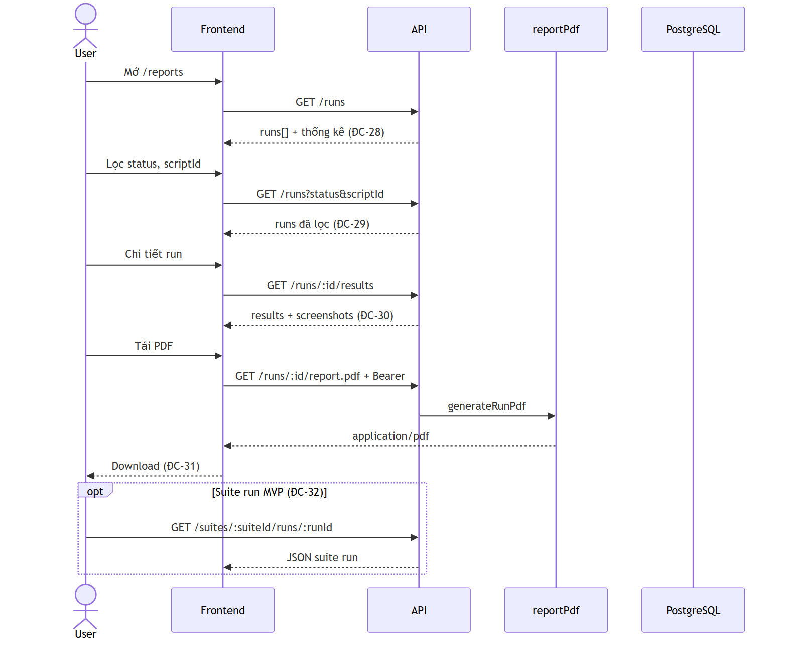

```mermaid
sequenceDiagram
    actor U as User
    participant W as Frontend
    participant API as API
    participant PDF as reportPdf
    participant DB as PostgreSQL

    U->>W: Mở /reports
    W->>API: GET /runs
    API-->>W: runs[] + thống kê (ĐC-28)

    U->>W: Lọc status, scriptId
    W->>API: GET /runs?status&scriptId
    API-->>W: runs đã lọc (ĐC-29)

    U->>W: Chi tiết run
    W->>API: GET /runs/:id/results
    API-->>W: results + screenshots (ĐC-30)

    U->>W: Tải PDF
    W->>API: GET /runs/:id/report.pdf + Bearer
    API->>PDF: generateRunPdf
    PDF-->>W: application/pdf
    W-->>U: Download (ĐC-31)

    opt Suite run MVP (ĐC-32)
        U->>API: GET /suites/:suiteId/runs/:runId
        API-->>W: JSON suite run
    end
```

### Biểu đồ hoạt động (Activity) — 3.5.9b

> **Hình 3.5.9b** — Báo cáo & xuất PDF

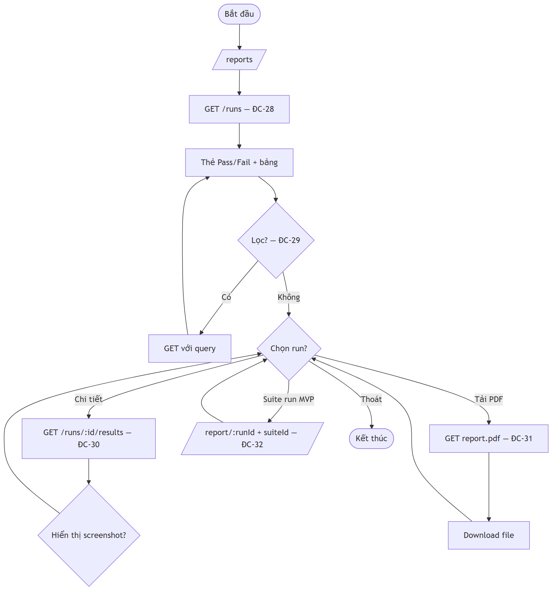

```mermaid
flowchart TD
    A([Bắt đầu]) --> B[/reports/]
    B --> C[GET /runs — ĐC-28]
    C --> D[Thẻ Pass/Fail + bảng]
    D --> E{Lọc? — ĐC-29}
    E -- Có --> F[GET với query]
    F --> D
    E -- Không --> G{Chọn run?}
    G -- Chi tiết --> H[GET /runs/:id/results — ĐC-30]
    H --> I{Hiển thị screenshot?}
    I --> G
    G -- Tải PDF --> J[GET report.pdf — ĐC-31]
    J --> K[Download file]
    K --> G
    G -- Suite run MVP --> L[/report/:runId + suiteId — ĐC-32/]
    L --> G
    G -- Thoát --> M([Kết thúc])
```

### Đặc tả chi tiết (8 cột)

### Bảng 3.30 — ĐC-28: Xem danh sách lần chạy & thống kê Pass/Fail

| Cột | Nội dung |
|-----|----------|
| **Tên Usecase** | Xem danh sách lần chạy & thống kê |
| **Tác nhân** | Admin, Tester, Viewer |
| **Mục đích** | Theo dõi lịch sử thực thi kịch bản |
| **Điều kiện tiên quyết** | Đăng nhập |
| **Mô tả chung** | `/reports` — GET /runs (theo userId trên API hiện tại) |
| **Luồng sự kiện** | 1. Mở `/reports`. 2. GET /runs. 3. Tính total/passed/failed cards. 4. Hiển thị bảng runs |
| **Ngoại lệ** | E1: Không có run → 0 |
| **Các yêu cầu đặc biệt** | Hiển thị tên script, thời gian, trạng thái tiếng Việt |

#### Biểu đồ trình tự — ĐC-28

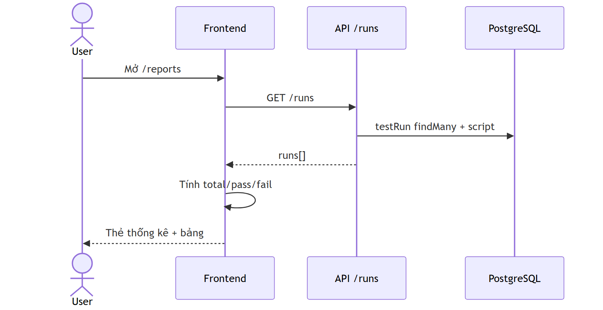

```mermaid
sequenceDiagram
    actor U as User
    participant W as Frontend
    participant API as API /runs
    participant DB as PostgreSQL

    U->>W: Mở /reports
    W->>API: GET /runs
    API->>DB: testRun findMany + script
    API-->>W: runs[]
    W->>W: Tính total/pass/fail
    W-->>U: Thẻ thống kê + bảng
```

#### Biểu đồ hoạt động — ĐC-28

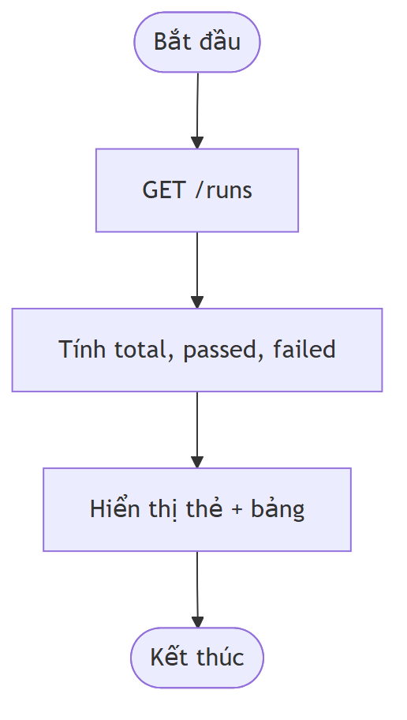

```mermaid
flowchart TD
    A([Bắt đầu]) --> B[GET /runs]
    B --> C[Tính total, passed, failed]
    C --> D[Hiển thị thẻ + bảng]
    D --> E([Kết thúc])
```

---

---

### Bảng 3.31 — ĐC-29: Lọc báo cáo theo trạng thái / kịch bản

| Cột | Nội dung |
|-----|----------|
| **Tên Usecase** | Lọc báo cáo |
| **Tác nhân** | Admin, Tester, Viewer |
| **Mục đích** | Thu hẹp danh sách run cần xem |
| **Điều kiện tiên quyết** | Đã tải danh sách runs |
| **Mô tả chung** | Query params status, scriptId gửi lên GET /runs |
| **Luồng sự kiện** | 1. Chọn trạng thái (passed/failed/queued). 2. Chọn script. 3. Gọi lại API với params. 4. Cập nhật bảng và thống kê |
| **Ngoại lệ** | E1: ScriptId không thuộc user runs → rỗng |
| **Các yêu cầu đặc biệt** | Filter client-side bổ sung nếu API chưa hỗ trợ đủ |

#### Biểu đồ trình tự — ĐC-29

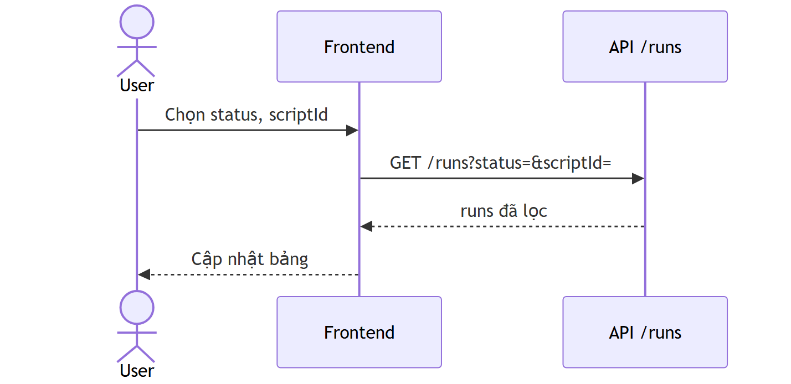

```mermaid
sequenceDiagram
    actor U as User
    participant W as Frontend
    participant API as API /runs

    U->>W: Chọn status, scriptId
    W->>API: GET /runs?status=&scriptId=
    API-->>W: runs đã lọc
    W-->>U: Cập nhật bảng
```

#### Biểu đồ hoạt động — ĐC-29

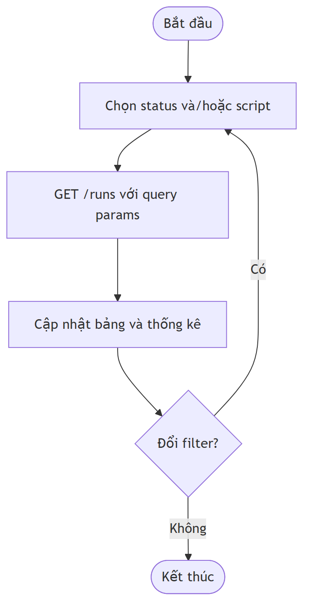

```mermaid
flowchart TD
    A([Bắt đầu]) --> B[Chọn status và/hoặc script]
    B --> C[GET /runs với query params]
    C --> D[Cập nhật bảng và thống kê]
    D --> E{Đổi filter?}
    E -- Có --> B
    E -- Không --> F([Kết thúc])
```

---

---

### Bảng 3.32 — ĐC-30: Xem chi tiết kết quả từng bước

| Cột | Nội dung |
|-----|----------|
| **Tên Usecase** | Xem chi tiết kết quả run |
| **Tác nhân** | Admin, Tester, Viewer |
| **Mục đích** | Phân tích pass/fail theo từng step |
| **Điều kiện tiên quyết** | Run id hợp lệ thuộc user |
| **Mô tả chung** | GET /runs/:id/results — kèm stepMeta, objectMap, screenshots |
| **Luồng sự kiện** | 1. Chọn **Chi tiết** trên một run. 2. GET results. 3. Hiển thị bảng stepOrder, keyword, status, message. 4. Hiển thị ảnh screenshot nếu fail |
| **Ngoại lệ** | E1: 404 run |
| **Các yêu cầu đặc biệt** | Screenshot qua URL `/screenshots/...` trên API host |

#### Biểu đồ trình tự — ĐC-30

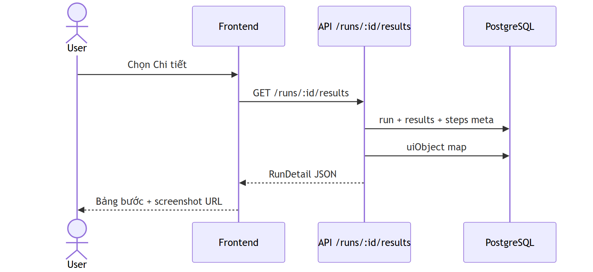

```mermaid
sequenceDiagram
    actor U as User
    participant W as Frontend
    participant API as API /runs/:id/results
    participant DB as PostgreSQL

    U->>W: Chọn Chi tiết
    W->>API: GET /runs/:id/results
    API->>DB: run + results + steps meta
    API->>DB: uiObject map
    API-->>W: RunDetail JSON
    W-->>U: Bảng bước + screenshot URL
```

#### Biểu đồ hoạt động — ĐC-30

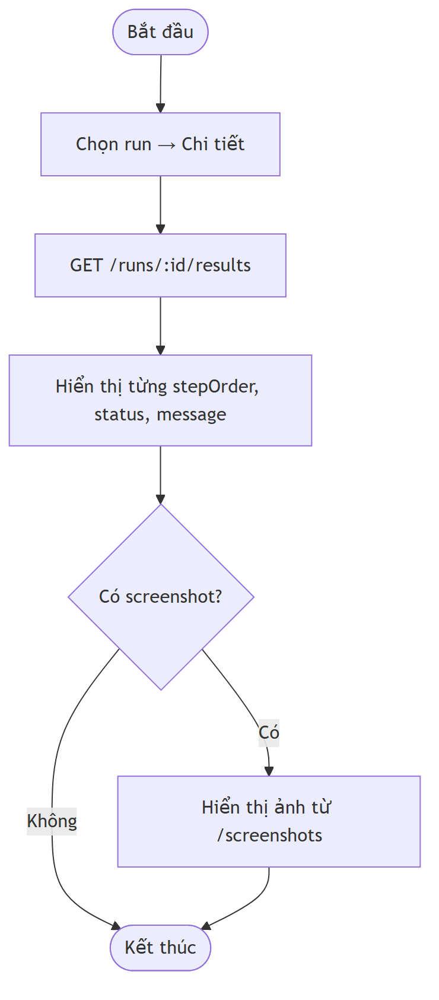

```mermaid
flowchart TD
    A([Bắt đầu]) --> B[Chọn run → Chi tiết]
    B --> C[GET /runs/:id/results]
    C --> D[Hiển thị từng stepOrder, status, message]
    D --> E{Có screenshot?}
    E -- Có --> F[Hiển thị ảnh từ /screenshots]
    E -- Không --> G([Kết thúc])
    F --> G
```

---

---

### Bảng 3.33 — ĐC-31: Tải báo cáo PDF một lần chạy

| Cột | Nội dung |
|-----|----------|
| **Tên Usecase** | Tải báo cáo PDF |
| **Tác nhân** | Admin, Tester, Viewer |
| **Mục đích** | Xuất báo cáo formal cho run |
| **Điều kiện tiên quyết** | Run tồn tại; user có quyền xem |
| **Mô tả chung** | GET /runs/:id/report.pdf — generate PDF bằng Playwright HTML render |
| **Luồng sự kiện** | 1. Nhấn **Tải PDF**. 2. fetch với Bearer header. 3. API generateRunPdf. 4. Trả application/pdf. 5. Browser download file |
| **Ngoại lệ** | E1: 404. E2: Lỗi generate → thông báo |
| **Các yêu cầu đặc biệt** | Phải gửi Authorization vì link trần không mang JWT |

#### Biểu đồ trình tự — ĐC-31

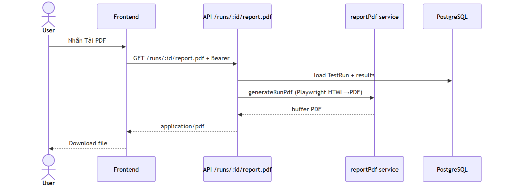

```mermaid
sequenceDiagram
    actor U as User
    participant W as Frontend
    participant API as API /runs/:id/report.pdf
    participant PDF as reportPdf service
    participant DB as PostgreSQL

    U->>W: Nhấn Tải PDF
    W->>API: GET /runs/:id/report.pdf + Bearer
    API->>DB: load TestRun + results
    API->>PDF: generateRunPdf (Playwright HTML→PDF)
    PDF-->>API: buffer PDF
    API-->>W: application/pdf
    W-->>U: Download file
```

#### Biểu đồ hoạt động — ĐC-31

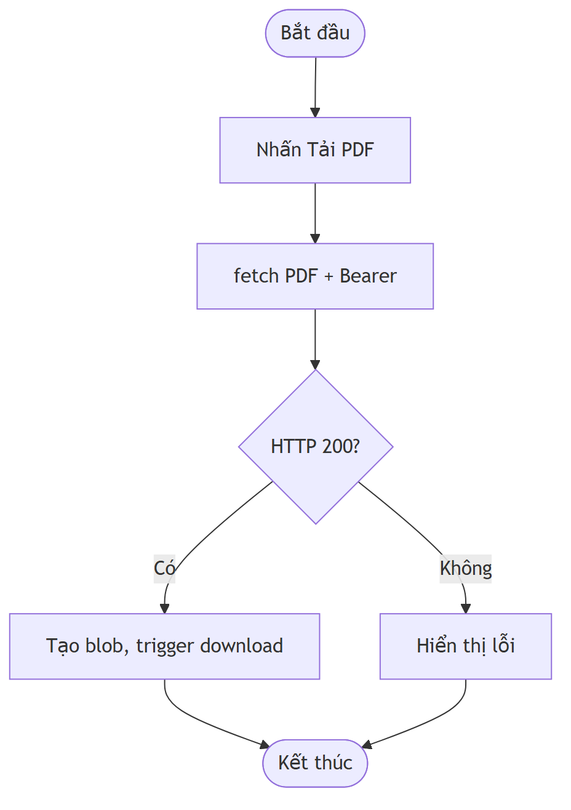

```mermaid
flowchart TD
    A([Bắt đầu]) --> B[Nhấn Tải PDF]
    B --> C[fetch PDF + Bearer]
    C --> D{HTTP 200?}
    D -- Không --> E[Hiển thị lỗi]
    D -- Có --> F[Tạo blob, trigger download]
    F --> G([Kết thúc])
    E --> G
```

---

---

### Bảng 3.34 — ĐC-32: Xem chi tiết suite run theo Run ID

| Cột | Nội dung |
|-----|----------|
| **Tên Usecase** | Xem chi tiết suite run |
| **Tác nhân** | Admin, Tester |
| **Mục đích** | Tra cứu kết quả chạy bộ kiểm thử (MVP) |
| **Điều kiện tiên quyết** | Biết runId và suiteId |
| **Mô tả chung** | `/report/[runId]` — GET /suites/:suiteId/runs/:runId |
| **Luồng sự kiện** | 1. Mở URL với runId. 2. Nhập suiteId. 3. Nhấn tải. 4. Hiển thị JSON response thô |
| **Ngoại lệ** | E1: Thiếu suiteId → message UI. E2: 404 |
| **Các yêu cầu đặc biệt** | MVP — chưa có UI báo cáo suite đẹp như script run |

#### Biểu đồ trình tự — ĐC-32

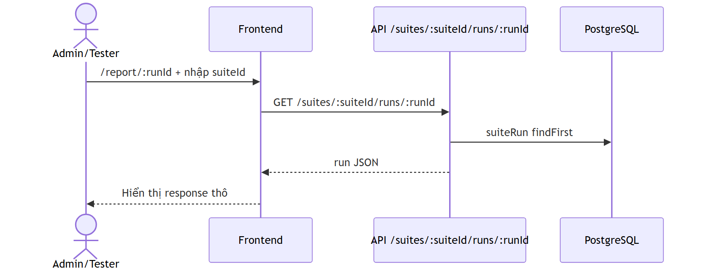

```mermaid
sequenceDiagram
    actor U as Admin/Tester
    participant W as Frontend
    participant API as API /suites/:suiteId/runs/:runId
    participant DB as PostgreSQL

    U->>W: /report/:runId + nhập suiteId
    W->>API: GET /suites/:suiteId/runs/:runId
    API->>DB: suiteRun findFirst
    API-->>W: run JSON
    W-->>U: Hiển thị response thô
```

#### Biểu đồ hoạt động — ĐC-32

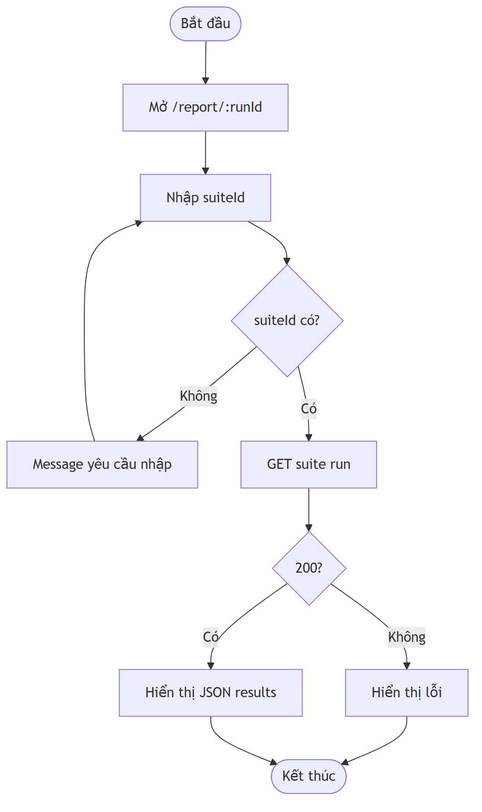

```mermaid
flowchart TD
    A([Bắt đầu]) --> B[Mở /report/:runId]
    B --> C[Nhập suiteId]
    C --> D{suiteId có?}
    D -- Không --> E[Message yêu cầu nhập]
    D -- Có --> F[GET suite run]
    F --> G{200?}
    G -- Không --> H[Hiển thị lỗi]
    G -- Có --> I[Hiển thị JSON results]
    E --> C
    H --> J([Kết thúc])
    I --> J
```

---

## A.8. Kiểm thử nhanh — Recorder & Editor

---

## Nhóm STT 10 — Ghi thao tác & publish test case

| Thuộc tính nhóm | Giá trị |
|-----------------|--------|
| **Mã use case** | ĐC-33 → ĐC-37 |
| **Số use case** | 5 |
| **Bảng đặc tả** | Bảng 3.35 – 3.39 (chi tiết: `11`) |
| **Màn hình** | /recorder, /editor |
| **Biểu đồ trình tự** | Hình 3.5.10a — file `16`, STT 10 |
| **Biểu đồ hoạt động** | Hình 3.5.10b — file `16`, STT 10 |

### Danh sách use case trong nhóm

| Mã | Tên use case | Bảng |
|----|--------------|------|
| ĐC-33 | Ghi thao tác thủ công | Bảng 3.35 |
| ĐC-34 | Import kịch bản từ script Playwright | Bảng 3.36 |
| ĐC-35 | Phân tích ghi thao tác thông minh (Smart Record) | Bảng 3.37 |
| ĐC-36 | Tạo test case ở trạng thái Draft | Bảng 3.38 |
| ĐC-37 | Publish test case | Bảng 3.39 |

### Biểu đồ trình tự (Sequence) — 3.5.10a

> **Hình 3.5.10a** — Ghi thao tác & publish test case

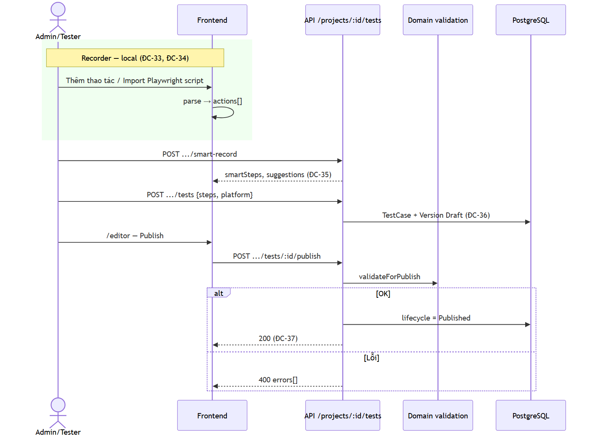

```mermaid
sequenceDiagram
    actor U as Admin/Tester
    participant W as Frontend
    participant API as API /projects/:id/tests
    participant DOM as Domain validation
    participant DB as PostgreSQL

    rect rgb(240,255,240)
        Note over U,W: Recorder — local (ĐC-33, ĐC-34)
        U->>W: Thêm thao tác / Import Playwright script
        W->>W: parse → actions[]
    end

    U->>API: POST .../smart-record
    API-->>W: smartSteps, suggestions (ĐC-35)

    U->>API: POST .../tests {steps, platform}
    API->>DB: TestCase + Version Draft (ĐC-36)

    U->>W: /editor — Publish
    W->>API: POST .../tests/:id/publish
    API->>DOM: validateForPublish
  alt OK
        API->>DB: lifecycle = Published
        API-->>W: 200 (ĐC-37)
    else Lỗi
        API-->>W: 400 errors[]
    end
```

### Biểu đồ hoạt động (Activity) — 3.5.10b

> **Hình 3.5.10b** — Ghi thao tác & publish test case

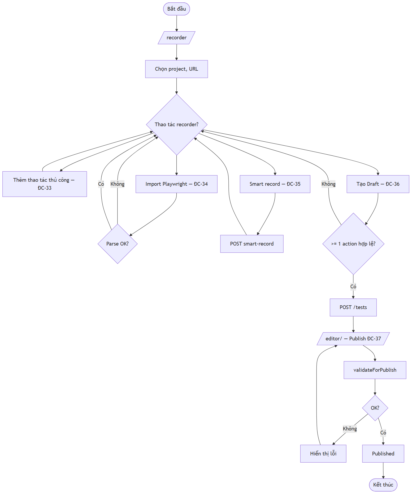

```mermaid
flowchart TD
    A([Bắt đầu]) --> B[/recorder/]
    B --> C[Chọn project, URL]
    C --> D{Thao tác recorder?}

    D --> E[Thêm thao tác thủ công — ĐC-33]
    E --> D

    D --> F[Import Playwright — ĐC-34]
    F --> F1{Parse OK?}
    F1 -- Không --> D
    F1 -- Có --> D

    D --> G[Smart record — ĐC-35]
    G --> G1[POST smart-record]
    G1 --> D

    D --> H[Tạo Draft — ĐC-36]
    H --> H1{>= 1 action hợp lệ?}
    H1 -- Không --> D
    H1 -- Có --> H2[POST /tests]
    H2 --> I[/editor/ — Publish ĐC-37/]
    I --> I1[validateForPublish]
    I1 --> I2{OK?}
    I2 -- Không --> I3[Hiển thị lỗi]
    I3 --> I
    I2 -- Có --> I4[Published]
    I4 --> J([Kết thúc])
```

### Đặc tả chi tiết (8 cột)

### Bảng 3.35 — ĐC-33: Ghi thao tác thủ công

| Cột | Nội dung |
|-----|----------|
| **Tên Usecase** | Ghi thao tác thủ công |
| **Tác nhân** | Admin, Tester |
| **Mục đích** | Xây dựng danh sách thao tác test không cần code |
| **Điều kiện tiên quyết** | Chọn project; có URL mục tiêu |
| **Mô tả chung** | `/recorder` — thêm click/fill/assertText/navigate vào mảng actions local |
| **Luồng sự kiện** | 1. Chọn project, URL. 2. Chọn loại thao tác, selector, value/expected. 3. **Thêm thao tác**. 4. Lặp. 5. Có thể xóa từng dòng hoặc xóa hết |
| **Ngoại lệ** | E1: Selector rỗng → không thêm |
| **Các yêu cầu đặc biệt** | Tối đa 255 ký tự một số field text |

#### Biểu đồ trình tự — ĐC-33

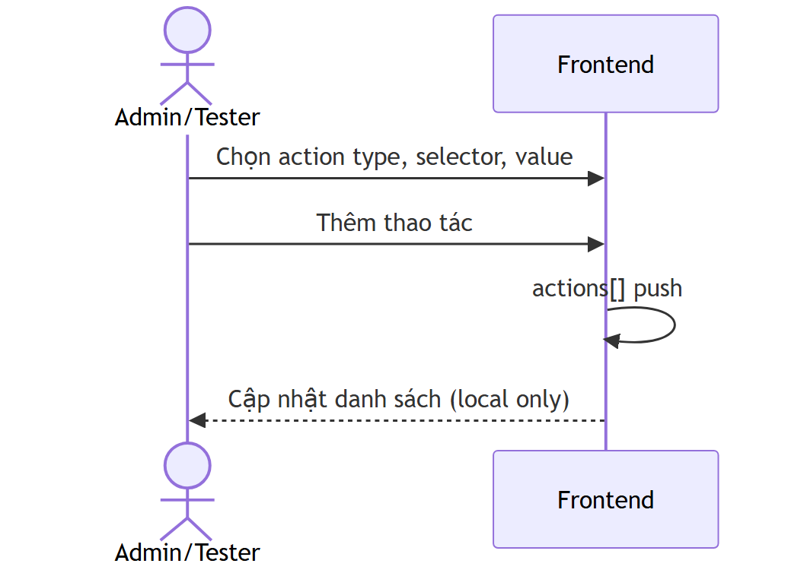

```mermaid
sequenceDiagram
    actor U as Admin/Tester
    participant W as Frontend

    U->>W: Chọn action type, selector, value
    U->>W: Thêm thao tác
    W->>W: actions[] push
    W-->>U: Cập nhật danh sách (local only)
```

#### Biểu đồ hoạt động — ĐC-33

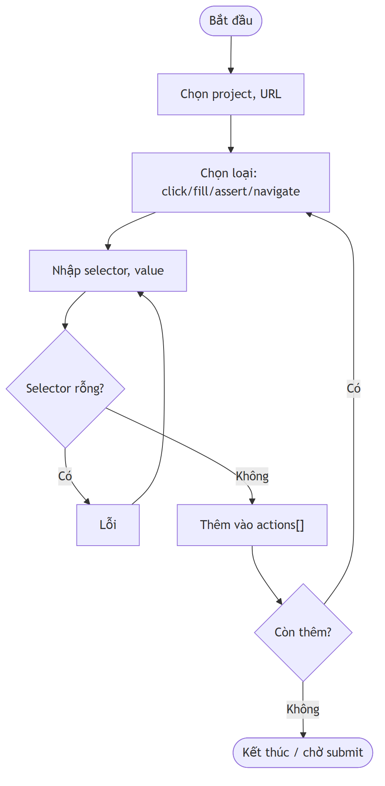

```mermaid
flowchart TD
    A([Bắt đầu]) --> B[Chọn project, URL]
    B --> C[Chọn loại: click/fill/assert/navigate]
    C --> D[Nhập selector, value]
    D --> E{Selector rỗng?}
    E -- Có --> F[Lỗi]
    F --> D
    E -- Không --> G["Thêm vào actions[]"]
    G --> H{Còn thêm?}
    H -- Có --> C
    H -- Không --> I([Kết thúc / chờ submit])
```

---

---

### Bảng 3.36 — ĐC-34: Import kịch bản từ script Playwright

| Cột | Nội dung |
|-----|----------|
| **Tên Usecase** | Import script Playwright |
| **Tác nhân** | Admin, Tester |
| **Mục đích** | Chuyển codegen Playwright sang actions no-code |
| **Điều kiện tiên quyết** | Dán script hợp lệ (goto, click, fill, expect) |
| **Mô tả chung** | Parser client-side `parsePlaywrightScriptToActions` |
| **Luồng sự kiện** | 1. Dán script vào textarea. 2. **Import**. 3. Parse từng dòng. 4. Gán actions[], cập nhật URL từ goto đầu tiên. 5. Thông báo số thao tác |
| **Ngoại lệ** | E1: Không parse được → lỗi UI. E2: Script quá dài → giới hạn 20000 ký tự |
| **Các yêu cầu đặc biệt** | Hỗ trợ page.goto, locator.click, getByRole fill, expect toContainText |

#### Biểu đồ trình tự — ĐC-34

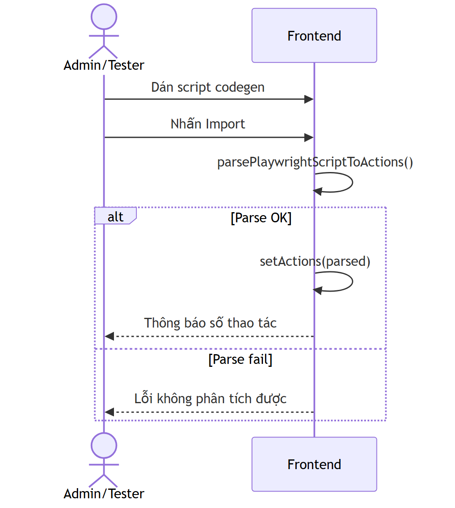

```mermaid
sequenceDiagram
    actor U as Admin/Tester
    participant W as Frontend

    U->>W: Dán script codegen
    U->>W: Nhấn Import
    W->>W: parsePlaywrightScriptToActions()
    alt Parse OK
        W->>W: setActions(parsed)
        W-->>U: Thông báo số thao tác
    else Parse fail
        W-->>U: Lỗi không phân tích được
    end
```

#### Biểu đồ hoạt động — ĐC-34

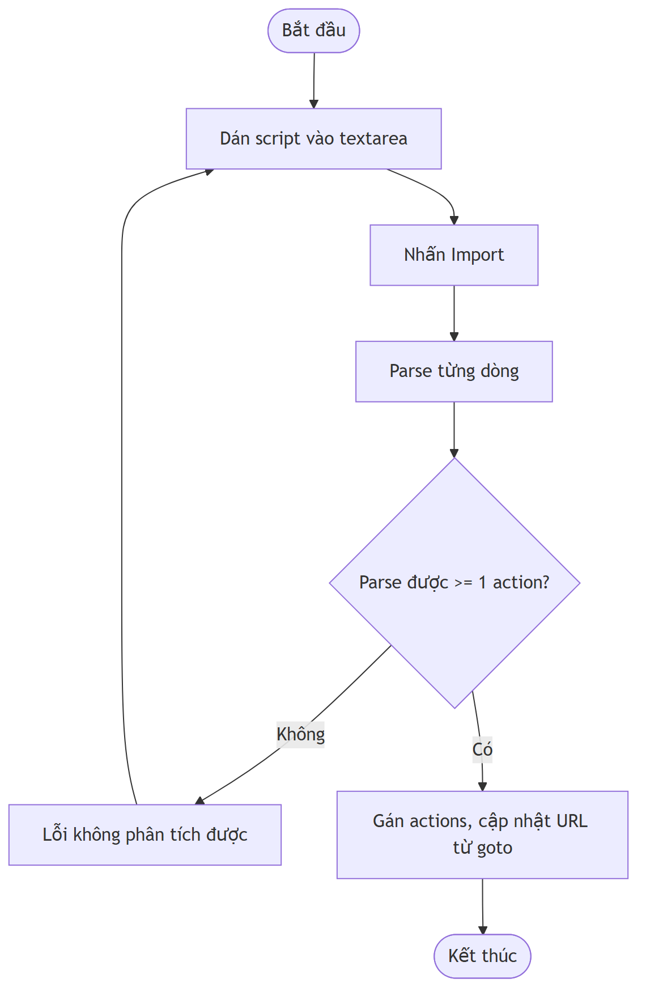

```mermaid
flowchart TD
    A([Bắt đầu]) --> B[Dán script vào textarea]
    B --> C[Nhấn Import]
    C --> D[Parse từng dòng]
    D --> E{Parse được >= 1 action?}
    E -- Không --> F[Lỗi không phân tích được]
    E -- Có --> G[Gán actions, cập nhật URL từ goto]
    G --> H([Kết thúc])
    F --> B
```

---

---

### Bảng 3.37 — ĐC-35: Phân tích ghi thao tác thông minh (Smart Record)

| Cột | Nội dung |
|-----|----------|
| **Tên Usecase** | Smart Record |
| **Tác nhân** | Admin, Tester |
| **Mục đích** | Đánh giá độ ổn định selector và gợi ý cải thiện |
| **Điều kiện tiên quyết** | Có URL và ít nhất 1 action |
| **Mô tả chung** | POST /projects/:id/tests/smart-record |
| **Luồng sự kiện** | 1. Nhấn phân tích smart. 2. Gửi url + actions. 3. API tính selectorScore, smartSteps, suggestions. 4. Hiển thị JSON preview |
| **Ngoại lệ** | E1: 400 dữ liệu. E2: API lỗi |
| **Các yêu cầu đặc biệt** | Gợi ý thêm assertText sau thao tác quan trọng |

#### Biểu đồ trình tự — ĐC-35

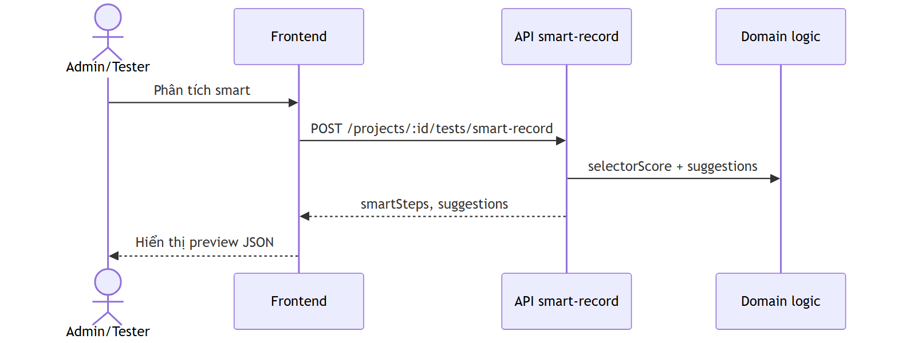

```mermaid
sequenceDiagram
    actor U as Admin/Tester
    participant W as Frontend
    participant API as API smart-record
    participant DOM as Domain logic

    U->>W: Phân tích smart
    W->>API: POST /projects/:id/tests/smart-record
    API->>DOM: selectorScore + suggestions
    API-->>W: smartSteps, suggestions
    W-->>U: Hiển thị preview JSON
```

#### Biểu đồ hoạt động — ĐC-35

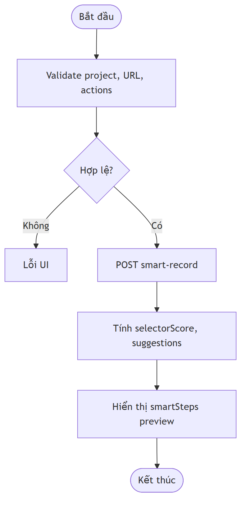

```mermaid
flowchart TD
    A([Bắt đầu]) --> B[Validate project, URL, actions]
    B --> C{Hợp lệ?}
    C -- Không --> D[Lỗi UI]
    C -- Có --> E[POST smart-record]
    E --> F[Tính selectorScore, suggestions]
    F --> G[Hiển thị smartSteps preview]
    G --> H([Kết thúc])
```

---

---

### Bảng 3.38 — ĐC-36: Tạo test case ở trạng thái Draft

| Cột | Nội dung |
|-----|----------|
| **Tên Usecase** | Tạo test case Draft |
| **Tác nhân** | Admin, Tester |
| **Mục đích** | Lưu test case version 1 lifecycle Draft từ recorder |
| **Điều kiện tiên quyết** | ≥1 thao tác hợp lệ ngoài navigate |
| **Mô tả chung** | POST /projects/:id/tests — tạo TestCase + TestCaseVersion |
| **Luồng sự kiện** | 1. Nhấn tạo test draft. 2. Build steps (navigate + recorded steps). 3. POST {name, platform, steps}. 4. parseStep validate. 5. Tạo case + version content Draft. 6. Hiển thị id, version |
| **Ngoại lệ** | E1: Step invalid → 400. E2: Project không tồn tại → 404 |
| **Các yêu cầu đặc biệt** | platform mặc định desktop-web |

#### Biểu đồ trình tự — ĐC-36

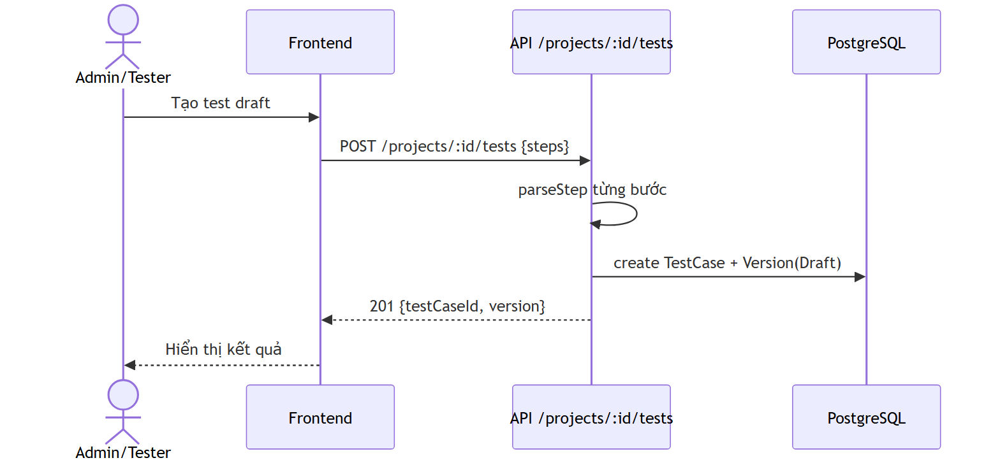

```mermaid
sequenceDiagram
    actor U as Admin/Tester
    participant W as Frontend
    participant API as API /projects/:id/tests
    participant DB as PostgreSQL

    U->>W: Tạo test draft
    W->>API: POST /projects/:id/tests {steps}
    API->>API: parseStep từng bước
    API->>DB: create TestCase + Version(Draft)
    API-->>W: 201 {testCaseId, version}
    W-->>U: Hiển thị kết quả
```

#### Biểu đồ hoạt động — ĐC-36

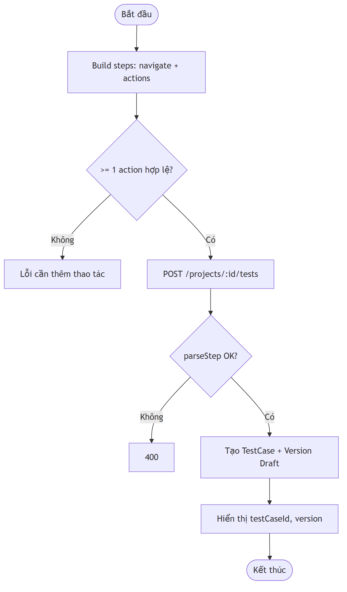

```mermaid
flowchart TD
    A([Bắt đầu]) --> B[Build steps: navigate + actions]
    B --> C{>= 1 action hợp lệ?}
    C -- Không --> D[Lỗi cần thêm thao tác]
    C -- Có --> E[POST /projects/:id/tests]
    E --> F{parseStep OK?}
    F -- Không --> G[400]
    F -- Có --> H[Tạo TestCase + Version Draft]
    H --> I[Hiển thị testCaseId, version]
    I --> J([Kết thúc])
```

---

---

### Bảng 3.39 — ĐC-37: Publish test case

| Cột | Nội dung |
|-----|----------|
| **Tên Usecase** | Publish test case |
| **Tác nhân** | Admin, Tester |
| **Mục đích** | Chuyển test case sang Published sau validate |
| **Điều kiện tiên quyết** | Có testCaseId, projectId; version mới nhất tồn tại |
| **Mô tả chung** | `/editor` — POST .../tests/:testCaseId/publish |
| **Luồng sự kiện** | 1. Nhập project ID, test case ID. 2. Publish. 3. validateForPublish(steps, lifecycle, platform). 4. Cập nhật content lifecycle Published. 5. Trả ok + version |
| **Ngoại lệ** | E1: Validation fail → 400 errors[]. E2: Không tìm thấy case → 404 |
| **Các yêu cầu đặc biệt** | Validate control.loop, control.if, component.call nếu có |

#### Biểu đồ trình tự — ĐC-37

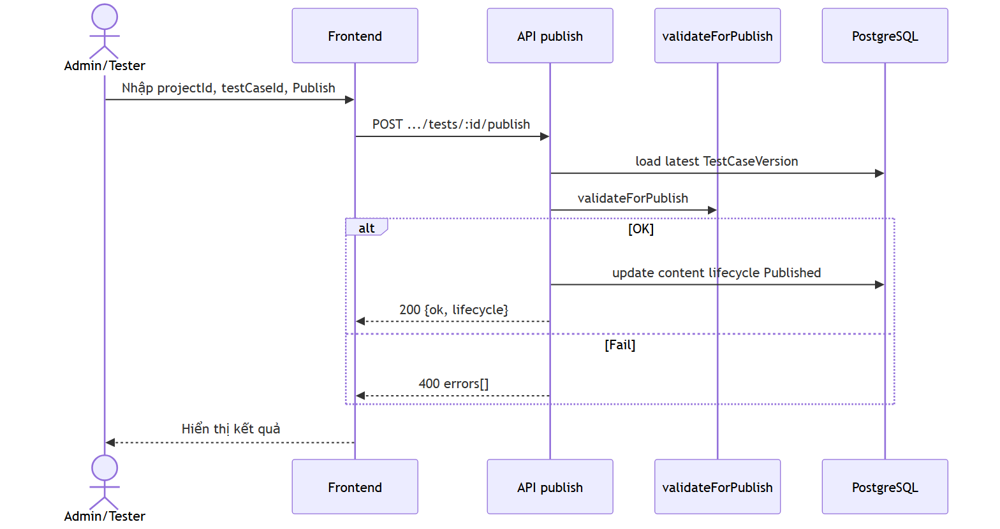

```mermaid
sequenceDiagram
    actor U as Admin/Tester
    participant W as Frontend
    participant API as API publish
    participant DOM as validateForPublish
    participant DB as PostgreSQL

    U->>W: Nhập projectId, testCaseId, Publish
    W->>API: POST .../tests/:id/publish
    API->>DB: load latest TestCaseVersion
    API->>DOM: validateForPublish
    alt OK
        API->>DB: update content lifecycle Published
        API-->>W: 200 {ok, lifecycle}
    else Fail
        API-->>W: 400 errors[]
    end
    W-->>U: Hiển thị kết quả
```

#### Biểu đồ hoạt động — ĐC-37

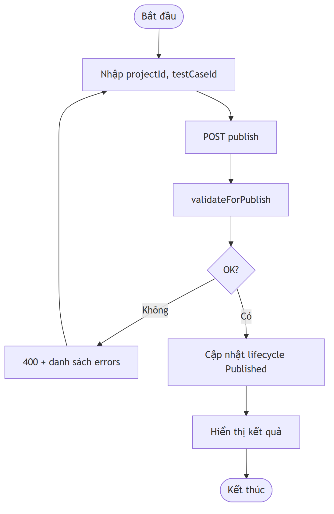

```mermaid
flowchart TD
    A([Bắt đầu]) --> B[Nhập projectId, testCaseId]
    B --> C[POST publish]
    C --> D[validateForPublish]
    D --> E{OK?}
    E -- Không --> F[400 + danh sách errors]
    E -- Có --> G[Cập nhật lifecycle Published]
    G --> H[Hiển thị kết quả]
    H --> I([Kết thúc])
    F --> B
```

---

## A.9. Bộ kiểm thử

---

## Nhóm STT 11 — Chạy test suite

| Thuộc tính nhóm | Giá trị |
|-----------------|--------|
| **Mã use case** | ĐC-38 |
| **Số use case** | 1 |
| **Bảng đặc tả** | Bảng 3.40 – 3.40 (chi tiết: `11`) |
| **Màn hình** | /suite-runs |
| **Biểu đồ trình tự** | Hình 3.5.11a — file `16`, STT 11 |
| **Biểu đồ hoạt động** | Hình 3.5.11b — file `16`, STT 11 |

### Danh sách use case trong nhóm

| Mã | Tên use case | Bảng |
|----|--------------|------|
| ĐC-38 | Chạy test suite từ giao diện | Bảng 3.40 |

### Biểu đồ trình tự (Sequence) — 3.5.11a

> **Hình 3.5.11a** — Chạy test suite

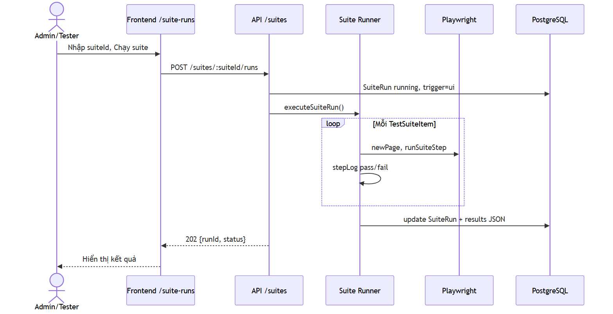

```mermaid
sequenceDiagram
    actor U as Admin/Tester
    participant W as Frontend /suite-runs
    participant API as API /suites
    participant SR as Suite Runner
    participant PW as Playwright
    participant DB as PostgreSQL

    U->>W: Nhập suiteId, Chạy suite
    W->>API: POST /suites/:suiteId/runs
    API->>DB: SuiteRun running, trigger=ui
    API->>SR: executeSuiteRun()
    loop Mỗi TestSuiteItem
        SR->>PW: newPage, runSuiteStep
        SR->>SR: stepLog pass/fail
    end
    SR->>DB: update SuiteRun + results JSON
    API-->>W: 202 {runId, status}
    W-->>U: Hiển thị kết quả
```

### Biểu đồ hoạt động (Activity) — 3.5.11b

> **Hình 3.5.11b** — Chạy test suite

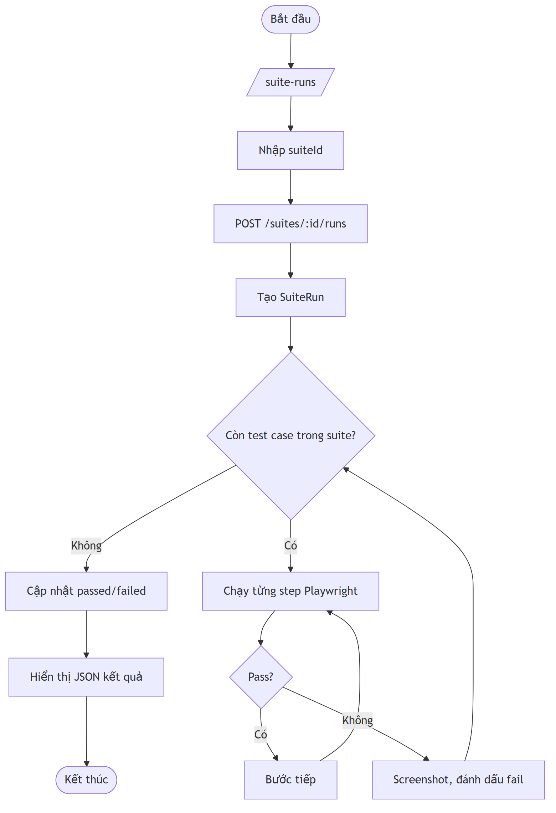

```mermaid
flowchart TD
    A([Bắt đầu]) --> B[/suite-runs/]
    B --> C[Nhập suiteId]
    C --> D[POST /suites/:id/runs]
    D --> E[Tạo SuiteRun]
    E --> F{Còn test case trong suite?}
    F -- Không --> K[Cập nhật passed/failed]
    F -- Có --> G[Chạy từng step Playwright]
    G --> H{Pass?}
    H -- Có --> I[Bước tiếp]
    I --> G
    H -- Không --> J[Screenshot, đánh dấu fail]
    J --> F
    K --> L[Hiển thị JSON kết quả]
    L --> M([Kết thúc])
```

### Đặc tả chi tiết (8 cột)

### Bảng 3.40 — ĐC-38: Chạy test suite từ giao diện

| Cột | Nội dung |
|-----|----------|
| **Tên Usecase** | Chạy test suite (UI) |
| **Tác nhân** | Admin, Tester |
| **Mục đích** | Thực thi regression suite gồm nhiều test case version |
| **Điều kiện tiên quyết** | Suite tồn tại; user access project của suite |
| **Mô tả chung** | `/suite-runs` — POST /suites/:suiteId/runs {environment} |
| **Luồng sự kiện** | 1. Nhập suite ID. 2. Chạy suite. 3. Tạo SuiteRun status running, trigger=ui. 4. executeSuiteRun: lặp items, Playwright từng case. 5. Ghi results JSON. 6. Cập nhật passed/failed. 7. Hiển thị response |
| **Ngoại lệ** | E1: Suite không tồn tại → 404. E2: Lỗi executor → 500 + runId failed |
| **Các yêu cầu đặc biệt** | Dùng chromium; timeout step 3000ms trong suite runner |

#### Biểu đồ trình tự — ĐC-38

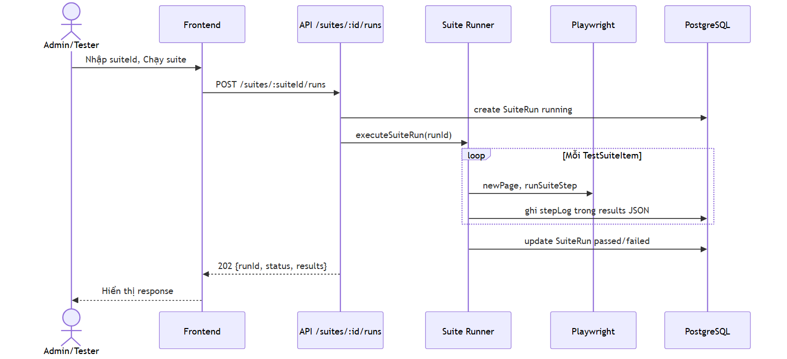

```mermaid
sequenceDiagram
    actor U as Admin/Tester
    participant W as Frontend
    participant API as API /suites/:id/runs
    participant SR as Suite Runner
    participant PW as Playwright
    participant DB as PostgreSQL

    U->>W: Nhập suiteId, Chạy suite
    W->>API: POST /suites/:suiteId/runs
    API->>DB: create SuiteRun running
    API->>SR: executeSuiteRun(runId)
    loop Mỗi TestSuiteItem
        SR->>PW: newPage, runSuiteStep
        SR->>DB: ghi stepLog trong results JSON
    end
    SR->>DB: update SuiteRun passed/failed
    API-->>W: 202 {runId, status, results}
    W-->>U: Hiển thị response
```

#### Biểu đồ hoạt động — ĐC-38

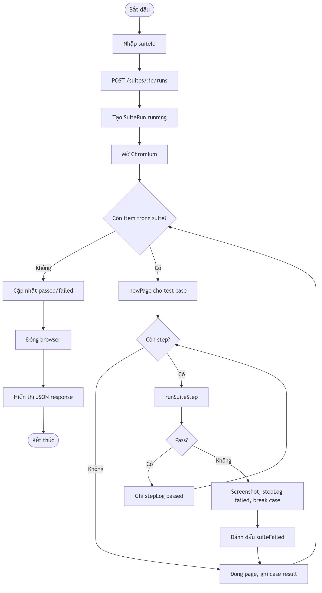

```mermaid
flowchart TD
    A([Bắt đầu]) --> B[Nhập suiteId]
    B --> C[POST /suites/:id/runs]
    C --> D[Tạo SuiteRun running]
    D --> E[Mở Chromium]
    E --> F{Còn item trong suite?}
    F -- Không --> M[Cập nhật passed/failed]
    F -- Có --> G[newPage cho test case]
    G --> H{Còn step?}
    H -- Không --> I[Đóng page, ghi case result]
    I --> F
    H -- Có --> J[runSuiteStep]
    J --> K{Pass?}
    K -- Có --> L[Ghi stepLog passed]
    L --> H
    K -- Không --> N[Screenshot, stepLog failed, break case]
    N --> O[Đánh dấu suiteFailed]
    O --> I
    M --> P[Đóng browser]
    P --> Q[Hiển thị JSON response]
    Q --> R([Kết thúc])
```

---

## A.10. Quản trị người dùng

---

## Nhóm STT 12 — Quản trị người dùng

| Thuộc tính nhóm | Giá trị |
|-----------------|--------|
| **Mã use case** | ĐC-39 → ĐC-42 |
| **Số use case** | 4 |
| **Bảng đặc tả** | Bảng 3.41 – 3.44 (chi tiết: `11`) |
| **Màn hình** | /admin/users |
| **Biểu đồ trình tự** | Hình 3.5.12a — file `16`, STT 12 |
| **Biểu đồ hoạt động** | Hình 3.5.12b — file `16`, STT 12 |

### Danh sách use case trong nhóm

| Mã | Tên use case | Bảng |
|----|--------------|------|
| ĐC-39 | Xem danh sách người dùng | Bảng 3.41 |
| ĐC-40 | Tạo người dùng (Admin) | Bảng 3.42 |
| ĐC-41 | Cập nhật thông tin / quyền người dùng | Bảng 3.43 |
| ĐC-42 | Xóa người dùng | Bảng 3.44 |

### Biểu đồ trình tự (Sequence) — 3.5.12a

> **Hình 3.5.12a** — Quản trị người dùng

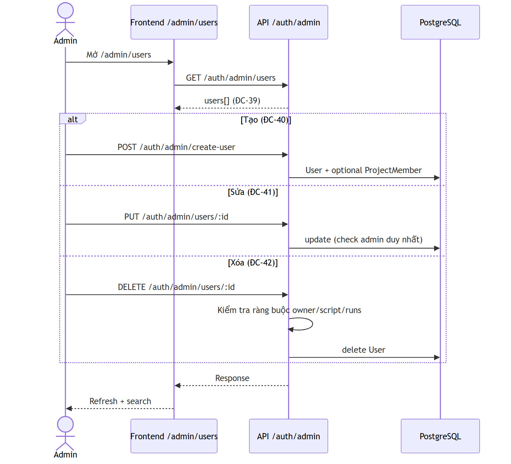

```mermaid
sequenceDiagram
    actor A as Admin
    participant W as Frontend /admin/users
    participant API as API /auth/admin
    participant DB as PostgreSQL

    A->>W: Mở /admin/users
    W->>API: GET /auth/admin/users
    API-->>W: users[] (ĐC-39)

    alt Tạo (ĐC-40)
        A->>API: POST /auth/admin/create-user
        API->>DB: User + optional ProjectMember
    else Sửa (ĐC-41)
        A->>API: PUT /auth/admin/users/:id
        API->>DB: update (check admin duy nhất)
    else Xóa (ĐC-42)
        A->>API: DELETE /auth/admin/users/:id
        API->>API: Kiểm tra ràng buộc owner/script/runs
        API->>DB: delete User
    end
    API-->>W: Response
    W-->>A: Refresh + search
```

### Biểu đồ hoạt động (Activity) — 3.5.12b

> **Hình 3.5.12b** — Quản trị người dùng

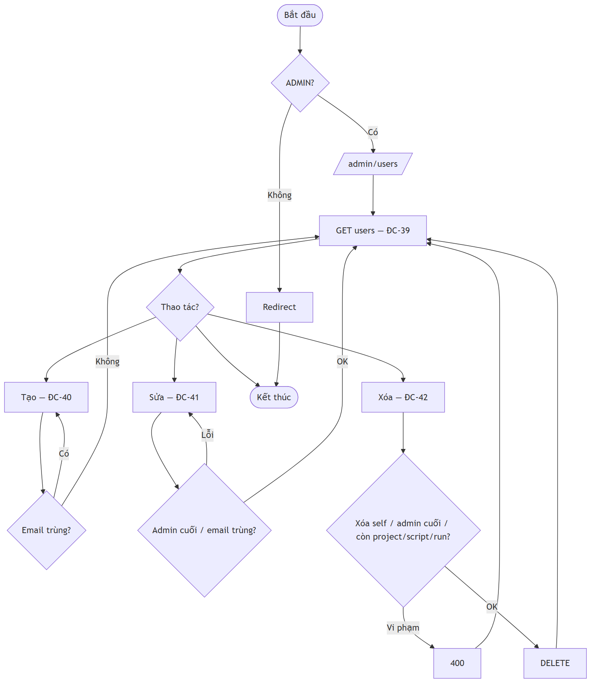

```mermaid
flowchart TD
    A([Bắt đầu]) --> B{ADMIN?}
    B -- Không --> C[Redirect]
    B -- Có --> D[/admin/users/]
    D --> E[GET users — ĐC-39]
    E --> F{Thao tác?}

    F --> G[Tạo — ĐC-40]
    G --> G1{Email trùng?}
    G1 -- Có --> G
    G1 -- Không --> E

    F --> H[Sửa — ĐC-41]
    H --> H1{Admin cuối / email trùng?}
    H1 -- Lỗi --> H
    H1 -- OK --> E

    F --> I[Xóa — ĐC-42]
    I --> I1{Xóa self / admin cuối / còn project/script/run?}
    I1 -- Vi phạm --> I2[400]
    I2 --> E
    I1 -- OK --> I3[DELETE]
    I3 --> E

    F --> J([Kết thúc])
    C --> J
```

### Đặc tả chi tiết (8 cột)

### Bảng 3.41 — ĐC-39: Xem danh sách người dùng

| Cột | Nội dung |
|-----|----------|
| **Tên Usecase** | Xem danh sách người dùng |
| **Tác nhân** | Admin |
| **Mục đích** | Quản trị tài khoản hệ thống |
| **Điều kiện tiên quyết** | Role ADMIN |
| **Mô tả chung** | GET /auth/admin/users |
| **Luồng sự kiện** | 1. Mở `/admin/users`. 2. GET users + GET projects (cho dropdown). 3. Hiển thị bảng, search local |
| **Ngoại lệ** | E1: 403 → redirect dashboard |
| **Các yêu cầu đặc biệt** | Sắp xếp role, fullName |

#### Biểu đồ trình tự — ĐC-39

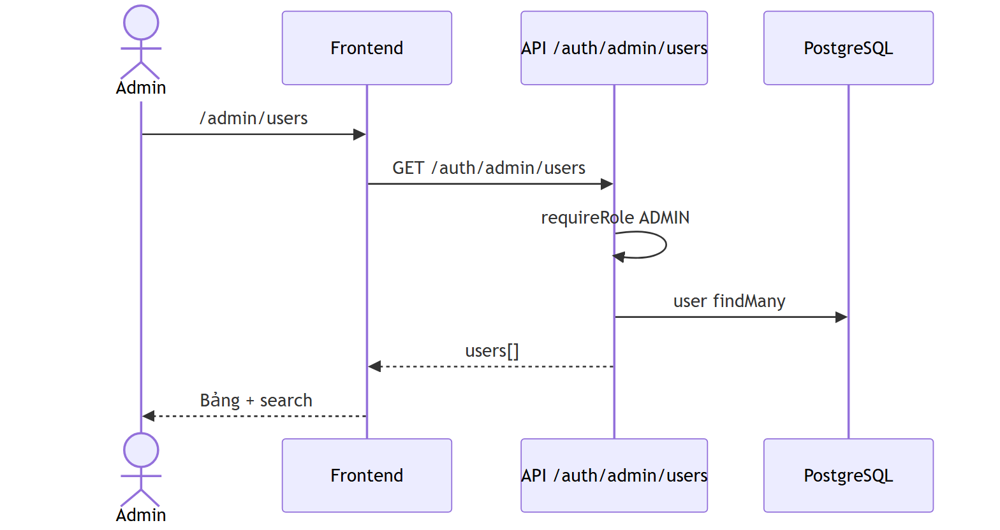

```mermaid
sequenceDiagram
    actor A as Admin
    participant W as Frontend
    participant API as API /auth/admin/users
    participant DB as PostgreSQL

    A->>W: /admin/users
    W->>API: GET /auth/admin/users
    API->>API: requireRole ADMIN
    API->>DB: user findMany
    API-->>W: users[]
    W-->>A: Bảng + search
```

#### Biểu đồ hoạt động — ĐC-39

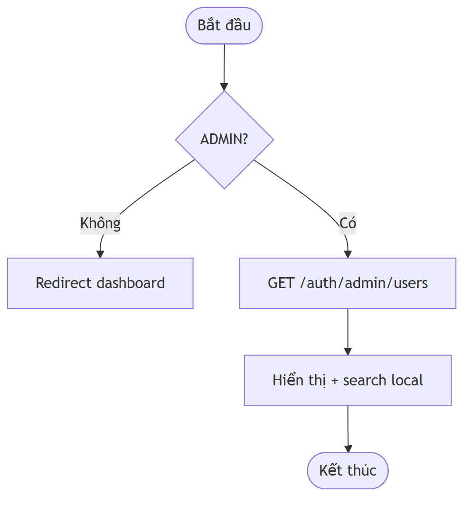

```mermaid
flowchart TD
    A([Bắt đầu]) --> B{ADMIN?}
    B -- Không --> C[Redirect dashboard]
    B -- Có --> D[GET /auth/admin/users]
    D --> E[Hiển thị + search local]
    E --> F([Kết thúc])
```

---

---

### Bảng 3.42 — ĐC-40: Tạo người dùng (Admin)

| Cột | Nội dung |
|-----|----------|
| **Tên Usecase** | Tạo người dùng (Admin) |
| **Tác nhân** | Admin |
| **Mục đích** | Tạo tài khoản với role bất kỳ kể cả ADMIN |
| **Điều kiện tiên quyết** | Email chưa tồn tại; MK đủ mạnh |
| **Mô tả chung** | POST /auth/admin/create-user; optional projectId → ProjectMember |
| **Luồng sự kiện** | 1. Điền form tạo user. 2. Chọn role, project (optional). 3. POST. 4. Tạo user. 5. Gán member nếu có projectId. 6. Refresh list |
| **Ngoại lệ** | E1: Email trùng → 409. E2: Project không accessible → 400 |
| **Các yêu cầu đặc biệt** | Chỉ Admin gọi được endpoint |

#### Biểu đồ trình tự — ĐC-40

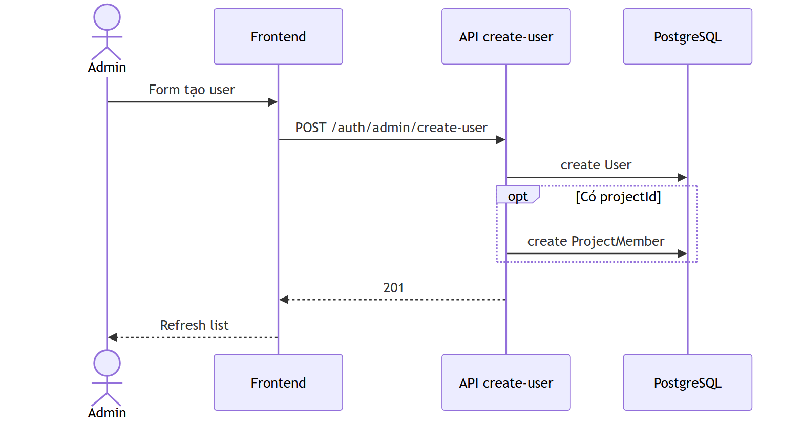

```mermaid
sequenceDiagram
    actor A as Admin
    participant W as Frontend
    participant API as API create-user
    participant DB as PostgreSQL

    A->>W: Form tạo user
    W->>API: POST /auth/admin/create-user
    API->>DB: create User
    opt Có projectId
        API->>DB: create ProjectMember
    end
    API-->>W: 201
    W-->>A: Refresh list
```

#### Biểu đồ hoạt động — ĐC-40

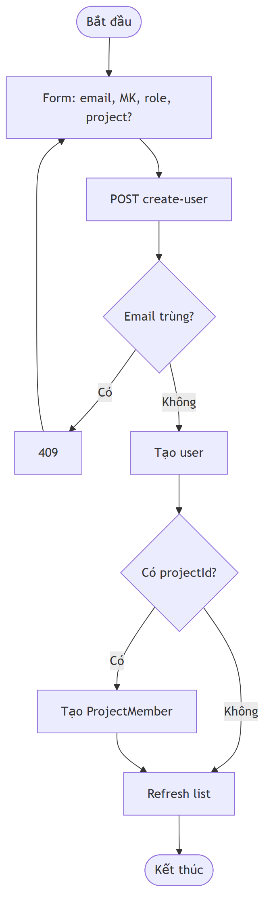

```mermaid
flowchart TD
    A([Bắt đầu]) --> B[Form: email, MK, role, project?]
    B --> C[POST create-user]
    C --> D{Email trùng?}
    D -- Có --> E[409]
    D -- Không --> F[Tạo user]
    F --> G{Có projectId?}
    G -- Có --> H[Tạo ProjectMember]
    G -- Không --> I[Refresh list]
    H --> I
    I --> J([Kết thúc])
    E --> B
```

---

---

### Bảng 3.43 — ĐC-41: Cập nhật thông tin / quyền người dùng

| Cột | Nội dung |
|-----|----------|
| **Tên Usecase** | Cập nhật người dùng |
| **Tác nhân** | Admin |
| **Mục đích** | Sửa họ tên, email, role, mật khẩu |
| **Điều kiện tiên quyết** | User id tồn tại; ít nhất một field thay đổi |
| **Mô tả chung** | PUT /auth/admin/users/:id |
| **Luồng sự kiện** | 1. Mở modal sửa. 2. Sửa field. 3. PUT. 4. Kiểm tra email trùng, ràng buộc admin duy nhất. 5. Cập nhật. 6. Refresh |
| **Ngoại lệ** | E1: Hạ quyền admin cuối → 400. E2: Email taken → 409 |
| **Các yêu cầu đặc biệt** | Không hạ quyền admin của chính mình nếu là admin duy nhất |

#### Biểu đồ trình tự — ĐC-41

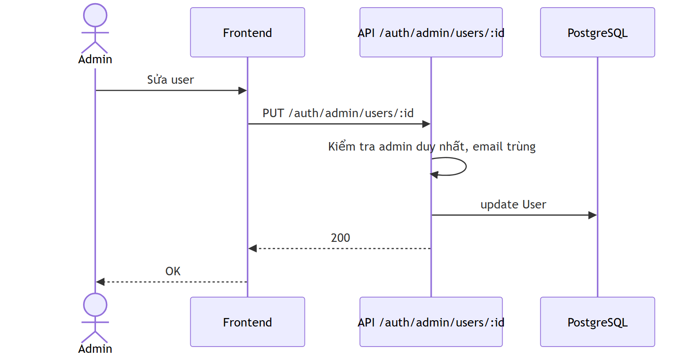

```mermaid
sequenceDiagram
    actor A as Admin
    participant W as Frontend
    participant API as API /auth/admin/users/:id
    participant DB as PostgreSQL

    A->>W: Sửa user
    W->>API: PUT /auth/admin/users/:id
    API->>API: Kiểm tra admin duy nhất, email trùng
    API->>DB: update User
    API-->>W: 200
    W-->>A: OK
```

#### Biểu đồ hoạt động — ĐC-41

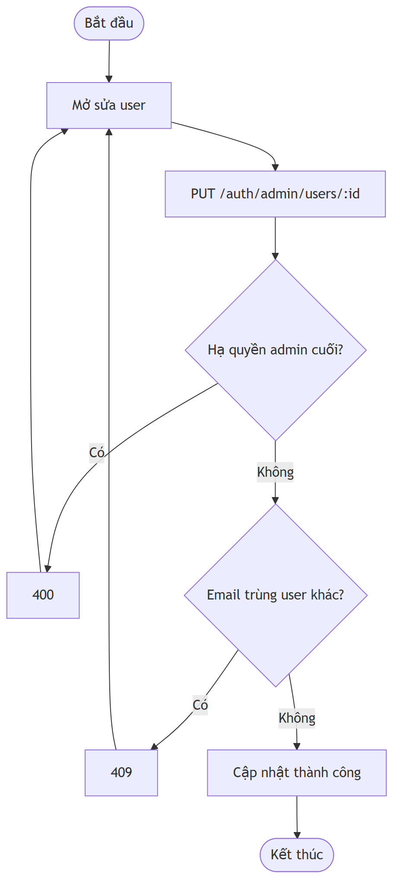

```mermaid
flowchart TD
    A([Bắt đầu]) --> B[Mở sửa user]
    B --> C[PUT /auth/admin/users/:id]
    C --> D{Hạ quyền admin cuối?}
    D -- Có --> E[400]
    D -- Không --> F{Email trùng user khác?}
    F -- Có --> G[409]
    F -- Không --> H[Cập nhật thành công]
    H --> I([Kết thúc])
    E --> B
    G --> B
```

---

---

### Bảng 3.44 — ĐC-42: Xóa người dùng

| Cột | Nội dung |
|-----|----------|
| **Tên Usecase** | Xóa người dùng |
| **Tác nhân** | Admin |
| **Mục đích** | Loại tài khoản không còn dùng |
| **Điều kiện tiên quyết** | Không phải chính mình; thỏa ràng buộc nghiệp vụ |
| **Mô tả chung** | DELETE /auth/admin/users/:id |
| **Luồng sự kiện** | 1. Chọn xóa, xác nhận. 2. DELETE. 3. Kiểm tra: không xóa self; không xóa admin cuối; không xóa nếu owner project / creator script / có runs. 4. Xóa user. 5. 204 |
| **Ngoại lệ** | E1: Còn owned projects → 400 message. E2: Còn scripts created → 400. E3: Còn runs → 400 |
| **Các yêu cầu đặc biệt** | Bảo vệ toàn vẹn dữ liệu lịch sử kiểm thử |

#### Biểu đồ trình tự — ĐC-42

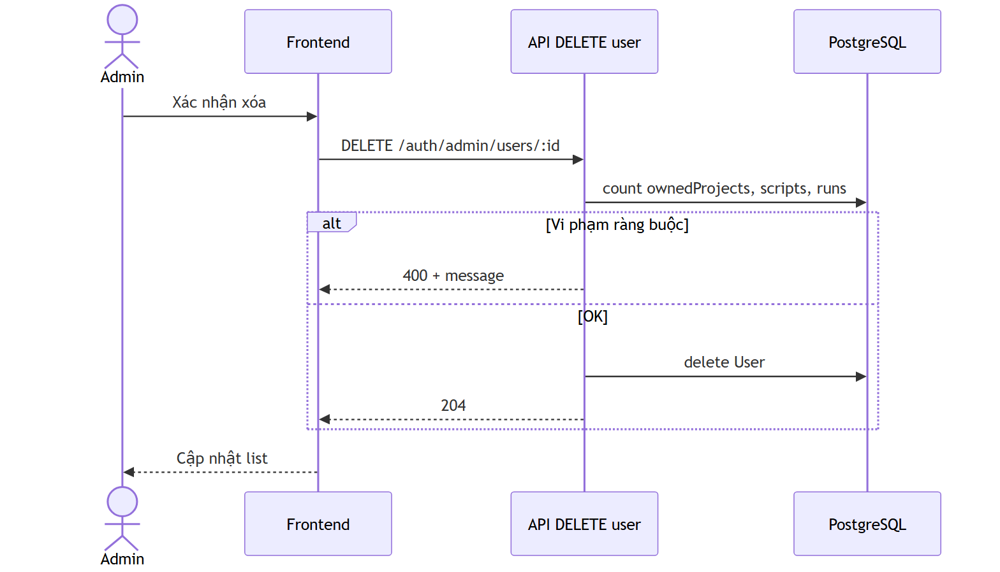

```mermaid
sequenceDiagram
    actor A as Admin
    participant W as Frontend
    participant API as API DELETE user
    participant DB as PostgreSQL

    A->>W: Xác nhận xóa
    W->>API: DELETE /auth/admin/users/:id
    API->>DB: count ownedProjects, scripts, runs
    alt Vi phạm ràng buộc
        API-->>W: 400 + message
    else OK
        API->>DB: delete User
        API-->>W: 204
    end
    W-->>A: Cập nhật list
```

#### Biểu đồ hoạt động — ĐC-42

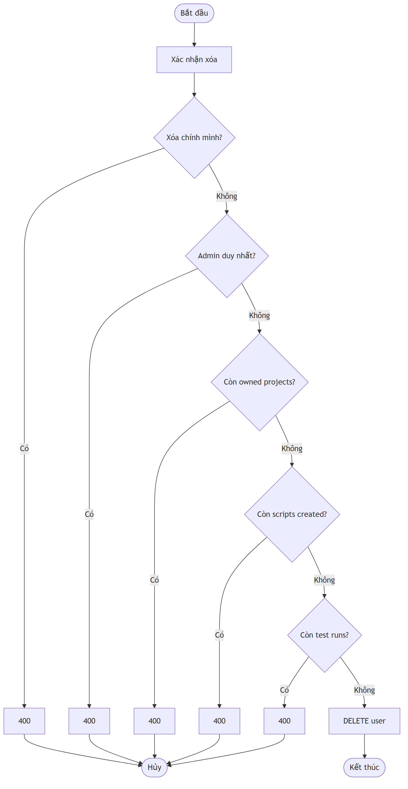

```mermaid
flowchart TD
    A([Bắt đầu]) --> B[Xác nhận xóa]
    B --> C{Xóa chính mình?}
    C -- Có --> D[400]
    C -- Không --> E{Admin duy nhất?}
    E -- Có --> F[400]
    E -- Không --> G{Còn owned projects?}
    G -- Có --> H[400]
    G -- Không --> I{Còn scripts created?}
    I -- Có --> J[400]
    I -- Không --> K{Còn test runs?}
    K -- Có --> L[400]
    K -- Không --> M[DELETE user]
    M --> N([Kết thúc])
    D --> O([Hủy])
    F --> O
    H --> O
    J --> O
    L --> O
```

---

## Phụ lục — Ánh xạ mã use case

| Mã | Bảng | Màn hình |
|----|------|----------|
| ĐC-01 | 3.3 | `/` |
| ĐC-02 | 3.4 | `/login` |
| ĐC-03 | 3.5 | `/register` |
| ĐC-04 | 3.6 | `/forgot-password` |
| ĐC-05 | 3.7 | `/reset-password` |
| ĐC-06 | 3.8 | `/settings/account` |
| ĐC-07 | 3.9 | AppShell |
| ĐC-08 | 3.10 | `/dashboard` |
| ĐC-09 | 3.11 | `/projects` |
| ĐC-10 | 3.12 | `/projects` |
| ĐC-11 | 3.13 | `/projects` |
| ĐC-12 | 3.14 | `/projects` |
| ĐC-13 | 3.15 | `/scripts` |
| ĐC-14 | 3.16 | `/scripts` |
| ĐC-15 | 3.17 | `/scripts` |
| ĐC-16 | 3.18 | `/scripts/[id]` |
| ĐC-17 | 3.19 | `/scripts/[id]` |
| ĐC-18 | 3.20 | `/scripts/[id]` |
| ĐC-19 | 3.21 | `/scripts/[id]` |
| ĐC-20 | 3.22 | `/objects` |
| ĐC-21 | 3.23 | `/objects` |
| ĐC-22 | 3.24 | `/objects` |
| ĐC-23 | 3.25 | `/objects` |
| ĐC-24 | 3.26 | `/datasets` |
| ĐC-25 | 3.27 | `/datasets` |
| ĐC-26 | 3.28 | `/datasets` |
| ĐC-27 | 3.29 | `/datasets` |
| ĐC-28 | 3.30 | `/reports` |
| ĐC-29 | 3.31 | `/reports` |
| ĐC-30 | 3.32 | `/reports` |
| ĐC-31 | 3.33 | `/reports` |
| ĐC-32 | 3.34 | `/report/[runId]` |
| ĐC-33 | 3.35 | `/recorder` |
| ĐC-34 | 3.36 | `/recorder` |
| ĐC-35 | 3.37 | `/recorder` |
| ĐC-36 | 3.38 | `/recorder` |
| ĐC-37 | 3.39 | `/editor` |
| ĐC-38 | 3.40 | `/suite-runs` |
| ĐC-39 | 3.41 | `/admin/users` |
| ĐC-40 | 3.42 | `/admin/users` |
| ĐC-41 | 3.43 | `/admin/users` |
| ĐC-42 | 3.44 | `/admin/users` |

*Tổng: **42** đặc tả chức năng (Bảng 3.3 – 3.44).*

---

## Liên kết tài liệu

| File | Nội dung |
|------|----------|
| `11-dac-ta-chuc-nang-giao-dien-web.md` | 42 bảng đặc tả (đánh số Bảng 3.3–3.44) |
| `17-dac-ta-chuc-nang-gop-nhom.md` | **File này** — cùng nội dung, nhóm theo STT 1–12 |
| `16-bieu-do-gop-trinh-tu-va-hoat-dong.md` | 12 nhóm biểu đồ Sequence + Activity |
| `12`, `13` | Phụ lục: 42 biểu đồ tách riêng (nếu cần) |
