# UML gộp đơn giản theo mẫu (swimlane) — Giao diện web

Tài liệu này cung cấp **12 diagram** (mỗi nhóm 1 *Sequence* + 1 *Activity*) theo hướng dẫn “gộp chức năng” và **nhãn rút gọn** để bạn đưa vào đồ án.

> Cách dùng: Mỗi khối `mermaid` → mở [mermaid.live](https://mermaid.live) → Export PNG/SVG.

## STT 1 — Trang chủ (ĐC-01)

### Sequence
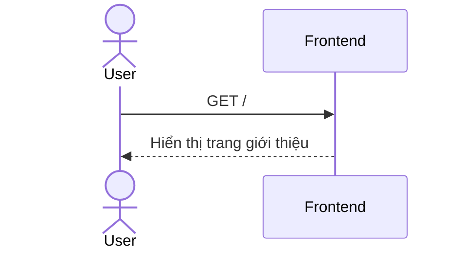
```mermaid
sequenceDiagram
  actor U as User
  participant FE as Frontend
  U->>FE: GET /
  FE-->>U: Hiển thị trang giới thiệu
```

### Activity
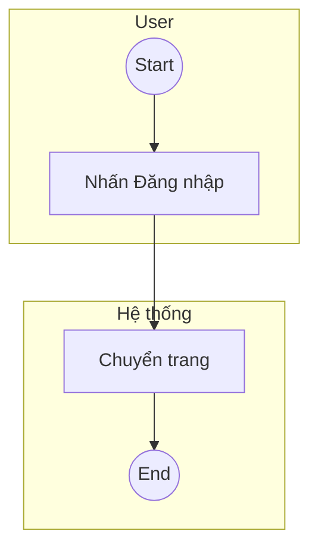
```mermaid
flowchart TD
  subgraph QuanTri[User]
    A((Start)) --> B[Nhấn Đăng nhập]
  end
  subgraph HeThong[Hệ thống]
    C[Chuyển trang] --> D((End))
  end
  B --> C
```

## STT 2 — Xác thực & tài khoản (ĐC-02 → ĐC-07)

### Sequence
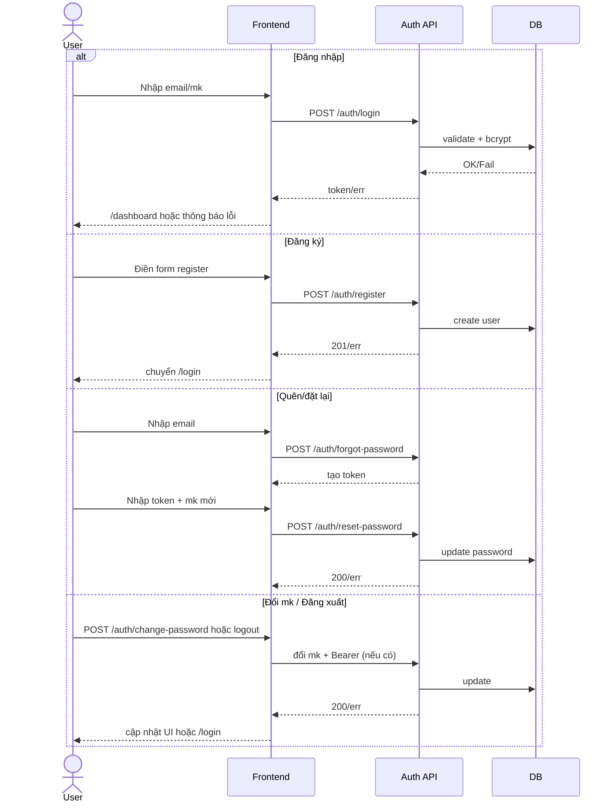
```mermaid
sequenceDiagram
  actor U as User
  participant FE as Frontend
  participant API as Auth API
  participant DB as DB
  alt Đăng nhập
    U->>FE: Nhập email/mk
    FE->>API: POST /auth/login
    API->>DB: validate + bcrypt
    DB-->>API: OK/Fail
    API-->>FE: token/err
    FE-->>U: /dashboard hoặc thông báo lỗi
  else Đăng ký
    U->>FE: Điền form register
    FE->>API: POST /auth/register
    API->>DB: create user
    API-->>FE: 201/err
    FE-->>U: chuyển /login
  else Quên/đặt lại
    U->>FE: Nhập email
    FE->>API: POST /auth/forgot-password
    API-->>FE: tạo token
    U->>FE: Nhập token + mk mới
    FE->>API: POST /auth/reset-password
    API->>DB: update password
    API-->>FE: 200/err
  else Đổi mk / Đăng xuất
    U->>FE: POST /auth/change-password hoặc logout
    FE->>API: đổi mk + Bearer (nếu có)
    API->>DB: update
    API-->>FE: 200/err
    FE-->>U: cập nhật UI hoặc /login
  end
```

### Activity
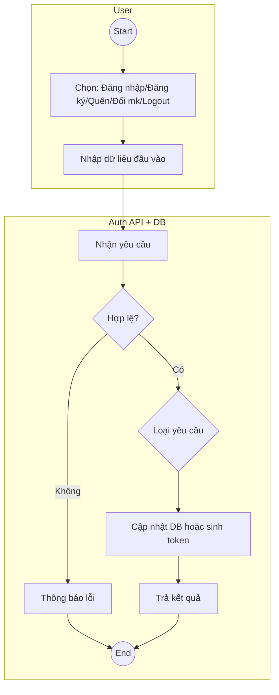
```mermaid
flowchart TD
  subgraph QuanTri[User]
    A((Start)) --> B[Chọn: Đăng nhập/Đăng ký/Quên/Đổi mk/Logout]
    B --> C[Nhập dữ liệu đầu vào]
  end
  subgraph HeThong[Auth API + DB]
    D[Nhận yêu cầu] --> E{Hợp lệ?}
    E -- Không --> F[Thông báo lỗi] --> Z((End))
    E -- Có --> G{Loại yêu cầu}
    G --> H[Cập nhật DB hoặc sinh token]
    H --> I[Trả kết quả]
    I --> Z((End))
  end
  C --> D
```

## STT 3 — Dashboard (ĐC-08)

### Sequence
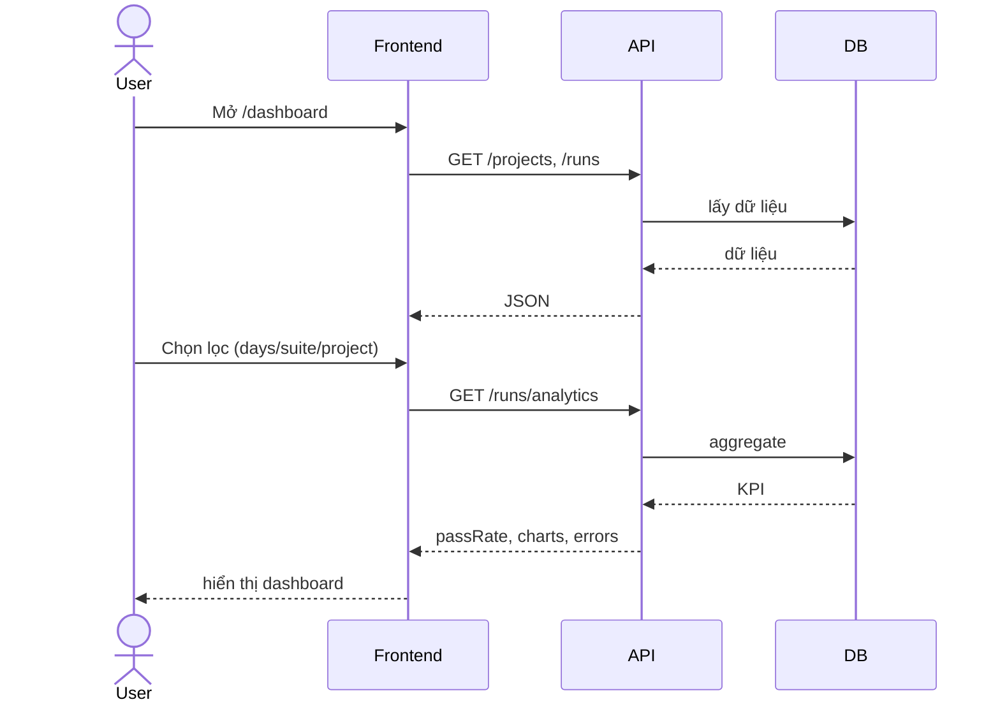
```mermaid
sequenceDiagram
  actor U as User
  participant FE as Frontend
  participant API as API
  participant DB as DB
  U->>FE: Mở /dashboard
  FE->>API: GET /projects, /runs
  API->>DB: lấy dữ liệu
  DB-->>API: dữ liệu
  API-->>FE: JSON
  U->>FE: Chọn lọc (days/suite/project)
  FE->>API: GET /runs/analytics
  API->>DB: aggregate
  DB-->>API: KPI
  API-->>FE: passRate, charts, errors
  FE-->>U: hiển thị dashboard
```

### Activity
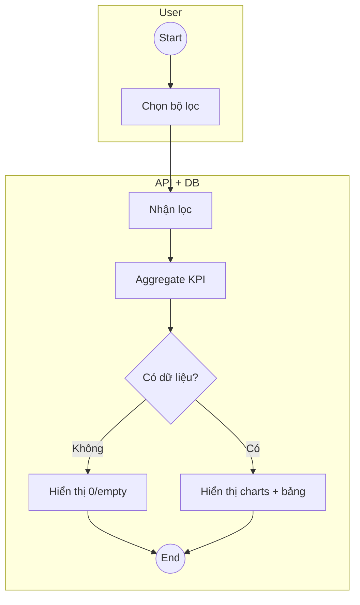
```mermaid
flowchart TD
  subgraph QuanTri[User]
    A((Start)) --> B[Chọn bộ lọc]
  end
  subgraph HeThong[API + DB]
    C[Nhận lọc] --> D[Aggregate KPI]
    D --> E{Có dữ liệu?}
    E -- Không --> F[Hiển thị 0/empty] --> Z((End))
    E -- Có --> G[Hiển thị charts + bảng] --> Z((End))
  end
  B --> C
```

## STT 4 — Quản lý dự án (ĐC-09 → ĐC-12)

### Sequence
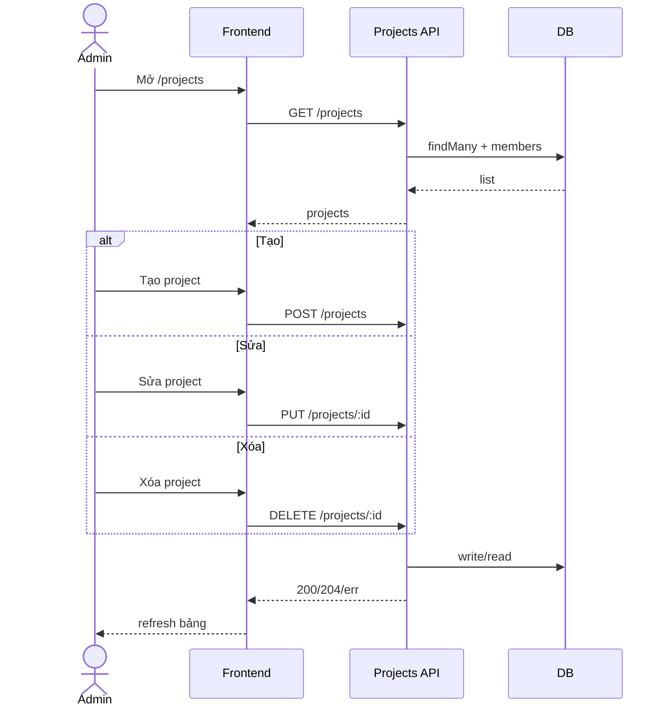
```mermaid
sequenceDiagram
  actor A as Admin
  participant FE as Frontend
  participant API as Projects API
  participant DB as DB
  A->>FE: Mở /projects
  FE->>API: GET /projects
  API->>DB: findMany + members
  DB-->>API: list
  API-->>FE: projects
  alt Tạo
    A->>FE: Tạo project
    FE->>API: POST /projects
  else Sửa
    A->>FE: Sửa project
    FE->>API: PUT /projects/:id
  else Xóa
    A->>FE: Xóa project
    FE->>API: DELETE /projects/:id
  end
  API->>DB: write/read
  API-->>FE: 200/204/err
  FE-->>A: refresh bảng
```

### Activity
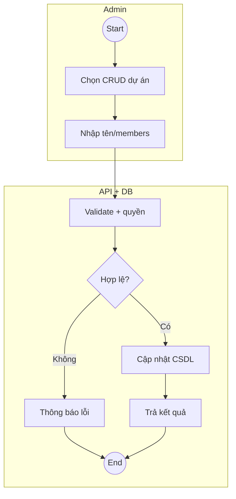
```mermaid
flowchart TD
  subgraph QuanTri[Admin]
    A((Start)) --> B[Chọn CRUD dự án]
    B --> C[Nhập tên/members]
  end
  subgraph HeThong[API + DB]
    D[Validate + quyền] --> E{Hợp lệ?}
    E -- Không --> F[Thông báo lỗi] --> Z((End))
    E -- Có --> G[Cập nhật CSDL]
    G --> H[Trả kết quả]
    H --> Z((End))
  end
  C --> D
```

## STT 5 — Quản lý kịch bản (ĐC-13 → ĐC-18)

### Sequence
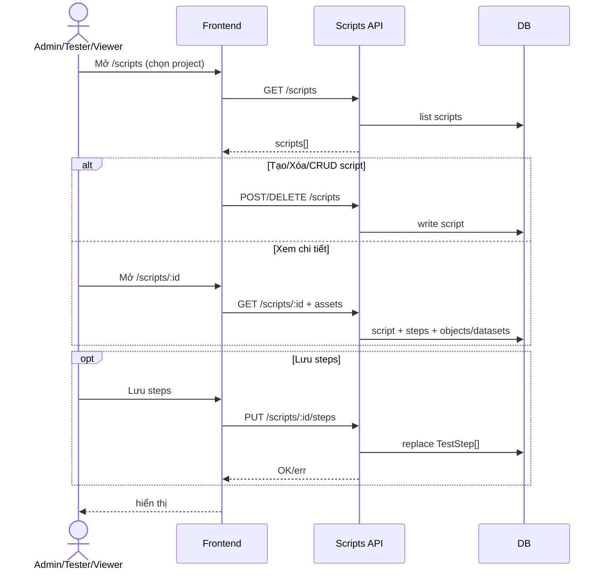
```mermaid
sequenceDiagram
  actor U as Admin/Tester/Viewer
  participant FE as Frontend
  participant API as Scripts API
  participant DB as DB
  U->>FE: Mở /scripts (chọn project)
  FE->>API: GET /scripts
  API->>DB: list scripts
  API-->>FE: scripts[]
  alt Tạo/Xóa/CRUD script
    FE->>API: POST/DELETE /scripts
    API->>DB: write script
  else Xem chi tiết
    U->>FE: Mở /scripts/:id
    FE->>API: GET /scripts/:id + assets
    API->>DB: script + steps + objects/datasets
  end
  opt Lưu steps
    U->>FE: Lưu steps
    FE->>API: PUT /scripts/:id/steps
    API->>DB: replace TestStep[]
    API-->>FE: OK/err
  end
  FE-->>U: hiển thị
```

### Activity
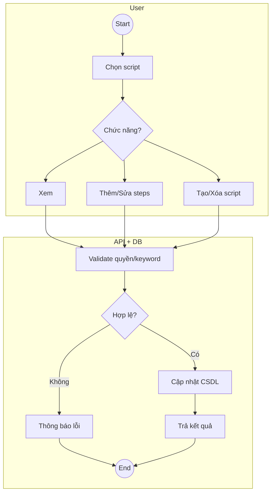
```mermaid
flowchart TD
  subgraph QuanTri[User]
    A((Start)) --> B[Chọn script]
    B --> C{Chức năng?}
    C --> D[Xem]
    C --> E[Thêm/Sửa steps]
    C --> F[Tạo/Xóa script]
  end
  subgraph HeThong[API + DB]
    G[Validate quyền/keyword] --> H{Hợp lệ?}
    H -- Không --> I[Thông báo lỗi] --> Z((End))
    H -- Có --> J[Cập nhật CSDL]
    J --> K[Trả kết quả]
    K --> Z((End))
  end
  D --> G
  E --> G
  F --> G
```

## STT 6 — Thực thi kịch bản (ĐC-19)

### Sequence
```mermaid
sequenceDiagram
  actor U as Admin/Tester
  participant FE as Frontend
  participant API as Runs API
  participant EX as Executor
  participant PW as Playwright
  participant DB as DB
  participant LIN as Linear (optional)
  U->>FE: Chạy test (browser + dataset)
  FE->>API: POST /runs
  API->>EX: executeScriptRun
  EX->>DB: create TestRun queued
  EX->>PW: launch + newPage
  loop Mỗi row dataset
    loop Mỗi step
      EX->>PW: run keyword
      alt Pass
        EX->>DB: insert TestResult passed
      else Fail
        EX->>PW: screenshot
        EX->>DB: insert TestResult failed
        opt Linear configured
          EX->>LIN: create issue
        end
        break
      end
    end
  end
  EX->>DB: update TestRun status
  EX-->>API: results
  API-->>FE: runId + summary
  FE-->>U: hiển thị timeline
```

### Activity
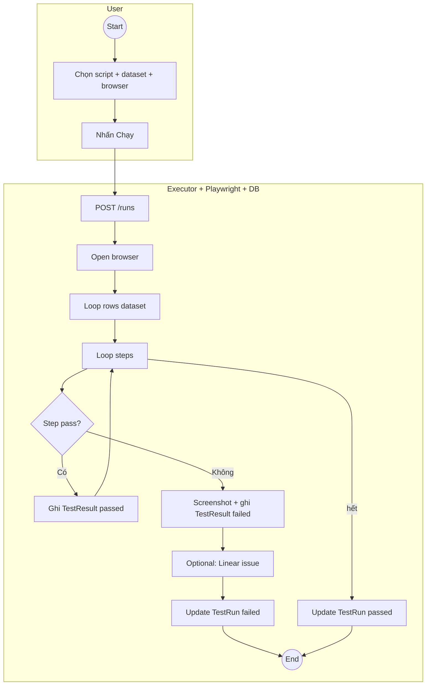
```mermaid
flowchart TD
  subgraph QuanTri[User]
    A((Start)) --> B[Chọn script + dataset + browser]
    B --> C[Nhấn Chạy]
  end
  subgraph HeThong[Executor + Playwright + DB]
    D[POST /runs] --> E[Open browser]
    E --> F[Loop rows dataset]
    F --> G[Loop steps]
    G --> H{Step pass?}
    H -- Có --> I[Ghi TestResult passed]
    H -- Không --> J[Screenshot + ghi TestResult failed]
    I --> G
    J --> K[Optional: Linear issue]
    K --> L[Update TestRun failed]
    G -- hết --> M[Update TestRun passed]
    L --> Z((End))
    M --> Z
  end
  C --> D
```

## STT 7 — Quản lý đối tượng UI (ĐC-20 → ĐC-23)

### Sequence
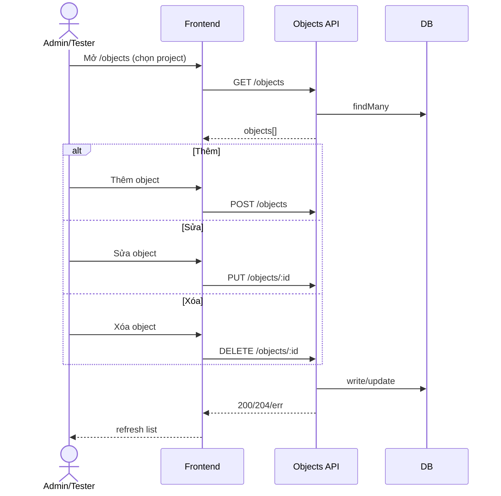
```mermaid
sequenceDiagram
  actor U as Admin/Tester
  participant FE as Frontend
  participant API as Objects API
  participant DB as DB
  U->>FE: Mở /objects (chọn project)
  FE->>API: GET /objects
  API->>DB: findMany
  API-->>FE: objects[]
  alt Thêm
    U->>FE: Thêm object
    FE->>API: POST /objects
  else Sửa
    U->>FE: Sửa object
    FE->>API: PUT /objects/:id
  else Xóa
    U->>FE: Xóa object
    FE->>API: DELETE /objects/:id
  end
  API->>DB: write/update
  API-->>FE: 200/204/err
  FE-->>U: refresh list
```

### Activity
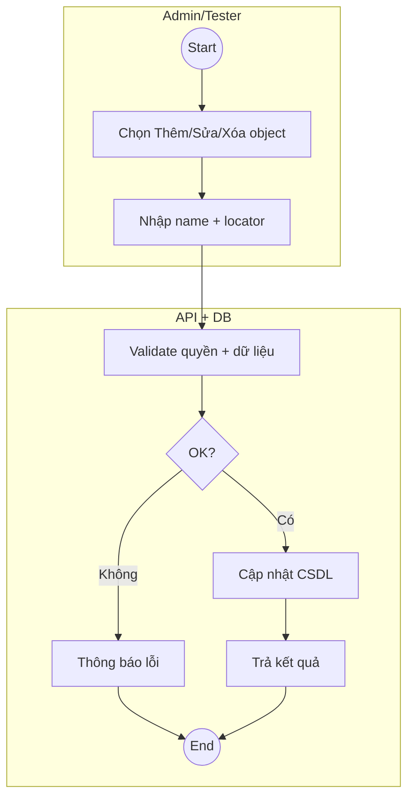
```mermaid
flowchart TD
  subgraph QuanTri[Admin/Tester]
    A((Start)) --> B[Chọn Thêm/Sửa/Xóa object]
    B --> C[Nhập name + locator]
  end
  subgraph HeThong[API + DB]
    D[Validate quyền + dữ liệu] --> E{OK?}
    E -- Không --> F[Thông báo lỗi] --> Z((End))
    E -- Có --> G[Cập nhật CSDL] --> H[Trả kết quả] --> Z((End))
  end
  C --> D
```

## STT 8 — Quản lý bộ dữ liệu (ĐC-24 → ĐC-27)

### Sequence
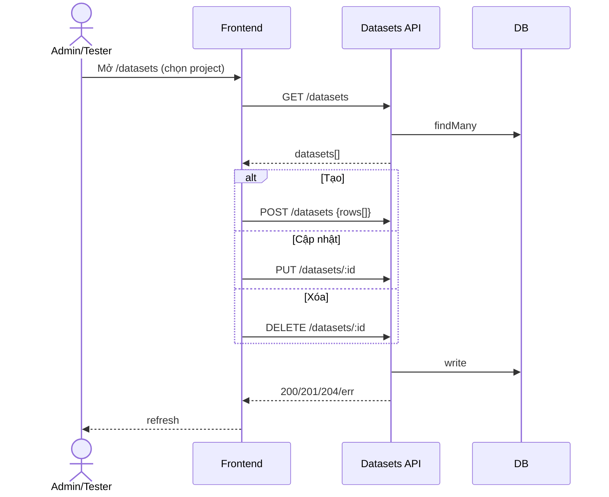
```mermaid
sequenceDiagram
  actor U as Admin/Tester
  participant FE as Frontend
  participant API as Datasets API
  participant DB as DB
  U->>FE: Mở /datasets (chọn project)
  FE->>API: GET /datasets
  API->>DB: findMany
  API-->>FE: datasets[]
  alt Tạo
    FE->>API: POST /datasets {rows[]}
  else Cập nhật
    FE->>API: PUT /datasets/:id
  else Xóa
    FE->>API: DELETE /datasets/:id
  end
  API->>DB: write
  API-->>FE: 200/201/204/err
  FE-->>U: refresh
```

### Activity
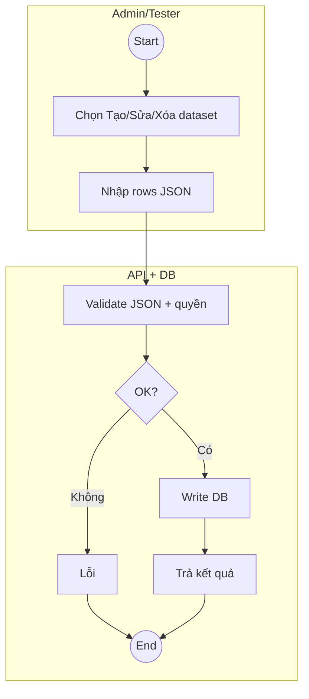
```mermaid
flowchart TD
  subgraph QuanTri[Admin/Tester]
    A((Start)) --> B[Chọn Tạo/Sửa/Xóa dataset]
    B --> C[Nhập rows JSON]
  end
  subgraph HeThong[API + DB]
    D[Validate JSON + quyền] --> E{OK?}
    E -- Không --> F[Lỗi] --> Z((End))
    E -- Có --> G[Write DB] --> H[Trả kết quả] --> Z((End))
  end
  C --> D
```

## STT 9 — Báo cáo & xuất PDF (ĐC-28 → ĐC-32)

### Sequence
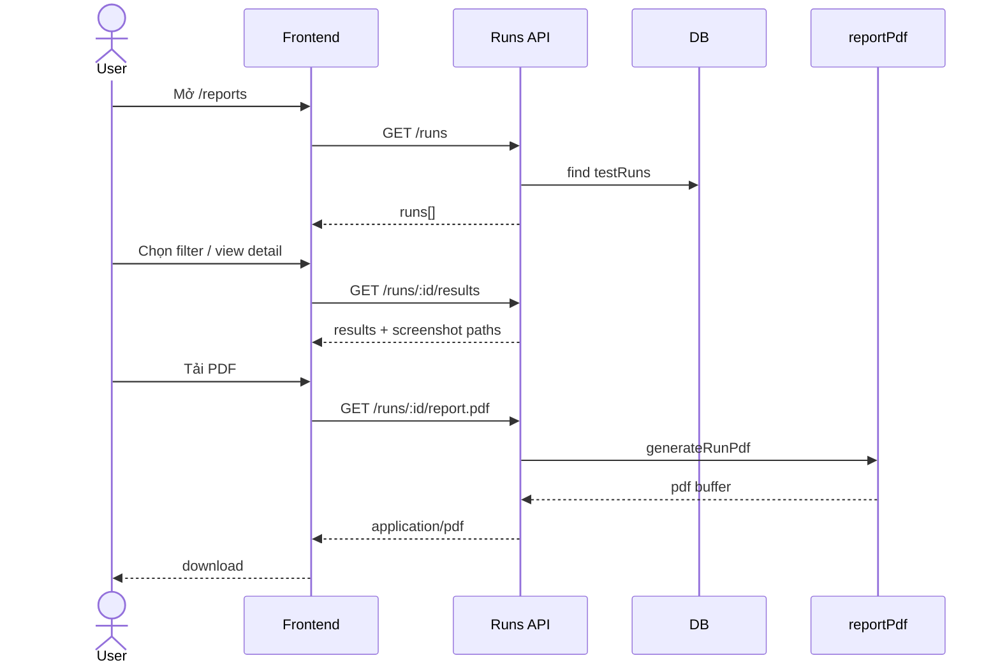
```mermaid
sequenceDiagram
  actor U as User
  participant FE as Frontend
  participant API as Runs API
  participant DB as DB
  participant PDF as reportPdf
  U->>FE: Mở /reports
  FE->>API: GET /runs
  API->>DB: find testRuns
  API-->>FE: runs[]
  U->>FE: Chọn filter / view detail
  FE->>API: GET /runs/:id/results
  API-->>FE: results + screenshot paths
  U->>FE: Tải PDF
  FE->>API: GET /runs/:id/report.pdf
  API->>PDF: generateRunPdf
  PDF-->>API: pdf buffer
  API-->>FE: application/pdf
  FE-->>U: download
```

### Activity
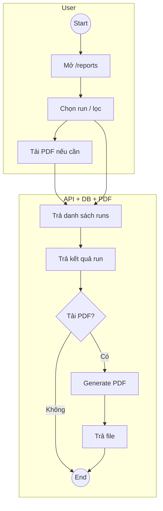
```mermaid
flowchart TD
  subgraph QuanTri[User]
    A((Start)) --> B[Mở /reports]
    B --> C[Chọn run / lọc]
    C --> D[Tải PDF nếu cần]
  end
  subgraph HeThong[API + DB + PDF]
    E[Trả danh sách runs] --> F[Trả kết quả run]
    F --> G{Tải PDF?}
    G -- Không --> Z((End))
    G -- Có --> H[Generate PDF] --> I[Trả file] --> Z((End))
  end
  D --> E
  C --> E
```

## STT 10 — Recorder & publish (ĐC-33 → ĐC-37)

### Sequence
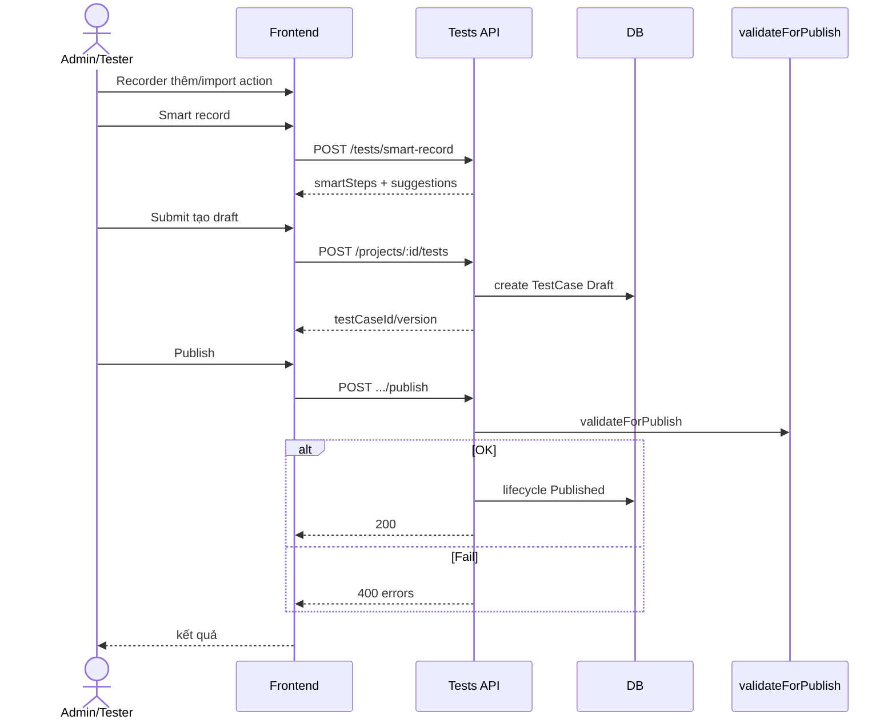
```mermaid
sequenceDiagram
  actor U as Admin/Tester
  participant FE as Frontend
  participant API as Tests API
  participant DB as DB
  participant VAL as validateForPublish
  U->>FE: Recorder thêm/import action
  U->>FE: Smart record
  FE->>API: POST /tests/smart-record
  API-->>FE: smartSteps + suggestions
  U->>FE: Submit tạo draft
  FE->>API: POST /projects/:id/tests
  API->>DB: create TestCase Draft
  API-->>FE: testCaseId/version
  U->>FE: Publish
  FE->>API: POST .../publish
  API->>VAL: validateForPublish
  alt OK
    API->>DB: lifecycle Published
    API-->>FE: 200
  else Fail
    API-->>FE: 400 errors
  end
  FE-->>U: kết quả
```

### Activity
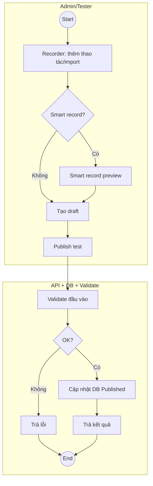
```mermaid
flowchart TD
  subgraph QuanTri[Admin/Tester]
    A((Start)) --> B[Recorder: thêm thao tác/import]
    B --> C{Smart record?}
    C -- Không --> D[Tạo draft]
    C -- Có --> E[Smart record preview] --> D
    D --> F[Publish test]
  end
  subgraph HeThong[API + DB + Validate]
    G[Validate đầu vào] --> H{OK?}
    H -- Không --> I[Trả lỗi] --> Z((End))
    H -- Có --> J[Cập nhật DB Published] --> K[Trả kết quả] --> Z((End))
  end
  F --> G
```

## STT 11 — Chạy test suite (ĐC-38)

### Sequence
```mermaid
sequenceDiagram
  actor U as Admin/Tester
  participant FE as Frontend
  participant API as Suite API
  participant SR as SuiteRunner
  participant PW as Playwright
  participant DB as DB
  U->>FE: POST /suite-runs
  FE->>API: POST /suites/:suiteId/runs
  API->>DB: create SuiteRun running
  API->>SR: executeSuiteRun
  loop Mỗi TestSuiteItem
    SR->>PW: chạy test steps
    SR->>DB: append results
  end
  SR->>DB: update SuiteRun passed/failed
  API-->>FE: runId + status
  FE-->>U: hiển thị
```

### Activity
```mermaid
flowchart TD
  subgraph QuanTri[User]
    A((Start)) --> B[Nhập suiteId]
    B --> C[Chạy suite]
  end
  subgraph HeThong[SuiteRunner + DB + Playwright]
    D[Create SuiteRun running] --> E[Loop items]
    E --> F[Chạy test case]
    F --> G{Pass?}
    G -- Không --> H[Suite failed] --> Z((End))
    G -- Có --> E
    E -- hết --> I[Suite passed] --> Z
  end
  C --> D
```

## STT 12 — Quản trị người dùng (ĐC-39 → ĐC-42)

### Sequence
```mermaid
sequenceDiagram
  actor A as Admin
  participant FE as Frontend
  participant API as Admin Users API
  participant DB as DB
  A->>FE: Mở /admin/users
  FE->>API: GET /auth/admin/users
  API->>DB: findMany
  API-->>FE: users[]
  alt Tạo
    FE->>API: POST /auth/admin/create-user
    API->>DB: create user + (optional) member
  else Sửa
    FE->>API: PUT /auth/admin/users/:id
    API->>DB: update + validate admin constraint
  else Xóa
    FE->>API: DELETE /auth/admin/users/:id
    API->>DB: check constraints + delete
  end
  API-->>FE: 200/204/err
  FE-->>A: refresh list
```

### Activity
```mermaid
flowchart TD
  subgraph QuanTri[Admin]
    A((Start)) --> B[Chọn thao tác: Tạo/Sửa/Xóa]
    B --> C[Nhập thông tin user]
  end
  subgraph HeThong[API + DB]
    D[Kiểm tra quyền + ràng buộc] --> E{Vi phạm?}
    E -- Có --> F[Thông báo lỗi/400] --> Z((End))
    E -- Không --> G[Write DB] --> H[Trả kết quả] --> Z((End))
  end
  C --> D
```

