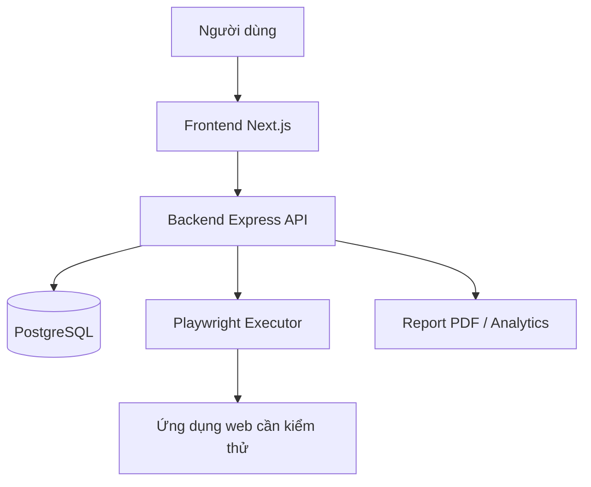

# Sơ đồ kiến trúc tổng thể hệ thống no-code testing (Hình minh họa)

```mermaid
flowchart TD
    U[Người dùng] --> FE[Frontend Next.js]
    FE --> API[Backend Express API]
    API --> DB[(PostgreSQL)]
    API --> EX[Playwright Executor]
    EX --> APP[Ứng dụng web cần kiểm thử]
    API --> RP[Report PDF / Analytics]
```

