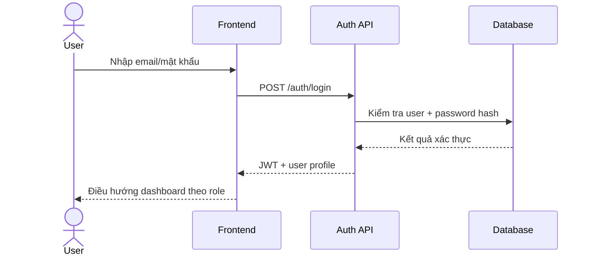

# Sơ đồ trình tự đăng nhập (Hình minh họa)

```mermaid
sequenceDiagram
    actor User
    participant Web as Frontend
    participant API as Auth API
    participant DB as Database
    User->>Web: Nhập email/mật khẩu
    Web->>API: POST /auth/login
    API->>DB: Kiểm tra user + password hash
    DB-->>API: Kết quả xác thực
    API-->>Web: JWT + user profile
    Web-->>User: Điều hướng dashboard theo role
```

