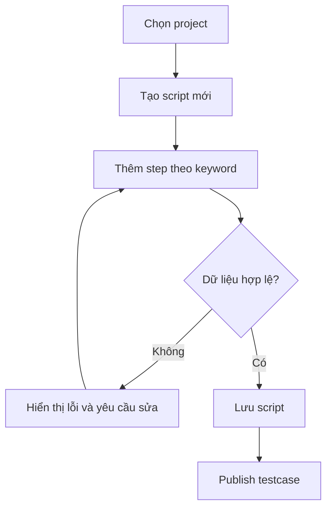

# Sơ đồ luồng quản lý script kiểm thử theo keyword (Hình minh họa)

```mermaid
flowchart TD
    A[Chọn project] --> B[Tạo script mới]
    B --> C[Thêm step theo keyword]
    C --> D{Dữ liệu hợp lệ?}
    D -- Không --> E[Hiển thị lỗi và yêu cầu sửa]
    E --> C
    D -- Có --> F[Lưu script]
    F --> G[Publish testcase]
```

