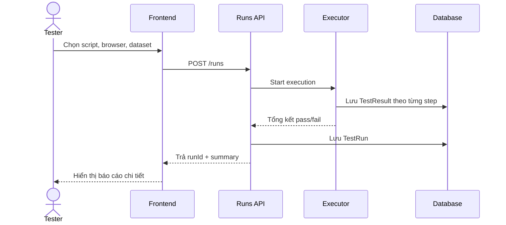

# Sơ đồ trình tự chạy test script và ghi nhận báo cáo (Hình minh họa)

```mermaid
sequenceDiagram
    actor Tester
    participant Web as Frontend
    participant API as Runs API
    participant EX as Executor
    participant DB as Database
    Tester->>Web: Chọn script, browser, dataset
    Web->>API: POST /runs
    API->>EX: Start execution
    EX->>DB: Lưu TestResult theo từng step
    EX-->>API: Tổng kết pass/fail
    API->>DB: Lưu TestRun
    API-->>Web: Trả runId + summary
    Web-->>Tester: Hiển thị báo cáo chi tiết
```

