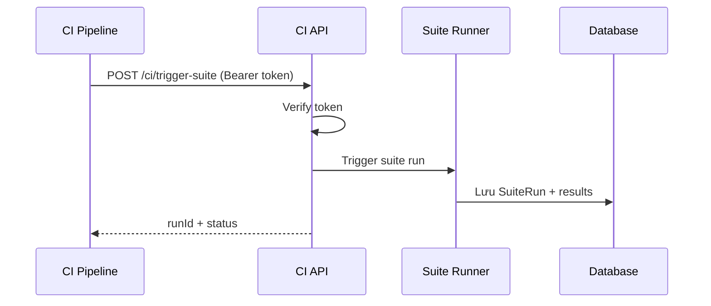

# Sơ đồ trình tự trigger suite từ CI (Hình minh họa)

```mermaid
sequenceDiagram
    participant CI as CI Pipeline
    participant API as CI API
    participant SR as Suite Runner
    participant DB as Database
    CI->>API: POST /ci/trigger-suite (Bearer token)
    API->>API: Verify token
    API->>SR: Trigger suite run
    SR->>DB: Lưu SuiteRun + results
    API-->>CI: runId + status
```

