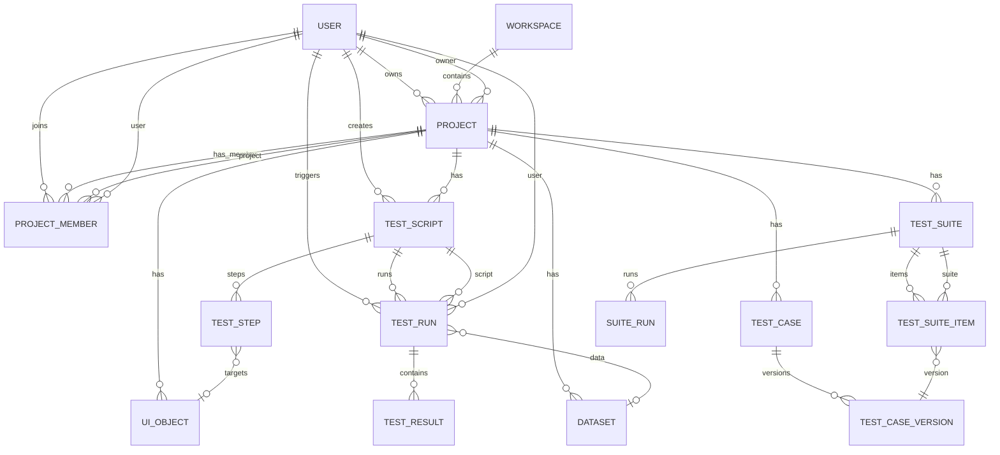

# ERD — Quan hệ thực thể (Hình minh họa)

Theo schema PostgreSQL (Prisma). Tên quan hệ mang tính mô tả.

**Thu gọn:** Có thể xuất bản chỉ nhóm `USER–PROJECT–TEST_SCRIPT–TEST_STEP–TEST_RUN–TEST_RESULT` cho phần “chạy script”; nhóm `TEST_CASE–TEST_SUITE–SUITE_RUN` cho phần suite/CI.
