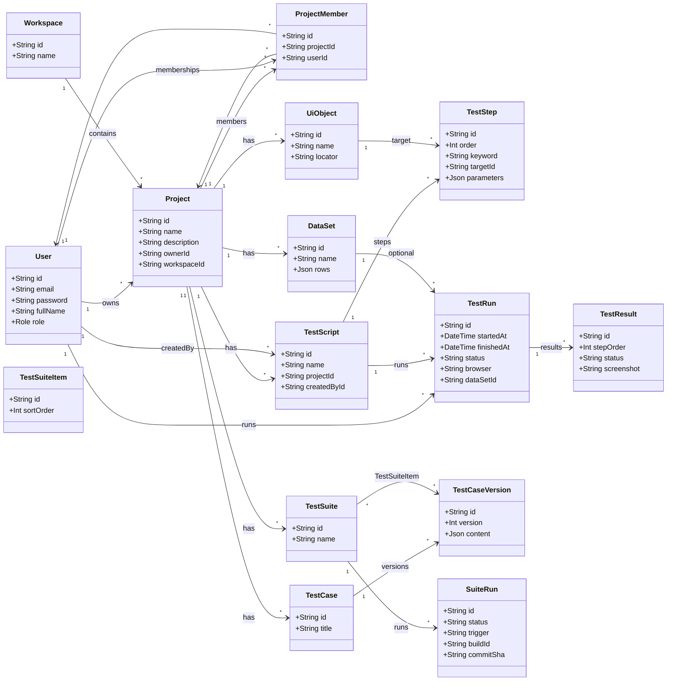

# Sơ đồ lớp — miền dữ liệu (Class Diagram)

Sơ đồ phản ánh các thực thể miền và quan hệ chính (theo `schema.prisma`), dùng cho báo cáo / luận văn.

**Ghi chú:** Quan hệ `ProjectMember` (nhiều–nhiều User–Project) được thể hiện gọn bằng liên kết `via`; chi tiết ràng buộc khóa ngoại xem ERD.
